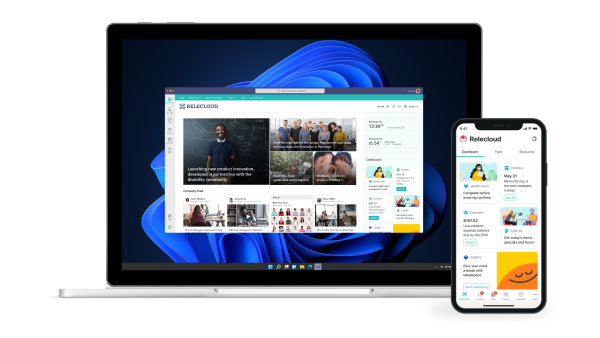
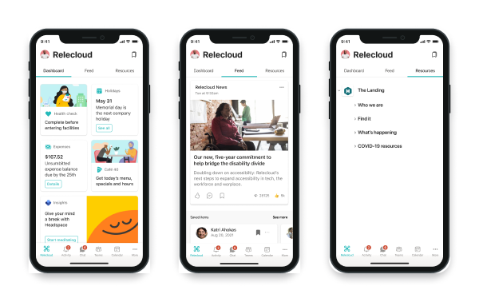
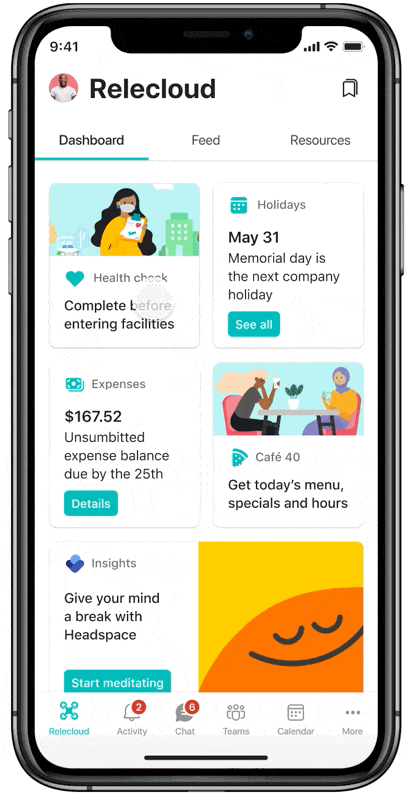

# Overview of Viva Connections

Microsoft Viva Connections is your gateway to a modern engagement experience designed to keep everyone engaged and informed. Viva Connections gives everyone a personalized destination to discover relevant news, conversations, and the tools they need to succeed. [Get step-by-step guidance on how to get Viva Connections for your organization.](guide-to-setting-up-viva-connections.md)

**Viva Connections is one of four modules that make up the Microsoft Viva platform:**
- **Connections**: This module is the gateway to the employee experience. It provides timely and relevant content and news, surfaces critical tasks and actions, and fosters connections between people.
- **Insights**: This module gives employees, managers, and leaders data-driven insights that help everyone work smarter and thrive.
- **Topics**: This module organizes content and expertise across systems and teams to deliver just-in-time knowledge in the apps people use every day.
- **Learning**: This module enables discovery, sharing, and engagement in learning to grow personally and professionally.

> [!NOTE]
> - Information in this article relates to the upgraded Viva Connections app. Viva Connections includes *both the desktop and mobile experiences*. 

**Viva Connections is:**
- A branded application experience in Microsoft Teams that is optimized to enable experiences for information workers and frontline workers.
- A gateway to employee experiences, with the ability for you to curate the content and tools you want to deliver through quick access to data and tasks, relevant news, communications, people, and resources.
- Built on existing capabilities in Microsoft 365 like SharePoint, Teams, Yammer, and Stream.

## Viva Connections mobile and desktop experiences

### The Viva Connections mobile experience
The Viva Connections mobile app is optimized to provide a fast, native, and branded experience focused on Dashboard, Feed, and Resources. It is a Teams application that is branded with your company name and logo.

#### Dashboard, Feed, and Resources
The experience in the Viva Connections mobile app is anchored around three key concepts: the Dashboard, the Feed, and Resources.

- **Dashboard**: The Dashboard is your employee’s digital toolset. It brings together the tools your employees need, enabling quick and easy access whether they are in the office or in the field. The Dashboard uses dynamic cards that employees can interact with to do things like complete simple tasks or review critical data. It’s authored in SharePoint and published to the Viva Connections Teams mobile app. 

  Cards in the Viva Connections Dashboard are based on [adaptive cards](https://adaptivecards.io/) and the [SharePoint Framework (SPFx)](/sharepoint/dev/spfx/sharepoint-framework-overview). They provide a low-code solution to bring your line-of-business apps into the Dashboard. In addition, in Viva Connections for Desktop, the experience uses SharePoint home sites, which can be extended using [SPFx web parts and extensions](/sharepoint/dev/spfx/viva/overview-viva-connections).

- **Feed**: The Viva Connections Feed delivers updates to the right people at the right time with powerful targeting and scheduling capabilities. It is tightly integrated with Yammer, SharePoint news, and Stream to display a personalized feed, based on post-level targeting of the groups that employees belong to. It supports both centralized corporate communication scenarios and democratized news scenarios. It is available in the Viva Connections Teams app on mobile, and will be available as a web part on desktop.
- **Resources**: The Viva Connections Resources experience enables way finding across platforms. It uses navigation elements from the SharePoint app bar, which can be audience targeted.

### The Viva Connections desktop experience
On desktop, Viva Connections surfaces your own home site as a branded app in Teams, combining the power of your intelligent SharePoint intranet with chat and collaboration tools that Teams provides.

**Key capabilities of the desktop experience:**
- **Global navigation and way finding**: The desktop experience provides employees the ability to navigate to important resources using the global navigation curated by your organization, the important sites your organization frequently engages with, and with organizational news. This navigation panel appears when users select the branded app icon in Teams, and surfaces elements shared with the [SharePoint app bar](sharepoint-app-bar.md).
- **Navigate intranet resources within Teams**: Users can consume your organization’s intranet experiences without leaving Teams.
- **Search for intranet content**: On the home page, users can search for intranet content directly from the Teams search bar.
- **Share intranet content**: Intranet content consumed within Teams can be easily shared into chats or channels, making collaboration on content easier.
- **Dashboard**: The Dashboard that appears in the mobile app can also be added to your home site as a web part, so that users have the same tools available on the home site in Teams.
- **Feed**: The Feed that is available in the mobile app is also available as a web part for your home site; thus, users can stay up to date with news, conversations, and videos while they’re on the desktop.

## Curated and tailored experiences
Viva Connections gives you and your content creators the tools for both curated and tailored experiences.
A curated experience is one in which the user sees content chosen by a site owner or author. For example, a site owner controls the content used on the site and whether the content is audience targeted audience targeting is accomplished using Azure Active Directory (AAD) groups for card-level targeting in the Dashboard and menu-item targeting in the global navigation.
A tailored experience is one in which content is automatically displayed according to what is most relevant to the users. This content might include content from the sites they follow, their Yammer group memberships, popular content, and more. An example of tailored content is the Feed.
- **Home site (curated)**: A site owner controls the layout of the home site, the elements used on that site, and targeting of content to specific audiences.
- **Dashboard (curated)**: A dashboard author controls the curation of the dashboard and can target each card on the dashboard to specific audiences using existing AAD groups. These provisions allow dashboard authors to create different experiences for each group. And because Viva Connection uses AAD groups, authors benefit from dynamic group memberships to reduce administrative overhead. Authors can easily preview what the dashboard will look like across devices and audiences.
- **Feed (tailored)**: The Viva Connections Feed uses its own heuristics to tailor the Feed for an employee by bringing in the most relevant content for that employee. It utilizes signals in the content created across the organization. Some of the signals used are Yammer group memberships, sites where news is posted, content popularity, and the intended audiences for a post. The Feed also supports promotional capabilities such as [news boosting](https://support.microsoft.com/office/boost-news-from-organization-news-sites-46ad8dc5-8f3b-4d81-853d-8bbbdd0f9c83).
- **Resources (curated)**: The list of sites on the Resources experience in mobile includes the global navigation defined at the organization level. The global navigation supports AAD groups for targeting so that employees in different groups will see relevant navigation items. 

|Capability Name |Curated vs. Tailored  |How  |
|---------|---------|---------|
|**Home site**     | Curated        |   Author controls layout, web parts, and audience targeting of content.      |
|**Dashboard**     | Curated         |   Author selects cards to show and uses AAD groups to target them to specific audiences.      |
|**Feed**    |     Tailored    |   Content is automatically prioritized and displayed based on signals associated with content from SharePoint and Yammer posts.      |
|**Resources**     |  Curated       |  Using AAD groups, menu items in the global navigation can be targeted to specific audiences.        |

## Branding
Matching your company or organizational brand is integral to your employee’s connection with your company's values and goals. The branding you apply in Teams to the Viva Connections app – including your logo and colors – is automatically applied to the mobile app. For information on how to apply your branding in an app, see [Customize apps in Microsoft Teams](/microsoftteams/customize-apps).

## Localization
Viva Connections is available in most major languages used in Microsoft 365. [Learn more about how to set up the Viva Connections mobile experience in a specific language](viva-connections-language.md).  

   - **Dashboard:** content can be set by Dashboard authors to support multiple languages.
   - **Feed:** the content will be available in the format in which it was authored and SharePoint news posts will display author-translated posts in the user’s preferred language.
   - **Resources:** are linked to the global navigation experience and follows the tenant’s default language.

## Viva Connections Dashboard
The Viva Connections Dashboard enables you to create a curated experience using Dashboard cards that give your employee's access to their most critical content and tools. These cards are designed to enable quick task completion either by interacting with a card directly or by opening a quick view in the Dashboard. Think of the Viva Connections Dashboard as a digital toolset for your employees.
The Viva Connections Dashboard is available on mobile platforms (iOS, Android) in the Viva Connections Teams app, and on the desktop as a web part. This web part can be integrated into a SharePoint Home site, which then is exposed as part of the Viva Connections for Desktop experience in Teams.

:::image type="content" alt-text="image showing example of Viva Connections Dashboard." source="../media/connections/vc-dash.png":::

### Anatomy of a dashboard
A dashboard is made of medium-sized and large-sized cards which users can interact with to get information or complete a task.

**Users can select cards or click the buttons on cards to do things like:**
- Displaying a quick view with more information or an input form
- Navigating to a SharePoint page
- Accessing a Teams app
- Accessing a site in the browser

A card can also reflect dynamic content that refreshes based on a user action or other event. For example, users can see new tasks assigned to them when they open the dashboard. As the users mark the tasks as **complete**, the card updates to reflect their new number of tasks.

The dashboard experience has been designed to be consistent across mobile platform and desktop, but there are some differences:

|Element  |Mobile  |Desktop  |
|---------|---------|---------|
|Dashboard  |     Displays as the default tab in the Viva Connections app in Teams.    |      Can be added to your home site as a web part.   |
|Dashboard layout   | Fixed in portrait mode. Card sizes can be medium (which shows two cards on one row) or large (which shows one card on a row).        |     Can be portrait or landscape with varying numbers of cards on each row depending on whether the web part is used in a 1-, 2-, or 3-column page section layout.     |
|Card UI     |  Native       |    HTML based     |
|Card order     |     Same as in Desktop    |  Same as in Mobile       |
|Card reflow    |   Same as in Desktop      |   Same as in Mobile      |
|How many cards are shown     |  All cards without audience targeting plus audience-targeted cards where the viewer is part of the targeted audience.       |   The number of cards to show can be specified in the Dashboard web part settings, but which cards are shown may vary depending on audience targeting.      |

#### Dashboard authoring
A Dashboard is authored in a SharePoint home site on a Dashboard page. A site editor can create the Dashboard, add cards in the size and layout of choice, and target the cards to specific audiences.

The layout of the dashboard, including the size of the cards (which can be individually set as medium or large), is set up by the person who authors the dashboard. The cards in the dashboard reflow based on the screen real estate of the Dashboard. These cards may look different depending on whether the Dashboard is used on mobile or in the Dashboard web part on the home site.

#### Dashboard cards

The Viva Connections Dashboard comes with an initial set of built-in cards, but is also designed to enable SaaS providers, system integrators, and in-house development teams create their own cards to meet their business needs.

Cards in the Viva Connections Dashboard are based on adaptive cards and the SharePoint Framework (SPFx). They provide a low-code solution to bring your line-of-business apps into the Dashboard.
In addition, in Viva Connections for Desktop, the experience leverages SharePoint home sites, which can already be extended using Web parts and SPFx.

**The initial set of cards available are:**

|Card Name  |Description  |
|---------|---------|
|Web link    |  Access a site without leaving the Viva Connections app       |
|Card designer    |     Create your own cards and quick views using the adaptive cards framework    |
|Teams app card     |    Use to open a Teams personal app or bot specified by the dashboard author     |
|Tasks     |    Use to open the Teams Tasks app     |
|Shifts     | Display information about the next or current shift from the Shifts app in Teams          |

These cards are available in the Dashboard toolbox when authoring a Dashboard, as shown in the following image:

 

## Viva Connections Feed
In the Viva Connections app, users will see a personalized Feed with relevant information from across their organization. The Feed automatically balances fresh and engaging content with corporate communications to keep users interested, while also ensuring that they see the most important messages. Individual messages can be promoted to raise greater awareness among users by using SharePoint’s Boost and Yammer’s Featured options. [Get answers to common questions](faqs-viva-connections-feed.md) about how content in the Feed gets prioritized and displayed.

The Feed requires usage of modern SharePoint or Yammer communities, but the best experience is delivered when both are used together.

### Feed content sources
Users will see content aggregated from the following sources, provided they have permissions to access the content from that source:
- **SharePoint news**
    - News posts on the home site
    - News posts on organization news sites
    - News posts on communication and teams sites
- **Yammer Community Posts** 
    - Posts to the organization community
    - Featured posts
    - Posts to communities that the user follows
- **Stream (built on SharePoint)**
    - [Video news links](video-news-links.md) on organization news sites
    - Video in a news post

## Viva Connections Resources
The **Resources** tab of the mobile app automatically uses the global navigation links that you set up in your [SharePoint app bar](sharepoint-app-bar.md). This type of functioning provides users with a familiar navigation structure and allows them to open sites, pages, news, and more — right from their mobile devices.

## Step-by-step guidance to provision Viva Connections

Learn how to [set up and deploy Viva Connections for your organization](guide-to-setting-up-viva-connections.md). 

## Summary of release notes

| Known issues  | 
| :------------------- | 
| [SPFx] Isolated components are not currently supported  | 
| [SPFx] Domain isolation is not supported yet  |  
| [Feed] Social reactions/comments still enabled but not functional (when disabled)  | 
| [Mobile] App acquisition flow. Workaround is to install missing app from desktop| 
| [Config] MDL2 icons are not supported on cards in the Teams mobile experience  | 
| Guest user access is not yet supported  | 

## More resources

[Set up and launch Viva Connections](guide-to-setting-up-viva-connections.md)
