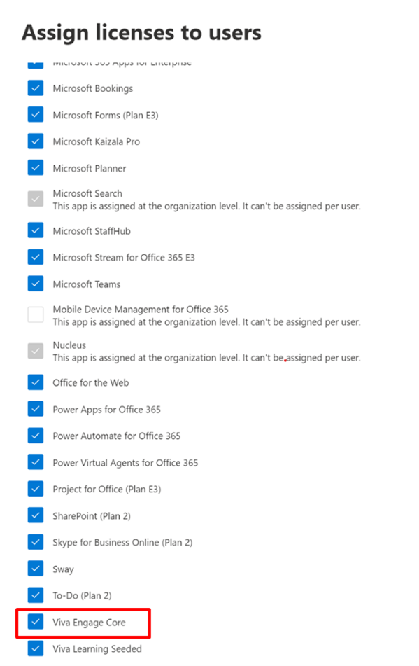
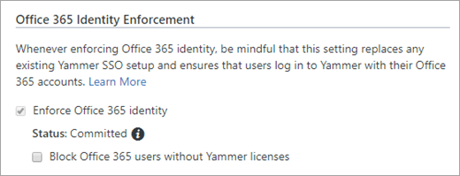

# Manage Viva Engage Core user licenses in Microsoft 365

When you assign user licenses as part of a bundled Microsoft 365 subscription plan such as Microsoft 365 Enterprise, the Viva Engage Core license is automatically assigned to the user. You can remove or assign Viva Engage Core licenses for specific users in the Microsoft 365 admin center or by using Windows PowerShell cmdlets for Microsoft 365.
  
At launch and following the launch of the service plan, the Viva Engage Core service plan will also enable access to Yammer. This is to ensure uninterrupted Yammer experiences for your users. You can block users who don't have Viva Engage Core licenses from accessing Yammer and Viva Engage by turning on the security setting **Block Office 365 users without Yammer licenses** (see [Start blocking users who don't have Yammer licenses](manage-engage-licenses-in-microsoft-365.md#StartBlocking)).
  
You need to be a Microsoft 365 global administrator or user management administrator to do the following operations.
  
For now, users with either a Yammer license or a Viva Engage Core license will see Viva Engage in Teams application (if it's been added and installed through the Teams admin center). Learn more about [installing](/viva/engage/setup) Viva Engage for your organization.
  

  
## Manage Viva Engage Core licenses in the Microsoft 365 admin center

You assign or remove the Viva Engage Core license to users the same way you assign any other Microsoft 365 Enterprise license.
  
- Sign in to Microsoft 365 Enterprise, navigate to the Microsoft 365 admin center, and on the **Users** \> **Active Users** page, assign or remove the Viva Engage Core license for users.

For more information, see [Assign licenses to users in Office 365 for business](https://support.office.com/article/997596b5-4173-4627-b915-36abac6786dc) and [Remove licenses from users in Office 365 for business](https://support.office.com/article/9b497c85-d0a4-4735-80fa-d3565bc05bd1) for more information.
  
## Manage Viva Engage Core licenses by using Windows PowerShell

You can use cmdlets in Windows PowerShell to assign Microsoft 365 licenses. With Windows PowerShell, you can more easily see who has a license, and assign licenses for multiple users at the same time. For more information, see [Use Office 365 PowerShell to assign licenses to user accounts](/microsoft-365/enterprise/assign-licenses-to-user-accounts-with-microsoft-365-powershell). You can also bulk update licenses based on a CSV file. For more information, see [Bulk license assignment to Office 365 users based on CSV](/samples/browse/?redirectedfrom=TechNet-Gallery).
  
Below are some example Windows PowerShell script snippets that you can use to manage Viva Engage Core licenses. Use them to develop a complete script for your organization.

- The following example unassigns the Viva Engage Core license from the litwareinc:ENTERPRISEPACK (Office 365 Enterprise) to the user belindan@litwareinc.com.

  ```
  $UPN = "belindan@litwareinc.com"
  $LicenseDetails = (Get-MsolUser -UserPrincipalName $UPN).Licenses
  ForEach ($License in $LicenseDetails) {
    $DisabledOptions = @()
    $License.ServiceStatus | ForEach {
       If ($_.ProvisioningStatus -eq "Disabled" -or  $_.ServicePlan.ServiceName -like "*VIVAENGAGE_CORE*") { $DisabledOptions += "$($_.ServicePlan.ServiceName)" } 
    }
    $LicenseOptions = New-MsolLicenseOptions -AccountSkuId $License.AccountSkuId -DisabledPlans $DisabledOptions
     Set-MsolUserLicense -UserPrincipalName $UPN -LicenseOptions $LicenseOptions
  }
  
  ```

- If you'd instead like to enable Viva Engage Core for a user without affecting anything else in their license, you can run the above script but change:
    
  ```
  If ($_.ProvisioningStatus -eq "Disabled" -or $_.ServicePlan.ServiceName -like "*VIVAENGAGE_CORE*") { $DisabledOptions += "$($_.ServicePlan.ServiceName)" }
  ```

    to
    
  ```
  If ($_.ProvisioningStatus -eq "Disabled" -and $_.ServicePlan.ServiceName -notlike "*VIVAENGAGE_CORE*") { $DisabledOptions += "$($_.ServicePlan.ServiceName)" }
  ```

- The following example returns information about any users who aren't currently licensed for Office 365.
    
  ```
  Get-MsolUser -All -UnlicensedUsersOnly
  ```

<a name="StartBlocking"> </a>
## Start blocking users who don't have Viva Engage Core licenses

The Viva Engage Core license, like the Yammer license, provides access to the core Yammer services. It also provides full access to both the Engage app and Yammer.com in the same way the Yammer license currently does. Because of this, in any scenario where you're blocking a user or your entire company from accessing Yammer, you'll need to remove the Viva Engage Core license and the Yammer license. Refer to [Managing Yammer user licenses in Office 365](/yammer/manage-yammer-users/manage-yammer-licenses-in-office-365) for details on how to remove a Yammer license.

It takes just a few steps to start blocking Microsoft 365 users who don't have Viva Engage Core licenses. However, turning on this setting can accidentally disrupt users' access to Yammer or Viva Engage. So before you begin, do the following to make sure your Viva Engage users can continue working smoothly:
  
- **Make sure that you have turned on the setting to enforce Office 365 identity for Yammer and Viva Engage users.** You can assign or unassign Viva Engage licenses only to Yammer/Viva Engage users who are managed in Office 365. So, to block Microsoft 365 users without Yammer and Viva Engage Core licenses, it's required that all Yammer users are managed in Office 365. The setting **Block Office 365 users without Yammer licenses** can be turned on only when the [Enforce office 365 identity for Yammer users](/yammer/configure-your-yammer-network/enforce-office-365-identity) setting is turned on.

- **Make sure all current Yammer and Viva Engage users have a Yammer or Viva Engage Core license.** When you start blocking Office 365 users without Yammer and Viva Engage Core licenses, any user without a Yammer license and Viva Engage Core license will be unable to access Yammer as well as Viva Engage. So before you begin, make sure that all of your current Yammer users have either Yammer licenses or Viva Engage Core licenses. One method to check this is to go to the **Export Users** page in Yammer and export all users. Then compare that list to the list of users in Microsoft 365 and make any changes required. For more information, see the article [How to audit Viva Engage users in networks connected to Office 365](/yammer/manage-yammer-users/audit-users-connected-to-office-365).

- **Tell your users about this change.** We strongly recommend that you tell users that you're starting to block Microsoft 365 users without Yammer and Viva Engage Core licenses, because it can disrupt their day to day usage of Viva Engage.

You must be a global administrator on Microsoft 365 who was synchronized to Yammer as a verified admin to perform these steps.
  
If you're ready to block users who don't have Yammer and Viva Engage Core licenses, follow these steps.
  
1. In Yammer, go to the **Network Admin** section, and choose **Security Settings**.

2. In the Security Settings page, go to the **Enforce Office 365 Identity** section, select the **Enforce Office 365 identity in Yammer** checkbox and confirm the selection. Enforcing Office 365 identity is a pre-requisite step to block users without Yammer licenses.

3. After the **Enforce Office 365 identity in Yammer** checkbox is selected, the **Block Office 365 users without Yammer licenses** checkbox will be available. Select the **Block Office 365 users without Yammer licenses** checkbox and then choose **Save**.

    
  
4. You see a confirmation message that asks if you're ready to start blocking Office 365 users without Yammer and Viva Engage Core licenses.

    
  
    The confirmation message shows you the number of active users on the Yammer network. Make sure all the current Yammer users have either Yammer or Viva Engage Core licenses. For more information, see [How to audit Yammer users in networks connected to Office 365](/yammer/manage-yammer-users/audit-users-connected-to-office-365).

    If you want, you can automatically log out all current users, so that you can be sure that everyone using the Yammer service has logged in with their Microsoft 365 identities and has a Yammer or Viva Engage Core license. If you choose to do this, select the **Log out all current users** checkbox. We strongly recommend doing this at a time of minimal user activity (because users might be logged out in the middle of their work) and communicate it to them ahead of time.

5. If you're ready to start blocking Microsoft 365 users without Yammer and Viva Engage Core licenses, select **Yes, I am ready** to confirm your choice. This returns you to the **Security Settings** page where the **Block Office 365 users without Yammer licenses** checkbox is now selected.

6. Choose **Save** to save all your settings on the page.

    If you don't choose **Save** but instead navigate away from the page, your settings won't take effect.

## FAQ
<a name="StartBlocking"> </a>

### Q: Why are Viva Engage Core licenses per-user?

A: Per-user licenses let you assign Yammer and/or Viva Engage to a subset of users in your company - typically for a geographical or team-by-team rollout. Only users with a Yammer or Viva Engage Core license can see the Yammer tile in the Office 365 app launcher and the Viva Engage application in Teams.
  
### Q: How does this affect Yammer users who sign-in with their email and password?

A: Licenses are enforced only for users who sign-in with Office 365 identity.
  
### Q: What if I don't want anyone in my company to use a legacy Yammer identity?

A: You can [Enforce Office 365 identity](/yammer/configure-your-yammer-network/enforce-office-365-identity.md) for all your Yammer users.
  
### Q: How can I tell if all of my Yammer users have accounts in Office 365?

A: You can export your list of users from Yammer and check for users who aren't in Office 365. For more information, see [Audit Yammer users in networks connected to Office 365](/yammer/manage-yammer-users/audit-users-connected-to-office-365).
