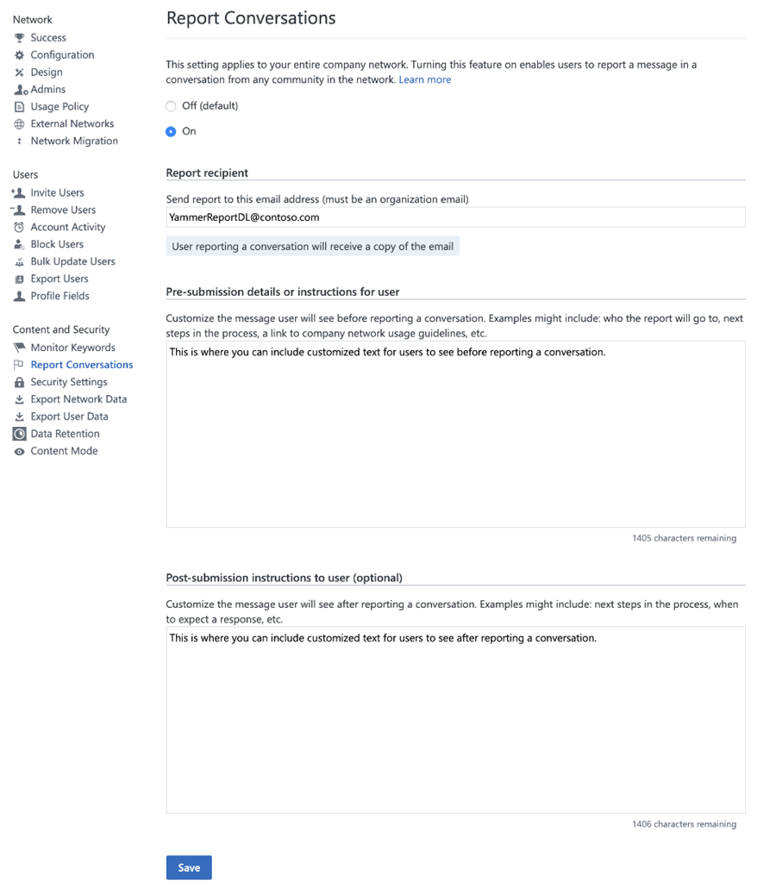
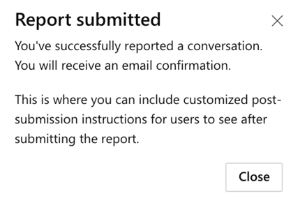

# Report a Viva Engage conversation

 Viva Engage tenants have access to a report conversations capability that enables users within the network to report conversations, comments, and replies in Viva Engage.

 Engage admins can enable users to report a conversation on their network from the Engage admin center. Within the Engage admin center, navigate to the "Setup & Configuration" tab and select "Configure Tenant". You will be redirected to the Yammer admin webpage, where you can access "Report a conversation" under "Content & Security" on the left panel.

## Setting up the report a conversation feature

After enabling conversations, enter information for the following two settings:

- **Report recipient (an organization email address)** - This is the email address that reports will be sent to.
- **Pre-submission details or instructions for user** – The text you enter here is shown to users when they select **Report a Conversation**, but before they submit a report.

There’s also an optional **Post-submission instructions to user** setting. These instructions are shown to users once they have finished submitting a report on a conversation or comment.

## Report recipient

An organization email must be provided for where the report will be sent.

> [!NOTE]
> Viva Engage does not verify that the email address entered here is an organization email address. Please ensure you enter only a valid organization email address.

## Pre-submission details or instructions for user

Use this field to explain to your employees what reporting the conversation, comment, or reply will entail. The text entered in this field will be shown to end users when they start the process of submitting a report and before they submit the report to help them understand what to expect.

Some things you may consider including are:

- details you want users to submit when reporting conversations or replies.
- who in your organization the report will go to.
- what the next steps in the process are.
- a link to company network usage guidelines, etc.

The text you enter will be displayed under the **Report Conversation** or **Report Comment** header when a user reports a conversation or comment. You can enter a maximum of 1500 characters.

## Post-submission instructions to user

Use this field to explain to your employees what will happen once a report has been successfully submitted.

The text entered in this field will be shown to end users when they have finished submitting a report. This text is optional. It can help your end users better understand what comes next once the report has been submitted. Some things you may consider including are:

- when a user can expect a response.
- what steps are taken next by the organization, etc.

The text entered in this field will be shown to your end users underneath a default *You’ve successfully reported a conversation* message, once the report has been successfully submitted. You can enter a maximum of 1500 characters.

## End user experience for reporting conversations

When enabled, users accessing Viva Engage will see the **Report Conversation** option on conversation starters and **Report Comment** on comments and replies.

**Report Conversation option on conversation starter**

**Report Conversation option on conversation comment**

Users will then see a right panel pop out with the custom message from the Engage admin and a required **Reason for Reporting box.**

The conversation or comment reported, along with who is reporting, and the reason for reporting, will be sent to the email specified in the **Report Conversations** settings.

Upon successful submission, the user will see the optional custom message configured by the admin. They will also receive a confirmation message with a link to the conversation, comment, or reply reported and the comment included in the report.

## Report Emails

Upon successful report submission, the following will occur:

The organization email set for Report Conversations in the admin settings will receive an email including:

- The name of the person who submitted the report.
- whether a conversation starter or comment is being reported. The title and text of the email indicates whether a conversation starter or comment is being reported.
- the name of the person who started the conversation or wrote the comment being reported.
- the community in which the reported conversation or comment was made.
- the date and time at which the reported conversation or comment was made.
- a link to the specific conversation starter.
- any comments entered by the reporting user.

> [!NOTE]
> Viva Engage does not support deep links to comments today. In the report emails for both conversation starters as well as comments, the link included in the report is always the conversation starter link. Reports do not contain deep links to a reported comment. The report reviewer can use the conversation starter link together with the reported comment timestamp to find the actual reported comment in the conversation.

A copy of this same email is also sent to the Viva Engage user who submitted the report.

## FAQ

**Q:** I’m an admin, and how do I know if my Viva Engage network is eligible for reporting conversations and comments?

**A:** All tenants that have configured Viva Engage for their organization (either seeded or premium) are eligible for the reporting conversations experience.

**Q:** Can I add multiple emails for the reports to be sent to?

**A:** Currently only one email can be used. We suggest you create and use a group email or distribution list alias if you would like the reports to go to multiple people.

**Q:** If my Viva Engage network is eligible for this, is it already on?

**A:** No, the feature is off by default. An Engage admin must turn on the feature for users so they can see the option to report conversations and comments.

**Q:** Can users report conversations from external networks?

**A:** No, The report conversations end user experience and actions are only available in the Viva Engage home network. Conversations in external networks cannot be reported.

**Q:** Can users report private messages or messages in the Viva Engage Inbox?

**A:** No, The report conversations end user experience and actions are only available on conversations within communities and the discovery feed.

**Q:** Can users report messages from private and secret communities?

**A:** Yes, conversations can be reported from all communities within Viva Engage – public, private, and secret. The email report that is sent includes a link to the original conversation starter where the starter or comment was reported. If the person reviewing the reports does not have access to the private or secret community, they can either work with the Engage admin to get access to that community to review the message or with the community administrator to get access to the reported message.

**Q:** Can users report messages from Viva Engage integrations with Teams, Outlook, and SharePoint?

**A:** At this time, conversation reporting is only available from the Viva Engage Teams integration.
