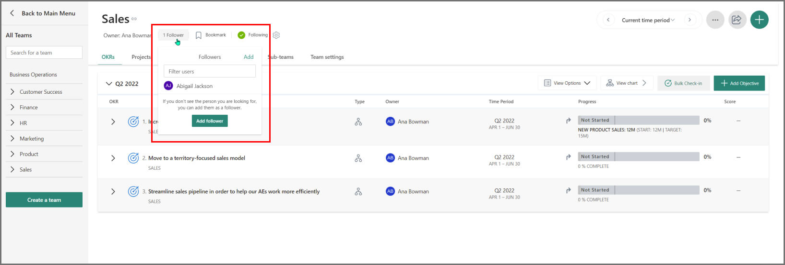
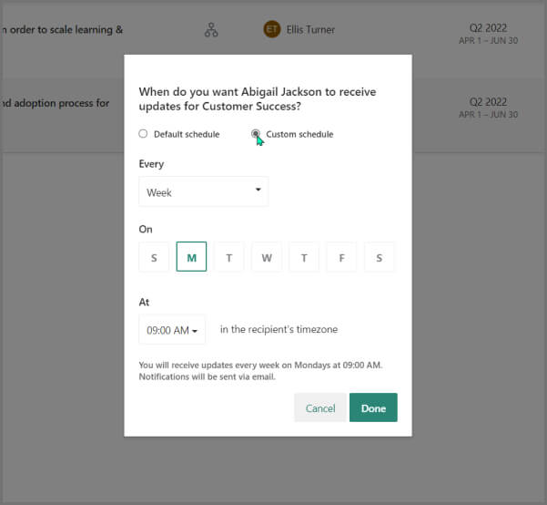
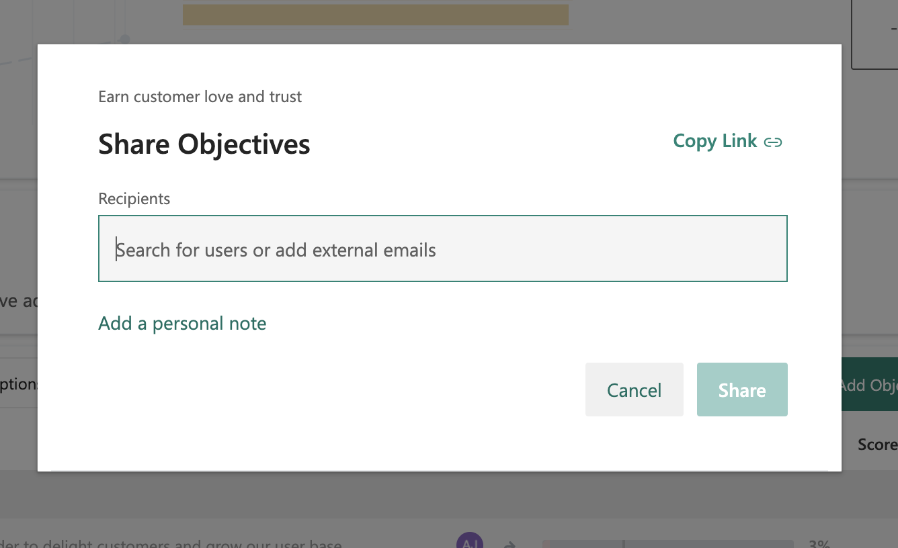

# Set up OKR business rhythms

## Key business rhythm #1: Weekly check-ins 

One of the most important parts of the OKR process is developing a weekly cadence to update, review, and track progress of your OKRs. 

We advise incorporating these items into your weekly stand-up or team meetings that exist today. 

Setting aside 15 minutes to discuss OKRs once a week will go a long way in OKR adoption and buy-in for your organization. 

### Update your OKRs

Ensure your OKRs have the latest information to discuss. Having check-in notifications set up will help keep your team up to date. You can learn more about setting up these notifications [here](https://help.ally.io/en/articles/2377894-check-in-reminders-and-notifications). 

It's best to have these notifications go out at least 24 hours in advance of your scheduled meeting where you'll be discussing OKRs. This way your team can come ready to the meeting.

### Review OKRs with the team

In your meetings, identify any OKRs marked Behind or At Risk in the past week and drill down to understand details. Additionally you can engage directly with OKRs in Viva Goals via likes and comments: [here](https://help.ally.io/en/articles/2107055-check-ins-and-feedback). 

We recommend using the [Chart View](https://help.ally.io/en/articles/2375435-chart-view) for these meetings, as it will allow you to quickly identify the status of OKRs in a visually pleasing format.

### Compare progress to previous week

Our "compare to previous" tool is a great trending feature that'll allow you to quickly identify what is moving forward or OKRs that have stalled progress. This tool is a great tool to utilize in your weekly review meetings. With two clicks of a button, you've that information at your finger tips. See instructions for enabling this view [here.](https://help.ally.io/en/articles/2632032-compare-to-past).

### Adjust as necessary

If everything is moving along as expected, great! If not, remember OKRs sometimes need adjustments. Make any [edits](https://help.ally.io/articles/3065314-q-can-i-edit-or-delete-a-okr) and reset expectations moving forward. 

In 15 minutes, you've gained a clear picture into what has moved forward, what is behind, and what has been changed for the coming week for the critical aspects of the business. You've engaged on your team and company's biggest goals and your team can see their progress and how it is contributing.

## Key business rhythm #2: Summary Updates

Keeping goals top-of-mind for your organization requires frequent reminders and updates. Viva Goals allows you to send automated OKR progress and status updates to your company, individual teams and individual contributors via email. 

### How to begin receiving summary updates 

To start receiving summary updates, begin by following the company, team or individual. You can follow as many teams or individuals as you like by visiting the respective OKR dashboard page available from the navigation menu.

You can also add other users as followers to ensure they receive summary updates for the company, team or individual. Select the Followers button and select the **Add** link. 

### How to customize summary update cadence and frequency

Customize the frequency and cadence of summary updates by selecting the 'cog' icon next to the following link from the title pane of the dashboard. You can also select **change update time** in the alert that shows after you follow the company, team or individual.

Select **Custom schedule** and choose the cadence, day and time that you would like to receive the update. Select **Done** to save your settings.

### How to manage summary updates

View all teams and individuals that you follow on your profile settings page. Select your profile icon and go to **Account Settings**.

From this page, you can change the cadence or unfollow the company, teams and individuals you're following.  

To edit the cadence for each summary update, select **Edit Update Time** button and select the schedule you would like to receive the weekly update from the popup. To unfollow a company, team or individual you're following, select the **Unfollow** button. You'll stop receiving the summary update for the company, team or individual you chose to unfollow.

You can also unfollow a company, team or individual from the dashboard.

### How to trigger the summary and follower update emails manually

The summary and follower update emails can also be triggered manually using the Share Summary feature.

1. From the OKRs page, select the share icon on the top right corner of the page and select **Share Summary**.

2. Enter the email addresses that you want to share the objectives with in the recipients field. You can also choose to share the update to all the users who are following the OKRs you are sharing by checking the **Include followers** ... checkbox.

3. Select **Add a personal note** if you want to add more context while sharing the summary of objectives. You can select the option **Include objective progress changes in the last xx days** and set the number of days according to your preference.

To send yourself a preview of the message that will be shared, select **Send Preview**

4. Once you are ready, select **Share** and the objectives will be sent to the intended recipients via email.

## Key business rhythm #3: Quarterly OKR reviews 

For the most part, OKRs are planned on an annual basis and a quarterly basis, with more emphasis on the quarterly process. This makes the quarterly review process critical. 

**Who needs to be involved:** The leader who owns an OKR and the team responsible for helping reach it. 

**What needs to happen:** The quarterly review happens at the end of the quarter. It is an opportunity for teams, managers and individuals to review their progress and reflect on the performance of the previous quarter. These meetings are when OKRs are assessed and scored.  

**In the quarterly review, you should accomplish the following three things:** 

- Assess progress based on team's OKRs and assign a score 
- Identify and discuss wins, losses, and lessons learned 
- Collaborate with other cross-functional teams in sharing graded OKRS and explaining results
- Outline adjustments for next quarter 

## Key business rhythm #4: Annual Planning

Annual planning is the most critical piece in setting your company up for success for the year. With a concrete plan, you’ll gain a clear idea of where your organization is headed, how you’ll define success, and a clear understanding of how you’ll execute your organization’s biggest priorities.  Annual planning consists of three phases. 

### 1-3 Months before the new year 

**Who needs to be involved:** Senior-level leadership 

**What needs to happen:** Senior-level leadership meets and discusses annual company goals 1-3 months prior to the new year. This will be the time to discuss first quarter company goals, as well. 

**In this phase, you should ask the following three questions:** 

- Which goals do we want to roll over for the new year? 
- What have we learned from the goals we reached this year, and the goals we didn’t reach? 
- What are our current gaps and problem areas? This should include market and industry, cross-functionality, team ability, and resourcing 

### 1 month prior to the new year 

**Who needs to be involved:** Senior leadership and team leaders 

**What needs to happen:** By December, senior leadership should communicate with team leaders on annual company-level goals and how those will align with the team’s quarterly goals. Discussion with team leaders is key to ensuring every team understands the priorities and focus for the upcoming year. 

If team leaders need more training on OKRs, this is an ideal time to make sure they have the support and coaching they need on OKR best practices. Plan to run interactive workshops to help engage and educate teams during this time if they are not already familiar with the OKR framework.

**In this phase, you should accomplish the following three things:** 

- Make sure team leaders understand the company mission, vision, and how those tie to the company-wide OKRs
- Give team leaders a chance to deliver feedback on company-wide OKRs
- Train team leaders on OKR best practices and Viva Goals 

### First week of the new year 

**Who needs to be involved:** The entire company 

**What needs to happen:** In the first few weeks of the new year, the senior leadership team will share the business level OKRs with the company, and team leaders should roll out drafts of Q1 team OKRs, making sure to communicate the right expectations for the upcoming quarter. 

This is the time to start scheduling regular check-ins and plan for reviews, as well as time for everyone to score and review OKRs at the end of the first quarter. The cycle repeats itself each quarter, with team and company-level quarterly OKRs always keeping alignment with the company’s annual goals. 

**In this phase, you should accomplish the following three things:** 

- Draft team-wide OKRs and determine cross-team dependencies 
- Schedule regular OKR check-ins or bake them into the agenda of already existing rhythms like team meetings and 1:1's 
- Make sure training materials are available to all relevant employees 
