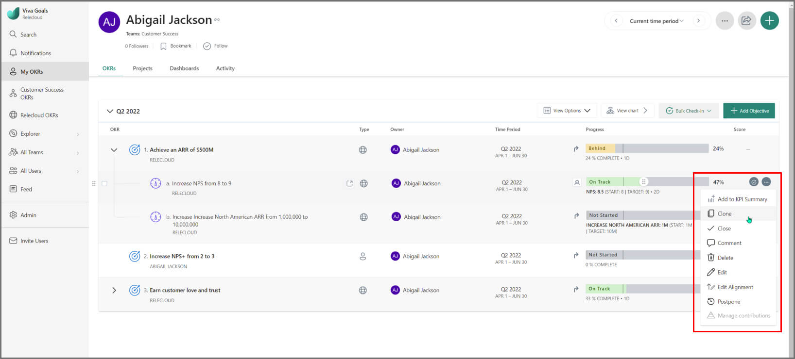
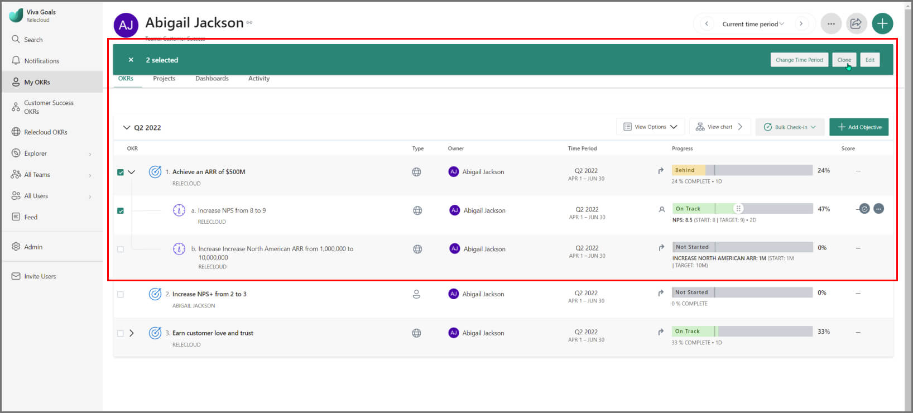

# Clone objectives 

> [!IMPORTANT]
> Viva Goals is currently available only for private preview customers, and only in English. The features described here are subject to change. Viva Goals is only being released to WW tenants, and that it is not being released to GCC, GCC High, and DoD environments. [Learn more about Viva Goals.](https://go.microsoft.com/fwlink/?linkid=2189933)

Cloning objectives helps your OKR process run more efficiently. 

## When to clone objectives 

There are two key situations when cloning is useful: 

### Setting up new objectives for the current time period

If you are collaborating on writing OKRs with cross-functional teams, you may find that OKRs move around from team to team, or that you want to use a slightly modified version of another team's OKR on your own team to ensure you're rowing in the same direction. Instead of starting from scratch, you can use the clone function in Viva Goals to make a duplicate copy of an Objective, then edit quickly. 

Cloning makes it simple to get set up quickly, while still allowing the flexibility for personalization.

### Rolling over unfinished objectives to a new time period

If you are scoring and closing Objectives in Q2 in preparation for Q3, you may have unfinished Objectives which you would like to continue working on. In this case, you want to roll your OKRs over to Q3. 

Cloning is a more effective way to do this than simply editing the time period of the unfinished Objective. By making a clone, you can ‘reset’ the Objective progress for the next time period, while saving your progress in the current time period. This way, you can show your progress in Q2 and continue progress in Q3. 

You can edit the cloned Objective to reflect the leftover portion of the goal in Q3, while making sure that the work you’ve already accomplished is still attributable to Q2.

## How to clone a single objective

1. Hover over the Objective and select **Clone** from the dropdown on the far right. You can also do this from the Objective page by selecting **Actions -> Clone**. 

2. Choose options from the dialogue box:

    - By default, Viva Goals will default to the current time period (useful if you're duplicating new Objectives). If you're carrying over unfinished Objectives into the future, choose the appropriate time period from the dropdown menu.
    
    - Choose to keep the original objective owner, or assign a new one.
    
    - Choose to clone:
    a. Only the objective - Will not clone any children.
    b. Objective and its immediate children - Will not clone any children that the objective's immediate children might have.
    c. Objective and all its children - Will clone all children even if an objective's immediate children has children.

>[!NOTE]
>Select 'keep original objective owner' if you want to retain the original owners for the objectives, key results and projects in the hierarchy. If you want to change the OKR owner, you can assign to yourself or any of your team members. All the OKRs and Projects in the hierarchy will be assigned to assigned owner.

3. If necessary, edit or tweak the newly cloned Objective, including changing key results or KPIs to reflect the remaining work in the new time period.

## How to clone multiple objectives

1. Choose the Objectives you wish to copy by selecting the checkboxes to the left of the Objectives. Only open Objectives can be cloned in bulk; objectives that have already been closed must be cloned on an individual basis. 

2. Select the **Clone** button in the blue bar that appears above the list of objectives.

3. Choose the options from the dialogue box, similar to above.

>[!NOTE]
>The cloning operation happens asynchronously without blocking you from performing other actions in Viva Goals. The time to complete will depend on the number of OKRs being cloned. Attempting to clone multiple times during the process will result in the OKRs being cloned multiple times. 
