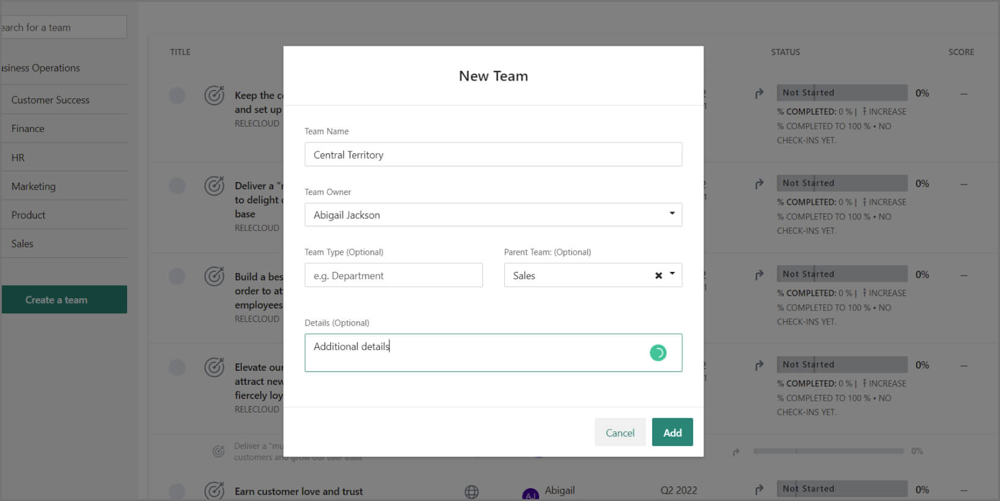
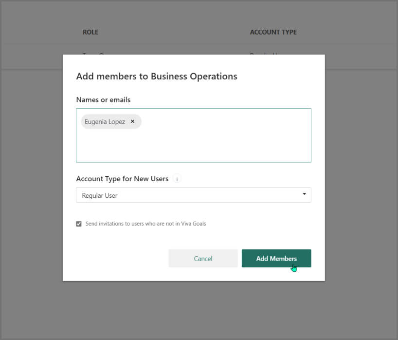
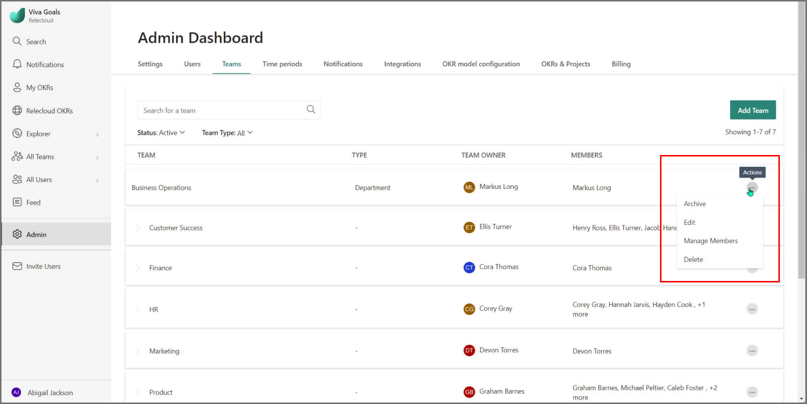

# Create and edit teams 

> [!IMPORTANT]
> Viva Goals is currently available only for private preview customers, and only in English. The features described here are subject to change. [Learn more about Viva Goals.](https://go.microsoft.com/fwlink/?linkid=2189933)

Viva Goals supports multiple levels of hierarchy, from department-level all the way down to individual teams and functional units. To achieve this setup, you can use the teams and subteams functionality.

## How to create teams 

1. Create a team by choosing **All Teams > Create a new team** or alternatively, **Admin > Teams > Add Team**.

    
   
1. In the dialog box that follows, perform the following steps:

- Enter a team name.
- Designate a team owner from the **Team Owner** dropdown list.
- If this team is a subteam, division, or department, select a primary team.
- Enter a team type and more details, if necessary.

In this example, we will set up a sales territory "Central Territory" (from the **Team Name** dropdown list), under the overarching Sales Department (from the **Parent Team: (Optional)** dropdown list).

To view all subteams, navigate to the **Parent Team** page and select the **Sub-teams** tab. Using subteams, you can easily replicate the structure of your organization and view how each department, division, and team contribute to organization goals.

## How to add team members to a team 

Team owners and administrators can set up their team by adding team members.

To add existing Viva Goals users as team members, perform the following steps:

1. Navigate to the **Team OKR** page.
1. Select the **Team Members** tab.
1. Select the **Add Members** button.
1. Start typing the name or email of the existing Viva Goals user. The auto-complete will suggest the matching users.
1. Select the name or email of the user, which is returned as a result.

   
1. Select the **Add Members** button. The user is added to the team as a member.

To add people who are currently not in Viva Goals, you can use the same dialog box. Ensure the **Send invitations to users who are not in Viva Goals** checkbox is checked.

As part of setting up a team, it is useful to have another team administrator to ensure that the team setup process is not dependent on one person.

To assign permissions of a team administrator to a team member, perform the following steps:

1. Select **Team Members** tab

   For every user listed, there is an **Actions** dropdown list in the last column.

1. Select the **Actions** dropdown list and select **Promote to Team Admin**.

## How to promote team owners and administrators

You can promote or remove any team member as a team owner or administrator in the **Admin** menu item of the **Admin Dashboard** page.

### How to update team owners

1. To update the team owner, go to the **Teams** section of the **Admin** menu, click **...** and select **Edit**.

1. From the edit teams pop-up, click on the Team Owner dropdown menu to select and update the team owner.

1. Click **Save**.

### How to update team administrators

1. From the **Teams** section of the **Admin** menu, click **...** and select **Manage Members**.

1. Select the **Action** dropdown list to the right of their name and you'll be able to edit their member status.

 
## How to archive and delete teams

As an Viva goals administrator, we give you support to manage your teams. Sometimes, teams are dissolved or due to an organizational change, they're retired. If so, we give you the following two options in Viva Goals.
- [Deleting a team](#how-to-delete-a-team)
- [Archiving a team](#how-to-archive-a-team)

### How to delete a team

Deleting a team is an option whose functionality is permanent in nature; once the team has been deleted, it can't be restored. Delete with caution. 

To delete a team, perform the following steps:

1. Select **Admin > Teams tab > Actions**.
1. Select **Delete** corresponding to the team that you want to delete.

Alternately, you can navigate to the team's OKR page, and delete the team from the options on the top-right corner.

> [!NOTE]
> *To delete a team from the team's OKR page, you need to be an organization administrator or the team owner. Team administrators cannot delete a team*.

A team can only be deleted if it has no objectives assigned to it. If you have objectives assigned to the team, a better alternative is to archive the team.

### How to archive a team 

Archiving a team is what we recommend you to use for teams that are no longer in service. You can archive a team by navigating to the **Admin > Teams  > Actions > Archive** against a specific team you want to archive.

To delete a team, perform the following steps:

1. Select **Admin > Teams tab > Actions**.
1. Select **Archive** corresponding to the team that you want to archive.

Alternately, you can navigate to the team's OKR page, and archive the team from the options on the top-right corner.

Once a team has been archived, it will be marked as **Archived** under the **Teams** tab within the Admin console, and won't be visible anywhere else. Any objectives that were owned by this team will remain in the same state; however, you will not be able to assign new objectives to this team.

Archiving a team is an option with a functionality that's not permanent in nature; you can restore an archived team.

To restore an archived team, perform the following steps:

1. Select **Admin > Teams tab > Actions**.
1. Select **Unarchive** corresponding to the team you want to restore.

   
### What happens when I archive a team?

Once a team is archived, you will no longer be able to create OKRs and projects under that team and users will no longer be a part of the team. Additionally, any subteams will then become independent teams in Viva Goals. All OKRs that were previously assigned to the archived teams will still be accessible for actions to be performed on them, such as, check-ins.

Even though you won't be able to see the team under **All Teams** now, you can see the assigned OKRs on expanding the parent OKRs they’re aligned to. You'll also be able to view these OKRs/projects in the Explorer by applying the type filter and selecting the archived team name.

However, the activities related to the specific team will be halted, including assigning team members and team-level notifications. These can be resumed at any point by unarchiving the team. 
