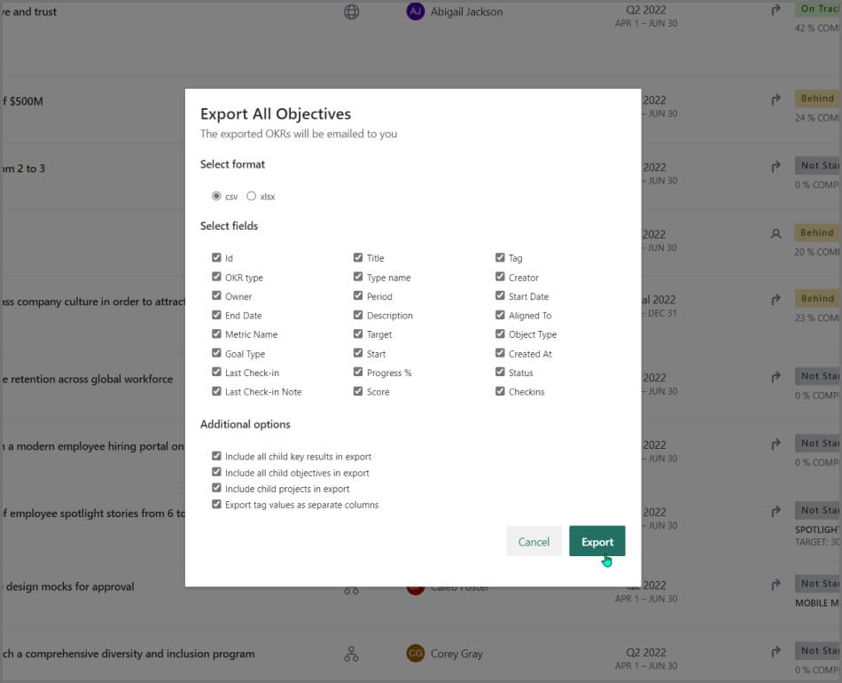
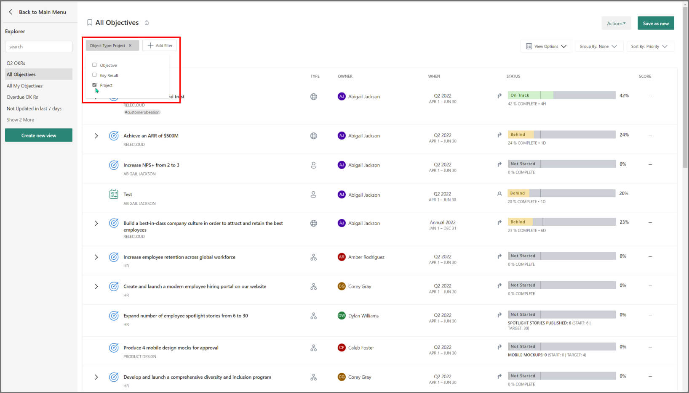

# Explorer

> [!IMPORTANT]
> Viva Goals is currently available only for private preview customers, and only in English. The features described here are subject to change. Viva Goals is only being released to WW tenants. It isn't being released to GCC, GCC High, or DoD environments. [Learn more about Viva Goals.](https://go.microsoft.com/fwlink/?linkid=2189933)

Explorer can generate preset views and create custom views. Use Explorer to filter out objectives and key results (OKRs) and projects of interest, and save commonly viewed filters to quickly access them again in the future.

## Default views in Explorer

The Explorer default views provide a strategic glimpse into your organization's OKRs and projects and their progress. You can choose from one of these handy preset views:

| View  | What it shows |
|---------|---------|
| All Objectives | All company objectives in one place |
| All My Objectives | All your objectives in one place |
| Overdue OKRs | OKRs that are past their due date. They need not be at risk or behind to be past their due date. |
| Not updated in the last seven days | OKRs that haven't had a check-in for the last seven days or longer. |
| OKRs that haven't had a check-in for the last seven days or longer. | OKRs marked with status **at risk** or **behind** |
| Recently completed OKRs | OKRs that have been closed within the last seven days |
| Unaligned OKRs | OKRs that aren't aligned to a parent objective |

## Create custom views in Explorer 

Viva Goals lets you create custom views and save the filters you use often.

1. To get started, select **Explorer** from the side navigation bar and then select **Create a new view**.

2. Add new add filters to customize the view.

The following filters are available:

| Filters | Filters by |
|---------|---------|
| Aligned | Aligned to any or a specific objective. This filter can also pull out unaligned objectives. |
| Check-in Date | Check-in date of the OKR/Project. Filters by the exact check-in date, after or before a specific date, or more or less than *x* number of days. |
| Created Date | Created-on date of the OKR/project. Filters by the exact created date, after or before a specific date, or more or less than *x* number of days. |
| Due | Due date of the OKR/Project. Find overdue OKRs/projects or view all OKRs/projects due within a particular time. Filters by overdue, after or before a specific date, or more or less than *x* number of days. |
| Integration | The integration connected with the OKR/project. |
| Keyword | Keywords in the OKR/project title. Filter based on the product name, campaign name, or other keywords unique to your organization. |
| Last Updated | Last time the OKR/project received an update. Find OKRs/projects that are falling behind on check-ins, or get a snapshot of activity during a specific timeframe. |
| Time period | The time period the OKR/project belongs to |
| Manager | Manager of the OKR/project owner. |
| Object Type | Filters by objective or key result or project. |
| Owner | Owner of the OKR/project. This filter can also locate unassigned OKRs/projects. |
| Progress | Percentage of completion. This filter is handy in combination with the due date filter. |
| Start Date | The start date of the OKR/project. |
| Status | The objective/project's current status. Select from Not Started, On Track, Behind, At Risk, Closed, Postponed, or Reopened. |
| Tag |  Search by tags added to OKRs/projects. |
| Team Type | The team type of the OKR/project. Team type is specified when you create a team in the admin dashboard. |
| Time Period | The time period the OKR/project belongs to. |
| Type | Organization-level, team-level, or individual-level OKR/projects |

Filters are better when used in combination. To create meaningful and relevant views,  combine several filters.

By default, views list objectives, key results, and projects. To view only top-level objectives, select the checkbox in the upper-right corner.

## How to save and export

Save and export views for future reference or to share insight with your team. To save a view, select the **Save View** button in the upper-right corner. You'll be prompted to name the view and select a sharing option.

> [!Note] 
> If you don't want to share the new view with your team, change the security setting to **Only Me** and then save the view.

You should now be able to find the saved view in Explorer. If you made it available to everyone, they'll be able to find it there also.

If you want to export the view, go to **Actions** -> **Export** in the upper-right corner. The export file will be emailed to your account. You can also remove the view from **Actions** if you've saved it and are now done with it.

Here are for settings for the **Export** feature:

- Select the format of the export file, CSV or XLSX.

- Select the exact fields to include in the export file.

- Include key results/projects along with the objectives exported. In this case, first level of key results/children will be exported along with each objective.

- Choose to export tags in separate columns in the file.

Any changes that you make will be preserved for every user for subsequent exports.

## How to rename a view

You can rename a view after it's been saved: Select **Actions** -> **Rename View**.

## How to use an existing view to create a similar view

Viva Goals enables you to edit a saved view and save it as a new view. To do this, open a saved view, make any appropriate changes to filters, and then select **Save** from the dropdown on the right side. You'll be prompted to update the current view or save it as a new view.

Example: I want to create specific views for each of my employees or teams. I've created a view for John with the appropriate filters set and have saved it. I then would edit the filter for **Owner** from John to Jordan and save it as a new view.
    
## How to sort your OKRs in Explorer
    
You can sort your objectives and key results in Explorer.

This information refers to the order in which the OKRs are arranged in the Entity (organization/team/individual) OKR view. For example: If you have OKRs arranged in a certain manner on your page and want to see the same priority order in Explorer, you can use this option.  

## Frequently asked questions 

**How do I view all OKRs in Explorer?**

In Explorer, select the **All Objectives** preset view.

**How do I view all projects?**

In Explorer, apply the filter for **Object Type** as **Project** to view all projects.

**How do I export my data?**

Use filters to access the data you want, and then go to **Actions** -> **Export**. You'll receive an email with a link to download your OKRs and projects as a .csv/Excel file. Remember to clear the **Show only top-level objectives** checkbox if you need the KRs too.

**How do I save a view?**

To save a view for easy access, select **Save view** in the upper-right corner. Enter a name for the new view and select a visibility option. After it's saved, you can access the view from the Explorer menu.

**How do I delete a view?**

To delete a saved view go to **Actions -> Remove view**.

**Who can access my view?**

That depends on the availability configuration you choose when you save the view. There are two options:

- Private: Only you can access the view
- Public: Everyone in the organization can access the view

To change this setting, select **Save view**, change the availability setting, and save it again.

**What does exporting tags as a separate field mean?**

If an objective, key result or project has more than one tag, the field can be exported as separate columns instead of comma-separated values in the .csv/Excel file.

**How do I export my OKRs and projects?**

You can use Explorer to export OKRs and projects. Go to Explorer from the main menu. You can use the **All objectives** view if you want to export all your OKRs or apply any desired filters, like time period or owner.

> [!NOTE]
> By default, Explorer only displays top-level objectives. If you want to include the KRs/projects, you can use the flat-list view or choose to include the child key results/child projects when you export.

**Flat-list view:**

After you modify your view as desired, go to **Actions** -> **Export** to export it. You'll soon receive an email with your download. To learn more about the Explorer, our [Explorer article](https://help.ally.io/en/articles/5845706-explorer).

**How do I filter OKRs by team in Explorer?**

Use the **Type** filter to refine the OKRs list by teams or individuals.

Apply the changes and save the view for future reference.
