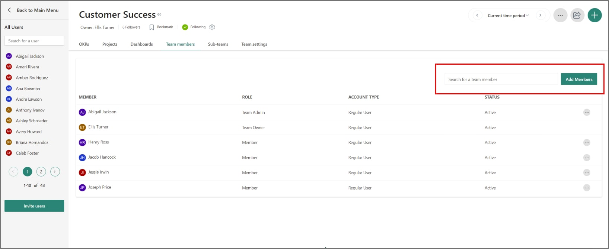
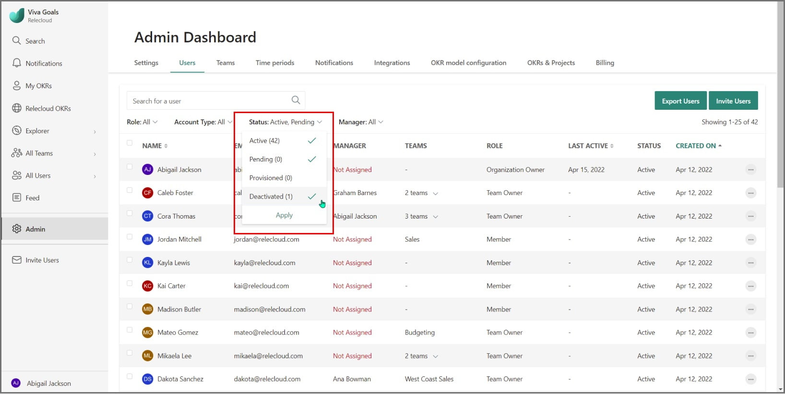
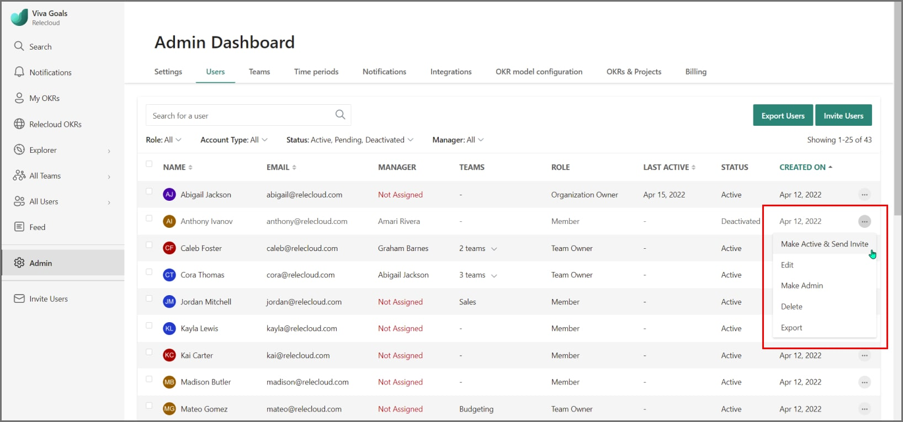
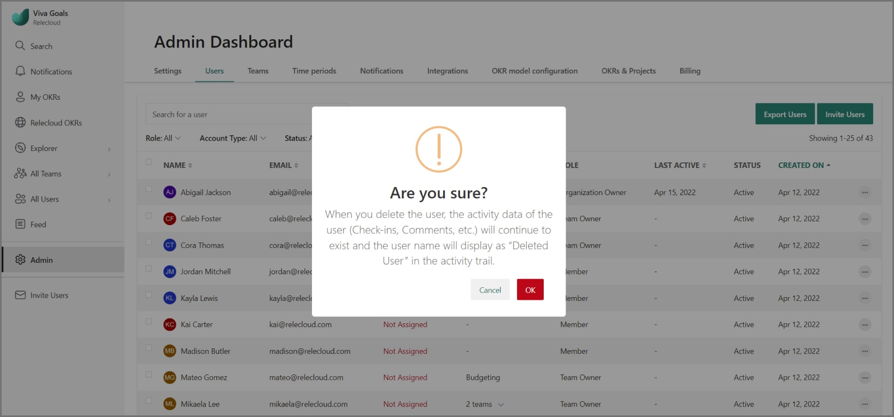

# Invite and remove users in Viva Goals

> [!IMPORTANT]
> Viva Goals is currently available only for private preview customers, and only in English. The features described here are subject to change. Viva Goals is only being released to WW tenants. It isn't being released to GCC, GCC High, or DoD environments. [Learn more about Viva Goals.](https://go.microsoft.com/fwlink/?linkid=2189933)

To onboard your entire organization into Viva Goals, send an invitation to all team members.

Before either of these procedures, you must sign in to Viva Goals using Azure Active Directory and create an account for your organization.  

## Add users via invitation after you create an organization 

1. After you create an organization, select **Continue.**

2. You'll be taken to the **Invite Members** page, where you can enter the names of the users you want to add to your organization.

   Alternatively, you can also add an Azure Active Directory group with all the users you want to invite.

4. If your organization is public, you have the option of sharing a link to join your organization with users.

> [!Note]
> Ensure that all users are provisioned on your organization's Azure Active Directory account.

## Add members via invitation from Viva Goals

To invite users from the Viva Goals menu, select the **Invite Users** button.

Or, if you're the organization administrator, you can also go to **Settings** and select **Invite Users** on the Users tab.

Another way to do this is to select **All Users** from the menu and then select the **Invite Users** button.

## Remove a user 

To remove a user from your organization, an admin can deactivate or delete their account: Go to **Admin** -> **Users**. Find the user you want to remove and select **Actions** -> **Deactivate** or **Actions** -> **Delete**. In either case, you'll no longer be billed for that user.

### Deactivate versus delete a user

A deactivated user will remain visible in Viva Goals but won't be able to sign in. The user will remain assigned as an owner of any OKRs they had. They won't be searchable in **All Users** and will be listed as deactivated in the **Users** section of the admin tools. 

To reactivate a user, go to **Action** -> **Make Active**, which will restore their ability to sign in.

Deleting a user is a permanent action and can't be undone. It removes all their activities in the system.

Admins can’t delete users who currently own any objective. To delete those users, reassign their OKRs first, and then delete the user.

**Example scenario of when to deactivate a user**

- When an employee moves from one organization to another within a company

**Example scenario on when to delete a user**

- When the organization administrator receives a request from the user to completely delete all data that can be linked back to them as per GDPR DSR regulations

### Frequently asked questions

**Can any group in Azure Active Directory be invited to Viva Goals?**

Any group in Azure Active Directory, Security Groups, Distribution groups, and Microsoft 365 groups can be invited to Viva Goals. 

**How many groups can be invited?** 

Currently, only one group from Azure Active Directory can be invited to Viva Goals. 

**If only one group can be added, how can administrators invite an entire organization to Viva Goals?**

To invite an entire organization, we recommend users nest all existing groups or include all members as part of a single group.  

**Can I invite a group if I'm not a member of the group?**

Yes, you can invite any group, even if you aren't a member.

**Will emails be sent to all users who are part of the invited group list?**

Yes. However, if the group they're a member of restricts emails by not including Viva Goals as an authorized sender, users won't receive email communications.

**If users are removed or added to the group, will the list automatically sync with the respective organization in Viva Goals?**

Yes, the Members list in that specific group will automatically sync with the respective organization. 
