# Microsoft Teams integration

> [!IMPORTANT] 
> Viva Goals is currently available only for private preview customers, and only in English. The features described here are subject to change. [Learn more about Viva Goals.](https://go.microsoft.com/fwlink/?linkid=2189933)

You can use Viva Goals to manage your OKRs directly within Microsoft Teams.

Our quick and easy integration enables users to add, update, and manage OKRs within the context of their daily workflow. You can also reference OKRs in conversations by using our message extensions.

## How to grant org-wide consent for your users

For private preview, the Viva Goals app is unverified. This will be changed as we move out of private preview. We recommend that as an admin you pre-consent for all users in your organization so that users don't have to review and accept the permissions requested by the app when they start the app. [Visit this page](/microsoftteams/app-permissions-admin-center) to learn how to consent for all your users.

## How to pre-install Viva Goals for users within Microsoft Teams

As a Microsoft Teams administrator, you can now pre-install the Viva Goals app directly from your MS Teams account. To do this, you need to be a tenant admin with access to admin.teams.microsoft.com.

**Follow these steps to successfully pre-install Viva Goals:**

1. Log in to https://admin.teams.microsoft.com/ with your user id and password.
2. Click on "Teams apps" and choose "Setup policies".
3. Choose the policy that is associated with the segment of users you want the Viva Goals app to be pre-installed for. If you want to pre-install Viva Goals for all users in your tenant, choose the Global(Org-wide-default) option.

4. Under the installed apps section, click on the ‘Add Apps’ button and Add Viva Goals.

After completing these steps, when a user logs into their MS Teams account, they'll find Viva Goals pre-installed within the Apps section.

## How to install the Viva Goals app if you are not an administrator

There are multiple ways to install the Viva Goals app in Teams.

The first way to add Viva Goals to Teams is for you to click the ellipsis […] button on the navigation bar on the left, search for Viva Goals and click on the Viva Goals app from the list of search results.

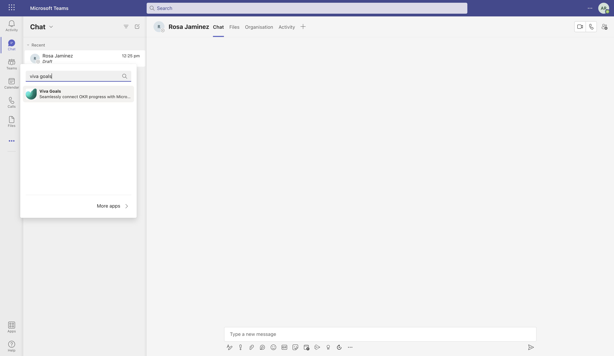

From the Viva Goals app detail page, you can click the Add button to add Viva Goals.

The second way to Add Viva Goals is to visit the Apps store and once there, search for Viva Goals and click the Viva Goals app listing.

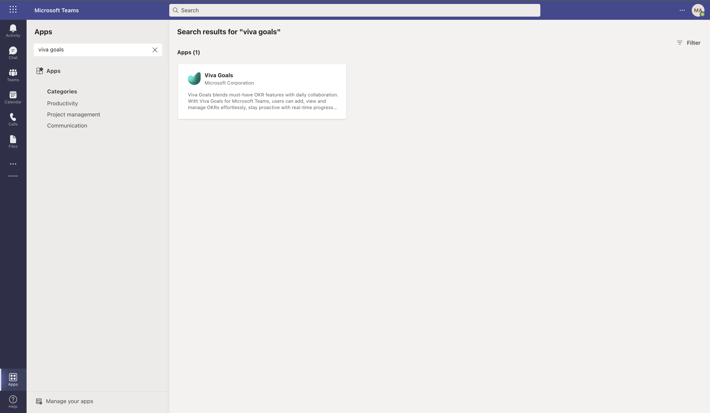

From the Viva Goals app detail page, click Add.

Once Viva Goals have been added to MS Teams, the app will guide you on the next steps based on if you already have an account with Viva Goals or not.

## How to use Viva Goals for Microsoft Teams 

Viva Goals in Microsoft Teams is your one stop shop for adding, updating and managing OKRs within Microsoft Teams. 

### How to manage your OKRs in Microsoft Teams

The ‘My OKRs’ tab shows you OKRs assigned to you. 

1. If you are part of multiple Viva Goals organizations, you can view your OKRs for each organization using the ‘organization switcher’ on the top left.

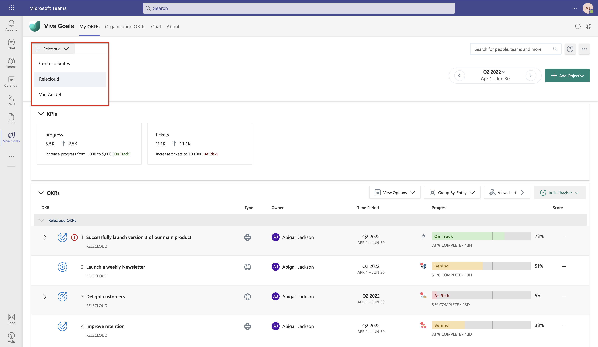

2. You can use the time period selector on the top right to view your OKRs for various time periods. 

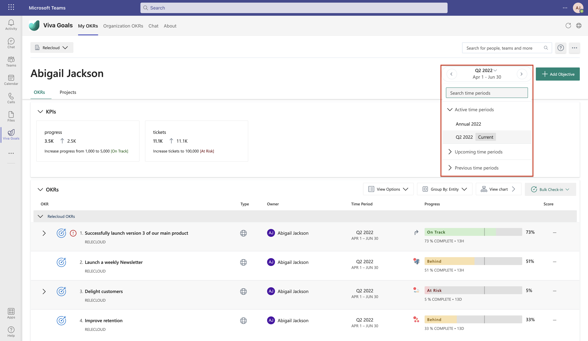

3. You can click on any OKR/Project to see details on the right.  
   
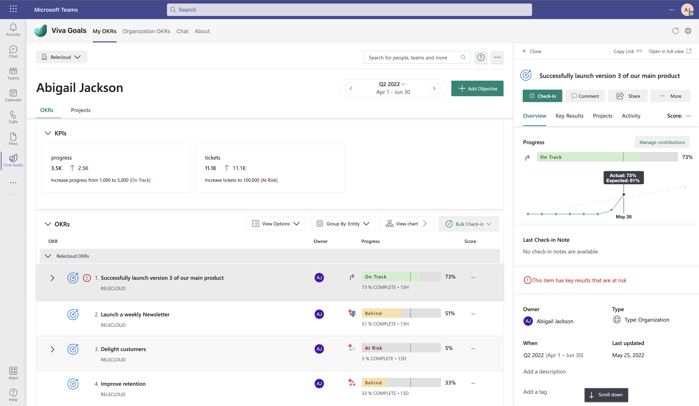

4. You can make inline check-ins to your OKRs/Projects directly from the list view by dragging the progress bar. You can also add a check-in note. 

         
### How to view organization OKRs in Microsoft Teams
         
To maintain your alignment to top level OKRs, the ‘Organization OKRs’ tab will show you your organization’s top level OKRs. Similar to the My OKRs tab, you can click on these items to view details. You can even edit and check-in on them if you are one of the OKR owners. 

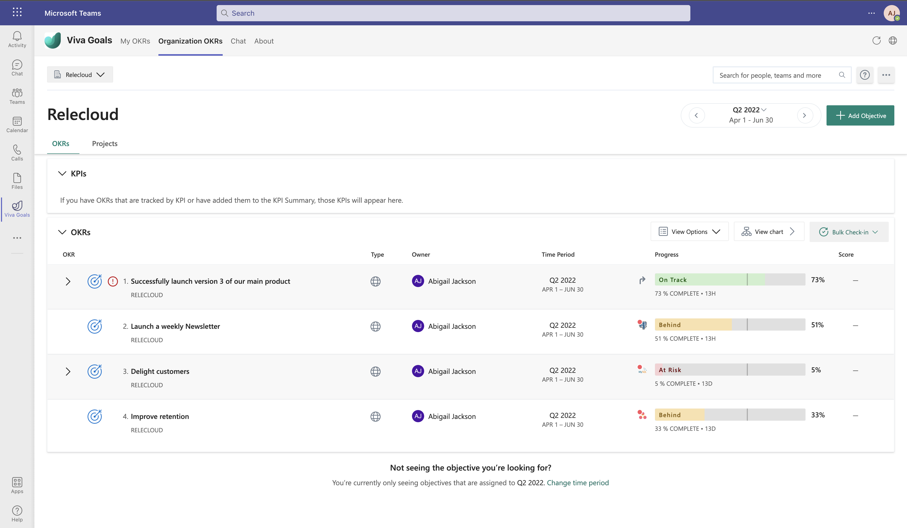
         
### How to find OKRs in Microsoft Teams

On both the ‘My OKRs’ and ‘Organization OKRs’ tabs, you can search for any OKRs on the top right. You can use this to view any team’s OKRs, or search for OKRs by name. This is a powerful way to quickly understand what other teams in your organization are focused on. 

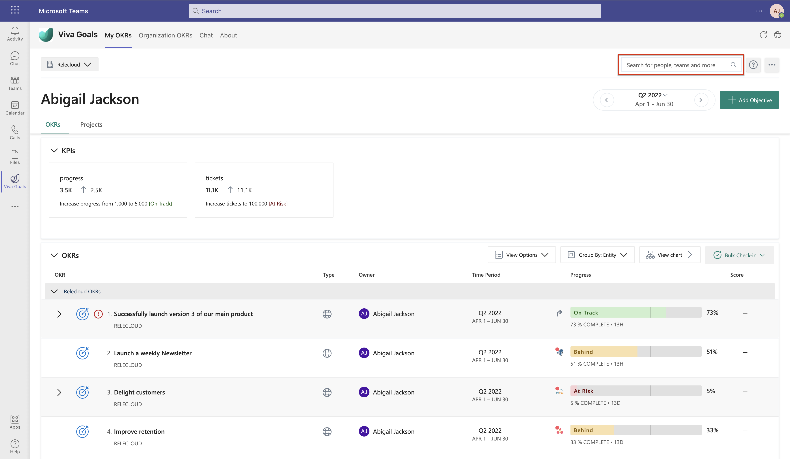

### How to add new objectives in Microsoft Teams
         
Adding a new objective inside Teams is easy. To do this follow the below steps:
         
1. On the ‘My OKRs’ page, click **+ Add Objective**. 

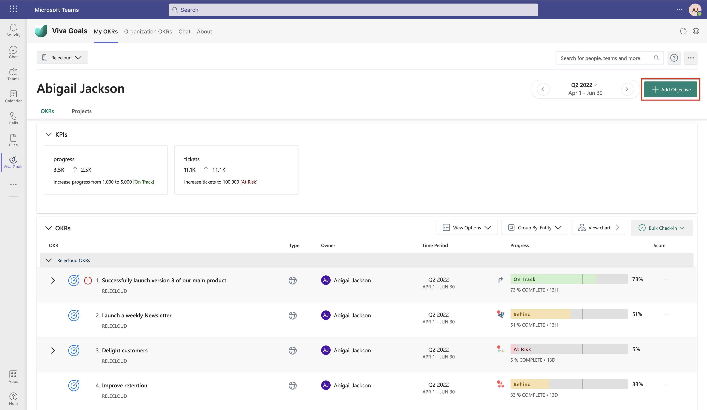
         
2. When the **Add Objective** page appears, enter your objective, add useful tags and description, choose a flexible measurement option, align the objective to another objective, and adjust owner, delegation and period. 

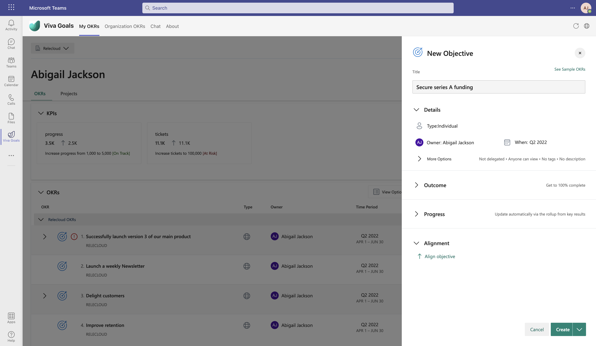
         
3. After you populate the objective information, select Save and Close, or Save and Add Key Results. 

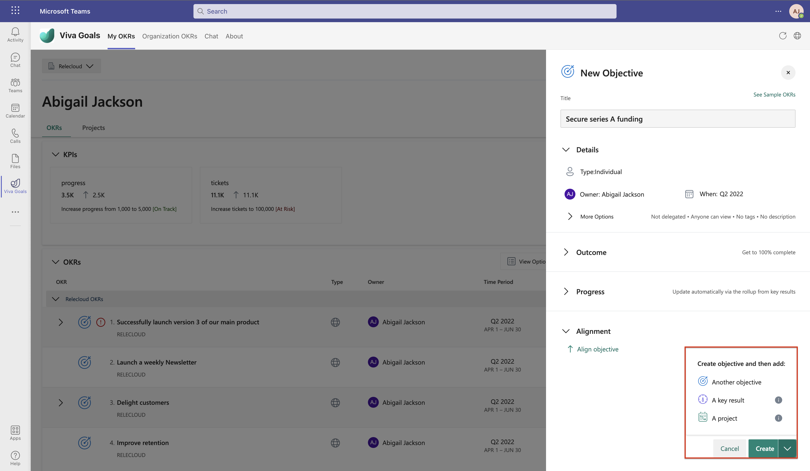
         
### How to add key results in Microsoft Teams

After adding an objective, and clicking Save and Add Key Result, the Add Key Result window will appear. On this page, you can add your key result, assign tags, add description, choose how you would like to measure success, add scoring guidance, a data integration, choose how to align, adjust owner, delegate and adjust time period. 

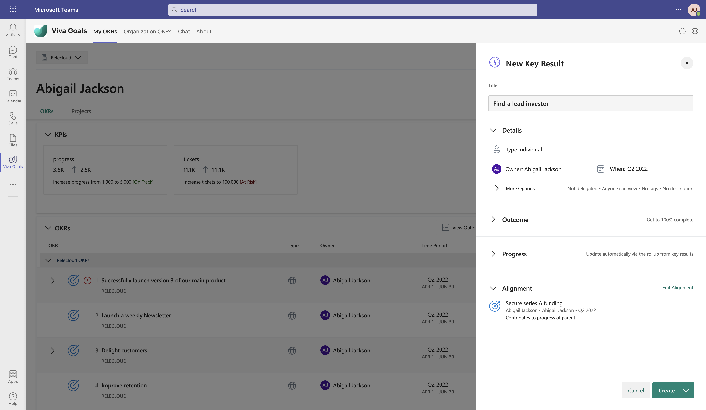

Once you have completed this information, you can Save and Close, or choose to Save and Add Another. 

### How to perform OKR check-ins in Microsoft Teams

To perform an OKR update in Teams: 

1. Select the My OKRs tab. Once here, scroll down to the OKR you wish to update and click the Check-in button. Updating key results is the same as the process for updating objectives.

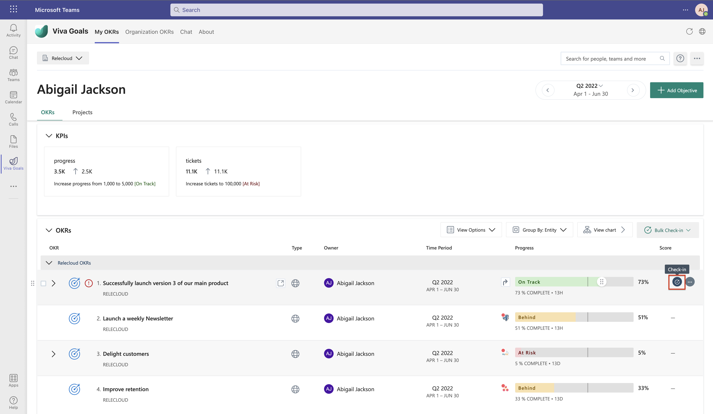
         
2. When the New check-in page appears, fill in the current progress and click Check in. 

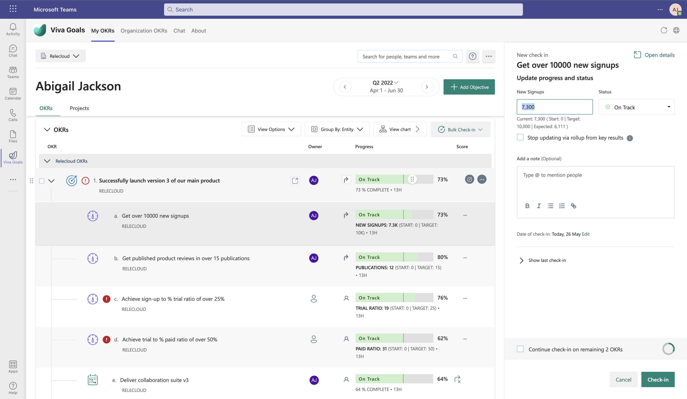

One you click Check-in, the progress of the objective or key result will adjust to reflect the recent check-in. 
         
## How to Use the Microsoft Teams Messaging Extension

You can surface specific OKRs and Projects within your MS Teams chats to add more context to your conversations. You can discuss progress, proactively identify and resolve blockers, and use Viva Goals to focus on the work that needs your attention. With the Microsoft Teams messaging extension, you can also make updates to your OKRs without leaving your chat.

## How to access the Viva Goals messaging extension within Microsoft Teams

> [!NOTE]
> Ensure that you have a Viva Goals account.

Follow these steps to insert an OKR/project in your textbox:

1. Log in to your MS Teams app.
2. Open up the chat where you would like to pull up your OKR progress.
3. Click on the ellipse **...** button below your text box.

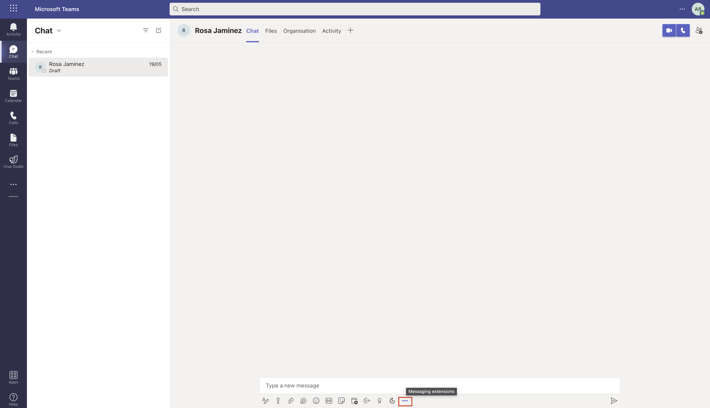

4. In the search box, type Viva Goals. The messaging extension for your organization’s Viva Goals account will appear.

5. Click the Viva Goals app.

   You will see a search bar, followed by the list of recommended public OKRs and projects.
   
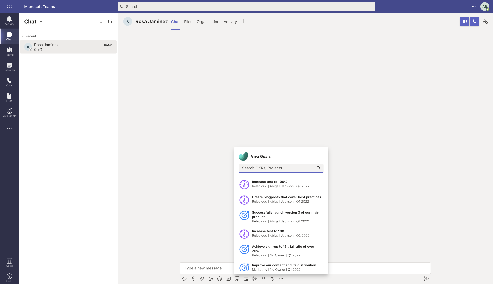

6. Type in the title of the OKR/Project you’re looking for. As you type, suggestions will appear, and you can pick one. You will then see a card for that OKR/Project within your text box.

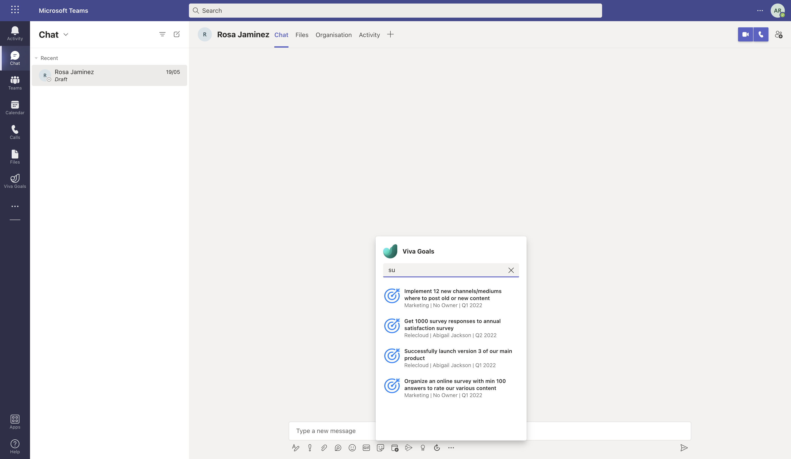
         
7. Add/remove any text you’d like to share for more context, along with the OKR/project’s progress, and hit **Send**.

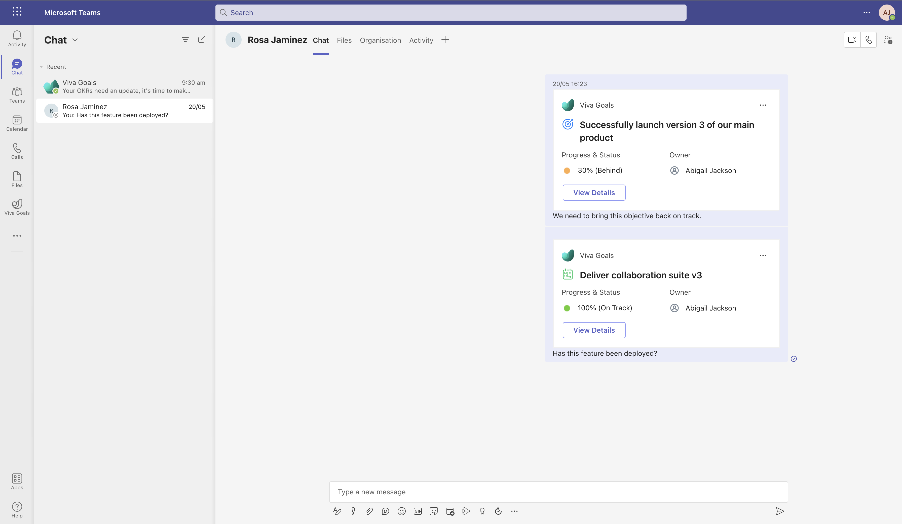

### How to make updates to your OKRs via the Microsoft Teams messaging extension

> [!NOTE]
> You can view details of the OKR/project card and make updates to it only after you have hit **Send**.

To update your OKRs on the fly via Microsoft Teams Messaging Extension, follow these simple steps:

1. Click on **View Details** on the OKR/project card that has been shared in the chat. A pop-up with all the details of the OKR/Project will appear.

      **A**: If the card selected is an objective/key result, you will be shown 4 tabs - **Overview**, **Key Results**, **Projects**, and **Activity**. The overview tab shows the details of the objective/key results such as the title, progress bar, owner, type, time period, last update’s date, tag, description, and alignment. The **Key Results** and the **Projects** tabs display the list of key results and projects that are aligned to the objective/key result, respectively. The activity tab lets you view the recent activity.
      
      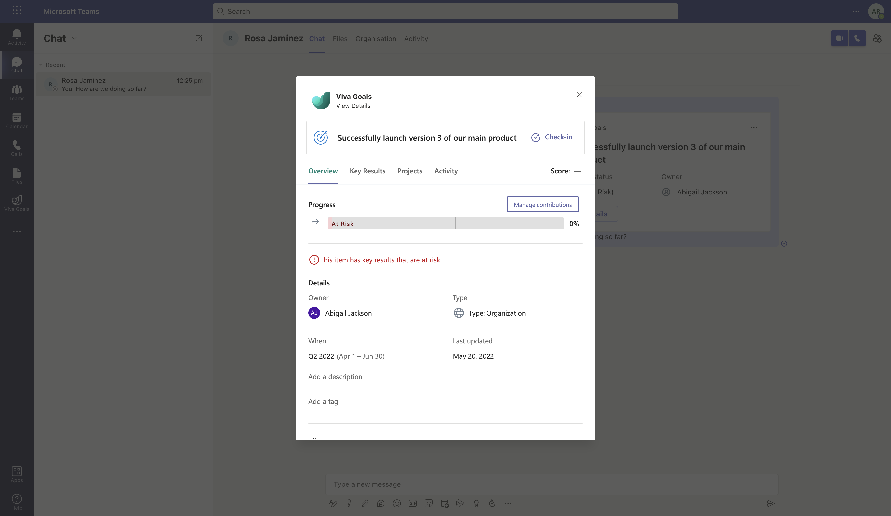

      **B**: If the card selected is a project, you will see 3 tabs - **Overview**, **Tasks**, and **Activity**. The **Overview** and the **Activity** tabs are similar to that of the OKRs. Under the **Tasks** tab, you'll be able to add tasks and also view existing tasks, if any.

2. Edit the OKR/project details, under the **Overview** section, such as the time period, owner, OKR type, and also add/edit a tag and a description.

3. Check-in to update the OKR/Project’s progress and status. You can also include a note.

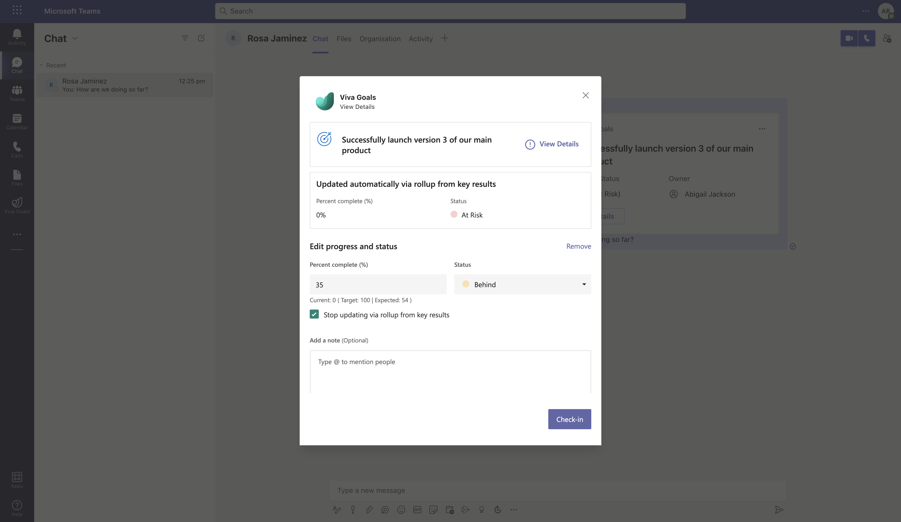

### FAQ

**1. What if I don’t have an existing Viva Goals account?**

If you don’t have an existing Viva Goals account, you will need to contact your administrator. Note that your organization would have to join the Viva Goals private preview for access.

**2. What if I already have a Viva Goals account?**

If you have an existing Viva Goals account, you will automatically be logged in and see any OKRs you have created 

**3. What if I don't have the permission to view a team's OKRs/Projects in Viva Goals? Would I be able to view them on MS Teams when they’re shared with me via the messaging extension?**

No, you would need to be a member/owner of that team in Viva Goals to view the OKRs/Projects that are shared with you on MS Teams.

**4. What does the error message 'Return to the main window to perform this action' mean and why does it appear?**

When you try to click on ‘View Details’ on an OKR/Project card before sending the message, this error would appear. You can only view the details and make updates to an OKR/Project card after the message has been sent.

**5. Can we add and send multiple cards in one message?**

Yes. MS Teams allows you to not only share multiple OKRs/Projects cards from Viva Goals, but also multiple cards from any app. You can even send multiple OKR cards from Viva Goals and multiple cards from other apps like Asana, Smartsheet, Jira, etc., all in one message.

**6. Is there a separate MS Teams messaging extension for each team in Viva Goals or a single messaging extension for the entire organization?**

There will be one common Viva Goals messaging extension on MS Teams for all teams, channels, and users across the organization.

**7. Can I search and view all OKRs/Projects or only my team's OKRs using the MS Teams extension?**

You can search for all the OKRs/Projects which are public and accessible to you. 

