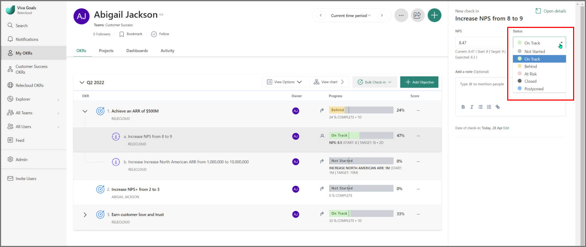
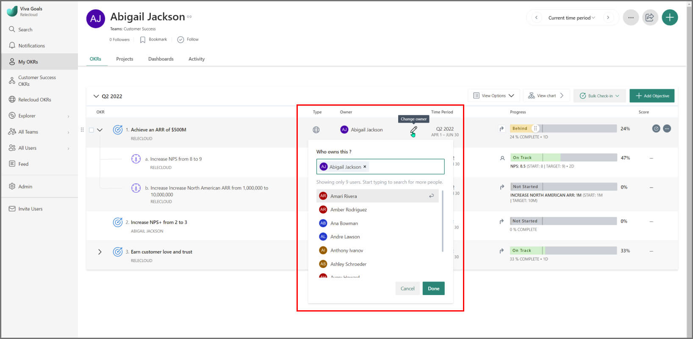

# Update OKRs with check-ins

> [!IMPORTANT]
> Viva Goals is currently available only for private preview customers, and only in English. The features described here are subject to change. Viva Goals is only being released to WW tenants. It isn't being released to GCC, GCC High, or DoD environments. [Learn more about Viva Goals.](https://go.microsoft.com/fwlink/?linkid=2189933)

## How to check in with Viva Goals 

Check-ins are updates that OKR owners make to the objectives and key results that they're responsible for.

Regular check-ins prompt a constant, rhythmic review of OKRs. This helps your team stay on track, course correct, make necessary changes to outdated or unachievable objectives, and most importantly, make sure that teams spend time on work that really matters. 

The fact that all check-ins are visible to everyone in the organization maintains transparency and accountability in the OKR process. If your organization would prefer to keep some OKRs private, see [Private objectives](private-objectives-key-results.md).

To check in quickly, go to your list of objectives and move the cursor over the objective or key result you want to update. Select the check-in option.

In the check-in sidebar:

1. **Tell your team the latest on your OKRs**: This is the place to contextualize your update with a brief note or comment. Be sure to cover any issues or challenges you're facing and the progress you've made. Numbers don’t always tell the whole story. 

2. **Enter progress**: This could be the percent completion of your task or KPIs met, depending on the metric of success you chose when you created the objective. 

3. **Flag the overall status**: Is your objective or KR on track, behind, or at risk, or have you not started yet? 

    

Keep it short and sharp. The OKR process doesn't require long explanations on every check-in.

After you make a check-in, you'll notice that the statuses and progress of all parent objectives update automatically. This roll-up reflects and maintains the alignment between different levels of OKRs.

> [!Note] 
> Objectives tracked by custom KPIs are an exception to automatic updates. Viva Goals can't know how the progress of the key result will impact the aligned objectives, so it won't automatically update progress. You have to manually update objectives that have custom KPIs. 

## How to assign responsibility for check-ins

Use the **check-in responsibility** feature to see who an OKR owner is and prompt them to check in. The check-in owner will be able to check in on the OKR manually or set up a data link for the OKR to automate the check-in process. Check-in owners will receive check-in reminders.

When there are multiple OKR owners, only the user who is set as **check-in responsible owner** will receive the reminders.

**How to assign responsibility for check-ins**:

1. Sign in to Viva Goals and select the **+** button on the top panel to create a new OKR.

2. Enter the objective/key result. To share it with another individual, choose owners from the **Owner option.** You can assign multiple owners for the OKR.

3. Select the user who will be responsible for making check-ins from the **Who is responsible for making check-ins?** drop-down. Once you make the selection, the user will start receiving check-in reminders.

> [!Note] 
> By default, the owner, or the first owner if there are multiple owners, is set as the person responsible for check-ins.

   

## How to use likes and comments with check-ins

OKRs and ongoing feedback make a great team. Use Viva Goals's social features to foster a culture of ongoing feedback for your OKRs by adding likes and comments to your team’s check-ins. 

To comment on a check-in, go to **Check-in** on the objective page or find it in the feed. Use "**@**" followed by the name of a team member to mention them in a comment. This sends them an email notification, which draws their attention to critical updates or opportunities.

## How to edit and delete check-ins 

If you need to change or remove check-in made in error, you can find the check-in on the objective page or feed and then select **edit** or **remove** to make changes.

## How to set reminders for check-ins 

Viva Goals sends reminders in the following ways: 

- If a Microsoft Teams integration is enabled, the notifications are sent through Teams. 

- If no integrations are set up, Viva Goals sends reminders by email.

**You can customize your reminder settings by:**

- Frequency (every one, two, or three weeks, or monthly). 

- Days on which notifications are sent. 

- Time at which notifications are sent.

- Disable notifications for OKRs that have had check-ins in the past *X* days (select number of days).

- Admins or managers of a team can control whether the subteams reporting to them can set their own check-in rhythm or must follow the same cadence as the parent team. 

**The two options that determine the cadence and cascading of check-in rhythms are:** 

- Allow teams to change their rhythm anytime.

- When saving, apply this schedule to teams. 

**Let's consider the following scenarios to better understand the usage of these configurations to set a check-in rhythm:**

- A chief of staff is setting a check-in cadence for the People Operations department to receive notifications every month on the first Friday at 9 AM. The chief of staff wants the subteams reporting to her to continue having a cadence of their own, preferably a weekly cadence. Therefore, she won't cascade this cadence down to the reporting teams and will let each team set their own check-in rhythm. 

    

- The head of marketing is setting a bi-weekly cadence for the Marketing team to receive notifications on every Monday once every two weeks at 9 AM. The head of marketing wants his reporting teams (say, Product Marketing, Demand Generation, and Customer Marketing) to have their own cadence but highly recommends starting them with the same cadence as the marketing team. In this case, the cadence will cascade down the teams. But the teams can change this schedule at any time. 

- The VP of sales wants her team to have a weekly check-in cadence and is setting a rhythm to receive notifications every Wednesday at 9 AM. She wants all the subteams who report to her to follow the same cadence to ensure everyone is caught up every week and is on the same page. Therefore, she'll set a cadence, cascade it down to all her reporting teams, and not let them change this rhythm.

Team owners and team admins can create a custom cadence of reminders for their departments and teams in **Admin** -> **Team Settings**. These cadences can differ from the organization-level cadence. 

If teams have to follow the parent team's check-in rhythm, the team owners and team admins can't change the schedule.

## How to automate check-ins 

To make check-ins automatic, you can:

- **Integrate Viva Goals with MS Teams.** To easily make check-ins and get a quick view of your OKR progress, pin your organization, team, or individual OKRs as a tab in any channel or chat. 

- **Roll up your objective progress to your key result progress.** Roll-up of progress makes it easy to assess the impact a key result has on its objective and other objectives above it in the hierarchy of OKRs. The objective's progress will be the average of the progress of its key results. 
