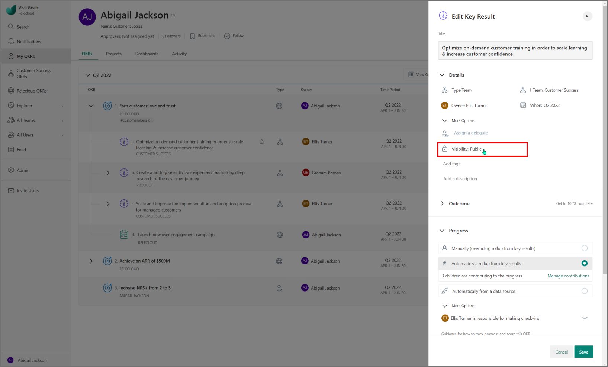
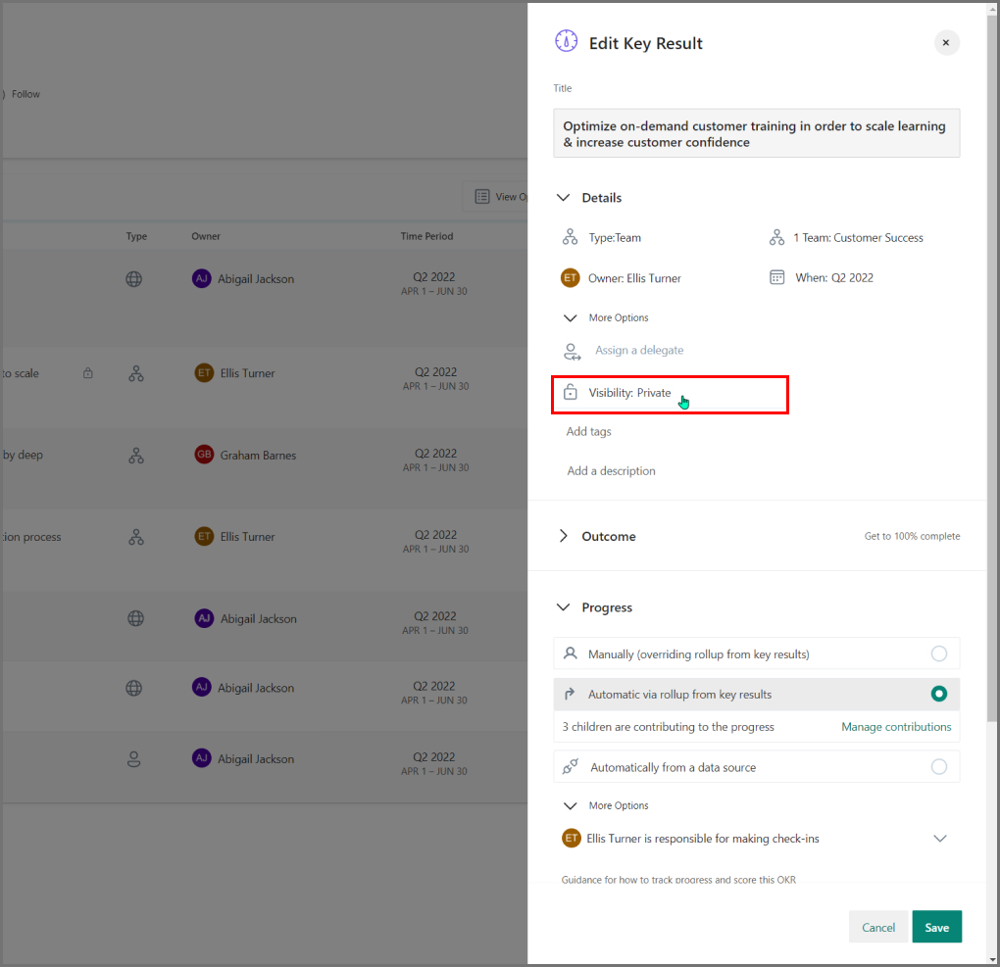

# Private Objectives 

> [!IMPORTANT]
> Viva Goals is currently available only for private preview customers, and only in English. The features described here are subject to change. Viva Goals is only being released to WW tenants. It isn't being released to GCC, GCC High, or DoD environments. [Learn more about Viva Goals.](https://go.microsoft.com/fwlink/?linkid=2189933)

While the OKR methodology promotes transparency across the entire organization, Viva Goals recognizes that large enterprises often have sensitive objectives that require a limited audience.

## What are Private Objectives?

The Private Objectives feature in Viva Goals allows users to set private objectives visible only to themselves and designated individuals.

Private objectives are easy to distinguish from the rest. Look for the **padlock icon**. Hovering over the icon will display the list of users that can see this objective and allows the owner to manage this list.

- Private Objectives will only be visible to this list of users. To the rest of the organization, these Objectives will not exist. 

- Private Objectives will be visible in the Objective Explorer to users with the given permission.

- Private Objective's comments, likes, and check-ins will only be visible to the designated list of viewers.

- Private Objectives can be set at the Organization, Team, or Individual levels.

## How to make an Objective private

If your organization has this feature enabled, visibility can be managed while creating or editing objectives.

By default, all objectives will be visible to the entire organization unless configured with the following steps:

1. Select **Visibility** on the **Add/Edit Objective** window.

2. Select **Private** and enter the name(s) of the required users to make it private to only this list of people and select **Done**.

    > [!NOTE]
    > This list of users will also be able to see any key results below the objective.

3. Now the user can see this objective is private to them and one other person.

The privacy of an objective can be edited or changed at any time by the owner of the objective.

## Key considerations for Private Objectives

- Making an objective **Private** will automatically cascade the same privacy settings to its Key Results.
- An Objective cannot be made Private if any of its Key Results are in Multiple Alignment  
- The Key Results of a Private Objective cannot be multi-aligned to more than one Private Objective.
- Private OKRs cannot be aligned to Public OKRs by default.
- If your organization is looking for the ability to have Public Objectives with Private Key Results, we can enable it

