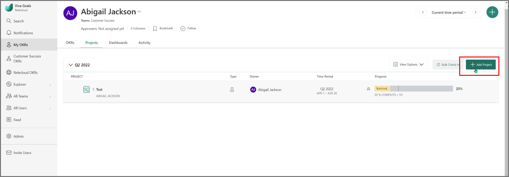
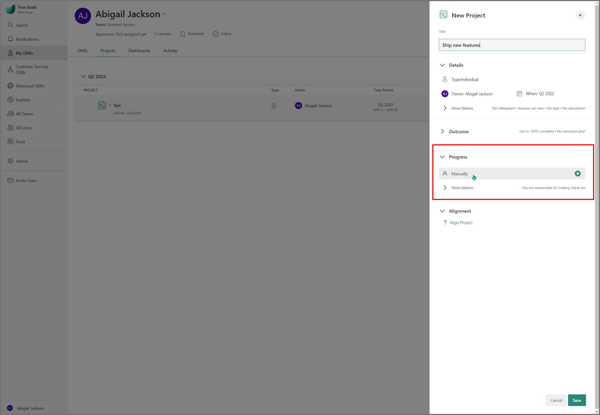
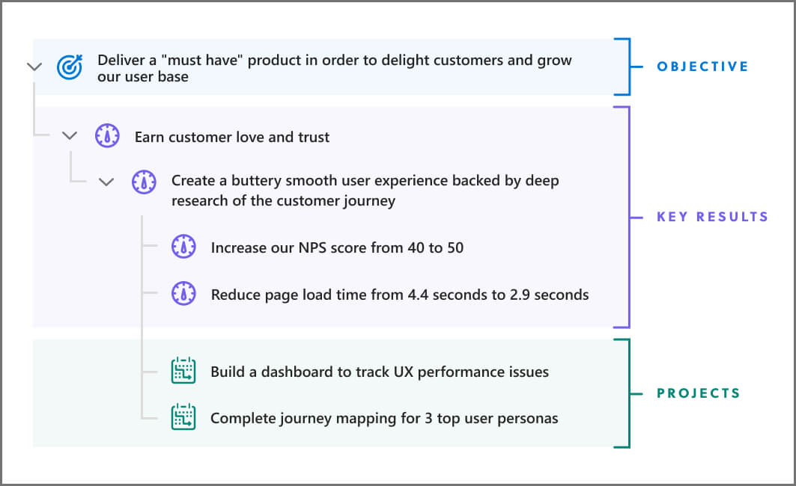
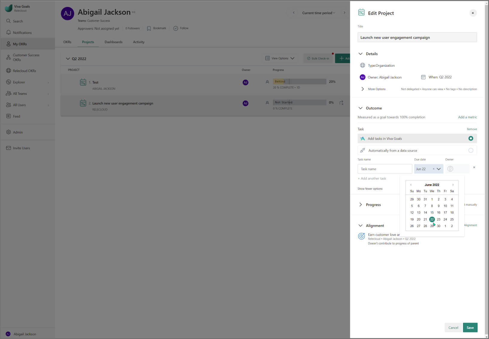

# Projects

> [!IMPORTANT]
> Viva Goals is currently available only for private preview customers, and only in English. The features described here are subject to change. Viva Goals is only being released to WW tenants. It isn't being released to GCC, GCC High, or DoD environments. [Learn more about Viva Goals.](https://go.microsoft.com/fwlink/?linkid=2189933)

Projects help you keep track the work your organization is executing to achieve your objectives and key results (OKRs). Like key results, projects can also be created under objectives and under other key results in Viva Goals, depending on which outcome they help to achieve. Select **Add project** under the appropriate objective or key result to create a project.

There are *two ways to add projects in Viva Goals*: You can bring projects to Viva Goals through an integration with the project management tool you use. Or you can create a project with a task list directly in Viva Goals.

## Add projects directly in Viva Goals

- From the list view of your OKRs, select **Add Project** under the corresponding objective or key result.

- Alternately, you can add projects from the **Projects tab** where your entire list of projects will be populated.

    

- Provide the project details: title, type (individual, team, or organizational project), project owner, and time period.

- Under the **Outcome section**, there are two options to break down your project: into milestones or by adding tasks to your project. 

- There are two ways to add tasks to your project: directly in Viva Goals or through an integration.

- To add tasks directly, provide details such as task name, due date, and owner.

    > [!NOTE]
    >
    > For key performance indicator (KPI) based projects:
    >
    > - When you add a KPI-based project, select **Add a metric** to specify the metrics of your project, including the starting and target value, the unit, and what the metric is.
    >
    > - To add tasks to your KPI-based project, select **Add tasks**. The task details you need to add are the task name, the owner, and the due date.
    >
    > - Note that these tasks will not roll up to the project. You have the options to update the project progress manually or automatically through an integration, but you can't update the progress automatically based on completed tasks (though you can add tasks).
    >
    
    >
- After you added your tasks, the next step is to set how the progress of the project will be calculated:

  - With tasks: Project progress can be calculated either manually or automatically based on the completed tasks.

  - Without tasks: Project progress is calculated automatically from the connected data source.

- Align the project to an objective or key result, and then select **Save**.

   

Native projects can be seen on the **OKR** and **Projects** tabs for your entity showing the manual or rollup icon. This shows whether progress is being updated either manually or based on the completion of native project tasks.

    
## Clone projects
    
Cloning projects is a quick way of to create new projects that retain the existing settings and tasks associated with the cloned project. Toward the end of any time period, such as a quarter, you may not have made the desired progress on a few projects. You can carry unfinished projects in Viva Goals into the subsequent time period by simply cloning them. This is a better way to roll over unfinished projects than editing the time period.

### When to clone projects

Cloning projects makes sense when: 

- You need to set new projects for the current time period quickly

- You need to carry over unfinished projects to a new time period

### How to clone projects

1. Against a specific project, select the **More actions** icon, and then select **Clone**.

2. In the dialogue box, configure the following settings:  

    **Time period:** Viva Goals defaults to the current time period, which is useful when you duplicate projects. If you're carrying over unfinished projects, select the appropriate time period from the drop-down menu.

    **Owner:** Choose to retain the original owner or assign a new one.

    **Entity type:** The project can be assigned to an organization, a particular team, or a specific user.

    **Alignment:** By default, the cloned project will be unaligned. Select **Add alignment**, if you want the project to align with an objective.

    > [!NOTE]
    > Unaligned OKRs are displayed only in the Projects dashboard, not in the current time period view. Unless you align the project to an objective, you won't able to see it in the current time period view.
    
## Access the Projects dashboard

In addition to being aligned to OKRs, projects also get their own dashboard in Viva Goals, so you can monitor execution. The dashboard is available at the individual, team, and organization levels.

    
## Understand project progress and status

Progress in Viva Goals is measured either as percentage complete or by a key performance indicator (KPI) metric (for example, 10 out of 15 sales calls made). Projects currently use only the percentage-complete method, as measured by tasks completed within the project.

By default, project progress does *not* roll up to the parent, to keep the focus on achieving key results. (For more information, see: [Roll up process of key results](https://help.ally.io/en/articles/1931651-roll-up-of-progress-of-key-results)). If you want, you can change this setting at the project level.

Viva Goals compares the progress of an item with its expected progress and computes a Status as outlined in ([OKR status indicators](https://help.ally.io/en/articles/3065807-okr-status-indicators)). Status for projects is computed in the same way as for OKRs.

**Project owners can do manual check-ins to provide the progress values or connect to a data integration to automatically update progress.**

You can choose to have a project without any tasks in Viva Goals and check in manually to update the project progress.

If you want to see the individual tasks in your project, you can create a task list directly in Viva Goals. Viva Goals also supports popular project management systems like JIRA, Asana and Wrike, with more on the way. When you use a task list in Viva Goals or connect to these systems, project progress is automatically computed based on the number of tasks completed vs outstanding. You can edit a project to add an integration after you created it without one. When that happens, project progress will be recomputed based on the tasks. But your previous history of check-ins will be maintained. Learn more about Viva Goals support for task lists, and popular integrations here:

- [Native projects](https://help.ally.io/en/articles/4397690-native-projects-in-ally)

- [Jira Integration with projects](https://help.ally.io/en/articles/4097674-better-jira-integration-with-projects)

- [Asana projects](https://help.ally.io/en/articles/4238088-asana-projects-in-ally)

- [Wrike projects](https://help.ally.io/en/articles/4510436-wrike-projects-in-ally-io)
    
## How to structure objectives, key results, and projects in Viva Goals

The recommended structure for OKRs and projects in Viva Goals is to have key results and projects under the objective. You can then see the outcomes needed to meet the key results and the output needed to achieve those outcomes (the projects). Projects are always placed after all the objectives and key results at each level of the hierarchy. 

## How to manually order the tasks of a Project

Users can sort the tasks by **Name**, **Assignee** or **Due Date**. Select one of those columns to expand the sort options.

> [!NOTE]
> You can only sort in the Full View of a project that contains tasks.

## How to add a due date for a task within a project

You can add a due date to a task within a project, even if the task is due after the project time period ends. 

For example, if the project was created for Q4 2021 (October 2021 to December 2021), the user can add a task with a due date of January 2022.

> [!NOTE]
> When you save the task, the application will notify you that "Due date is after project's end date," but you can save the task.
> 

## How to find tasks in Viva Goals

You'll find tasks listed in the **Projects** section.

## The difference between key results and projects

Most key results that aren't KPI metric-based are projects. The main questions to ask are:

- Is this key result really an outcome for the business, or is it an output (something you do) on the way to an outcome (the result)?

- Can I follow the parent objective with "as measured by" and complete it with this key result in a convincing manner?

One good indicator that a key result may really be a project is if it's percentage-completion based and doesn't have any children. Another indicator is if the language is delivery-oriented: Look for words like *Ship ...*, *Deliver ...*, *Implement...*.
