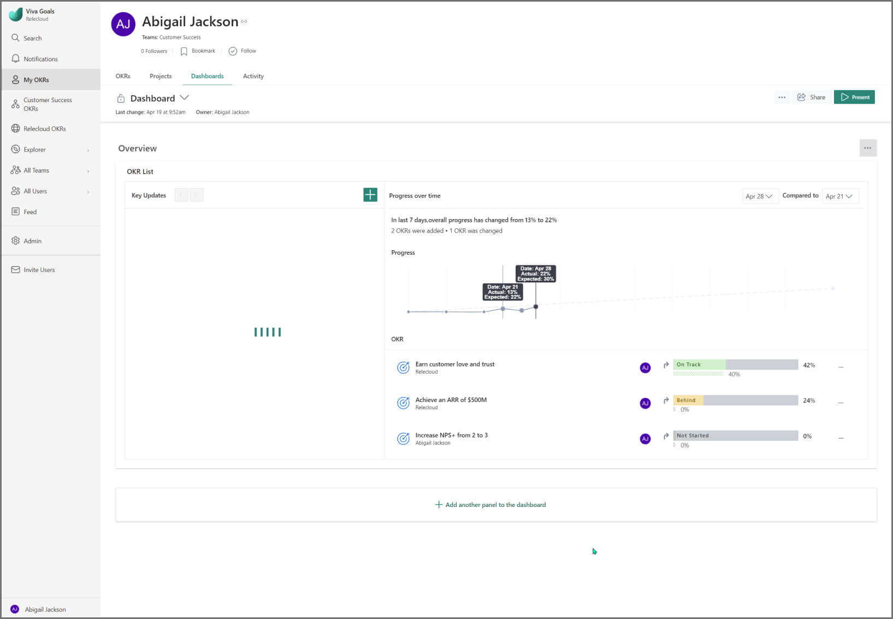
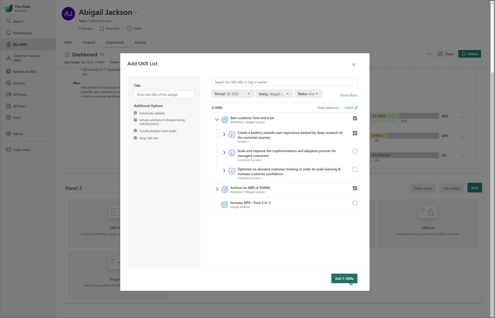
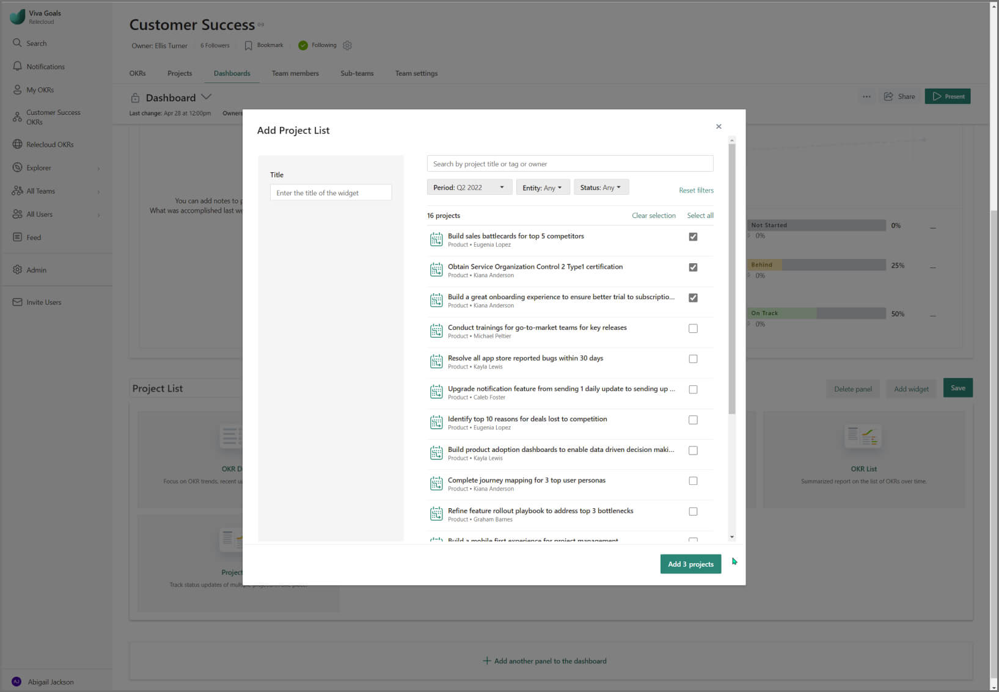
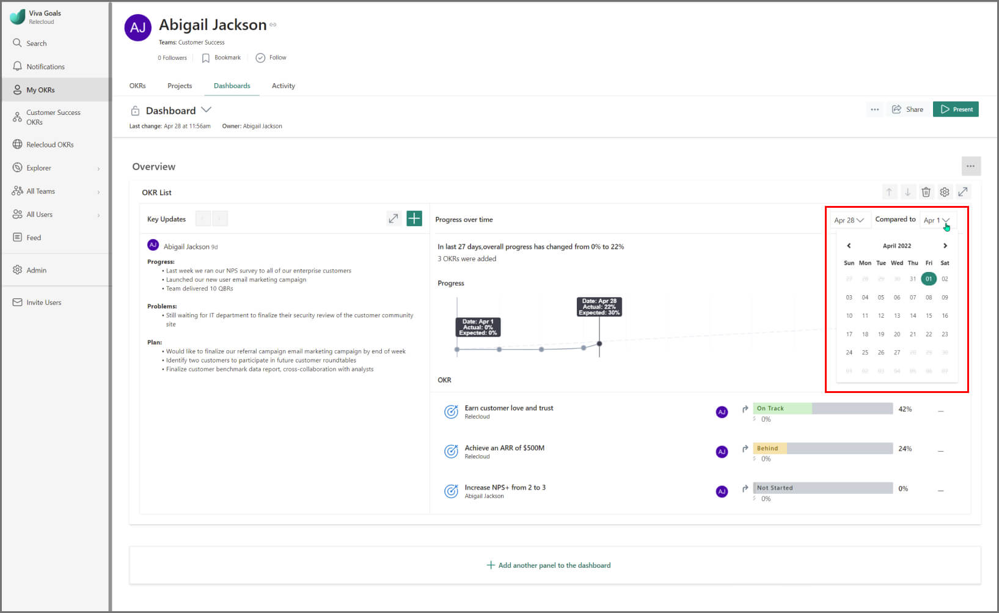
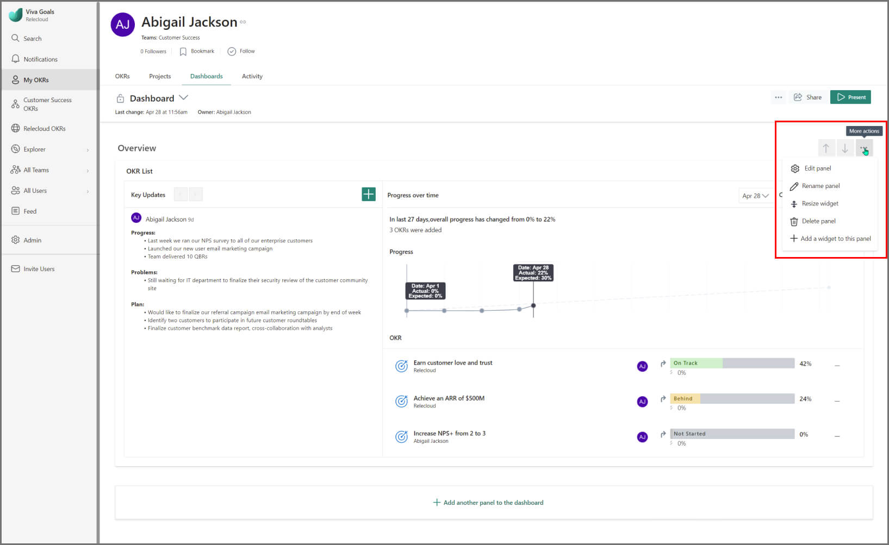
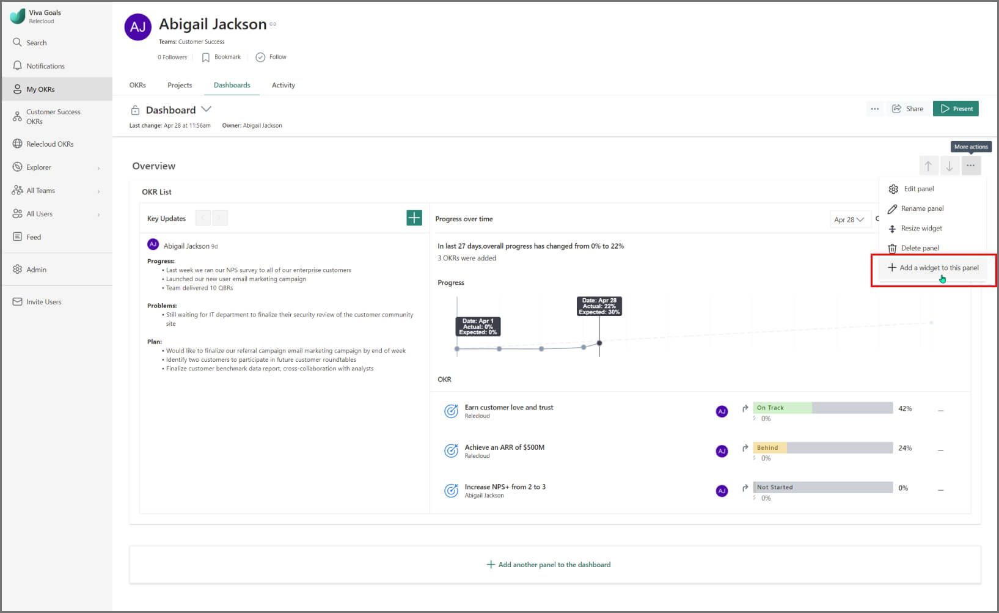
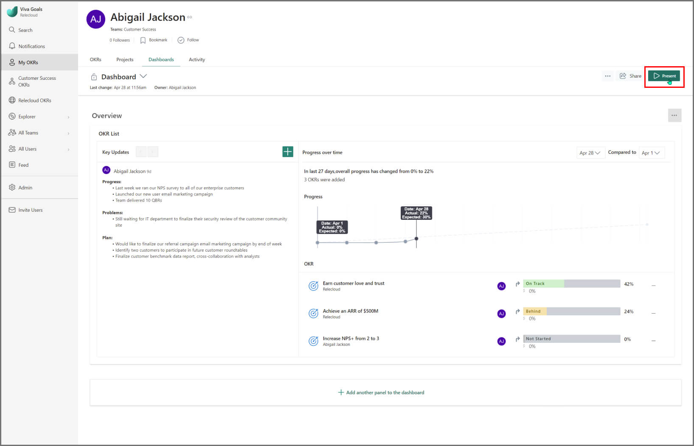

# Review Dashboards

> [!IMPORTANT]
> Viva Goals is currently available only for private preview customers, and only in English. The features described here are subject to change. Viva Goals is only being released to WW tenants. It isn't being released to GCC, GCC High, or DoD environments. [Learn more about Viva Goals.](https://go.microsoft.com/fwlink/?linkid=2189933)

## Review Dashboards for every business review rhythm

Business reviews happen across every level of the organization. Examples include quarterly business reviews, departmental deep dives, town halls and all-hands, team meetings, and board meetings. It becomes cumbersome to populate data for each of these reviews, and create presentations from the ground up.

Instead of building a dashboard from scratch, you can use the Viva Goals Review Dashboard to create a presentation-ready dashboard in no time, and present real-time data on Objectives and Key Results (OKR) progress during review meetings. 
    
With the ability to create multiple dashboards, you can save yourself from creating or editing presentations for each meeting, and use dashboards as the single source of truth to present live data on OKR progress. 

If you spend a significant amount of time creating presentations before every review meeting, or often switch back and forth during meetings to present real-time data, Review Dashboard can help. 
    
## What is a Review Dashboard?

The Review Dashboard is a customizable, presentation-ready dashboard that populates real-time data on Objectives and Key Results (OKR) progress, thereby eliminating the need to create a presentation from the ground up, every time before a review meeting.

You could be using several tools to track metrics that are closely correlated to the OKR progress within Viva Goals. Instead of juggling tools to present real-time data during reviews, Review Dashboard enables you to bring key performance indicator (KPIs), visualizations, projects, trends, and contextual information on OKR status under a single roof. This will foster a laser-focused review meeting.

## Who can benefit from the Review Dashboard?

Anybody who leads a review meeting or presents the overall OKR progress to the leadership team can reap the benefit of our Review Dashboard. Key use cases include: 

- The **executive team** can periodically facilitate effective strategic reviews with department heads to review OKR status at every level of the organization.

- The **department heads** can preside over tactical review meetings with team managers, and present the department's OKR status to the leadership team during business reviews.

- **Team managers** can use the dashboard to take a quick glance at OKR progress, instead of fetching this data manually and creating a presentation from scratch.

- **Individuals** can tailor this dashboard while having one-on-ones with their respective managers to talk through the accomplishments, priorities, and blockers using real-time data.

## How to access the Review Dashboard

Every organization, team, and individual has their own Review Dashboard. 

1. To view the company-level Review Dashboard, select your **organization’s OKRs** tab from the left pane and select the **Dashboard** tab.

2. To view a team-level Review Dashboard, select **All Teams** from the left pane and select a **team** of your choice, then select the **Dashboard** tab.

3. For Review Dashboards at an individual level, select **My OKRs** from the left pane and select the **Dashboard** tab. To view the dashboard of a user, select **All Users** from the left pane and select a **user** of your choice, then select the **Dashboard** tab.

## How to set up the Review Dashboard

**1. Navigate to the OKR page of the company, team, or individual.** Select the **Dashboards** tab.

**2. Open the dropdown list with the name 'Dashboard'.** Click **New Dashboard**. You will be provided with the options to create multiple widgets for this dashboard.  

**3. Start adding panels and widgets to the dashboard.** A Review Dashboard can house multiple panels, and each panel comprises seven types of widgets — Objectives and Key Results (OKR) detail, OKR list, text block, key performance indicator (KPI) list, and project list. You can customize this dashboard with any number of panels and widgets of your choice, depending on the need.

**4. To edit the dashboard, select the three-dot icon in the right-end corner (next to the Present button).** You can make the following edits to the dashboard: rename the dashboard, clone the dashboard, and set a default dashboard.

5. You can clone a dashboard. By cloning, you'll be able to copy the content and template for you to get started with dashboards in no time. 

## Available widgets for the Review Dashboard 

### 1. OKR list

- This widget comes handy when you want to briefly summarize the progress made since the last review cycle.

- You can list objectives by filtering them based on the time period, entity, and status. This list will set the stage for your review meeting by displaying the objectives that you want to discuss about. For instance, to identify objectives that require attention, you can filter them based on the status to display OKRs that are at risk, and behind.

- The Key Updates section on the left allows you to provide the narrative for the progress updates. These updates will ensure that every member across all the levels of the organization are on the same page in terms of the progress made by each entity.

- In case of shared OKRs, you can view the OKR progress of the dependent teams, instead of switching back and forth between each entity’s OKRs.

To create this widget,

- From the list of available options, select the objective list widget, and provide a name for this widget.

- The next step is to start adding objectives to this widget. You can add objectives either automatically based on the rules you define, or manually by handpicking the objectives. Further, you can filter these objectives based on the time period, entity it belongs to, and the status.

    > [!IMPORTANT]
    > When you choose to add objectives automatically based on the predefined rules, any objective that meets the criteria will be added to the list automatically. You don't have to rework on the list every time before your review. For example, if you want to review only the OKRs that are at risk, you can define this rule, and any time an objective becomes at risk, it will be added to the list automatically, and will not go unnoticed. However, if you want to review significant OKRs irrespective of the status, or entity, or time period, you can select such objectives manually, and review the progress during each meeting.

- In addition, you can add the Key Updates section, include the summary changes, and append the progress trend graph.

- Save and add the widget.

### 2. OKR detail

- You can choose any particular objective to take the center stage, and dive deep into the progress of each key result.

- This widget provides a granular analysis of the progress of each key result using the RAG status indicators (Red, Amber, Green), which will help you in understanding the daily progress of key results. You can quickly get to the root cause, and take necessary steps to bring the key result back on track.

- The Key Updates section on the left allows you to provide the narrative for the progress updates of the chosen objective. You can talk through the challenges, and the plan forward to get back on track.

To create this widget,

- From the list of available options, select the objective detail widget.

- The next step is to add a specific objective to this widget. You can filter the objectives based on the time period, and entity it belongs to.

- You can choose to include the progress graph, and recent check-ins made on the chosen objective. In addition, you can list all the key results pertaining to this objective.

- Save and add the widget.

### 3. Text block

- This is a rich-text editor wherein you can jot down supporting notes and add descriptive comments for the OKRs.

- You can include screenshots here to substantiate your data, if need be.

- This widget is an avenue for you to provide additional information, and talk through important points during OKR review meetings.

To create this widget,

- From the list of available options, select the text block widget.

- Use the formatting options for better presentation of the text within this widget.

- Save, and add the widget.

### 4. KPI list

- The KPI widget will let you highlight the key metrics, and review the progress of these metrics over time.

- There are two views of the KPI widget — tabular view, and the grid view. Grid view will provide you with the much-needed bird's-eye view on the numbers, and the progress update since the last review cycle. The table view, on the other hand, will let you analyze the daily progress made on the KPI. You can seamlessly switch between the views based on your requirement.

- You can filter KPIs based on the time period, and entity. For better context, the associated objective will also be displayed in this widget for each KPI.

To create this widget,

- From the list of available options, select the KPI widget, and provide a name for this widget.

- The next step is to start adding KPIs to this widget. You can add KPIs either automatically based on the rules you define, or manually by handpicking them. Further, you can filter these key metrics based on the time period, and the entity it belongs to.

- Select how you want to view the KPIs, either in grid view or the list view.

- In addition, you can select to display the objective that's linked with the KPI for better context.

- Save, and add the widget.

### 5. Project list

- Projects are initiatives teams and users execute to achieve key results. When you connect these projects to the overarching goals, employees see the big picture on how their work is driving progression toward company goals.

- To ensure teams work on the right projects that drive results, it's important to bring focus on Projects into your business rhythms. When you periodically review Projects in the context of OKRs, you gain greater visibility into work that’s driving OKR progression.

- Review Projects with the help of check-in notes, and the week-on-week progress and status.

To create this widget,

- From the list of available options, select the project list widget, and provide a name for this widget.

- You can filter and select projects based on the time period, entity, and the status of projects.

- Save, and add the widget.

## How to customize your Review Dashboard
   
After landing on the Review Dashboard page, the first step is to select the review period. 

### Add panels to the dashboard

- The default panel includes the objective list widget. Towards the tail-end of the dashboard, you will have the option to **add more panels** to the Review Dashboard.

- As you create a panel, provide a name for the panel. For greater flexibility over building the dashboard to cater to your requirement, you can move a panel up or down.

- On the right of the panel, select the More Actions icon to edit, or delete the panel.

### Add widgets to a panel

- Create a new panel, and start adding widgets to the panel from the list of widgets available.

- Alternately, to add widgets to an existing panel, select the three-dot icon towards the right-end of a panel and select **Add a widget** from the dropdown options.

- Once you’ve added the widget to the panel, you can select the cog icon towards the right-end of the widget to edit the widget. In order to delete a widget, you'll have to edit a panel, and select the delete icon, adjacent to the cog icon.

- When you edit the entire panel, each widget of the panel can be resized, and moved up or down based on your requirement. Also, to expand each widget select the expand icon (next to the cog icon) for better readability.

## How to present the Review Dashboard

On the **top-right corner** of the dashboard, you'll find the **Present** button. Review Dashboard is a presentation-ready dashboard. Each panel becomes a standalone slide of the presentation. This helps you in presenting real-time data on OKR progress, without juggling tools during a review meeting.

    
## How to clone and move Review Dashboards
    
As a team owner or team admin, often a need arises to clone a dashboard to retain the same structure across the entire organisation. One can achieve this in Viva Goals by making use of the **Clone**, **Clone and Move** and **Set as Default** functionalities on Dashboards which aid users in performing the cloning operations.

**Step 1:** Navigate to the **Dashboard** tab in the **My OKRs** window.

**Step 2:** From the highlighted drop-down menu, select the dashboard you want to clone.

**Step 3:** Select the three dots icon and select **Clone**.

**Step 4:** By default, the name of the cloned dashboard will be "**Copy of \<dashboard name\>**". You can edit the name to easily identify the cloned dashboard, edit widgets and then select **Save**. After cloning, the user will land on the cloned dashboard.
    
## How to share Review Dashboards
    
Dashboards can be created and shared across every level of the organization. To stay current on what is happening in the company, and to foster transparency across teams, you can **share a dashboard across the the organization, team, and all individuals. 

- Navigate to the **Dashboards** page of your desired entity.

- On the top-right corner, select **Share**.

    > [!NOTE]
    > There are two access levels:
    >
    > - **Org-wide view access** — anyone in the organization can view the dashboard. In addition, you can determine who will have edit access to the shared dashboard.  
    > - **Private** — only specific users will have access to the shared dashboard. You can choose the level of access each user will have - view or edit access to the dashboard.

- Select the access level for the shared dashboard — either org-wide view access or private access.

- If you select org-wide view access, you can add users who can make edits to this dashboard. If you select private access, you can add users who can either have view-only access or edit access to the dashboard.

- Use the search box to start adding users, and against each user, you can determine the access level for the specified user.

## How to revoke share access for Review Dashboards

- Navigate to the **Dashboards** page of your desired entity.

- On the top-right corner, select **Share**.

- Select the access level from which you want to revoke the user-level access.

- Against the user, you will find a dropdown menu. Select **Remove** from this menu to revoke the access for the user.

## Permissions for Review Dashboards 

The applicable permissions can be categorized for two types of dashboards — default and user-created ones. Default dashboards are provided by Viva Goals across every level of the organization, while user-created dashboards are created and maintained by individual users for an organization, team, or individual.  
  
| Permissions | Organization dashboard | Team dashboard | Individual dashboard |
|---------|---------|---------|---------|
| Permissions for default dashboards | <li>By default, everyone in the organization can view the dashboard, but cannot make edits to it unless they are allowed access.</li> <li>Only the org admin and org owner can view, edit, and share the dashboard.</li> | <li>By default, the team owners, team admins, org owners, and org admins can view, edit, and share the dashboard. </li> <li> All the team members can only view the team dashboard.</li> | <li>The user, org owners, and org admins can view, edit, and share the individual dashboard. </li> <li> Everyone else in the organization can only view the dashboard.</li> |
| Permissions for user-created dashboards | <li>The org owners and org admins can create new organizational dashboards. </li> <li> The respective dashboard owners can share the dashboard, while the view and edit access is determined based on the privacy set while sharing the dashboard.</li> | <li>The team owners, team admins, org owners, and org admins can create new dashboards for the team. </li> <li> Only the respective dashboard owners can share the team dashboard, while the view and edit access is determined based on the permissions granted while sharing the dashboard.</li>        | <li>The user, org owners, and org admins can create user-level dashboards. </li> <li> Either the individual or the org owners/admins can share the individual's dashboard.</li> |

> [!NOTE]
> Within a private dashboard, if you make check-ins on public Objectives and Key Results (OKRs), these check-in updates will still be visible to everyone in the organization from the OKR activity feed, owing to the fact that these are public OKRs.

## Frequently asked questions about Review Dashboards

**1 Why am I not allowed to perform 'Clone' or 'Clone and Move'?**

Team members are not allowed to perform clone and move. These options will only be available if the user's role is Organization Admin, Organization Owner, Team Admin, Team Owner or the Dashboard Owner.

**2. Why is the 'Key Updates' widget empty in the cloned dashboard?**

Key Updates will not be copied during clone.

**3. Why is 'Clone and Move' not visible to me?**

Clone and Move will not be available for Private dashboards. However, the Clone functionality can still be used.

**4. Who can update the Key Updates on Review Dashboards?**

The Key Updates section can be edited by people other than the owner, depending on the OKRs that have been selected.

**For Objective List widget key updates,** all users who own the OKRs included in the objective list or any user who has edit access to the dashboard can modify or add a new key update.  
    
**For Objective detailed widget key updates,** the key updates go in as a new check-in to the objective so the permission levels also reflect accordingly. Since any user can't make edits to another user’s check-ins, therefore, the key updates for the objective detail widget on a dashboard can only be added by other OKR owners, and not edited or removed at this point.  
