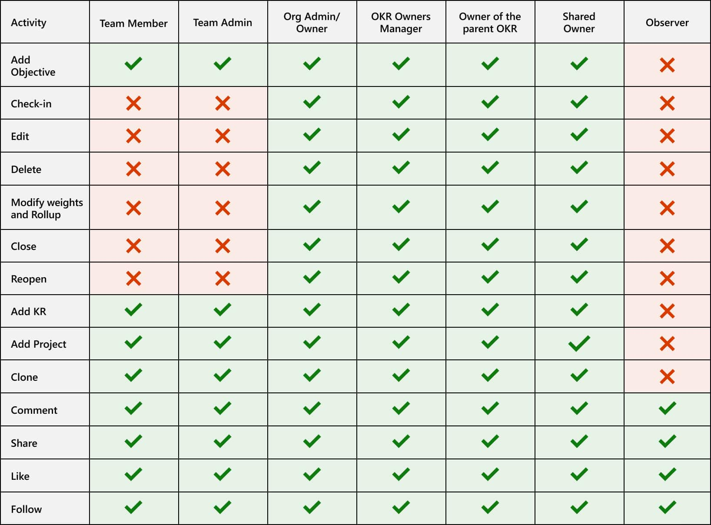
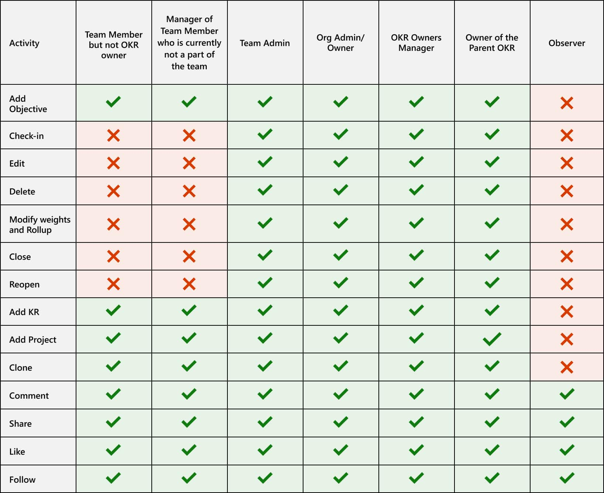
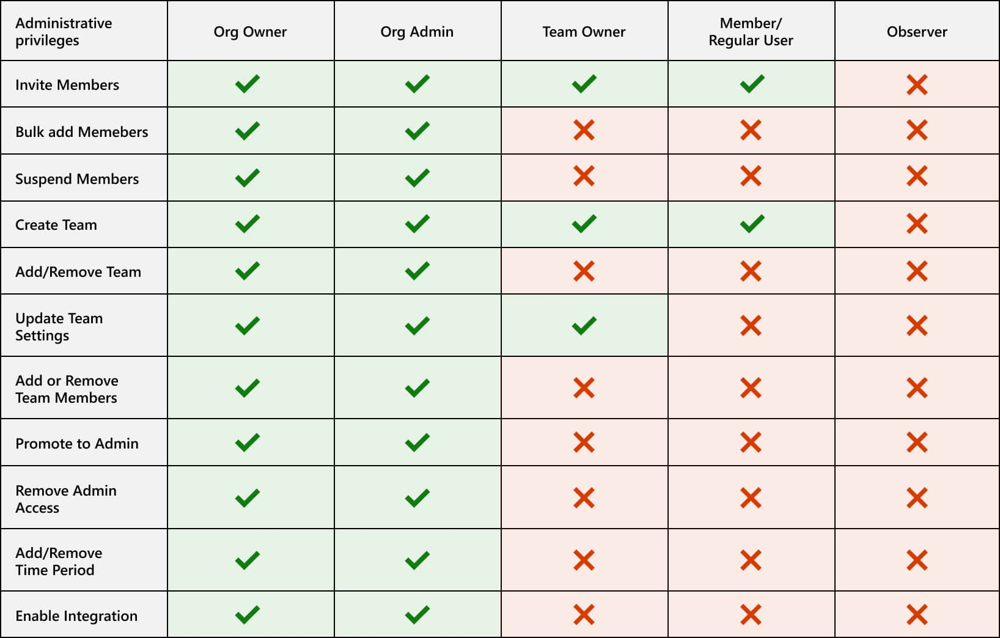
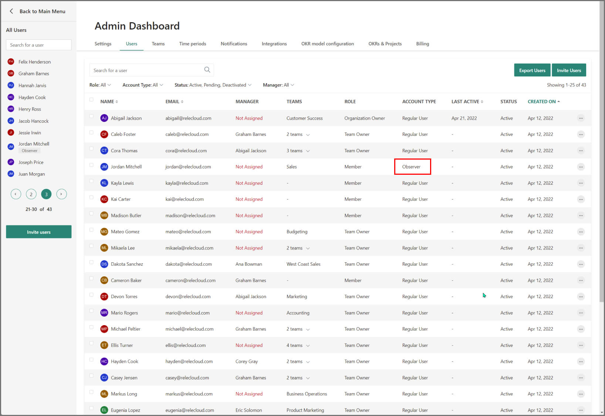
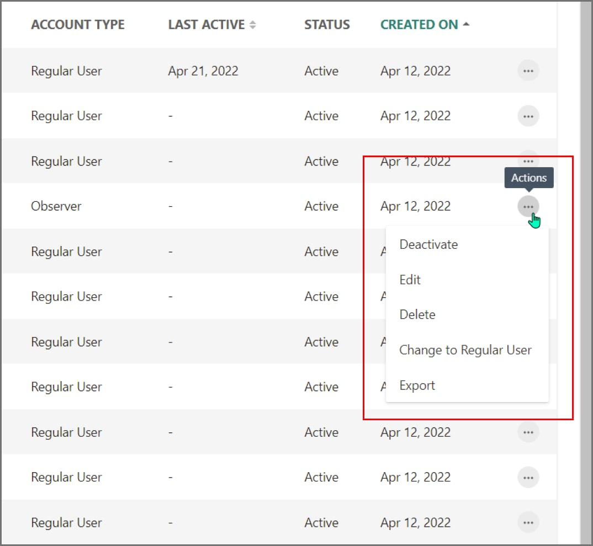

# Roles and permissions in Viva Goals

> [!IMPORTANT]
> Viva Goals is currently available only for private preview customers, and only in English. The features described here are subject to change. [Learn more about Viva Goals.](https://go.microsoft.com/fwlink/?linkid=2189933)

## Role types in Viva Goals

Let's begin with the basics: 

- In Viva Goals, a **creator** is a member who has created an objective. 
- **An owner** is a member who has been assigned an objective. 
- **Organization administrators and organization owners** in Viva Goals have access to all OKR permissions, including creating, editing, and deleting any objectives or check-ins. 
- **Observers** can't create, edit, or own OKRs, but can view OKRs. 

Viva Goals supports the following full roster of roles within an organization:

|Role  |Description  |
|---------|---------|
|Members    |    Members (the default role for everyone) can set up and manage their individual OKRs, and view all OKRs within the organization.     |
|Observers     |   Observers, as opposed to members, can't create, edit, or own OKRs. They can view all OKRs like members.      |
|Managers     |    Managers are members who own their OKRs and the OKRs of those who report to them.     |
|Team Owners     |    Team owners are members who own their team members' OKRs.     |
|Team Admins     |   Team administrators are members who can manage team members.      |
|Organization Admins     |   Organizational administrators are members who manage the setup of the organization and can manage users and teams. An organization can have more than one organization administrator.      |
|Organization Owner  |    Organizational owners manage members, teams, set up, and billing for the account. By default, they own organization-level OKRs, but organizational objectives can be owned by other members also.     |

## Permission levels on individual OKRs

The permission levels on individual OKRs are outlined here: 

## Permission levels on team OKRs

The permission levels on team OKRs are outlined here: 

## Creating OKRs

By default, all members in the organization can create OKRs for themselves, other members, teams, or the organization. This privilege reduces the friction in setting up OKRs and facilitates alignment. 

For example, a team member can propose a team-level objective by adding an objective of type **Team**, and assign it to the team manager. The manager can accept the suggestion by: 

- Doing nothing
- Changing it to an individual's objective
- Deleting it

## Managing OKRs

### Who can edit and delete objectives? 

**Individual objectives** 

- Creator 
- Owner 
- Team Manager
- Parent Objective Owner

**Team objectives**

- Creator 
- Owner 
- Team Manager
- Parent Objective Owner
- Team Owner

**Organization objectives**

- Creator 
- Owner 
- Team Manager
- Parent Objective Owner

Creators are by default provided with the ability to edit and delete objectives they have created. These permissions allow them to correct any errors during creation, like an incorrect assignment.

### Who can check-in, close, and reopen objectives? 

**Individual objectives** 

- Owner 
- Team Manager
- Parent Objective Owner

**Team objectives**

- Owner 
- Team Manager
- Parent Objective Owner
- Team Owner

**Organization objectives**

- Owner 
- Team Manager
- Parent Objective Owner

While the check-in process is largely restricted to members involved in the objective, Viva Goals encourages cross-team collaboration by letting anyone in the organization engage with check-ins, including viewing and likingcheck-ins, and adding and viewing comments. 

## Administrative Privileges

All administrative privileges are restricted to members with an organization administrator or organization owner role, by default.

### User management

Organization owners and organization administrators can: 

- Invite members
- Bulk-add members
- Suspend members 
- Update team member profiles (Name, Email, Profile Picture, Manager) 

Members can also update their own profiles. 

### Team management

Organization owners and organization administrators can: 

- Create teams 
- Update team settings (Name, Description, Team Hierarchy) 
- Add and remove team members. 

The team owner can add and remove team members. 

### Administrator management

Organization owners and organization administrators can: 

- Promote a team member to an administrator 
- Revoke administrator access

### Other permissions

The other permissions in Viva Goals are described in the following table:

Organization owners and organization administrators can: 

- Work on the behalf of another team member
- Add and remove time periods 
- Enable integrations 

Only the organization owner can: 

- Manage billing and subscription 

## The Observer user role 

Viva Goals supports two kinds of accounts:

- **Team Members**: Regular team members/users can access all Viva Goals functionality, including creating, updating, and owning OKRs. They can take up additional responsibilities in Viva Goals, like administrator or manager. 

- **Observers**: Observers can't create, edit, or own OKRs. However, they can view all OKRs.

### Privileges of an Observer

An Observer is entitled to the following privileges:

- **Seeing all OKRs**: This privilege enables an Observer to be aware of, and aligned to, organization, teams, and user priorities, progress, and updates.
- **Following progress**: This privilege enables an Observer to receive updates for relevant OKRs.
- **Liking and commenting**: This privilege enables an Observer to like and comment on OKRs, check in, and offer activity feed updates.

### Adding users as an Observer

You can set a default user type for new users from **Admin Dashboard > Setting**. 

If the value is set to **Observer**, users will take up account type as **Observer** when they are invited to join. Team members will have the option to choose between Observer and Regular privileges when inviting a new user. 

### Identifying an Observer

If the users have an **Observer** tag next to their name, they are an Observer.

If you are an administrator, you can also look at user type from **Admin Dashboard > Users > User Type column**, as depicted in the following image:

### Changing account type of users

Administrators can change the user type from **Observer** to **Regular** and from **Regular** to **Observer** through **Admin Dashboard > Users Tab > User listing > Three dot Menu**, as shown in image below:

### Inviting other users as Observers

An Observer can invite others as Observers if the Invite Policy in **Admin > Settings** is set to **Anyone in the organization**.
