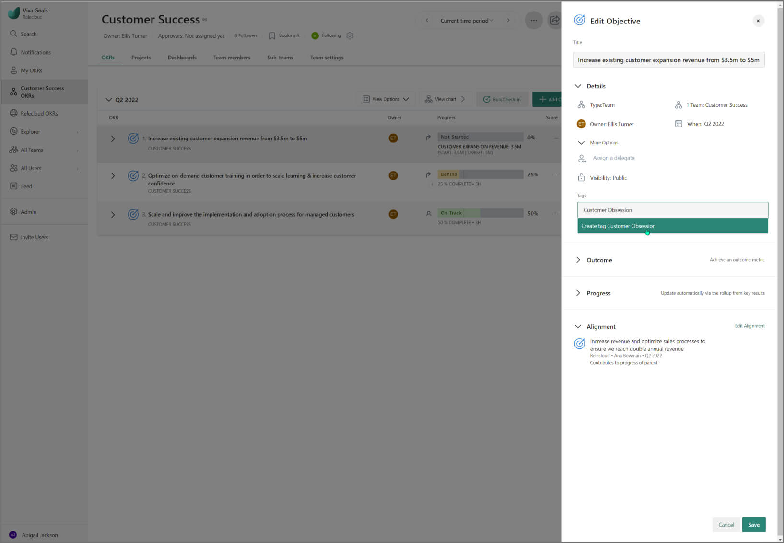

# Tags

You  add tags in Viva Goals to group similar OKRs and projects under a common identifier or add an extra level of description. Tags make it easier to search for specific OKRs and projects and to generate targeted reports.
    
This article describes how to add tags, search by tag, and use Explorer to make reports with the Tags filter.

## Add a tag

1. Open the create or edit objective dialog box and select **Add Tags** under **More Options** under the objective name. In the text box, type the desired tag.

2. Add a new tag if it doesn't exist yet, or select one from the dropdown.

   > [!NOTE]
   > You can select **x** to remove the tag at any time.

In the example pictured below, we're tagging OKRs related to **Customer Obsession**, the responsibilities for which are distributed across teams and individuals. It becomes strategically valuable to group these related OKRs together.

## Search by tag

Tags are searchable. To search by tag, select the search button in the upper-right corner and type the tag name.

## Reporting with tags

You can use Explorer to filter by tag and create meaningful reports and views. To create a report:

1. Go to Explorer from the main menu and create a new view.

2. Add the **Tags** filter, and select the desired tag.

3. Optionally, add other filters to the report. For example, we could use the **Tags** filter in combination with **Last Updated** to bring up recent progress made toward the Annual Event.

4. To separate tags in the exported report, select **Export tag values as separate columns**.

   

   
