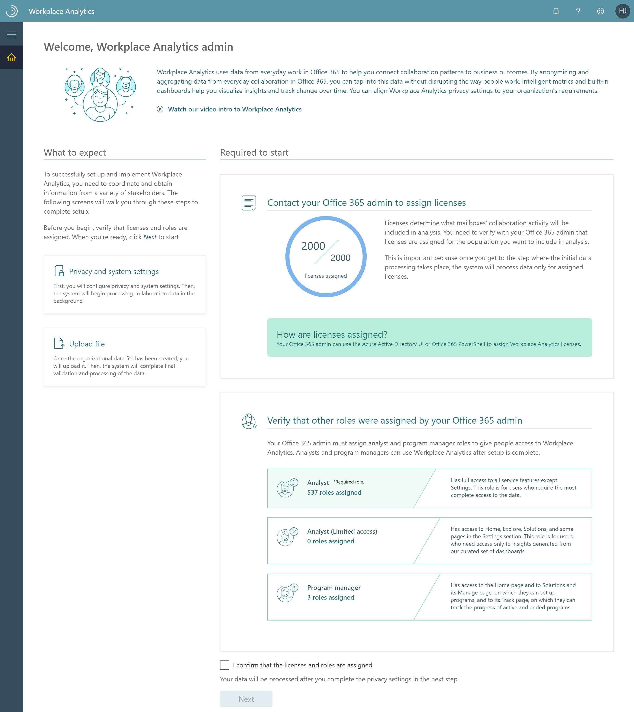
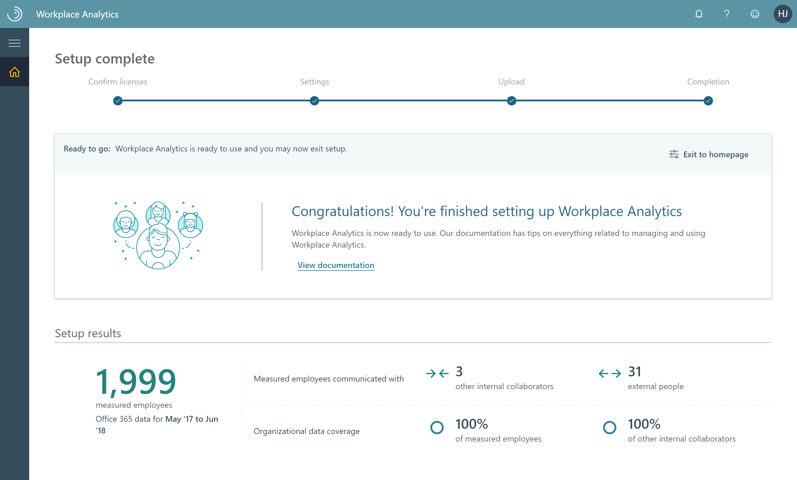

---

title: Advanced insights setup
description: How to set up and configure Viva Insights for advanced insights and analysis tools 
author: madehmer
ms.author: v-mideh
ms.topic: article
ms.localizationpriority: medium 
search.appverid:
- MET150
ms.prod: wpa
ms.collection: M365-analytics
manager: scott.ruble
audience: Admin
---

# Set up advanced insights

The following setup and configuration steps are required to set up advanced insights for Microsoft Viva Insights. Although the Microsoft 365 admin and the Viva Insights admin perform most of these steps, others in your organization help make decisions that relate to setup. For more information, see [Determine key personas and roles for implementation](Determine-key-personas.md).

**Prerequisites:** See [Environment requirements](environment-requirements.md) to learn about Microsoft 365 tenant requirements, Viva Insights licenses, and supported browsers.

## Setup steps

* **Owner** - The following persons or entities do the setup steps:
  * **Viva Insights admin** does most of the work and is the person referred to in the steps as "you."
  * **Microsoft 365 admin** assigns licenses and roles in Step 2.  
  * **Viva Insights** processes and validates data in a few of the steps.
* **Task** - Complete steps to set up and configure Viva Insights.  
* **Outcome** - In your organization, people have been assigned licenses and roles. Those roles grant access to data that the people can use to analyze work habits and implement change in how employees spend their time. Also, you've set system defaults and privacy settings and an admin has uploaded organizational data.  

<!-- IN THIS VIDEO, MUST FIX A) EARLY SCREENSHOT THAT SHOWS EXPLORE PAGE AND B) END SEQUENCE THAT NO LONGER MATCHES CURRENT FRE. -->

### Video: Overview for admins

<iframe width="640" height="564" src="https://player.vimeo.com/video/282873274" frameborder="0" allowFullScreen mozallowfullscreen webkitAllowFullScreen></iframe>

**To set up the app**

1. **Open [Viva Insights web app](https://workplaceanalytics.office.com)**. If prompted, sign in with your work account. This page begins a sequence that guides you through setup. Under **Required to start**, the page describes the next task, and verifies the assignment of licenses and roles:

      
  
2. **Licenses and roles** - Verify that your Microsoft 365 admin has assigned licenses and roles to people in the organization, and then select **Next**. For more information, see [Assign licenses](assign-licenses-to-population.md) and [Assign roles](assign-roles-to-wpa-admins.md).

   > [!Important]
   > On the **Home** page, under **Required to start**, Viva Insights admins can see the current number of assigned roles and licenses. They can proceed with setup only if the number of assigned licenses is greater than zero. Licenses can take from 24 up to 72 hours to activate after you purchase licenses. Until licenses are provisioned, unlicensed users will  get a [500 error](../Tutorials/wpa-tool-500-error.md) when opening Viva Insights.

3. **System defaults** - Set the time zone, week days, weekend days, and working hours. For more information, see [System defaults](../Use/system-defaults.md).

4. **Privacy settings** - Set minimum group size and choose whether to hide subject lines, domains, email addresses, and terms in subject lines. For more information, see [Privacy settings](../Use/privacy-settings.md). After you've finished making both the system defaults and the privacy settings, select **Next**.

   >[!Important] 
   >At this point, Viva Insights automatically extracts collaboration data (data about email usage, meetings, chats, and calls) in the background and keeps it ready for analysis. <u>Exception:</u> If your organization purchased Viva Insights before June 12, 2019, this extraction is not performed in the background. Before you can move on to step 5, you must wait for the extraction to complete. You will know that it has finished when Viva Insights displays a "completed processing" status on the **Setup** page.

5. **Prepare organizational data** - Export organizational data from your HR system into a UTF-8 encoded .csv file. For information about what data to export and how to structure it, see [Prepare organizational data](Prepare-organizational-data.md).

6. **Upload organizational data** - Upload the .csv file into Viva Insights. For more information, see [Upload organizational data](upload-organizational-data-1st.md).

   The following steps are part of the **Upload organizational data** task:

   1. **Map data** - Map the uploaded data to Viva Insights field names. For more information, see [Field mapping](upload-organizational-data-1st.md#field-mapping).
   2. **Data validation** - Viva Insights validates the upload and then notifies you whether your uploaded data validated. If it did not, you are advised what further action you can take. For more information, see [Data validation](upload-organizational-data-1st.md#data-validation).
   3. **Data processing** - Viva Insights processes the validated data.

      

      When the processing finishes, your setup is complete, as shown in the status bar:

      

## Product availability

After organizational data has been uploaded and validated, no further action by the admin is necessary. After this point, it takes about one day before you can use Viva Insights in the Viva Insights app. (For organizations with many licensed employees, it might take slightly longer.)

For example, analysts can begin to conduct analyses in [Explore the stats](../use/explore-intro.md) and [Query designer](../tutorials/query-basics.md)) after privacy settings have been made, collaboration data has been extracted, and organizational data has been uploaded. As soon as Viva Insights is ready for use, an email notification to that effect is sent to users who've been assigned the [analyst role](../use/user-roles.md#role-descriptions-and-access-levels).

## Related topics

[Environment requirements](environment-requirements.md)
