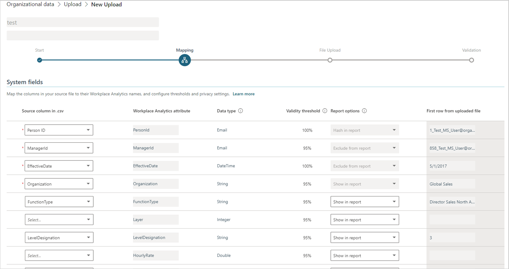
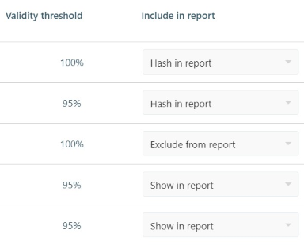
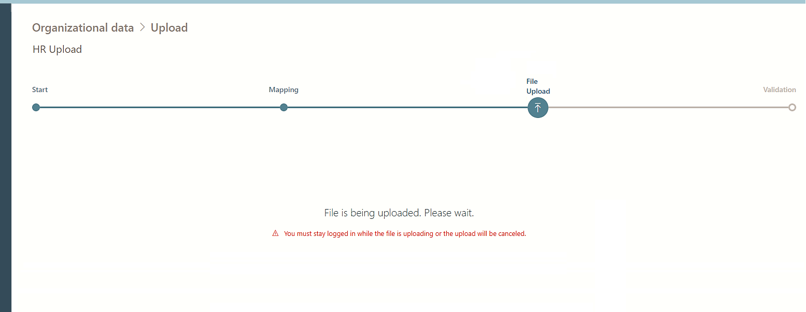
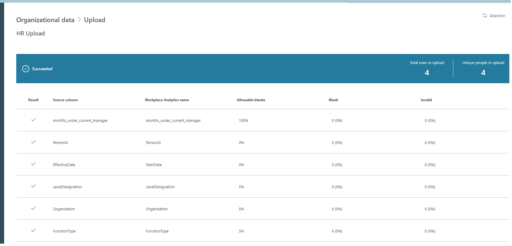
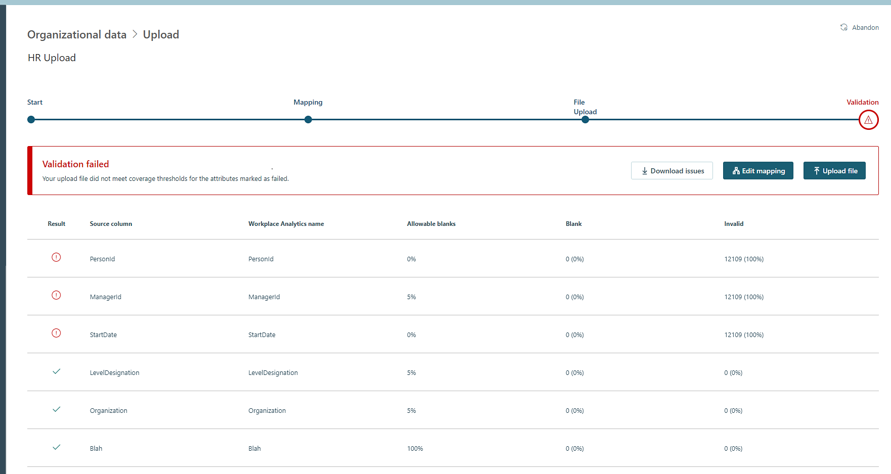

---

title: Subsequent organizational data uploads
description: How to upload data from your organization to Microsoft Workplace Analytics if this is not the first time you are uploading data. 
author: madehmer
ms.author: helayne
ms.topic: article
ms.localizationpriority: medium 
ms.collection: viva-insights-advanced
ms.service: viva 
ms.subservice: viva-insights 
search.appverid: 
- MET150 
manager: scott.ruble
audience: Admin
---

# Subsequent organizational data uploads

Administrators can use the following steps for a subsequent upload (import) organizational data to Viva Insights in Workplace Analytics. Complete the steps after preparing the data as described in [Prepare organizational data](Prepare-organizational-data.md).

>[!Important]
>Only follow these steps if this is **not** the first time you have uploaded organizational data to Workplace Analytics. If this **is** the first time, follow the steps in [Upload organizational data (first upload)](upload-organizational-data-1st.md).

## Import tasks

Importing organizational data requires the following tasks:

1. [File upload](#file-upload)
2. [Field mapping](#field-mapping)
3. [Data validation](#data-validation)

After you prepare the source data, you can upload the .csv file and map fields. After you map fields, Workplace Analytics validates the data. When the data successfully validates, the overall data-import task is complete. If the data validation is not successful, you can choose from a few options that are described in [Validation fails](#validation-fails).

<!-- NEED TO UPDATE WITH 3 DIFFERENT SCENARIOS - ASK MICHELE ### Video: Upload organizational data

The user interface and navigation in recent releases of Workplace Analytics are different that what's shown in this video.

<iframe width="640" height="564" src="https://player.vimeo.com/video/282897809" frameborder="0" allowFullScreen mozallowfullscreen webkitAllowFullScreen></iframe>
-->
## File upload

Use the following steps to upload (import) your organizational data as a .csv file into Workplace Analytics.

**To select the file to upload**

1. Open [Workplace Analytics](https://workplaceanalytics.office.com). If prompted, enter your organizational credentials.
2. Select **Data sources** > **Organizational data**.
3. Select **Upload** to see your organization's **Upload history**, and then select **New upload**.
4. In **Upload**, select **Name your upload**, enter a name, select **Add an optional description**, and then enter a description.
5. In **Select file**, choose **Select file**, select the .csv file with the new employee data you want to upload, and then select **Open** after reviewing the following **important upload considerations**:

   * The .csv file that you upload must be UTF-8 encoded.
   * Make sure that the file you are uploading is not open in a different program when you begin the upload process.
   * After the upload process begins, the process is irreversible.  

   >[!Note]
   >If you are uploading new data, go to step 8, *Complete new file upload*. However, if you have uploaded data and then discovered that it contains sensitive, incorrect, or unauthorized data, you must remove the uploaded data and replace it with a new file. To do this, go to step 9, *Append or replace organizational data*.

6. To complete a new-file upload, select **Next**. This shows the **System fields** table. Go to [Field mapping](#field-mapping).
7. If you are not uploading a new data file, you must now choose whether to append or replace organizational data. In the **Append or replace** area, select one of the following options:

    * Use **Append the existing organization data** to update attribute values for existing employees, to add new employees, or to add new attributes (columns). This is the default option.

    * Use **Replace all existing organizational data with this file** to delete all _previous_ HR data uploads, so that the data in the _current_ upload becomes the only HR data that is present for your organization in Workplace Analytics. Take note of the "Caution" message, which explains that this replace option permanently deletes all previously uploaded organizational data.  

    After you have chosen to append or to replace data, select **Next** and go to [Field mapping](#field-mapping).

## Field mapping

You need to map the fields (columns) for the source .csv file to the field names that Workplace Analytics recognizes. You map these in **Organizational data** > **Upload**.

The **Upload** page includes tables for System fields and Custom fields for mapping the data for the upload file.

When appending new attributes to an existing upload, you need to select all the same required and optional attributes that you mapped before in previous uploads, in addition to the new attributes you want to add (append).

### System fields table

<!-- The following include is for "system" fields and is meant only for subsequent uploads, and only temporarily. After the UI changes, switch to the "system default" include file. -->
[!INCLUDE [System fields table](../includes/org-data-sys-fields.md)]

### Custom fields table

* **Custom fields** appear on this page below the optional fields. Custom fields are optional attributes you can create. Select a column from your source.csv file. Name the column, select the data type, set the [validity threshold](#set-validity-threshold-for-custom-fields), and then select the report option.

### Field column details

* **Source column** corresponds to each of the fields in the uploaded file.
* **Workplace Analytics name** is the name of your organization's Workplace Analytics.
* **Data type** is the data type of the fields.

   >[!Note]
   >If the data type is Boolean, the value for the Boolean field must be TRUE or FALSE.

* **Validity threshold** sets the percentage of rows in the uploaded file that must have non-null values (no blanks) for the attribute. The source file might still be valid even if some rows have missing values for some columns. This setting is not intended to check or allow invalid values. A single invalid value, such as an incorrect data type, email address, or TimeZone string will cause the file upload to fail. The following summarizes the threshold settings:

  * **Required attributes** - Because PersonId and EffectiveDate are required attributes, their Validity threshold value must be 100 percent. This value cannot be changed.
  * **Fields with minimum values** - The threshold for the ManagerId, Organization, and LevelDesignation fields is set to 95 percent by default.
  * **Other system fields** - The Validation threshold for other system fields is set to 95 percent by default, but you can increase or decrease this value.
  * **Custom fields** - See [Set Validity threshold for custom fields](#set-validity-threshold-for-custom-fields).

* **Include in report** lets you decide how to treat sensitive data in the report that will be generated about the import operation. The following options are available for each of the columns in your source data:

    

  * **Show in report** - Lets the actual data value appear in the report just as it was imported in the organizational data file.
  * **Hash in report** - De-identifies sensitive data. If you choose this option, the report will include data that was generated about the import operation, but instead of showing actual values that were taken from the source file, it shows a hashed version of the value – a format that cannot be read.
  * **Exclude from report** - Prevents the data value from appearing in the report. You can select this option for any attribute that you consider highly sensitive. However, for data-privacy reasons, Workplace Analytics _automatically_ assigns **Exclude from report** to particular attributes, such as ManagerID. In those cases, you cannot change this value.

  >[!Note]
  >The visibility of one or more attributes (columns) might be set to **Show in report** or **Hash in report** for previously uploaded data. If you change this setting to **Exclude from report**, any auto-refresh query that depends on the data in that column will experience a schema violation.
  >
  >In this case, after you finish mapping fields, Workplace Analytics shows a warning message that reads "Your upload has certain issues that may affect execution of the auto-refresh queries." If you see this message, go to [If expected columns are missing or excluded](#if-expected-columns-are-missing-or-excluded).

#### To map fields

After you complete the steps in [File upload](#file-upload), the **Upload** page with the System fields table will appear.

1. Map the required fields.

   1. Determine which of the columns in your .csv file correspond to the second column in the table (Workplace Analytics name).
   2. Under Source column, select the down arrow to see the list of the columns in your .csv file. From the list, select the correct column name for this data.
   3. Set the appropriate values for the other columns in the table, such as the Workplace Analytics name, Data type, and so on. Repeat these mapping steps for the rest of the required fields.

   >[!Note]
   >For more information, see [Field column details](#field-column-details).

2. Map the optional and custom fields, as applicable. You only need to map the columns in your source (.csv) file that your organization considers important for analysis. For example, if "Region" is important and your data contains this field, map it.

   

   1. Under **Source column** (the first column in the table), select the down arrow to see the list of column names that were found in the data file. From the list, select the column name for the data. In this example, you'd select the source column for **Region**.
   2. Set values for the other columns in the table, such as the validity threshold and report options.
   3. Repeat these steps for all optional and custom fields that are important to your organization.

3. In the **Submit for validation** area, select **I confirm that these mappings are correct**, and then select **Submit**. This uploads the data file and starts the validation process.

<!-- DROPPING THIS NOTE FOR NOW IN FAVOR OF ADDING RELATED WORDING TO STEP 4 
>[!Note] 
>The schema of the new data file need not exactly match the schema of the previously uploaded HR data. However, omitting columns that were present in previous uploads can cause errors in any [auto-refresh](../tutorials/query-auto-refresh.md) queries that depend on the presence of those HR columns.  
> If expected columns are missing, Workplace Analytics shows a warning message that reads "
-->

4. After you select **Submit**, two circumstances could trigger a warning message:

   * **Omitted columns** - If (a) You chose the **Replace** option for uploading organizational data, and (b) while mapping fields, you have chosen to omit one or more columns that are present in the existing organizational-data schema, and (c) at least one auto-refresh query depends on those (omitted) columns.

   * **Excluded columns** - If (a) While setting the **Report options** for attributes on the **Mapping** page, you have chosen to exclude one or more columns from query results, and (b) at least one auto-refresh query depends on those (excluded) columns.

   In either case, Workplace Analytics shows a warning message about issues that could affect auto-refresh queries. If you see this message, go to the section [If expected columns are missing or excluded](#if-expected-columns-are-missing-or-excluded). If you do not see this warning message, go to the next phase, [Data validation](#data-validation).

### If expected columns are missing or excluded

For a query to run successfully, it requires particular attributes (columns) to be present in the organizational data. This is also true for queries for which the [auto-refresh option](../tutorials/query-auto-refresh.md) is turned on. If expected columns are missing, or if visibility settings (which you set by using the **Report options** on the **Mapping** page) exclude expected columns, Workplace Analytics shows a warning message:

   

Below this message, a table in the **Warning details** area lists the affected auto-refresh queries and provides details about issues that were encountered. This information is for review only. You cannot change data or mapping settings on this page.

After you review the issues, if you decide not to continue with the data replacement, select **Back.** This returns you to the field mapping page; continue with the steps in [To map fields](#to-map-fields).

To continue with data upload despite the issues, select **Next**. Note that this choice will turn auto-refresh off for queries that were listed in the **Warning Details** area. The results of the last runs of these queries remain available.

## Data validation

After you complete the steps in [Field mapping](#field-mapping), the organizational data file is uploaded and validated, and the **Upload** page shows the _File is being uploaded_ screen:

In most cases, file validation should complete very quickly. If your organizational data file is very large, validation could take up to one or two minutes.

After this phase completes, the file has either passed or failed validation. Go to the appropriate section:

[Validation succeeds](#validation-succeeds)

[Validation fails](#validation-fails)

> [!Note]
> Each tenant can have only one upload in progress at a time. Therefore you need to complete the workflow of one data file, which means you either guide it to a successful validation or abandon it, before you begin the workflow of the next data file. The status or stage of the upload workflow is shown on the progress bar across the top of the **Upload** page.

>[!Important]
>You must stay logged in while the file is uploading or the upload will be canceled. The upload requires this page to be open in your web browser during the upload. If you close the browser (or this browser page), the upload will fail.

## Validation succeeds

If validation succeeds, the **Upload** page will indicate it and show the size of the upload and that the overall process is complete. After successful validation, Workplace Analytics processes your new data.

You can select **Settings** > **Upload** > **Organizational data** to see **Upload history**. You can then select **Successes** to see the workflows that were successfully validated (and uploaded).

You can do the following for an upload:

* Select the **View** (eye) icon to see a summary of the validation results.
* Select the **Mapping** icon to see the mapping settings for the workflow.
* Select the **Download log** icon to see the log.

>[!Note]
>Each tenant can have only one upload in progress at a time. Therefore you need to complete the workflow of one data file, which means you either guide it to a successful validation or abandon it, before you begin the workflow of the next data file. The status or stage of the upload workflow is shown on the progress bar across the top of the **Upload** page.

## Validation fails

If data validation fails, the **Validation** page shows a "Validation failed" notification. It also shows details about the validation attempt and presents you with options:

After a failed validation, it's best to first gain an understanding of the errors by scanning the error summary table. You can also select **Download issues** to examine the error log.

This information about the errors helps you decide which path to choose next &mdash; whether to fix the source data, change the mapping, or abandon the current upload. The following describes these options:

### Options upon failed validation

[!INCLUDE [Options upon failed validation](../includes/org-data-failed-validation.md)]

### Addition of a new data column

Let's say that you've already uploaded at least 13 months of snapshot data, which contained the five required columns (PersonId, EffectiveDate, LevelDesignation, ManagerId, Organization) for all employees. Now, you want to upload one new column of data – for example, an engagement score value for each employee – and you want it to apply to all of the historical data. When you upload to append the new "EngagementScore" data column, remember to re-upload all five of the minimum required fields along with the new field.

### Set Validity threshold for custom fields

The threshold checks for non-null values, so it depends on the intended use of the custom field. If you intend to use this data in much of your analysis, consider setting it to a high percentage. You can set a lower threshold for data that applies, for example, to only a small subset of people in your organization.

#### Set a high value

Generally, you should set the Validity threshold to a high value. This is especially important if your analysis will focus on that field.

For example, you might include a "SupervisorIndicator" attribute. At first, you might not think that you're analyzing manager behavior and you might be tempted to omit this attribute. But the organization hierarchy is used implicitly by many Workplace Analytics analyses – for differentiating different work groups, for determining high- and low-quality meetings based on how many levels attend, and more.

#### Set a lower value

The goal of your analysis might be to determine sales effectiveness. Your data might include an attribute for sales attainment that only makes sense for members of your sales force, who constitute about 10 percent of the company. This number doesn't apply to engineers or program managers, but it is critical for high-performers in sales.  

### Related topics

* [Prepare organizational data](prepare-organizational-data.md)
* [First upload of organizational data](upload-organizational-data-1st.md)
