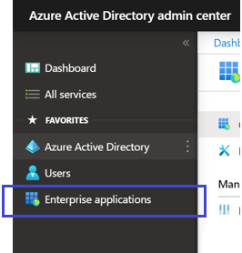
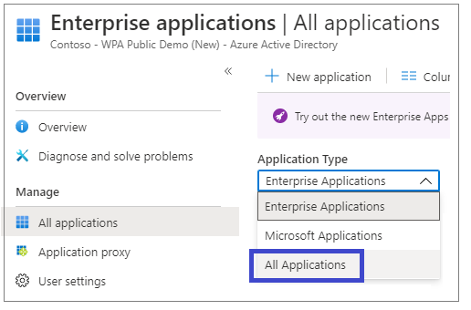
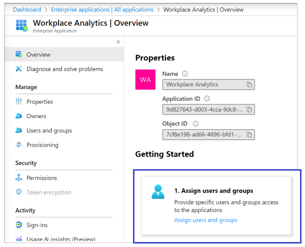
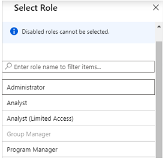
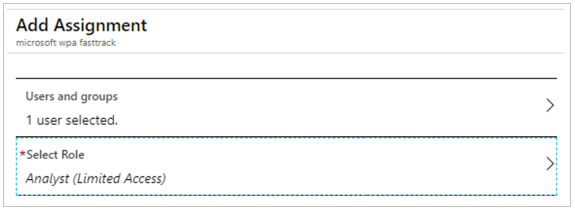
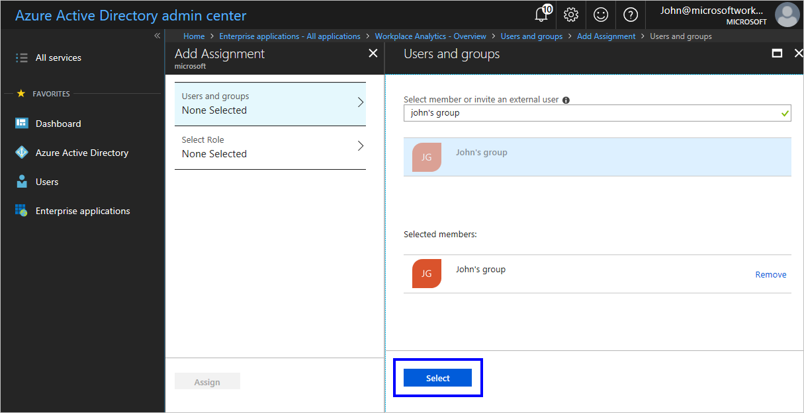

---

title: Assign roles for Viva Insights
description: How to assign roles for Microsoft Viva Insights with Azure Active Directory
author: madehmer
ms.author: helayne
ms.topic: article
ms.localizationpriority: medium 
ms.collection: viva-insights-advanced 
ms.service: viva 
ms.subservice: viva-insights 
search.appverid: 
- MET150 
manager: scott.ruble
audience: Admin
---

# Assign roles for Viva Insights

People can work with Microsoft Viva Insights only after they've been assigned a role. See [User roles](../use/user-roles.md) for details on what each role can do with Viva Insights or Workplace Analytics. Refer to the following to assign Viva Insights or Workplace Analytics roles:

* [Assign Viva Insights roles](#assign-viva-insights-roles)
* [Assign Workplace Analytics roles](#assign-workplace-analytics-roles)
* [Assign roles to groups](#assign-roles-to-groups)
* [Verify role assignments](#verify-role-assignments)
* [Role assignment FAQ](#role-assignment-faq)

## Assign Viva Insights roles

**Owner** - [Microsoft 365 global admin](/microsoft-365/admin/add-users/about-admin-roles)

1. To assign roles for Viva Insights, sign in to the [Microsoft 365 admin center](https://admin.microsoft.com/AdminPortal/home).
2. Go to [Role assignments](https://go.microsoft.com/fwlink/p/?linkid=2097861).
3. Search for **Insights**, and then select the applicable Insights role to assign a user or group.
4. Select **Assign** > **Add**.
5. Enter the user or group's display name or username, and then select the user or group from the list of suggestions. Optionally, add multiple users until you're done.
6. Select **Save**.

## Assign Workplace Analytics roles

**Owner** - Azure Active Directory [Privileged Role Administrator](/azure/active-directory/roles/permissions-reference)

1. To assign roles for Workplace Analytics, sign in to your tenant's [Azure Active Directory admin center](https://aad.portal.azure.com).
2. In the left navigation menu, select **Enterprise applications**:

   

3. In **Enterprise applications | All applications**, select **Application Type** > **All Applications**:

   

4. In the search field, enter **workplace**, and then press **Enter**.
5. In the search results, select **Workplace Analytics**.  
6. In **Workplace Analytics** | **Overview**, under **Getting Started**, select **Assign users and groups**:

     

7. In **Users and groups**, select **Add user**.

   >[!Note]
   >In the **Users and groups** section, you'll see **None Selected**.

8. In **Add Assignment**, select **Users and groups**.
9. Under **Users and groups** (on the right side of the page), identify the user to whom you want to assign a role. Start typing that person's user identifier (such as their name or User Principal name) in the search field and then select their identifier in the results list. After you select the person, their identifier appears on the right under **Selected items**. In the **Users and groups** section, you'll see the selected user count change by 1:

   

   >[!Note]
   >Repeat this step to add one or more additional users to assign them the same role.

10. In **Add Assignment**, chose **Select Role** to view it on the right side of the page:

    

    >[!Note]
    >The Group manager role might appear (as a disabled option) in some tenants that were provisioned earlier.

11. Select the applicable role. You'll then see the selected role at the bottom of the **Select Role** section. The role also shows up under **Add Assignment** in the **Select Role** section:

    

    >[!Note]
    >To change the role for a user, repeat **Steps 10-11** and select a different role in **Step 11**.

12. In **Add Assignment**, select **Assign** (bottom of the page):

    

13. After a few seconds, you'll see a message in the upper right about the role assignment. Optionally, you can now assign additional roles, either to the same user or to different users by repeating these steps.

To check the current role assignments for a person, see [Verify role assignments](#verify-role-assignments).

## Assign roles to groups

You can also assign roles to groups, which means that you are assigning access permissions associated with that role to the group. Any people who are assigned to that group automatically receive the same permissions.

>[!Note]
>You can assign Workplace Analytics roles to Azure Active Directory security groups. For more information about working with this kind of group, see [Manage app and resource access using Azure Active Directory groups](/azure/active-directory/fundamentals/active-directory-manage-groups).

To assign roles to a group, the steps are similar to those for assigning roles to individuals, as described in [Assign Workplace Analytics roles](#assign-workplace-analytics-roles). In that process, when prompted to select a name, select a group name instead, and then assign a role to the selected group.

   

To learn more about creating a user group in Azure Active Directory, see [Create a group and add members in Azure Active Directory](/azure/active-directory/fundamentals/active-directory-groups-create-azure-portal).

## Verify role assignments

Do the following to see what roles are assigned for Viva Insights.

1. Sign in to the [Microsoft 365 admin center](https://admin.microsoft.com/AdminPortal/home).
2. Go to [Role assignments](https://go.microsoft.com/fwlink/p/?linkid=2097861) to see a person or group's assigned roles.

Do the following to see what roles are assigned for Workplace Analytics.  

1. On the **Workplace Analytics | Users and groups** page, start typing the user or group identifier. As you do so, the list filters accordingly.  
2. In the **Role assigned** column, you can see the person or group's role assignments.

## Role assignment FAQ

**When to assign a group instead of an individual a specific role**

It depends on the situation and your company's policies. However, the primary reason for choosing between one method and another is usually efficiency. In a smaller company, if you only need to assign a few people a Viva Insights role, it's more convenient to assign individual people their applicable roles, especially if their roles are unlikely to change.

However, in a larger company where the number of people required for the same role is significant, such as for program managers, it is more efficient to assign the role to a group, and then add users to the group because groups are easier to manage and audit.

## Related topics

* [User roles](../use/user-roles.md)
* [Create a group and add members in Azure Active Directory](/azure/active-directory/fundamentals/active-directory-groups-create-azure-portal)
* [Environment requirements](../setup/environment-requirements.md)
* [About admin roles](/microsoft-365/admin/add-users/about-admin-roles)
