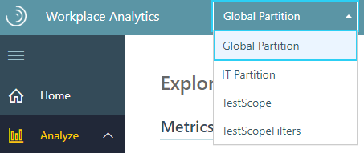
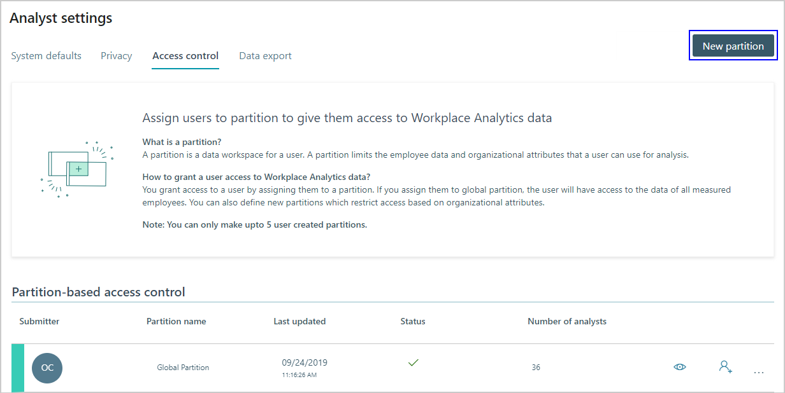
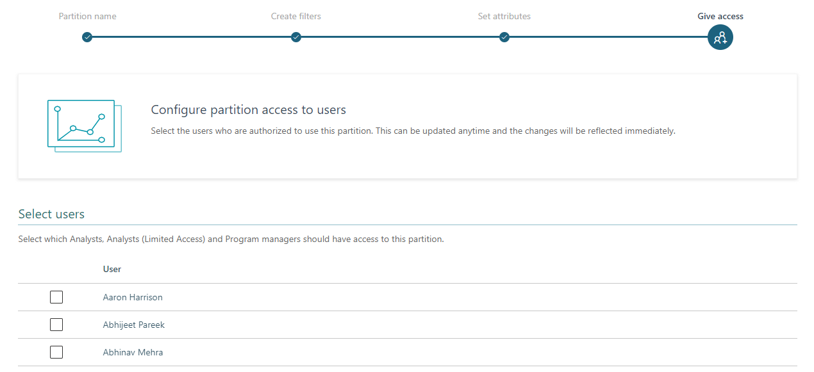
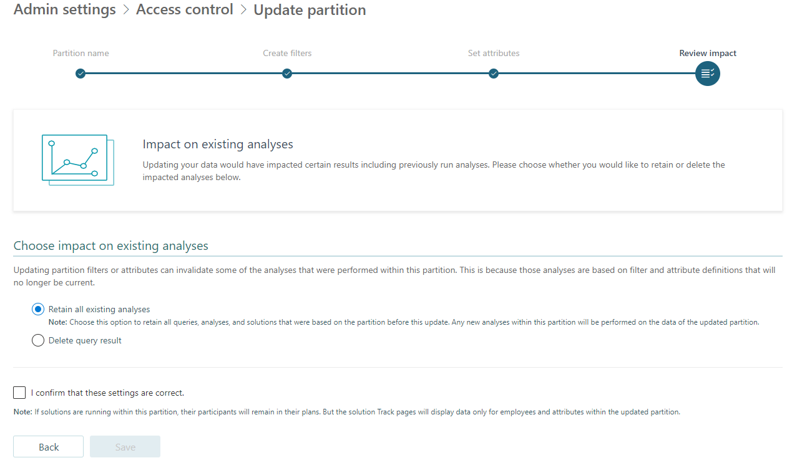

---

ROBOTS: NOINDEX,NOFOLLOW
title: Partitions for Viva Insights
description: Describes how to use and set up partitions for advanced insights 
author: madehmer
ms.author: helayne
ms.topic: article
ms.localizationpriority: medium 
ms.collection: viva-insights-advanced 
ms.service: viva 
ms.subservice: viva-insights 
search.appverid: 
- MET150 
manager: scott.ruble
audience: Admin
---

# Partitions for Viva Insights

A partition is a data workspace for Microsoft Viva Insights analysis. A partition delimits the employee data and organizational attributes that an analyst can use for analysis. Companies create partitions that contain subsets of employee data. To do this, they use various criteria, such as the following for example:

* **Organization** - A company can create a partition for data about all the employees in one division, or in a functional group or team, such as for Research and development.
* **Geography** - A multi-national corporation might create different partitions for the data of employees of different countries or parts of countries, such as for Wales.
* **Role** - A company could select the data of all the employees who have a particular function to include in a partition, such as for Accounting personnel.

## Partitions give access to data

A partition defines what data you work with in the advanced insights app for Viva Insights. If you have one of the analyst roles (analyst limited), you work with data in [Explore the stats](../use/explore-intro.md) and [Query designer](../tutorials/query-designer.md) in the advanced insights app. You are also assigned one or more partitions, and your partition determines whose data you work with on those pages.

If you have the program manager role, you have complete access to **Plans** with no limitations.

For example, if you are an analyst with the job of finding workplace trends in the sales organization, you must be assigned a partition that encompasses the data of salespeople. You can then view data about salespeople in **Explore the stats** and create queries about salespeople in **Query designer**.

>[!Note]
>Analysts (and limited analysts) are not the only people who use partitions. Program managers who work in [Plans](../tutorials/solutionsv2-intro.md) must also be granted explicit access to a partition, after which they can create and view solution [Plans](../tutorials/solutionsv2-task.md#create-a-plan) only in that partition.

## The Global partition

One particular partition encompasses everyone’s data: the "Global" partition. If an analyst has this partition, they can work with all employee data that’s been uploaded. The Global partition is created by the system. While it exists by default, no analysts are given access to it by default. Analysts must be granted access&mdash;to this or to any partition&mdash;expressly, by an admin. See [To create a partition](#to-create-a-partition) for more information about assigning analysts to a partition.

>[!Note]
>For existing users, as part of one-time migration in 2019, all existing analysts and their existing Query designer and settings are being moved to the Global partition.

## Use partitions

If you are an analyst, you must have a partition selected to be able to view data in **Explore the stats** and **Query designer**. If you are a program manager, you work in the Global partition by default and you can go right to **Plans** to manage programs. If you are an admin, you create partitions, but you do not work within one.

### To use a partition

* **Roles**: Analyst, Program manager, or Admin

1. [Open the app](https://workplaceanalytics.office.com/)(if that link doesn't work, try [this link instead](https://workplaceanalytics-eu.office.com/)). If prompted, enter your work credentials. If you are a PM or analyst and you have not been assigned a partition, you'll see a notice that "to proceed, you have to be part of at least one partition."

    If you see this notice, ask your Viva Insights Administrator to assign you to a partition. You cannot start using Viva Insights until the admin assigns you to one or more partitions. If you do not see this notice, go on to the next step.

2. What you see now depends on your role and partition assignments:

   * If you are an analyst (or limited analyst), go to **Step 3**.
   * If you have any other role, go to **Step 4**.

3. If you're an analyst, do the following:

    * If you only have one partition (even the default "Global" partition), this is the partition that you will use. Skip the rest of these steps. You can view **Explore the stats** data or **Query designer** where you will only see data to which your partition grants you access.
    * If you have more than one partition, the **Partition** drop-down menu at the top of the **Home** page shows what partitions you can access. After you’ve selected a partition, you can skip the rest of these steps and view date in **Explore the stats** and **Query designer**.

         

4. If you are a Program manager or admin, your choices depend on your role assignment:

    * **Both a program manager and an analyst** - If you have both a Program manager role and an Analyst role, the data you see depends on the page that you open. Plans are accessible only in the Global partition. A person with both a Program manager and an Analyst role can access plans in Global partition and access **Explore the stats** and **Query designer** in other partitions that they can access.
    * **Program manager only** - Program managers automatically access and use the Global partition to access the Plans page.
    * **Administrator** - If you’re signed in as an admin, then partitions don't affect your access.

## Create, edit, and delete partitions

* **Role**: Viva Insights Administrator

To administer partitions, see the following sections:

* [To create a partition](#to-create-a-partition)
* [To edit a partition](#to-edit-a-partition)
* [To delete a partition](#to-delete-a-partition)

### To create a partition

Viva Insights Administrators create partitions on **Analyst settings**. This task consists of the following sub-tasks:

| Sub-task | Step | Notes |
| -------- | ---- | ----------- |
| Name the partition | 4 | Also, optionally, type a description |
| Create filters  | 5 | Select the employees whose data the partition will contain |
| Select attributes  | 6, 7 | Select organizational-data attributes to include in the partition |
| Give access |  8  | Select one or more analysts who will have access to this partition |

>[!Important]
>Plan your partitions carefully before you start to create them. Partitions have limits in both number and size. For more information, see [Number and size limits](#number-and-size-limits).

1. [Open the app](https://workplaceanalytics.office.com)(if that link doesn't work, try [this link instead](https://workplaceanalytics-eu.office.com/)). If prompted, sign in with your work account.  
2. In **Controls** > **Analyst settings**, select **Access control**.
3. Select **New partition**:

    

4. Enter the name of the new partition and optionally type a description.
5. In **Select employees for partition** > **Create filters**, add one or more filters to define what employee data can be accessed within this new partition:

    

    >[!Note]
    >You can filter by only one attribute. For example, if you create a filter that uses the Organization attribute, you can select the following filter clauses:
    >
    >* Organization + Equals + <name_of_manager_1> AND
    >
    >  Organization + Equals + <name_of_manager_2>
    >
    >* And you cannot add other clauses that use a different attribute, such as: Domain + Equals + <domain_name>

6. Select which attributes from the organizational data to include in the partition. To exclude an attribute from the partition, leave it unselected.
7. You might want one or more attributes to not be visible to analysts who work in this partition. For example, "sales quota" might be a sensitive attribute that is included in the organizational data. To hide the "sales quota" attribute, select it and then set its **Visibility** to **Hash in report**.

    

8. Under **Analysts**, select one or more analysts who will have access to this partition. Only the analysts that you select will be able to perform analyses in the advanced insights app.

    

### To edit a partition

1. [Open the app](https://workplaceanalytics.office.com/)(if that link doesn't work, try [this link instead](https://workplaceanalytics-eu.office.com/)). If prompted, enter your work credentials.  
2. Go to **Controls** > **Analyst settings**, and then select **Access control**.
3. Locate the partition that you want to edit.
4. Select the **ellipsis** (...) in that partition's row, and then select **Edit partition**:

    

5. Edit any of the aspects of the partition that you specified previously. After you edit one aspect, move to the next one by selecting **Next**:

   * Edit filters to change the employees whose data you want to include.
   * Select different attributes to include in the partition.
   * Select different analysts who will have access to this partition.

6. Review and select impact on the analyses that already exist. You need to perform this step because editing a partition usually changes its data, which renders previously run analyses and queries (and their results) invalid. You can now choose to delete those invalid query results or to retain them:

    

   After you select **Retain all existing analyses** or **Delete query results**, confirm that the current settings are correct and select **Save**.

### To delete a partition

1. In **Controls** > **Analyst settings**, select **Access control**.
2. Locate the partition that you want to delete.
3. Select the **ellipsis** (...) in that partition's row, and then select **Delete partition**:

    

   >[!Note]
   >You cannot delete the Global partition. Only other partitions created by you can be deleted.

## FAQ

#### Q1. How can I start using partitions?

Currently the partitions feature is being rolled out on a per-customer basis. To have it enabled for your organization, reach out to your customer service contact at Microsoft.

#### Q2. Why are newly uploaded attributes not being reflected inside non-global partitions?

New attributes are not added automatically. After you upload a new attribute (in an [organizational data upload](../setup/upload-organizational-data2.md)), you must explicitly add the attribute to a partition by [editing the partition](#to-edit-a-partition).

#### Q3. Why am I not able to see analyst settings in a partition?

All analyst settings are applied to all partitions. For this reason the settings tab is visible only in the [Global partition](#the-global-partition).

#### Q4. Upload updates to organizational data occur regularly. How can these updates affect partitions?

See [Partitions and organizational data](#partitions-and-organizational-data) for details.

## Number and size limits

Partitions have limits both in number and size:

* An organization can have a maximum of ten partitions.
* Any new partition that you create can contain a maximum of 10,000 licensed users. Also see [Actions that can change partition size](#actions-that-can-change-partition-size).

>[!Note]
>
>* The Global partition does _not_ count toward this total of ten partitions and has no limit of licensed users.
>* If you need more than 10 partitions or more than 10,000 licenses in a partition, you can request these exemptions by contacting [Viva Insights Support](../overview/getting-support.md).

### Actions that can change partition size

The following scenarios can push the size of a partition beyond the allowed limit.

* **Role**: Viva Insights Administrator

| Scenario | Admin action | Result |
| -------- | ------------ | ------ |
| You are creating a new partition or editing an existing partition that has fewer than 10,000 users. | You select a filter (in step 5 under [To create a partition](#to-create-a-partition)) that increases the partition size beyond 10,000 users. | You see a warning that indicates that the partition size has exceeded the limit. You can create this partition only if you reduce the size to below the limit. |
| You have a current partition  | <ul><li>You upload organizational data. This upload increases the size of a partition to greater than 10,000 users.</li><li>A refresh of collaboration data increases the size of the partition because of license assignment or reallocation. This causes the partition size to exceed the limit.</li></ul> | The upload succeeds and the partition size exceeds the limit. You receive a notification that warns you to address this issue.   Select the link in the notification to open the **Partition-based access control** area, which shows the partitions that have exceeded the limit. |
| You have a partition that contains more than 10,000 users. | You are editing the partition and changing the number of licences. | You can reduce but not increase the number of licenses. |

>[!Note]
>The preceding scenarios assume a limit of 10,000 licensed users. If you are working with a partition that starts with a higher number of licenses (because, for example, you contacted Viva Insights Support and requested a higher limit), these restrictions apply to the actual limit of the partition.

## Partitions and organizational data

Partitions depend on organizational data in the following ways.

* Partitions can depend on organizational data columns. As described in the **Create filters** step of [To create a partition](#to-create-a-partition), you can define a partition by filtering by organizational data columns. For example, you can define a partition by filtering on an organizational data column called _Country_.
* As described in the **Select attributes** step of [To create a partition](#to-create-a-partition), organizational-data attributes can be configured to be included in the partition for analysts to use.

Because of these dependencies, existing partitions can be affected when an admin, after [uploading organizational data for the first time](upload-organizational-data-1st.md), uploads new data in a [subsequent upload](upload-organizational-data2.md). In [Upload organizational data](upload-organizational-data2.md#important-upload-considerations), the admin has a number of options. Appending existing organizational data does not affect partitions, regardless of the structure of the new data.

However, if the admin selects to **Replace all existing organizational data** and the organizational data has a new data schema, it could cause errors. For example, if the _Country_ column is not present in the new organizational-data upload (and if the column is either used as a filter or included in a partition), the definition of any partition that refers to this column is violated.

Because of this possibility, during organizational-data upload (between the mapping step and the validation step), the system checks for partition schema violations. If the schemas of one or more partitions are violated, you'll see the following error:

In the lower half of this page, the system identifies the columns that are omitted in the uploaded file but present in the earlier uploaded data (and its schema) and are present in existing partitions. It also names the partitions that are affected by the missing columns.  

   >[!Note]
   >If a column in a new set of data is missing, this affects the schema of a partition only if that column is referred to in the schema. If no partition's schema refers to the missing column, the missing column will not cause an error, and the organizational-data upload will continue on to the validation phase.

In the case of an error such as this, the admin cannot proceed with the current data upload. The admin has these choices:

* Start over by selecting **Back** and then attempt organizational-data upload with data that has a different schema.
* [Edit the affected partition](#to-edit-a-partition) (or partitions). Consider removing from the partition the column that is referred to in the schema, the column that caused the dependency that was violated. You can do this by de-selecting the corresponding attribute in the **Organizational data** table on the **Set attributes** page:

    

  After you remove the column from the partition, try again to upload the .csv file that caused the schema violation.

* [Delete the affected partition](#to-delete-a-partition) (or partitions) and then try again to upload the .csv file that caused the schema violation.

   >[!Note]
   >Schema errors can occur only in user-created partitions. Uploading organizational data does not affect the definition of the Global partition.
