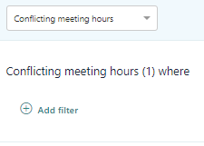

---

title: Customize query metrics in Workplace Analytics
description: How to customize a base metric in a Workplace Analytics query
author: madehmer
ms.author: helayne
ms.topic: article
ms.localizationpriority: medium 
ms.collection: viva-insights-advanced 
ms.service: viva 
ms.subservice: viva-insights 
search.appverid: 
- MET150 
manager: scott.ruble
audience: Admin
---

# Customize query metrics

Analysts create queries to determine workplace patterns and behaviors. An important step when creating a query is selecting the metrics that define the query's area of focus. You can use a template or a query in [Query designer](query-designer.md) to create analysis. You'll see available base metrics within the query and when you select one, it'll appear in a simple, unfiltered form.

## Edit a base metric

After you add a base metric for a person or meeting query, you can edit some of them (not all base metrics are editable) for more refined query results by applying filters. These filters apply only to the metric and function independently from any filters that you apply to the query itself.

For example, select **Email hours**, and then select the **Edit** (pencil) icon to edit and change the name to "Total emails sent during R&D meetings" and add a filter for "Email hours where at least all attendees and/or recipients FunctionType equals R&D."

When you customize a base metric, it's saved as a new custom metric for the query you're creating.
## How-to steps

1. In **Analyze** > **Query designer**, select **Get started** under **Query**, and then select the type of query you want to create, such as a person or meeting query. **Note**: You currently can only customize metrics for a person or a meeting query.
2. Select and change **Enter query name here** to name your query and enter a description.
3. For **Group by**, select a time-grouping option (day, week, or month).
4. Select a date range and a meeting exclusion rule.
5. In the **Metrics** section, select the **plus sign** (+) next to **Add metric** and then select a metric from the list:

   

   >[!Note]
   >You can select multiple metrics from the list. When you are finished, select elsewhere on the page to close the list.

   For this example, select the **Conflicting meeting hours** metric:

   

   The selected metric becomes the *base metric* for the query, and represents the area of focus for data analysis.

6. To customize the metric:

   1. Select the **Edit** icon . This shows the option to apply filters to the base metric:

      

   2. Select the plus (+) sign next to **Add filter**. A filter is now added. In our example, it's the Initiator filter:

      

   3. Select the filter name, **Initiator**. This shows options that define the filters for email initiators:

      

   4. Define the filter details in the available fields. Optionally, define other filters (if others are available) by selecting AND or OR and adding details to the additional filters.

      For guidance on the proper use of AND or OR operators in conjunction with NOT operators, see [NOT Operators](#not-operators).

   5. Select **Confirm** at the top right of the page.

7. Optionally, you can now change the base metric. Select the drop-down arrow shown next to the name of the base metric, and then select a different metric.

   >[!Note]
   >
   >* Any base metric that is customizable shows a drop-down menu with the possible change options.
   >* Not all base metrics can be changed. If no drop-down menu is available, the metric cannot be changed.
   >* Changes are not always one to one. For example, you can switch from **Conflicting meeting hours** to **Email hours**, but because of variations in the available filters, the opposite change is not possible.
   >* If you select a new base metric with identical filter options, the metric will change but you'll see no additional changes.
   >* If you select a new base metric for which the filter options are a subset, additional available filters appear. If you edit the name of the metric and then change the base metric, the name that you edited is deleted.

8. After you create or edit all the metrics you want, confirm or cancel your changes:

   * Select **Confirm** to save all changes to the metric.
   * Select **Cancel** to discard all changes (reverted to the original state).
   * If you neither confirm nor cancel the changes, the changes are automatically confirmed.

9. Select **Run** to run the query with all confirmed metrics and applied customizations.

## NOT operators

Care should be taken when you use the 'NOT' operator in conjunction with other metric filters. For example, suppose that you wanted to add a query filter to exclude all meetings where the subject line contained all the following terms: sales, meetings, and office, by using a ‘NOT’ operator.

Assume that a meeting email had the subject line: “Sales meeting”, but did not also include the term 'office'. In this case, if you were to use the ‘NOT’ operator in conjunction with the 'OR' operator, any meetings that corresponded to the missing term would still be returned. If you want to exclude all the terms, not just any of them, use the 'AND' rather than the 'OR' operator. Otherwise, values will be returned when any one of the filter terms is not satisfied.
