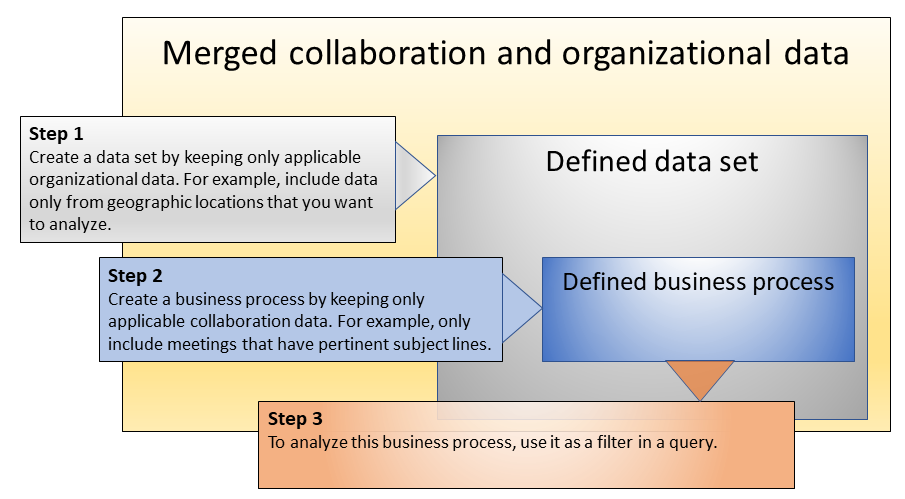
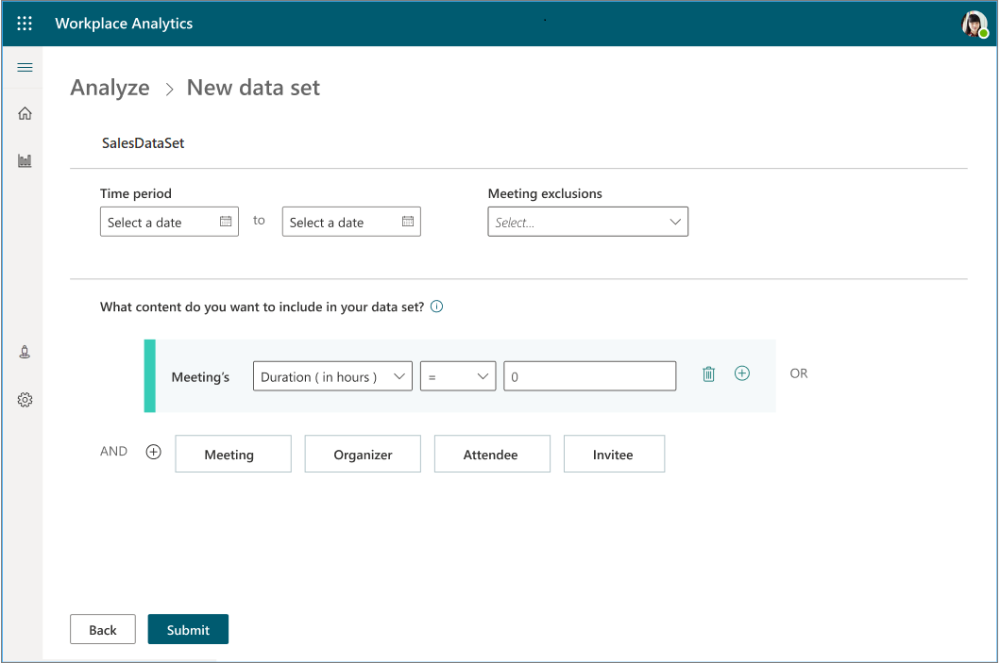
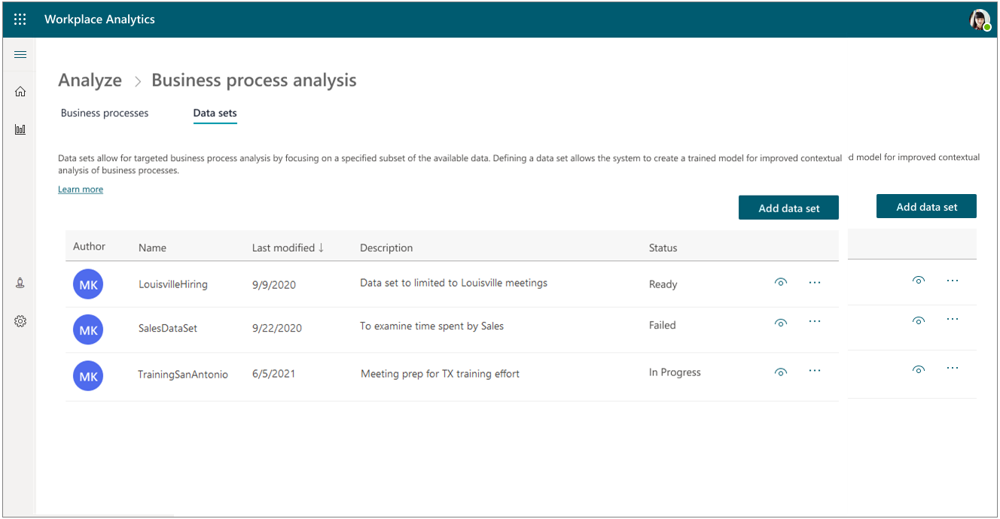
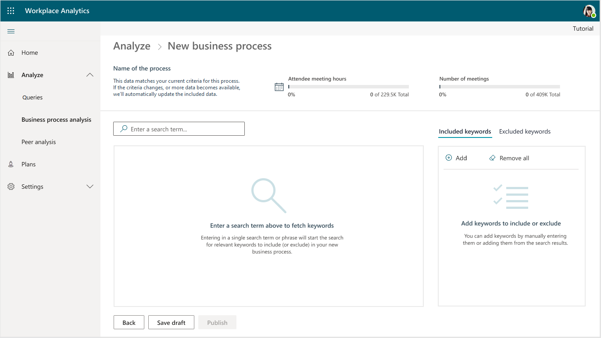
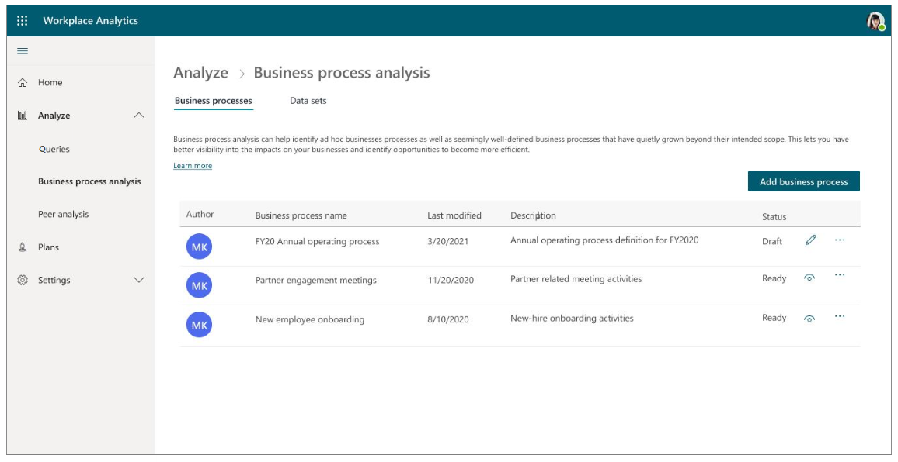
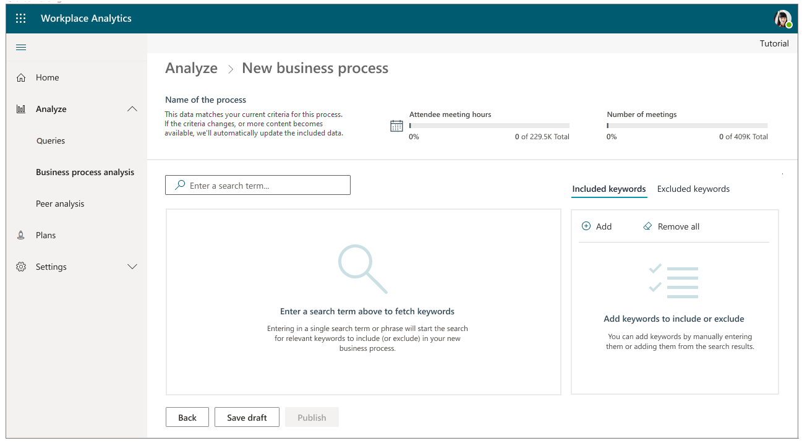
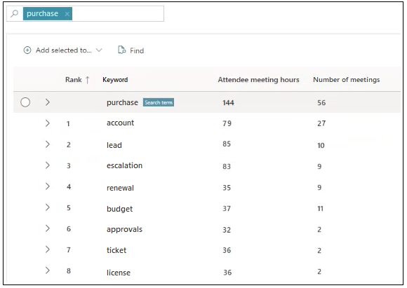
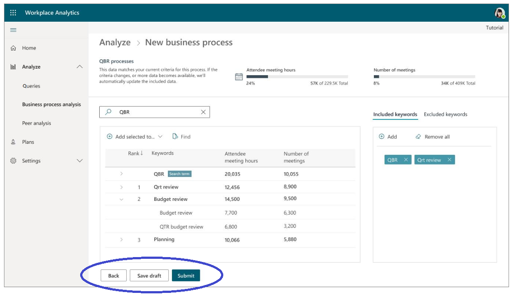
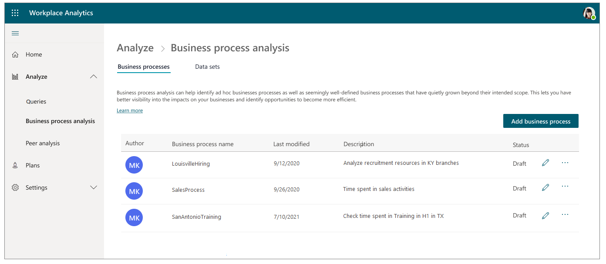
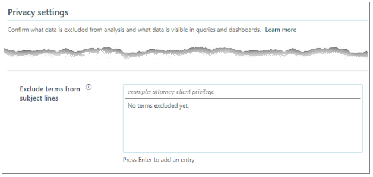

---

title: Business process analysis for Viva Insights 
description: Learn how to analyze business processes for Viva Insights
author: madehmer
ms.author: v-mideh
ms.topic: article
ms.collection: m365initiative-viva-insights
ms.localizationpriority: medium 
ms.prod: wpa
manager: scott.ruble
audience: Admin
---

# Business process analysis

When you and your co-workers perform an organized series of steps to reach a goal, you've participated in a business process. For example, your organization's hiring process might consist of getting leads, screening candidates, conducting interviews, making an offer, and sending new hires to HR for onboarding. Later business processes might have training or coaching goals.

You can improve your business processes by analyzing them, such as by measuring their cost in time and money. For example, your business routinely conducts an information-security audit and your CFO or CIO might want to know if the right amount of time is being spent on these audits, and whether the correct employees (roles) are participating in them.

To find out, you can conduct an analysis by running a business process query (such as for hiring or auditing) with a query filter or a [metric filter](../use/metric-filters.md).

To analyze a business process:

1. [Define a dataset](#define-a-dataset) &ndash; Make sure that you're analyzing only data that is relevant in every aspect, such as organizationally and geographically.
2. [Define a business process](#define-a-business-process) &ndash; Define the business process that you want to analyze within the dataset that you defined in the preceding step.
3. [Analyze a business process](#analyze-a-business-process) &ndash; Compose and run a Workplace Analytics query in which you select the business process as a parameter.

The following sections describes this analysis.

>[!Note]
>After you define a dataset, all other analysts with access to this partition can you use it. Similarly, after you define a business process, all other analysts in the partition can use it too.

## Define a dataset

Before you define a business process, you need to select the dataset that's applicable to that process. For example, you might want to answer this question: "How much time does our sales team spend in sales activities?"

You start by limiting the dataset for your query by keeping only the organizational data that applies to the analysis &ndash; in this case, meetings that were attended by at least one sales representative.

To define a dataset, use the following procedure:

### Dataset steps

**Role**: Analyst

Every business process that you create must be based on a dataset. For that reason, creating at least one dataset is mandatory before you can proceed to [Define a business process](#define-a-business-process).

For example, the following steps define analysis data for meetings of a particular length that were attended by at least one sales representative.

1. In **Analyze**, select **Business process analysis**.
2. Select **Data sets**, and then select **Add data set**.

   

3. On the **New data set** page, type a name and, optionally, a description for your new dataset. (In this example, we've given **SalesDataSet** as the name of the dataset.) Select **Continue**.

   

4. For **Time period**, select start and end dates. All meetings that occurred outside of this time period are excluded from the dataset.
5. For **Meeting exclusions**, specify a [meeting exclusion rule](meeting-exclusions-intro.md) or accept the default, the [Tenant default meeting exclusion rule](meeting-exclusion-concept.md#default-meeting-exclusion-rule).
6. For **Which meetings do you want to include in your query results**, define filters to scope the dataset for the analysis. For example, to filter out specific meetings, select **Add filter**, and then select **Meeting**:

   

7. In the boxes to the right of **Meetings**, select **Duration (in hours)**, **<** (less than), and **0.5** (hours).
8. On the next line, select **Attendee**, and then select the work function (such as Sales) for the meeting attendees.

   

9. For **Organizer's**, select **FunctionType**, **Equals**, and **Sales**. (The choices that are available are determined by the [organizational data](../setup/prepare-organizational-data.md) that the Viva Insights or Workplace Analytics admin has uploaded.)

    

10. Select **Submit** to create the dataset that matches these criteria (and no other data). The process time for the dataset varies depending on its size.

### Dataset statuses

When you select **Submit**, you'll see the following possible statuses in **Analyze** > **Business process analysis** > **Data sets**:

* **In progress** - Shows the system is processing a new dataset, which can take a few minutes up to a few hours, depending on its size.
* **Ready** - After the system successfully creates the dataset, it's ready to use by you and other analysts in new business-process definitions and analyses.
* **Empty** - Means the filters you defined caused an empty dataset. Review the filters options and create a new dataset with filters that will create a meaningful subset of your data.
* **Failed** - Shows when the system failed to create the new dataset. If you see this status and you know that the dataset has all the correct selections and should work, give the system a few days to process the failure. Because when the Microsoft team sees a dataset failure, they will investigate and try to fix the failure for you. To ask for help with a failed dataset, see **Advanced insights support** in [Get support](../overview/getting-support.md).

### Dataset actions

After a dataset is processed, you can view, use, or delete it, but you cannot edit it. Also, you can only delete a dataset when no business processes are using it. After you delete a dataset, it cannot be recovered.

To view or delete a dataset, go to **Analyze** > **Business process analysis** > **Data sets**, and then use the **View** or **Delete** options.

## Define a business process

Before you can analyze a business process within your organization, you need to define it. You define a business process by assembling a list of keywords that are typically found in meeting subject lines associated with that process. This list defines the business-process filter. You select these keywords on the **New business process** page in the **Analyze** area of Workplace Analytics:  

>[!Note]
>Currently, you can use only English keywords in the process of defining a business process. This holds true even if your instance of Workplace Analytics is in a language other than English.

### Business process steps

The following example shows how to examine a specific length of meetings where one of more sales representatives attended. To make sure the data is restricted to the Sales group, the steps use the "SalesDataSet" that was defined in [Dataset steps](#dataset-steps).

To create a business process, you need to do the following:

1. [Create a new business process](#create-a-new-business-process)
2. [Define a list of keywords](#define-keywords)

#### Create a new business process

**Role:** Analyst

Do the following to create and name a new business process.

1. In Workplace Analytics, select **Analyze** > **Business process analysis**.

   

2. Select **Add business process**.

   

3. In **New Business process**, enter a name and an optional description for this new business process, such as **Sales interactions**, and then select **Continue**.
4. For **dataset**, select what dataset to use for this analysis, such as **SalesDataSet**.
5. For **Content type**, keep **Meetings** selected, and then select **Continue**.
6. Continue to the next section to define the keywords.

#### Define keywords

**Role**: Analyst

Do the following to define the vocabulary for the business process. Start on the **New business process** page:

As an analyst, you need to find the keywords that most effectively represent the business process. The system can help you find these keywords. You start by entering words based on what users typically use when referring to the process. The system then takes these words as cues to uncover additional content that might be relevant. For example, the following defines words related to sales interactions.

1. In the field marked **Enter a search term**, type **purchase** and press Enter. The system searches for content that's related to "purchase" and displays the results in a table.

   

2. You can optionally sort the values in the table's columns by selecting a header in the table, such as **Rank**, **Keyword**, **Attendee meeting hours**, or **Number of meetings**.

   >[!Note]
   >The Rank column indicates relevance ranking. In the preceding illustration, a rank of 1 indicates that the "account" keyword is the most relevant to the specified search term "purchase." The concept is similar to the ranking in web-page search results.

3. Scan the words in the **Keyword** column to find what relates most closely to the business process to be analyzed, such as "Sales activities."

   To make sure you're looking at relevant content, you can examine these terms more closely, as follows:

   * **Find related keywords** - Expand the keyword by selecting the ">" (greater-than) sign to its left. This shows multiple-word phrases that include the keyword. For example, if you expand the keyword **lead**, you might see "qualified lead" or "lead generation." For each keyword, you can see the **Number of meetings** that contain it in its subject line, and the amount of time spent in those meetings (**Attendee meeting hours**).

   * **View the metadata of actual meetings** - Select a keyword to see a list of meetings whose subject lines contained this exact phrase, along with additional information such as the number of attendees and whether the meeting is recurring. If these meetings are relevant to the business process, consider selecting this keyword for your business process.

4. After you decide that a keyword is relevant, you can include it hovering your mouse over the keyword's row to see the checkbox to the left of it, and then select the checkbox for it. 

   

5. After one or more terms are selected, select **Add selected to**, and then select **Included keywords**.

   

   After you include a term, you'll see it in the **Included keywords** list to the right of the results table:

   

6. Optionally, you can explicitly _exclude_ terms from the keyword list by repeating the previous step and select **Excluded keywords**.

   >[!Note]
   >As you add keywords, the system becomes more context-aware and will automatically start uncovering more content that's relevant to the keywords that you've added and will show it in the results list.  

7. You might already know the keywords your company uses for a business process. To manually enter them, select **Included keywords** > **Add**, and then enter the keyword (or multiple keywords separated by semicolons), and then press **Enter**. Similarly, for keywords you want to explicitly exclude, use the **Excluded keywords** option.
8. Look at the numbers of meeting hours and meetings at the top of the page:

   

   The totals (229.5K and 409K) reflect the meeting hours and meetings in the entire dataset. The smaller numbers reflect the numbers of meeting hours (11.K) and meetings (20K) in the data associated with the keywords that you currently have added to the business process. These smaller numbers change as you add or delete keywords.

   If you are familiar with the hiring process, these numbers could indicate that your defined keywords are too narrow (too few meetings and hours) or too broad (too many), after which you can adjust accordingly by adding or deleting keywords.

9. You might have added some keywords and feel you're not finished but you have no more time. In this case, you can select **Save draft**, return later, and resume where you left off.

   

10. When you're finished defining the business process, select **Submit**, which will only be available when at least one keyword is present in the **Included Keywords** list. The system starts processing and shows an [In progress status](#business-process-statuses).

### Business process statuses

Business processes can have the following status:

* **Draft** - For a draft business process that you are working on but haven't selected **Submit** for yet.  
* **In progress** - After you **Submit** it and the system is processing it, which is done during the regularly scheduled weekly Microsoft 365 data processing cycle.
* **Ready** - The business process was successfully processed and can be used in queries by an analyst in the same partition.
* **Failed** - The processing failed. If a business process fails, you can ask for help. See [Get support](../overview/getting-support.md) for details.

   

### Business process actions

After a business process is ready, you can view, use, or delete it. However, you cannot edit it, unless it is still in _Draft_ state. You can only delete a business process that's not being used in one or more reoccurring queries. After you delete a business process, it cannot be recovered.

To view or delete a business process, go to **Analyze** > **Business process analysis** > **Business processes**,  and then use the **View** or **Delete** options.

## Analyze a business process

You analyze _real-world_ business processes by running Workplace Analytics meeting or person queries. As you do this, you use a _digital_ "business process" &mdash; the kind that you defined in [Business process steps](#business-process-steps) &mdash; as a filter.

Design your query and choose its metrics so that filtering by this digital business process focuses the query on the set of collaboration activities (the relevant set of meetings) that you want to analyze.

You can filter by business processes wherever the **Meeting** option is available as a filter or a metric customization. In the first of the following examples (for a meeting query), the **Meeting** option is available as a filter; in the second example (for a person query), the **Meeting** option is available as a metric customization.

### Use a business process in a meeting query

In [meeting queries](Meeting-queries.md#meeting-queries), business processes are only available as filters for meetings, as described in the following steps.

1. In **Analyze** > **Query designer**, under **Query**, select **Get started** > **Meeting** > **Next**.
2. Select **Set up query** and enter initial information about it, such as name, time period, and exclusions.
3. In **Select filters**, select **Meeting**.

   

4. Next to **Meeting’s**, select **Business process**.

   

5. In the field on the right, select an available business process. Only business processes in the "Ready" state are available.
6. In **Organizational data**, be sure to select **BusinessProcesses** as as an attribute to include in the query.
7. Finish defining your query and select **Run**.

### Interpret the query results

The results of meeting queries in which you’ve specified a business-process filter will contain a column called **BusinessProcesses**. This column will contain the matched business process name for each meeting row in the results. If multiple business processes match a single meeting, this column will contain a comma-delimited list of matched business process names for the meeting.

For general information about examining query results, see [View, download, and export query results](../use/View-download-and-export-query-results.md).

### Use a business process in a person query

In [person queries](Person-queries.md#person-queries), business processes are available as filters for meetings that are used for customizing metrics, as described in the following steps.

1. In **Analyze** > **Query designer**, under **Query**, select **Get started** > **Person** > **Next**.
2. Select **Set up query** and then enter the applicable information for the query, such as name, time period, and exclusions.
3. In **Select metrics**, select a metric, such as **Collaboration hours**.
4. For the Collaboration hours metric, select **Edit** (the pencil icon) to customize it.

   

5. Select **Add filter**.

   

6. For **Collaboration hours where**, edit the filter and use an applicable business process. Only business processes in the "Ready" state are available for selection.
7. In **Organizational data**, be sure to select **BusinessProcesses** as as an attribute to include in the query.
8. Finish defining the query, and then select **Run**.

### Interpret query results

The query results in which you’ve specified a business-process filter will include a column called **BusinessProcesses**. This column will contain the matched business process name for each meeting row in the results. If multiple business processes match a single meeting, this column will contain a comma-delimited list of matched business process names for the meeting.

After the query runs, examine its results as described in [Understand and interpret query output](../use/csv-query-output-file.md) and [View, download, and export query results](../use/View-download-and-export-query-results.md).

## Data privacy

The business-process analysis feature follows the data-privacy standards of Workplace Analytics, which are described in [Privacy settings](../use/privacy-settings.md).

To define a business process, you must use meeting subject lines, but access to meeting subject lines is restricted by two of the available data-privacy settings: [Hash subject lines](../use/privacy-settings.md#hash-subject-lines) and [Exclude terms from subject lines](../use/privacy-settings.md#exclude-terms-from-subject-lines). These settings affect your ability to define a business process as described here:

### Hash subject lines

You can use this setting to control whether to show legible or hashed subject lines in [Meeting query](meeting-queries.md) results.

If your Viva Insights or Workplace Analytics admin has chosen to hash subject lines by setting the **Hash subject lines** option to **Yes**, the subject lines of meetings that are shown in query results become unintelligible.

However, this option also makes subject lines unusable for business-process analysis. So, when this setting is in effect, if you select **Add business process** in the procedure to [Create a new business process](#create-a-new-business-process), you'll see a warning stating that business-process analysis is unavailable. To re-enable it, contact your Viva Insights or Workplace Analytics admin and ask them to set the **Hash subject lines** option to **No**.

### Exclude terms from subject lines

For data-privacy reasons, you might want to exclude particular meetings from analysis. (For more information, see [Exclude content from subject lines](../use/privacy-settings.md#exclude-terms-from-subject-lines).) You do this by adding words that occur in those meetings' subject lines to the **Exclude terms from subject lines** list on the **Privacy settings** page of Workplace Analytics:

How does the exclusion of terms affect your analysis of business processes? It affects your ability to [define keywords](#define-keywords), which is the central task in defining a business process. This is because you define a business process atop a dataset, and within that dataset are the words that you can add as keywords. If your admin excludes a word (such as "merger" or "acquisition") from analysis in general, that also excludes it from datasets and consequently from business-process analysis.

The exclusion of terms does not work retroactively; that is, exclusions work only on new data. An exclusion takes effect if all of the following hold true:

* You create the dataset after the admin creates the exclusion.
* You create the dataset after the weekly data refresh is completed. (The collaboration data that Workplace Analytics uses is refreshed once a week, on Sunday. Workplace Analytics then processes the new data, which appears one day later, on Monday.)
* You define the dataset to use new data. That is, as you [define the dataset](#define-a-dataset), for **Time period**, select dates that take place entirely after the exclusion was defined and data was refreshed.

The following example shows how this can unfold:

| Date | Event |
| ---- | ----- |
| 1/1/2020 | A customer begins using Workplace Analytics. |
| 4/1/2020 | An admin excludes the term "merger."
| 4/8/2020 | The weekly data refresh has taken place. Any new data that arrived during the refresh will respect the exclusion; this means that any datasets based on this data will exclude the word "merger." (Also, any data that will arrive in the future will respect the exclusion.)
| 4/9/2020 | An analyst defines a dataset, called "DS1," for the period 1/1/2020 – 4/1/2020. This dataset does NOT respect the exclusion, which means that the word "merger" is _not_ excluded.
| 4/9/2020 | An analyst creates a business process that uses the dataset DS1 and they later use it in a query. This business process does _not_ respect the exclusion and therefore still contains the word "merger."
| 8/1/2020 | An analyst defines a dataset, called "DS2" for the period 5/1/2020 – 8/1/2020. This dataset does respect the exclusion and therefore does _not_ contain the word "merger."
| 8/5/2020 | An analyst defines a business process that uses the dataset DS2 and they later use it in a query. This dataset (and therefore the business process that uses it) _does_ respect the exclusion and does _not_ contain the word "merger."

## Related topics

* [Prepare organizational data](../setup/prepare-organizational-data.md)
* [Meeting queries](meeting-queries.md)
* [Person queries](person-queries.md)
* [Privacy settings](../use/privacy-settings.md)
