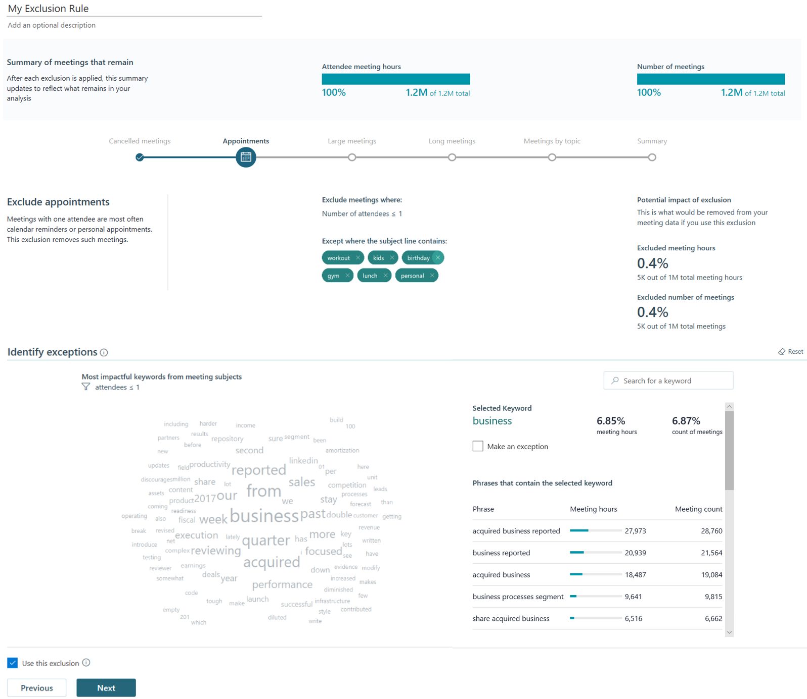
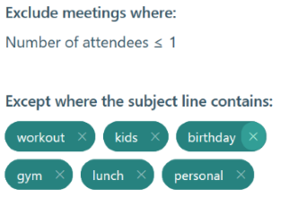
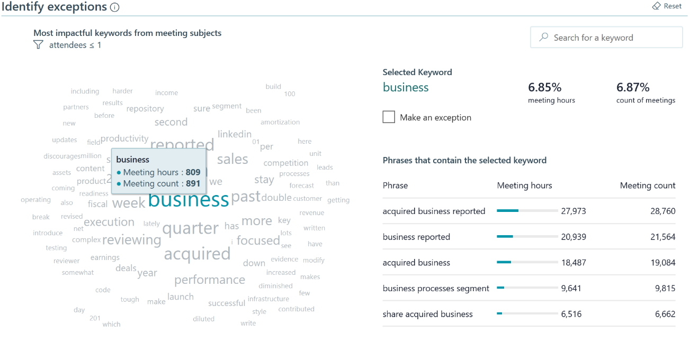
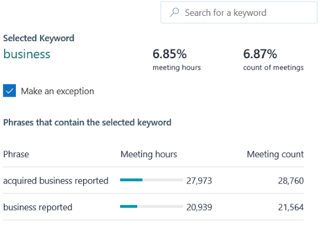
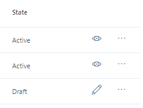

---

title: Meeting exclusion rule concepts
description: Describes concepts and tools for meeting exclusion rules, including a word cloud and a list of supported languages
author: madehmer
ms.author: helayne
ms.topic: article
ms.localizationpriority: medium 
ms.collection: viva-insights-advanced 
ms.service: viva 
ms.subservice: viva-insights 
search.appverid: 
- MET150 
manager: scott.ruble
audience: Admin
---

# Meeting exclusion rule concepts and tools

You can use the following screen elements and concepts to create and use meeting exclusion rules in Microsoft Viva Insights in Workplace Analytics. For step-by-step walkthroughs, see [Meeting exclusion rule walkthroughs](meeting-exclusion-rules.md).

At each step in the exclusion-creation flow, you'll see a page, such as the following.

In the following sections, you'll learn more about the pages you use in the exclusion-creation steps.

## Progress summaries  

### Progress bar

The progress bar at the top of the page tracks where you are in the flow:

### Summary of meetings that remain

This section tracks how many meetings and meeting hours remain in your analysis as you exclude meetings. This view updates every time you advance to the next step in the flow. 

These numbers help you understand the effects of the exclusions that are already in place and the effect of the exclusion created in the current step. This helps you confirm whether to remove these meetings and decide which meetings, if any, that you want to keep in your analysis. 

Before you apply any filters, 100% of meeting hours are still available for analysis, as are 100% of the meetings that have been held in the time since Workplace Analytics began to use data from Microsoft 365.

  

As the [Create a meeting exclusion rule](meeting-exclusion-rules.md) walkthrough describes, as you complete each step and move on to the next one, you'll see the number of meetings and meeting hours decrease as the exclusion is applied to your data.

  

>[!Note]
> This calculation updates after you select **Next** and advance to the next step.

## Interactive summary of the current exclusion step

The middle section of the page shows you a summary of the current exclusion step:

  

This section has the following informative areas:

* On the left, you see the types of meetings this step addresses. The exclusion description helps you understand the purpose of the current step.
* In the center, you see details about the meetings that this exclusion would remove from analysis. This section helps you keep track of the customizations you have made to the current exclusion.
* On the right, you see the effects of the current exclusion step if you apply it, namely: What percentage of meeting hours and of meetings would it exclude? In other words, what impact would this step have on the remaining meeting data?
  
  >[!Tip]
  >Pay particular attention to the number shown for _Excluded meeting hours_. This metric is usually more important than the percentage of meetings because time spent in meetings is a more important indicator when analyzing meeting behavior than the sheer number of meetings, which can vary greatly in length.

## Customization working area

Below the **Summary of meetings that remain**, you can customize four of the five exclusion types: appointments, large meetings, long meetings, and meetings by topic. The _cancelled meetings_ exclusion type cannot be customized, but you can choose not to use the exclusion in your rule.

You can make the following types of customizations:

* Change the default filter value for any step that has a numerical filter.
* Choose which keywords and topics that you would like to exclude from analysis. For details, see [Create a meeting exclusion rule](meeting-exclusion-rules.md#create-a-meeting-exclusion-rule).
* Create [exceptions to an exclusion](#make-an-exception-to-an-exclusion).
* Use keywords and topics in the following [list of languages](#supported-languages).

### Make an exception to an exclusion

Sometimes, the default exclusion filters out meetings that you may want to keep in your analysis. You may want to make exceptions to an exclusion without removing the entire exclusion itself. The tools described in this section will help you identify which meetings you may want to keep in your analysis based on the keywords associated with these meeting subject lines.

For steps 2-4 in the meeting exclusion creation flow, appointments, large meetings, and long meetings, you can use the  [Word cloud](#word-cloud), a [Phrase table](#phrase-table), and search capability ([Keyword search](#keyword-search)) to customize your exclusions in this manner.

### Word cloud

Below the heading **Identify exceptions** is a word cloud that displays keywords from meeting subject lines. It includes only keywords for meetings that meet the filter criteria that are being applied on the current step. In a word cloud, the larger the size of text of a keyword, the more meeting hours the keyword represents. You can use keywords and topics in the following [supported languages](#supported-languages).

The filter context of the word cloud always reflects the filter context for the step that you are on. For example, in the _Exclude small meetings_ step, the keywords were found in the meeting invitations where the number of attendees is less than or equal to one.

While you define the exclusion, if you adjust that filter context, the word cloud is re-filtered accordingly.

To remove a keyword from this exclusion, select the keyword in the word cloud and then select **Make an exception**. Before you remove it, you might want to learn more about it and its impact on the data. To learn more, do one of the following:

* Hover your cursor on the keyword to see the meeting hours and meeting count.
* Select the keyword. This selects the keyword and displays details about its impact on meeting hours in the Phrase table. The [Phrase table](#phrase-table) is described later in this step.

### Keyword search

You might know of a specific word that you want to retain in your analysis (that is, remove from the exclusion). If you cannot find that word in the word cloud, search for it in the field marked **Search for a keyword**. This lets you search for phrases that contain one, two, or three words. If the keyword is found, Workplace Analytics shows data in the Phrase table about removing it from the exclusion. To remove it from the exclusion, select **Make an exception**.

#### Remove an exception

After you make an exception of a word, it appears above the word cloud. If you change your mind, you can remove the word from the exception list. To do this, select the **X** next to the word. This returns it to the group of keywords whose meetings will be excluded.

  

You can also remove all of your exceptions to this exclusion at once. To do this, select **Reset**.

### Phrase table

Workplace Analytics shows a table named **Phrases that contain the selected keyword**. This table can help you understand the context of meetings that are associated with this subject-line phrase or keyword.

### Example 1: Business

The words "business" or "marketing" in the word cloud represent meetings that you might want to include in your analysis. To help you decide, you can see the effects of removing this keyword (and its meetings) from the exclusion. For example, if you select **business**, Workplace Analytics shows what percentage of meetings have this word in their subject line and the total number of hours for those meetings:

In the following illustration, the word "business" has been excepted from the exclusion, which means that meetings with "business" in their invitations' subject lines will be _retained_ in your analysis:

### Example 2: Soccer

The word cloud contains "soccer," which you select. Now, if the Phrase table shows phrases such as "soccer practice" or "soccer league," this might indicate that meetings with "soccer" in the subject line were not work-related and therefore are appropriate to exclude from analysis.

However, if you work for an athletic-equipment supplier and this table displays phrases such as "soccer product review," these meetings are probably work related and therefore should be included for analysis. To retain this keyword and its associated meetings, you make it an exception to the exclusion rule. To do this, select **Make an exception** adjacent to the word cloud.

If you notice other words in the cloud that you might want to retain in your analysis, select them, review the **Phrases that contain the selected keyword** table, and, when appropriate, select **Make an exception**.

## Select exclusion type

For a **New exclusion**, the following types of exclusions are available to create, which you do in Step 3 of [To start a meeting exclusion rule](meeting-exclusion-rules.md#to-start-a-meeting-exclusion-rule):

* **Meeting Exclusion** - Excludes data from specific types of meetings (such as all-day training meetings) from analysis whose inclusion might skew query results.

* **Attendee exclusion** - Excludes data about meeting invitees, by their responses from analysis . For example, you might want to explicitly exclude (or include) invitees who tentatively accepted a meeting invitation. Creating attendee exclusions lets you effectively redefine "meeting attendance." If you add no attendee exclusions, meeting attendance means only one thing: that a person accepted the meeting invitation. However, by creating an attendee exclusion, you can change that definition to also include either or both of the invitee actions "tentative" and "no response."

>[!Note]
>These exclusion types are not mutually exclusive. You can exclude data about particular types of meetings (such as long or large meetings) and also exclude data independently about attendees who respond with “tentative” or do not respond to meeting invitations.

## Default meeting-exclusion rule

Workplace Analytics supplies one meeting exclusion rule by default, the _Tenant default meeting exclusion rule_. This rule excludes the following types of meetings from query results, which are not likely relevant workplace meetings:

* Meetings with only one attendee
* Meetings equal to or longer than eight hours
* Meetings with 250 or more attendees
* Cancelled meetings

>[!Note]
>To respect user privacy, meetings marked as private and/or confidential are always excluded from meeting query calculations.

This default rule is a good start, but if you were to use only it, you would miss the opportunity to verify that this rule doesn't exclude important meetings you wanted to keep, as well as the opportunity to exclude additional meetings based on meeting-subject keywords.

To create a custom rule for your organization, follow the steps in [Create a meeting exclusion rule](meeting-exclusion-rules.md#create-a-meeting-exclusion-rule).

## Rule actions

For published rules, select the **View** (eye) icon in the rule's row to view it. For draft rules, select the **Edit** (pencil) icon in the rule's row to edit it.

Select the **More options** (ellipsis) icon in the rule's row to view the menu, which varies depending on if it's a published or draft rule.

### Published rules

The following options are available for a published rule:

* **Duplicate** creates an exact copy of the rule.
* **Set preferred** sets this rule as the preferred rule. There can be only one preferred rule within your tenant. This has the following effects:

  * When an analyst designates a rule as preferred, that rule will appear to _all_ analysts as the preferred rule in [Explore the stats](../use/explore-intro.md) data.
  * The preferred rule also appears at the top of the list of rules on the [Analyst settings](../use/settings.md#analyst-settings) page. (The **Set preferred** action is unavailable for the rule that is currently set as preferred.)
  * The preferred rule will apply to all [queries](query-basics.md) that are run during the time the rule is in place.

* **Archive** archives the rule.  
* **Favorite** sets the rule as a favorite, which sorts it near the top of rule lists. (For rules set as favorites, select favorite again to reverse the option.)

### Draft rules

The options for draft rules are **Duplicate** and **Delete**:

### Archived rules

The options for archived rules are **Delete** and **Restore**. **Restore** returns the rule to the list of published rules:

## Application of meeting exclusion rules

Workplace Analytics provides a default meeting exclusion rule. You and other analysts can create new rules. Are all these rules available to all analysts? Can you combine your rules with theirs, or with the default rule? This section answers those questions and others.

Q1. **Scope of meeting exclusion rules** - You create meeting exclusion rules on the Meeting exclusions page, which is reached through the **Analyst settings** page of Workplace Analytics. After you create rules, where can you apply them in Workplace Analytics?

Exclusion rules apply in two areas where analysts work most:

* **Explore the stats** - Exclusion rules work for analysts as they inspect data in Explore the stats. For more information, see [Select which rule to use](meeting-exclusion-rules.md#select-which-rule-to-use).
* **Query designer** - Analysts can also apply exclusion rules when creating, refining, and running queries in Workplace Analytics. For more information, see [Use rules with queries](meeting-exclusion-rules.md#use-rules-with-queries).

Q2. **Edit existing rules** - Can you change/edit the default meeting-exclusion rule, or rules that you or other analysts have created?

You can edit a rule only if it has been saved as a draft. You cannot change or edit published rules.

Q3. **Sharing of rules** - Can rules be viewed and shared by others? If you create a rule, does it or can it be applied to the data and queries that are used by other analysts?

Yes. Anyone in your organization can use the rules that anyone else in the organization has created.

Q4. **Combining of rules** - Can you combine rules? For example, can you use the default meeting-exclusion rule and then layer a new rule on top of it, so that both are in effect? Can you combine a rule of your own with a rule that another analyst has defined?

No. You can have only one rule in effect at a time. For more information, see [Select which rule to use](meeting-exclusion-rules.md#select-which-rule-to-use).

## Supported languages

The following languages are supported for keywords and phrases in meeting exclusions.

| &nbsp; | &nbsp; | &nbsp; | &nbsp; |  
|---|---|---|---|
|Arabic | French | Korean | Serbian (Cyrillic) |
|Bengali | German |Latvian | Serbian (Latin) |
|Bulgarian | Greek |Lithuanian | Slovak |
|Catalan | Gujarati| Malay |Slovenian  |
|Chinese (Simplified) |Hebrew | Malayalam |Swedish |
|Chinese (Traditional) | Hindi | Marathi | Tamil |
|Croatian | Hungarian | Norwegian (Bokmaal) | Telugu
|Czech | Icelandic | Polish |Thai |
|Danish | Indonesian |Portuguese (Brazilian | Turkish|
|Dutch | Italian | Portuguese (Spanish) | Ukrainian |
|English |Japanese | Punjabi | Urdu |
| Estonian | Kannada | Romanian | Vietnamese|
|Finnish | Kazakh | Russian|

## Related topic

[Meeting exclusion rule limitation for large meetings](meeting-exclusion-250.md)
