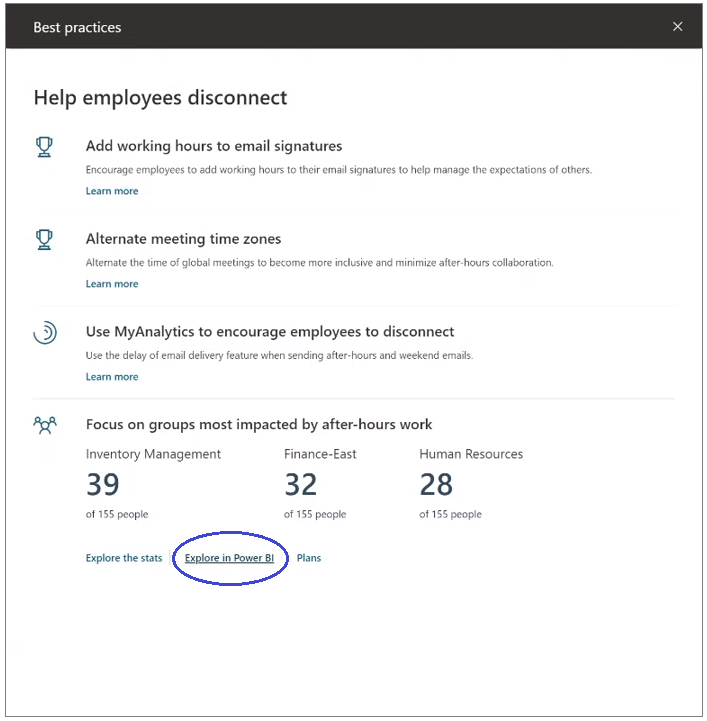
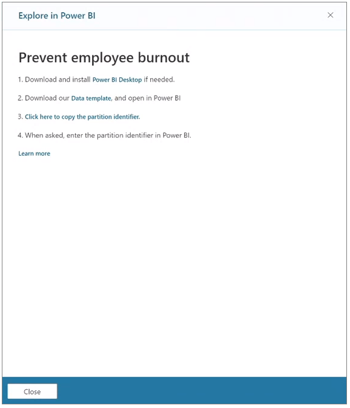
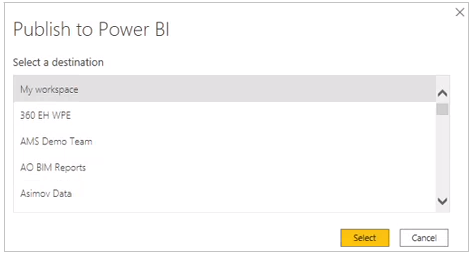
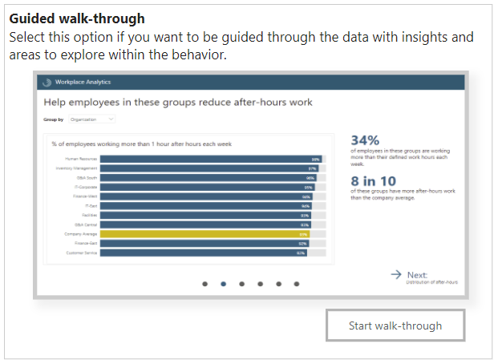
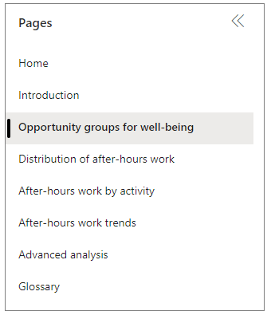
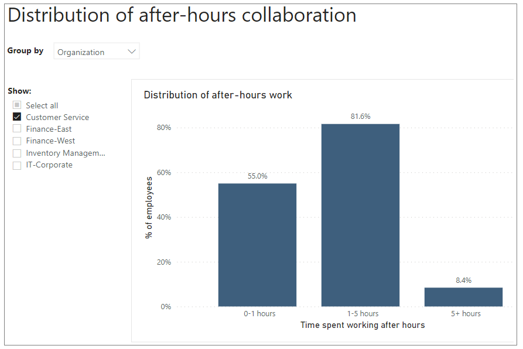

# In-depth insights in Power BI

**Owner** - Analyst or Analyst limited

As a business decision maker, you can use Viva Insights to see your organization's current work conditions and trends. With these insights, you can identify “opportunity groups” (groups that you might want to act on) and do detailed analysis with the drill-down capabilities in Power BI.

The Power BI Connector combines Viva Insights data with the visualization capabilities of Power BI. The data you view in Power BI stays up to date because it automatically refreshes with new data from Viva Insights. The connector also enforces privacy by preventing those who view the report from seeing data about a group smaller than the [minimum group size](../use/privacy-settings.md#minimum-group-size), which is specified by the Viva Insights admin. This lets you share reports with confidence that individual data is not exposed.

To set up these visualizations, follow the steps that are described in the following walkthrough. You need not run queries nor select metrics to populate these visualizations. The metrics are predefined and communicated to Power BI through the Power BI Connector. For background information, see [Connect through the Power BI Connector](../use/view-download-and-export-query-results.md#connect-through-the-power-bi-connector).

## View and publish insights in Power BI

In the following walkthrough, you can do the steps as a business decision maker who has been granted the limited analyst role in the advanced insights app. Your interest in the employee experience at your company is heightened because you’ve become aware of employee attrition, and you want to find out what could be causing this problem. At the end of this walkthrough, you can view custom Power BI visualizations about this issue and optionally share them with team members.

1. Open [the advanced insights app](https://workplaceanalytics.office.com/). If prompted, sign in with your work account.

2. Select the **Boost employee engagement** outcome to see insights about your company.

3. In **Prevent employee burnout**, you'll see what percentage of employees spend more than five hours each week working after hours. To see how to help employees disconnect, select **See your insights**:

     

4. In **Best practices**, select **Explore in Power BI**:

    

5. Follow the instructions in **Explore in Power BI**:

    

   1. If you do not already have Power BI installed, select the link to download and install it.
   2. Download the data template for this insight.
   3. In your web browser or in your Downloads folder, select the downloaded data template file. This opens Power BI.  
   4. Select **Click here to copy the partition identifier**. After you do, a “Copied” indicator is shown:
  
      

6. In Power BI, give the information that’s required to make a connection. When prompted, paste the partition identifier copied in the previous step:

   

7. Select **OK** to view the **Home** page in Power BI Desktop:

   

   **Best-practice recommendation**: In Power BI Desktop, publish your new visualizations to your workspace to optimize your analysis when using Power BI online.

   

   After you publish, it’s easy to view your visualizations (in read-only mode) in [Power BI Online](https://powerbi.microsoft.com/). For more details, see [Publish datasets and reports from Power BI Desktop](/power-bi/create-reports/desktop-upload-desktop-files).

8. (Optional) Delegate this information to your team members by sharing this report. This lets them filter and focus the data to further identify opportunities or track metrics that change over time.

9. Go to the next section to [identify and help opportunity groups](#identify-and-help-opportunity-groups).

### Identify and help opportunity groups

These Power BI visualizations show the opportunity groups in your organization. For example, the following shows groups whose members, on average, have less one-on-one time than others in the company.

On the **Introduction** page, in the guided walkthrough, select **Start walk-through**:

The walkthrough opens, in sequence, several other analysis pages that present you with more information about this area, such as wellbeing:

Each analysis page gives you a **Group by** choice. For details, see [Grouping choices](#grouping-choices).

### Grouping choices

Part of the task of identifying groups that might need help is deciding how to define groups. In each of the analysis pages, you can choose a business-attribute pivot to display data, such as for **Group by**, select either **Organization** or **LevelDesignation**:

This choice might help you discover, for example, that a particular trait is evident not in just one or two organizations, but rather for employees at a particular level, across organizations.

After you make this selection on one page, the graphs on all of the analysis pages switch to that choice. You can then filter the data further to focus your analysis on groups in which you have the most interest. For example, after we selected to **Group by** > **Organization**, we then selected the **Customer Service** group to learn more about it.

  
By using these filtering options, we can see that 8.4% of the employees in the Customer Service group work more than five hours per week in their after-hours time.

### Explore Advanced analysis

One of your drill-down options is to slice and filter the data in custom ways all in one place, the **Advanced analysis** page. On the **Home** page, in **Advanced analysis**, select **Start here**:

This opens the **Advanced analysis** page:

On this page, for example, you can not only group and filter by **Organization** and by **LevelDesignation**, you can also change the time period for which the data is analyzed, and simultaneously filter by groups in different pivots. For example, you can select **Senior IC** for **LevelDesignation** and at the same time select **Finance-East** and **Finance-South** to view data only for employees at that level in those groups.

After you've identified one or more groups that need help, how can you help them? See [Next steps](#next-steps) for details.

## Next steps

With the knowledge gained from these visualizations, you can now take action:

* Learn more about current behavior and trends by running [queries](query-basics.md). You can also create a dashboard for yourself by importing data through the Query designer (especially [auto-refresh queries](query-auto-refresh.md)) into [Power BI](../use/view-download-and-export-query-results.md#get-a-link-for-an-odata-feed-to-use-in-power-bi).

* Help employees help themselves by pointing them to a pertinent [playbook](../personal/use/mya-adoption/adopt-learning-modules.md).

* If you've decided that one or more groups need help recovering focus time, consider starting a [Teamwork plan](teamwork-solution.md).

## Power BI tips, troubleshooting, and FAQs

For details about how to share the dashboard and other Power BI tips, troubleshoot any issues, or review the most frequently asked questions, see [Power BI tips, FAQs, and troubleshooting](power-bi-templates.md).

## Related topics

* [Templates](power-bi-intro.md)
* [Teamwork plans](teamwork-solution.md)
