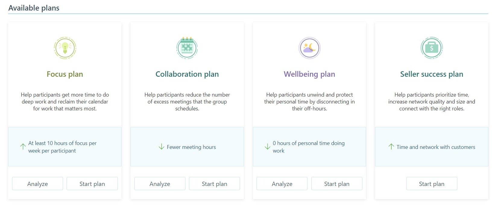
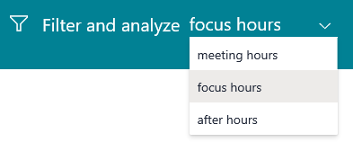
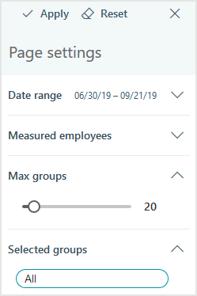
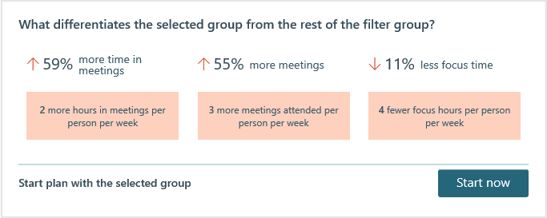
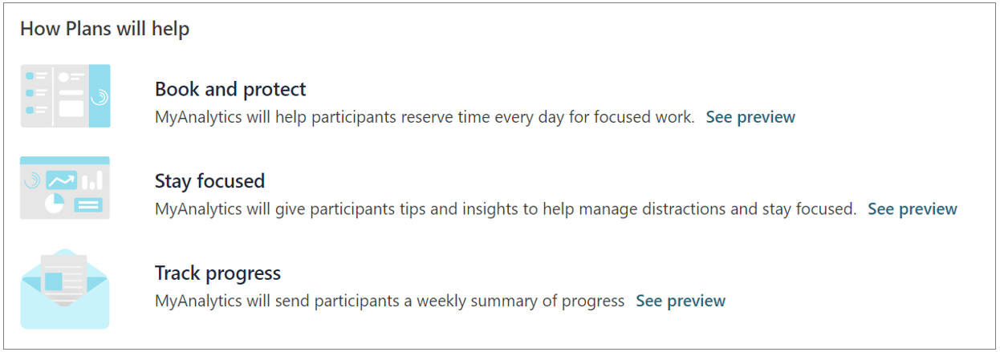

---

title: Workplace Analytics plan walkthrough
description: A walkthrough of the steps required to create a plan in Workplace Analytics
author: madehmer
ms.author: helayne
ms.topic: article
ms.localizationpriority: medium 
ms.collection: viva-insights-advanced 
ms.service: viva 
ms.subservice: viva-insights 
search.appverid: 
- MET150 
manager: scott.ruble
audience: Admin
---

# Plans: Walkthrough

You can use the _plans_ feature of Workplace Analytics to create improvement plans for employees, with the goal of changing their work habits for the better. You can create a plan, track it while it is in progress, and examine it after it completes.

People in the following roles can work on improvement plans in various ways:

* **Analysts**, **limited analysts**, and **program managers** can identify groups of employees and opportunities for change, design and start plans, track plans that are underway, and examine plans that have completed.
* **MyAnalytics users** participate in plans. For more information, see [Plan participant experience](solutionsv2-participants.md).  

> [!Note]  
> If you have been assigned multiple roles, your capabilities are expanded. See [User roles in Workplace Analytics](../use/user-roles.md).

> [!Important]  
> To create a plan, you must select a group of participants. For any person to be eligible for participation in a plan, they must have a MyAnalytics license. See [Prerequisites for plans](solutionsv2-intro.md#prerequisites-for-plans).

## Create a plan

**Role:** analyst, limited analyst, or program manager

As an analyst, limited analyst, or program manager, follow these steps to create a plan.

1. [Define the plan](#define-the-plan).

2. [Select a group](#select-a-group).

3. [Start the plan](#start-the-plan).

### Define the plan

1. Open [Workplace Analytics](https://workplaceanalytics.office.com). If prompted, sign in with your work account.

2. In **Plans** > **New plan**, you can learn about and select the type of plan you want to create, such as a _Focus plan_, a _Collaboration plan_, a _Wellbeing plan_, or the _Seller success plan_.

    

    > [!Note]  
    > On this page, the **Analyze** option is available only to people with the role of analyst or limited analyst.

3. Do you have a group of employees in mind for participation in a plan? If so, select **Start plan** for the plan that you want that group to use, and go to step 5. If you do not already have a group picked out, go to [Find the group through analysis](#find-the-group-through-analysis), which is only available to people with an analyst role in Workplace Analytics.

4. For this example, select **Start plan** for the _Focus plan_. This opens the **Set up new plan** pane for a Focus plan, which shows default values for the plan, such as its name:

    

5. Go to [Select a group](#select-a-group) for next steps.

### Select a group

If you have a particular group in mind, you can identify the group either by [uploading a .csv file](#upload-a-csv-file) or by [using filters](#use-filters). (If you don’t have a group in mind, go to [Find the group through analysis](#find-the-group-through-analysis).

#### Upload a .csv file

1. Locate the .csv file to upload. The format of this file is simple: a list of email addresses in a single column. To obtain this file, you might have exported it from an HR system.

2. Select **Upload .csv file**.

3. Select **Browse**, select a .csv file, and then select **Open**.

4. After the file is uploaded, select **Validate**.

5. After the group is successfully validated, you'll see any applicable warnings about the participants. For more information, see [Validation](solutionsv2-conceptual.md#validation).

6. Go to [Start the plan](#start-the-plan).

#### Use filters

1. Select **Use filters**. This opens the filter controls:

    

2. Add filters to define your group. For example, select **FunctionType**, **Equals**, and **Marketing** in the fields to select the people who work in business strategy as your group. Optionally, add more function types to expand this group, or add more filtering criteria to refine the selection.

3. Select **Validate**. After the group is successfully validated, you'll see any  applicable warnings. For more information, see [Validation](solutionsv2-conceptual.md#validation).

4. Go to [Start the plan](#start-the-plan).

### Find the group through analysis

If you do not already have a group in mind for a plan, you can analyze the work habits of a larger segment of your organization to identify a group that could potentially benefit from a plan.

> [!Tip]
> These steps work best after you’ve decided on the type of plan. Where might people in your organization have a problem? The available plans address too few focus hours (Focus plan), too many hours of meetings (Collaboration plan), or too much collaboration after the workday ends (Wellbeing plan).

   

#### To identify a group by using filters and charts

1. On the **Plans** page, in the card for one of the plans under **Available plans**, select **Analyze**. For this walkthrough example, select **Analyze** on the Focus plan card to open the **Filter and analyze** page.

2. (Optional) Although you just selected a plan, you can change it by selecting it (such as **after hours**) in **Filter and analyze**:

    

3. Scope your data. To start, narrow the focus to specific people by applying filters in the **Page settings** pane. If it's not open, select **Settings and filters** at the top right of the page:

    

    

4. In **Page settings**, refine your selection of employees and change how the employees are grouped. For example, you can add a filter to show only employees in the East and Southeast regions and you can change the maximum number of groups to 10. After you finish adding filters, select **Apply**. The main section of the page changes to reflect these new changes.

5. To select a more precise group of people to include in the plan and continue with your analysis, you can use the **Select a question to change the view of your chart** options, such as: **Which groups attend the highest number of meetings?**

    

    Selecting a question shows the answer to the question in the chart. By selecting a question that is relevant to the collaboration problem that you want to solve, you will see groups of employees who are most likely to exhibit symptoms of that problem. Selecting a question also orders the groups shown by their metrics (such as meeting hours, focus hours, or number of meetings) based on what the question asks about.

    The chart has vertical bars that represent different groups of people. Each bar that represents a group that meets or exceeds the minimum group size. Any groups smaller than the minimum group size do not show up in the chart because they are too small to analyze. (Also see [Minimum group size](solutionsv2-conceptual.md#minimum-group-size).)

    <!-- For example, if the organization you are analyzing has a minimum group size of five, you can change it to a level that you consider more relevant for your organization. However, you cannot set the group size lower than five. In the following chart, the Data & Applied Sciences group contains fewer than five people, so its bar is shown as grayed out: -->

    See also [Available and selected employees](solutionsv2-conceptual.md#available-and-selected-employees).

6. Select one or more groups for analysis. To deselect a group, select it again. For more information about what happens with selected groups when you change settings on this page, see [Persistence of group selections](solutionsv2-conceptual.md#persistence-of-group-selections).

7. After you select one or more groups to analyze, you'll see additional information about this group’s work habits below the chart, such as:

    

8. After you identify the groups, select **Start plan** to open **Set up new plan** to show the filters that you set in the charts and in page settings:

    

    > [!Note]  
    > Because these steps are using analysis to find the group and filters are an important part of that analysis, **Use filters** is the default option. However, you can select **Upload .csv file** to upload participant data instead.

9. (Optional) Change the selected filters or add new filters to further refine the group.

10. Select **Validate**. After validation completes, you'll see results with any applicable warnings, such as:

    

11. Any warnings reduce the number of potential members in the group. If the remaining group size is above the minimum group size, you can proceed. If you are satisfied with the group at this point, select **Save as draft**, and then go to [Start the plan](#start-the-plan) for next steps.

> [!Note]
> Before you start a plan, it's a good idea to inform plan participants about the upcoming plan, its goals, and its start and end dates. You could, for example, send this information in a "welcome" or "program-launch" email as described in [Program-launch email](../personal/use/mya-adoption/team-adopt-plan.md#program-launch-email). For more information, see the best-practices recommendations in [Develop a communications plan](../personal/use/mya-adoption/team-adopt-plan.md#develop-a-communications-plan). 

## Start the plan

**Role:** analyst, limited analyst, or program manager

After the selected group validates successfully, you'll see insights about the group. They show you how the group’s numbers differ from company averages for the context that you chose. For example, if you chose to create a Focus time plan, Workplace Analytics shows metrics, such as the number of hours in meetings per week, that show why the people in this group could benefit from more focus time. Although these insights are informative, they are not interactive.

1. Select **Plans** > **Manage** to see a list of plans, and then in **Show**, select **Drafts** to view your new plan.

2. (Optional) Select **Edit** next to your new plan to change the **Plan name** to a name more meaningful to you than the suggested value.

3. (Optional) Change the **Plan target** to a different value. Note that you can select only percentage-based targets, such as a 10% decrease in after-hours work.

4. (Optional) Set the **Plan duration**. To do this, set the start date. (You must choose a Sunday because all plans start on Sundays.) The plan’s end date is then calculated and shown.

5. (Optional) In **How Plans will help**, select **See preview** to see examples of inline suggestions, dashboard information, and the digest that people will experience while participating in the plan. Similar to plan insights, these previews are informative but not interactive:

    
  
    In these previews, you can see a brief description of "habits" that participants will learn about. Following these habits can help them reach their plan’s target. For example, rescheduling meetings that conflict with their focus time is a habit that can help a participant reach a target of increased focus time. Three habits are suggested for each plan type.

6. Select **Create plan**. This schedules the plan you chose for the group you selected to start and end on the dates that you set for the **Plan duration**. Or select **Save as draft** to finish up later or set the plan duration later.

## Track plans

**Role:** analyst, limited analyst, or program manager

You can use the **Track** page to measure progress on the target since the plan started, as well as ROI for the plan.

### To track an active plan

1. Select **Plans** > **Track**.
2. In **Progress for**, select the plan you want to see progress information about up to this point in time.

## Related topics

* [Plans: Introduction](solutionsv2-intro.md)  
* [Plans: Participants](solutionsv2-participants.md)  
* [Plans: Concepts](solutionsv2-conceptual.md)
