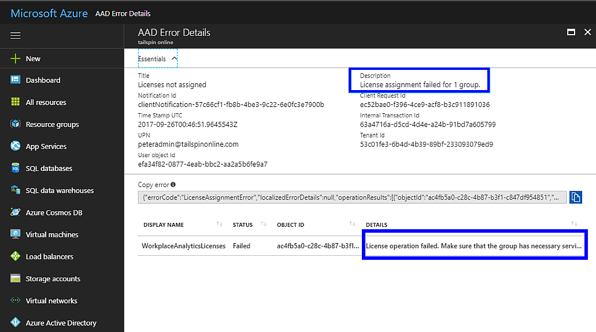
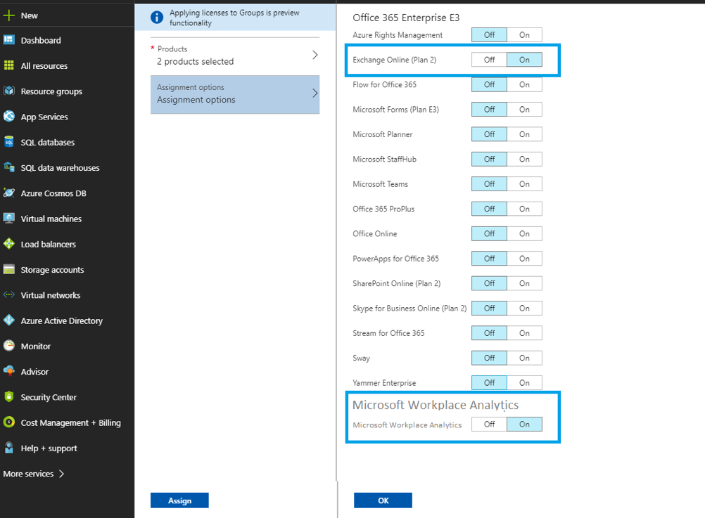

# Assign group-based licenses for Workplace Analytics

To use group-based licensing to assign Workplace Analytics licenses, see [Group-based licensing](/azure/active-directory/enterprise-users/licensing-groups-assign).

 <!-- FORMERLY HERE: NOW OUTDATED AS OF AUGUST 2021. 
ALSO HIDING THIS TOPIC BUT NOT DELETING IT -- IN CASE SOMEONE HAS BOOKMARKED IT. 

Some Microsoft Online products are "add-ins," which require a service plan that's enabled for a user or a group. With group-based licensing, the system requires that both the prerequisite and add-in service plans be enabled for the group, so that any new users who are added to the group can get a valid service plan assignment.

Here's an example:

>[!Note]
>Previously, Workplace Analytics had a prerequisite of an E1, E3, or E5 license. Now, the prerequisite for an Exchange Online license has been removed, so every organization can deploy Workplace Analytics by using group-based-licensing for a single group.

 Microsoft Workplace Analytics is an add-on product that contains a single service plan with the same name and ID of WORKPLACE_ANALYTICS. 

This service plan can only be assigned to a user, or a group, when one of the following prerequisites are also assigned:

* Exchange Online (Plan 1) (Id: EXCHANGE_S_STANDARD)
* Exchange Online (Plan 2) (Id: EXCHANGE_S_ENTERPRISE)

If you try to assign this product on its own to a group, the portal will return an error:

The error notification details will include the following error message:
> _License operation failed. Make sure that the group has necessary services before adding or removing a dependent service. **The service Microsoft Workplace Analytics requires Exchange Online (Plan 2) to be enabled as well.**_

Before you assign this add-on license to a group, ensure that the group also contains the prerequisite service plan. You can update an existing group that already contains the full Microsoft 365 E3 product that includes Exchange Online.
Or you can create a standalone group that contains only the minimum products required to make the add-on work, which you can use to license only the selected users for the add-on product.

For example, you can assign the following products to the same group:

* Microsoft 365 or Office 365 Enterprise E3, with only the Exchange Online (Plan 2) service plan enabled
* Microsoft Workplace Analytics

The resulting assignment is valid and applied to the group. And thereafter, any users added to this group will consume one license of the E3 product and one license of the Workplace Analytics product. At the same time, those users can be members of another group that gives them the full E3 product and they will still consume only one license for that product.

>[!Tip]
>You can create multiple groups for each prerequisite service plan. For example, if your organization has both **E1** and **E3** users, you can create two groups for licensing Workplace Analytics. One group for E1 as a prerequisite and the other for E3. This enables you to separately assign licenses for the Workplace Analytics app to E1 and E3 users without consuming additional licenses.
 
-->

## Related topics

* [Environment requirements for Workplace Analytics](../setup/environment-requirements.md)
* [Group-based licensing](/azure/active-directory/enterprise-users/licensing-groups-assign)