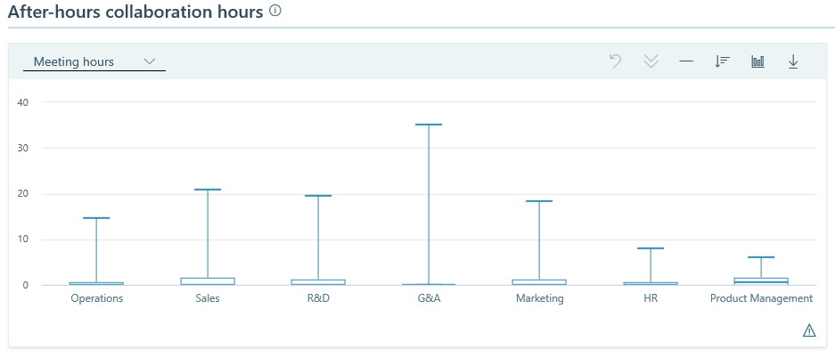
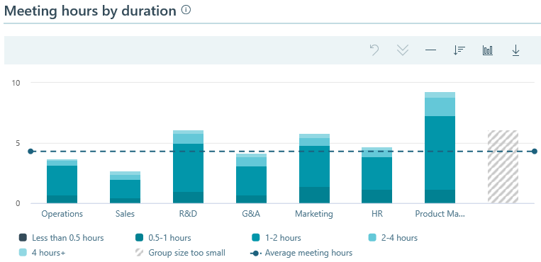
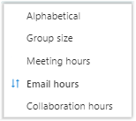
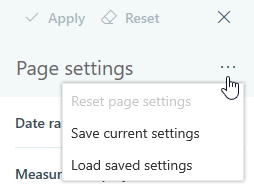

# Advanced insights charts

[Explore the stats](/viva/insights/use/explore-intro?toc=/viva/insights/use/toc.json&bc=/viva/insights/breadcrumb/toc.json) data in the advanced insights app summarizes your organizational data into visual charts. The following describes these charts and information about how to use them:

* [Chart types](#chart-types) describes the primary chart types.
* [Chart features](#chart-features) helps you get the most out of the charts.
* [Work with charts](#work-with-charts) describes how to use the chart tools to customize the data.

## Chart types

[Explore the stats](/viva/insights/use/explore-intro?toc=/viva/insights/use/toc.json&bc=/viva/insights/breadcrumb/toc.json) show data primarily through the following chart types:

 **Column graphs** compare data across groups. The columns run vertically. Each column shows the average value for a metric, such as email or meeting hours, per person, per week, in each group, and for the period selected. For an example, see [Meeting hours by number of attendees](/viva/insights/use/explore-metrics-meetings-overview?toc=/viva/insights/use/toc.json&bc=/viva/insights/breadcrumb/toc.json#meetings-hours-by-number-of-attendees).

 **Bar charts** also compare data across groups. The bars run horizontally. Bar charts are used on the **External collaboration** page. Each bar shows the value for the metric, such as external network size, within a group, for the period selected. For an example, see [Groups collaborating with external domains](/viva/insights/use/explore-metrics-external-collaboration?toc=/viva/insights/use/toc.json&bc=/viva/insights/breadcrumb/toc.json#external-domain-collaboration).

 **Box plots** (also known as distribution charts) show the distribution of metric values within a group. A box plot shows the maximum, minimum, median, upper quartile, and lower quartile for the group for the period selected. Each value within a group represents the average value for a person. For example, the person with the highest average is represented by the maximum point on each box plot in the chart.

 **Line graphs** are used as trend-line charts in that they show metric values over time. The default trend line is the company average for the selected metric. Trend-line charts show one point per week for as many weeks as you have set in **Date range**, under **Settings and filters**. See [Change the date range](#to-change-the-date-range).

For an example, see the chart on the right in [Skip-level meeting hours](/viva/insights/use/explore-metrics-management-and-coaching?toc=/viva/insights/use/toc.json&bc=/viva/insights/breadcrumb/toc.json#skip-level-meeting-hours).

## Chart features

### Chart pairs

In most cases, charts appear in pairs. The charts in a pair present related information and can interact with one another. Within a pair, the chart on the left appears by default as a column graph. (An exception is in **External collaboration**, the left chart in each pair is a bar chart.) The chart on the left is paired with a line graph:

>[!Note]
>Within a chart pair, you can [switch](#switch-between-chart-types) the left chart to show either a column graph or box plot.

The column graph shows metric data for groups and the related line graph shows trends, namely values of this metric over time for the selected groups. For example, here is the **Meeting hours by duration** pair of charts in [Meetings overview](Explore-metrics-meetings-overview.md):

You could view this relationship between the charts in a pair as a sort of "chart workspace" in which you focus on a particular filtered data set and then apply different views to it to coax out different facts. If you sort data in the column chart and then switch it to a box plot, your sorting choices carry over to the show of the box plot.

### Defaults

By default, the advanced insights charts show data by employee groups within an organization. Charts show the average metric for each group. Changing the metric changes how the groups are sorted. To learn about changing metrics, see [Sort groups](#sort-groups).

By default, a column chart (or box plot) shows 30 columns, where each column depicts a group of people. You can [change the number of groups (columns)](#to-change-the-number-of-groups) that a chart shows.

Charts also show the average for all groups, in the reference line. For more information, see [Reference line](#use-the-reference-line-to-see-averages).

### Minimum group size

The Viva Insights admin can set a minimum group size threshold, which is required for the group's data to be included in the chart. If the group size is less than the minimum, the group's data is excluded. (The minimum group size can be raised or lowered, but it cannot be set to a number lower than five.)

In the show of a group whose size is smaller than the minimum, you can see the name of the group but not its values. If the size of a group equals zero, the name is also excluded. For more information about setting group size, see [Privacy settings](/viva/insights/use/privacy-settings?toc=/viva/insights/use/toc.json&bc=/viva/insights/breadcrumb/toc.json).

### Use of filters

To change or add filters to see different organizations or other organizational attributes, use the available filters for the charts. Filters are set in [Settings and filters](#settings-and-filters).

## Work with charts

* [Chart tools](#chart-tools) enable you to change the chart type, sort the display, drill down or exclude attributes from the chart, download chart data, and select groups for display in the adjacent trend chart.

* [Settings and filters](#settings-and-filters) in the **Settings and filters** enable you to change the time range of the data, to change what shows in all the charts, to apply filters, to save current settings, to load saved settings, or to reset settings for all the charts.

### Chart tools

You can interact with charts in several ways. For example, use the tool icons above a chart to change what data it shows or to download its data. Hover your cursor over a chart to view data details. Select the metric names in the chart legend to hide or show them.

#### Use the reference line to see averages

The height of the reference line shows the value of the metric that is shown in bold in the legend below the chart. For example, if that metric is "Average collaboration hours," the reference line indicates the average number of collaboration hours for the filter group during the time period indicated by the date range.

* To see more data about the information that the chart is showing, hover over the left or right endpoint of the reference line:

   

  This opens a tooltip that shows the averages for the available metrics for this chart type. (These metrics are shown in the chart legend.)

#### Sort groups

You can sort any column chart or box plot alphabetically or by any metric that is available in the chart.

* To sort, select the **Sort groups** icon, and then select a metric, such as **Meeting hours** or **Email hours**, or select **Alphabetical**. After you change the sort order, the chart automatically updates the data shown in the new sort order.

* To reverse the sort order while sorting by the same metric, select the **Sort groups** icon, and then re-select the metric (**Email hours** in the following example):

   

#### Switch between chart types

In a pair of charts, the chart on the left can show either a column chart or a box plot. The chart on the right shows related trend lines.

* To switch to a box plot, select the **Change chart type** icon, and then select **Box plot**.
* To switch to a column chart, select the **Change chart type** icon, and then select **Column chart**.

After you change chart types, data for the same groups still appears and any selected groups remain selected. This means that the adjacent line graph still shows the trend lines for those same selected groups.

#### Minimum-group alert

When you sort groups by an attribute metric, an alert icon appears in the bottom-right corner of the chart if the chart cannot show a group because if it's smaller than the minimum group size setting.

This functionality protects the privacy of members of groups whose size is below the minimum group size. If a small group was shown after sorting by an attribute's metric, an analyst could infer the small group's value for that metric from its position adjacent to or between other groups, whose values are shown. If you sort alphabetically, such an inference is not possible, so small groups are not hidden.

#### Sort order is retained within a chart pair

A column chart and its related box plot work together. If you sort by a particular choice in the column chart and then switch to the box plot, your sorting choice is also used in the show of the box plot.

### Work with trend lines

In a chart pair, you use the column chart or box plot on the left to change how the trend lines are shown in the line graph on the right. Each trend line corresponds to one group (column) in the left chart.

#### To add a group trend line to the chart

* Select the corresponding group in the adjacent column chart.

#### To remove a group trend line from the chart, but keep it in the legend

* Select the corresponding group name in the legend of the trend chart (below the chart).

#### To remove a group trend line

* Select the corresponding column in the adjacent column chart to remove its line from the trend chart.

#### To reset to the default chart

* At the top of the trend chart, select **Reset**. This removes all added lines from the line graph and returns it to the default.

### Work with metrics and groups

#### To hide or show metrics

* In the chart's legend (below the chart), select the metric name to hide its data from the chart. Select the metric name again to show or include it in the chart.

#### To drill down or exclude a group

* To drill down and show a specific group in the chart, select one or more group's chart data to select (or bold) that group's name in the chart, and then select the **Drilldown** icon.
* To exclude a group from the chart, select one or more group's chart data within the chart to select (or bold) that group's name in the chart, then select the **Exclude groups** icon.
* To revert either of these actions, select the **Undo** icon.

>[!Note]
>The **Undo** tool currently only applies to reversing changes made with the **Drilldown** and **Exclude groups** chart tools. You can apply these drill down and exclude actions with [Settings and filters](#settings-and-filters).

#### To switch between percentage and hours data

* To the right of each chart's title, select **%** to show percentage data or select **Hours** to show the chart data in hours.

### View or download data

#### To view an attribute's details in the chart

* On the chart, hover your cursor over the attribute in the chart to see its data.

#### To download chart data

* In the toolbar above a chart, select the **Download CSV** icon.

   This download contains the chart data exactly as the chart shows it. If you've applied any filters or changed the number of groups to show, those changes are reflected in the data that is downloaded.

   Because the download contains just what you see in the chart, you can use the downloaded .csv data in Excel or in Power BI to reproduce the chart that Viva Insights shows.

>[!Note]
>Because **Download CSV** gives you only the summarized data shown in the chart, it does not include the query data that was used to generate the chart, so privacy and minimum aggregation rules are adhered to.

## Settings and filters

Use **Settings and filters** to change the time range of the data, to change the attribute to group in the charts, and to apply filters. In the following procedures, if the **Settings and filters** panel is not open, select **Settings and filters** to open it.

When you change chart settings, your changes apply to all the charts in all **Explore the stats** data. For example, when you set the chart to group by _level_, all charts in all sections are grouped by that level.

### To apply or reset settings

After you change a setting or add a filter, select **Apply** at the upper-right to apply the settings to all the charts. Or to change back to the default settings, select **Reset**.

### To save custom settings and applied filters for later use

After you change one or more page settings, chart or add one of more filters, you can:

* Select the **ellipsis** (**...**) next to **Page settings** > **Save current settings** to save the settings or applied filters for later use.

* In **Settings and filters**, select the **ellipsis** (**...**) next to **Chart settings** > **Apply to page settings** to save specific chart settings, such as with the drill down or exclude chart tools.

The next time you view Explore the stats data in Viva Insights, it shows the charts with the default settings and filters. To view the custom chart settings saved from earlier, select the **ellipsis** (**...**) next to **Page settings** > **Load saved settings**.

### To change the date range

1. In **Settings and filters**, expand **Date range**.
2. In **Date range**, select a year and then select a month.
3. The selected month shows in more detail in a fly-out window. Use that window to select weeks in the month, one week at a time.
4. Select **Apply** (upper right) to apply these changes to all charts.

>[!Note]
>The date range options encompass the most recent data that has been loaded and use the following logic:
>
>* A week is defined as Sunday to Saturday, and date ranges are adjusted to span the first Sunday to last Saturday of the selected range.
>* For a week that starts in one month and ends in the following month, the data is associated with the month in which the week begins.

### To change or add filters

1. In **Page settings**, expand **Measured employees**.
2. In **Group by**, select the organizational attribute to use in all charts.
3. Next to **Filters**, select the **Edit** (pencil) icon.  
4. In **Edit page filters**, you can change the **Employees** filter:

   * **All employees** - Includes inactive and active employees for the set date range.
   * **Active only** - Includes only active employees who have sent at least one email or instant message for the set date range.
   * **Inactive only** - Includes only those inactive employess who have not sent at least one email or instant message for the set date range.

5. Select **Add filter** to add one or more additional filters.
6. Select **Apply** (upper right) to apply these changes to all charts.

### To change the number of groups

1. To open the **Page settings** panel, expand **Max groups**.
2. Use the **Max groups** slider to set the number of groups you want the charts to show.  
3. Select **Apply**.

> [!Note]
> The **Max groups** slider moves in increments of 5 (groups). The minimum number of groups that you can show is 10 and the maximum is 100. When you add or remove groups, the scroll bar under the chart adjusts accordingly.
