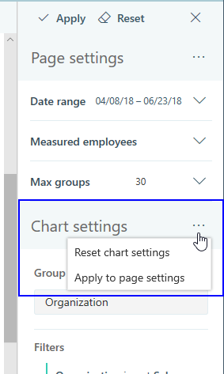
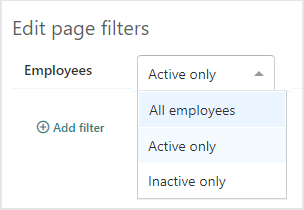

---

title: Explore the stats page settings
description: Describes the page settings for Explore the stats in Workplace Analytics
author: madehmer
ms.author: helayne
ms.topic: article
ms.localizationpriority: medium 
ms.collection: viva-insights-advanced 
ms.service: viva 
ms.subservice: viva-insights 
search.appverid: 
- MET150 
manager: scott.ruble
audience: Admin
---

# Settings and filters for Explore the stats

You can select **Settings and filters** to view **Page settings** on the right side of an Explore the stats page in Workplace Analytics. You can use these settings to change the date range, the way to group time investors (a grouping of employees that is used in queries), and the filter for active, inactive, or all employees.

When you change the chart settings, they apply to all the chart data. For example, when you set the chart to group by *Organization*, all charts in all sections are grouped by organization.

## To apply or reset settings

After you change a setting or add a filter, select **Apply** at the upper-right to apply the settings to the chart data. Or to change back to the default settings, select **Reset**.

## To save custom settings

After you change page settings or filters:

* Select the **ellipsis** (**...**) next to **Page settings** > **Save current settings** to save them for later use.

* In **Page settings**, select the **ellipsis** (**...**) next to **Chart settings** > **Apply to page settings** to save specific chart settings, such as with the drill down or exclude chart tools.

The next time you view Explore the stats data in Workplace Analytics, it shows the charts with the default page settings and filters. To view the custom chart settings saved from earlier, select the **ellipsis** (**...**) next to **Page settings** > **Load saved settings**.

## To change the date range

1. In **Page settings**, expand **Date range**.
2. In **Date range**, select a year and then select a month.
3. The selected month shows more detail for selecting one or more weeks.
4. Select **Apply** (upper right) to apply these changes to all charts.

>[!Note]
>The date range options encompass the most recently uploaded and processed data with the following logic:
>
>* A week is defined as Sunday to Saturday, and date ranges are adjusted to span the first Sunday to the last Saturday of the selected range.
>* For a week that starts in one month and ends in the following month, the data is associated with the month in which the week begins.

## To change or add filters

By default, the Explore the stats data is filtered to show active employees only. Active employees who sent at least one email or instant message during the set date range (the time period set for the query).

1. In **Page settings**, expand **Measured employees**.
2. In **Group by**, select the organizational attribute to use in all charts.
3. Next to **Filters**, select the **Edit** (pencil) icon.  
4. In **Edit page filters**, you can change the **Employees** filter:

   * **All employees** - Includes inactive and active employees for the set date range.
   * **Active only** - Includes only active employees who have sent at least one email or instant message for the set date range.
   * **Inactive only** - Includes only those inactive employess who have not sent at least one email or instant message for the set date range.

5. Select **Add filter** to add one or more additional filters.
6. Select **Apply** (upper right) to apply these changes to all charts.

## To change the number of groups

1. To open the **Page settings** panel, expand **Max groups**.
2. Use **Max groups** to set the number of groups you want the charts to show.  
3. Select **Apply**.

>[!Note]
>You can change **Max groups** by increments of five groups each way. The minimum setting is 10 and the maximum is 100.

## Time investors

This section is only available for applicable Explore the stats, such as External collaboration. Time investors are the people in your company who have been assigned a Workplace Analytics license.

By default, Time investors are grouped by organization, but you can also group them by domain, engagement, or other options. The settings you select in the this section only apply to time investors.

## Collaborators

This section is only available for applicable Explore the stats, such as External collaboration. You can use the Collaborators section to group users by Collaborators, which are people with whom time investors have had an interaction. If you group by Collaborators, the settings you select only apply to Collaborators. Currently, the Collaborators section supports grouping by domain only.

>[!Note]
>Currently, you cannot apply the Collaborators filter for the External network size, External network breadth, and bubble charts in the Network section. However, it does apply to all the other charts on the page.
