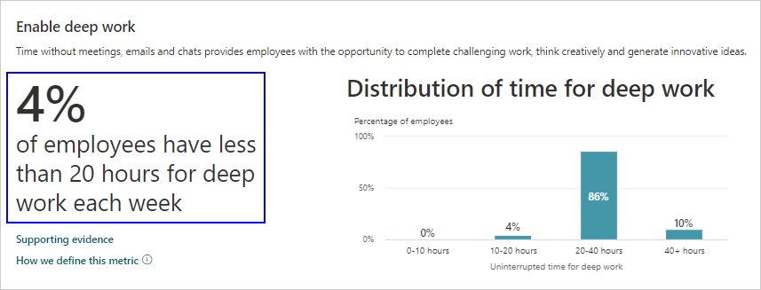
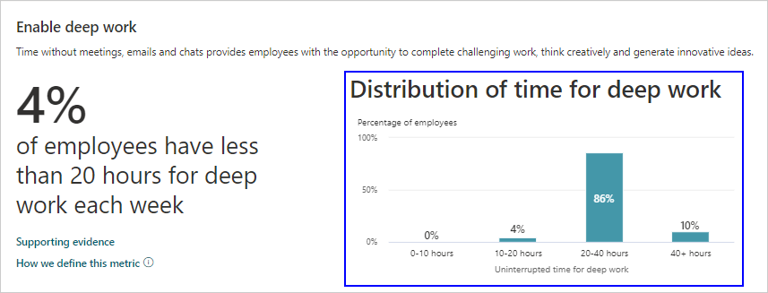

# Foster organizational innovation 

Employees who share information, prioritize learning, and protect time for deep thinking generate the new ideas needed for success in rapidly evolving markets. Each of the behaviors listed show how your organization compares with others based on industry research and your specific organizational data.

## Calculations

The following are the percentage insights, their underlying metrics, and a little about the calculations used for them.

|Behavior |Percentage insight | Metrics |Calculations |
|---------|--------|--------------------|----------------------|
|Enable deep work |Percentage of employees have less than 20 hours for deep work each week |[Total focus hours](metric-definitions.md#focus-define) |The percentage of employees who have less than 20 hours available to focus each week. Calculated weekly and averaged over the time period. |
|Utilize influencers |Percentage of organizations who have few influencers |[Influence](metric-definitions.md#network-metrics) |Influencers are employees with the best connections to people across the company based on their collaboration patterns. This insight highlights the organizations that don't have sufficient representation of them, based on company and organization size. |

The following defines the organizational data shown in the visual behavioral insights.

|Behavior |Visual insight | Calculations|
|---------|--------|----------|------------|
|Enable deep work |Distribution of time for deep work |Percentage of employees grouped by their [focus time](metric-definitions.md#focus-define). The groups are divided into those who spend between 0 and 10 hours, 10 and 20 hours, 20 and 40 hours, and more than 40 hours focusing. The percentages are calculated weekly and averaged over the entire time period. |
|Utilize influencers |Organizations with limited influencers |Percentage organizations that don't have sufficient representation of influencers, based on company size. This uses the [influence](metric-definitions.md#network-metrics) metric.|

## Take action

You can select **See your insights** to see ways you can drive innovation. Depending on your role, the following are available in addition to the recommendations within Take action.

* **Opportunity groups** - Lists the groups who are most affected and would benefit the most from these recommended best practices or [Plans](../Tutorials/solutionsv2-intro.md), which are based on your organizational data and industry research.
* **Explore the stats** – The following recommendations link to more in-depth data about your organization's [teamwork](../tutorials/teamwork-solution.md) or [internal networks](explore-metrics-internal-networks.md). In the **Take action** section for each of the following behaviors, select **See your insights** > **Explore the stats** to access them:

  |Behavior |Recommendation |Explore the stats|
  |---|---|---|
  |Enable deep work |Make time for deep work |[Teamwork](https://workplaceanalytics.office.com/en-us/Plans/Teamwork) |
  |Utilize influencers |Activate influencers to drive innovation |[Internal networks](https://workplaceanalytics.office.com/en-us/Home/ChangeManagement/InternalNetworks) |

* **Explore in Power BI** - If available, links to [Power BI reports](../tutorials/power-bi-intro.md) for more advanced analysis for one or more of the recommendations.
* **Plans** - Opens a new [Plan](../Tutorials/solutionsv2-intro.md) you can set up relating to one or more of the recommendations.

## Best practices

This section describes why each of the following behaviors matter and the top best practices that can help foster innovation.

* [Enable deep work](#enable-deep-work)
* [Utilize influencers](#utilize-influencers)

<!-- ### Foster cross-group collaboration

Collaboration across organizational boundaries enables the learning and idea formation required for innovation. [How to Make Sure Agile Teams Can Work Together](https://insights.office.com/collaboration/how-to-make-sure-agile-teams-can-work-together/) explains that work "occurs through collaboration in networks of relationships that often do not mirror formal reporting structures or standard work processes."

Ways to create opportunities for cross-group collaboration:

* Create cross-functional [Teams channels](/microsoftteams/teams-channels-overview) to build community and communicate, share information, and brainstorm about projects.
* Give teams an opportunity to join cross-functional teams to compete in an innovation challenge around a key business challenge.

For more best practices and how to create goals across teams or departments, see [Best practices for cross-group collaboration](../tutorials/gm-cgcollaboration.md).
-->
## Enable deep work

Time without meetings, emails and chats provides employees with the opportunity to complete challenging work, think creatively and generate innovative ideas.

[How to establish a meeting-free day each week](https://insights.office.com/time-management/how-to-establish-a-meeting-free-day-each-week/) explains the "goal is uninterrupted focus" time to work "on projects that require focus and high-level thinking..." Ways to support focus time:

* Follow a team norm to not send chats to team members who have scheduled focus time or have the focusing status showing in Microsoft Teams.
* Use a [personal focus plan](../personal/use/focus-plan.md) to automatically book focus time, protect this time by silencing chats, and track weekly progress.

For more best practices and ways to establish a 'no meeting' period, see [Best practices for focus time](../tutorials/gm-focus.md).

## Utilize influencers

Influencers are people within an organization who are well connected and can drive innovation by efficiently sharing information with others.

The [Measuring your employees’ invisible forms of influence](https://insights.office.com/productivity/measuring-your-employees-invisible-forms-of-influence/) article says that "traditional organizational reporting structures limit managers’ visibility into how their employees are influencing and contributing to other teams. New workplace metrics are needed to help leaders get a more complete picture of this." Ways to leverage influencers:

* Use [Insights](../personal/use/use-the-insights.md) and the [Network](../personal/use/network.md) page to see connections, top collaborators, and suggestions on how to improve connections and cultivate influence.
* Use [Microsoft Teams channels](/microsoftteams/teams-channels-overview) for cross-functional team collaboration and to drive conversations.

For more best practices and how to identify and utilize influencers, see [Best practices for influencers](../tutorials/gm-influencer.md).

## Related topics

* [Business outcomes overview](insights.md)
* [Metric descriptions for Workplace Analytics](metric-definitions.md)