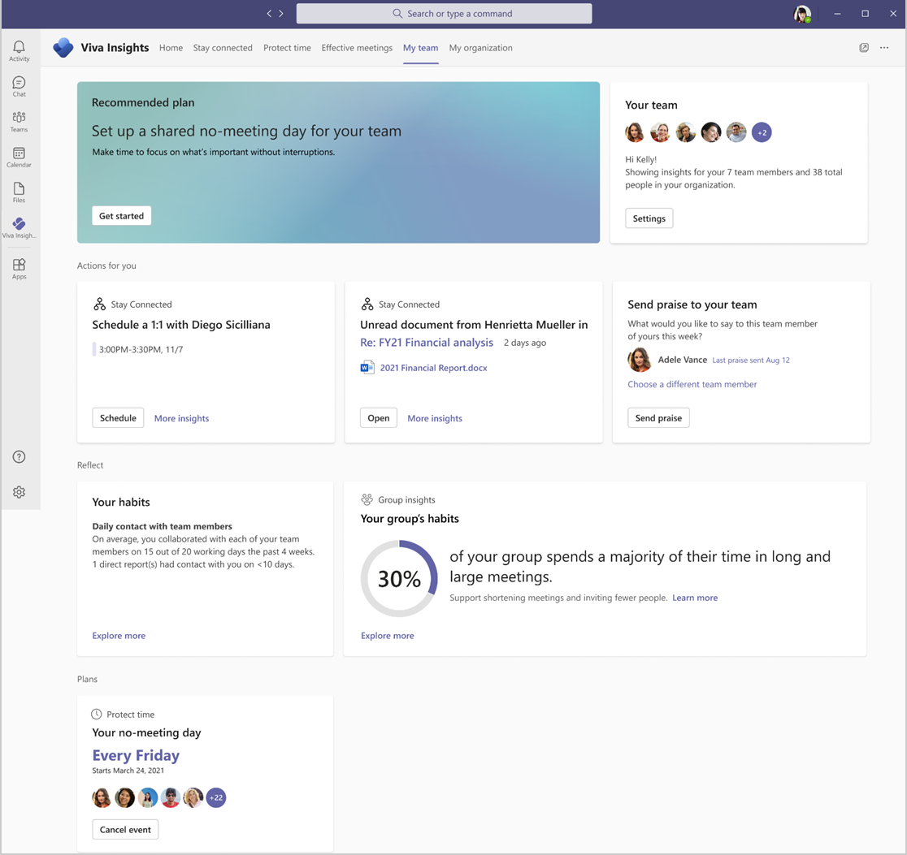
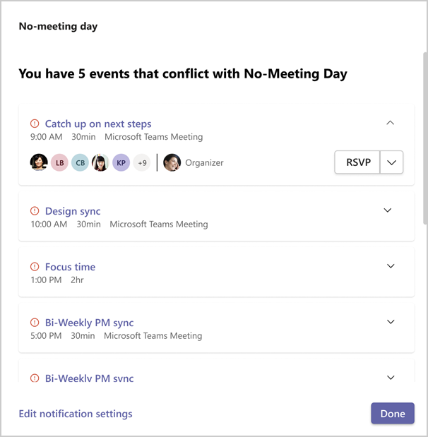

# My team insights

Microsoft Viva Insights shows team managers and leads insights about their teams’ work patterns. Get visibility into leading indicators of overall team experience, wellbeing, and productivity. You can then use these insights to understand current team norms and take action to create positive change.

**My team** within the Viva Insights app in Microsoft Teams is available for those with a Microsoft Viva Insights license. Viva Insights uses Azure Active Directory (AD) for your initial team, which you can then edit by selecting **Go to settings** in the **Your team** section.

## Data privacy

All of the information shown on this page is derived from a manager's personal Exchange Online mailbox. Managers do not see any incremental information from team members' mailboxes that would allow them to track team member activities. For example, a manager can use this page to see if they've sent an email to a team member after hours, but they cannot determine whether the team member opened the email.

When data is processed for team insights, Microsoft protects employee privacy and fully complies with local regulations, such as the General Data Protection Regulation (GDPR) the same as for personal insights. For information about data privacy and GDPR compliance in Viva Insights, see [Privacy guide](../personal/teams/viva-teams-app-privacy.md).  

## Install, pin, and configure the app

After your admin has completed the [Admin tasks](../setup/ml-insights-setup.md), the setup for **My team** is the same as for [Personal insights](../personal/teams/viva-teams-app.md) in the Viva Insights app. See the following to install, pin, and configure the app in Teams:

* [Install and pin the app](../personal/teams/viva-teams-app-install.md)
* [Configure the app](../personal/teams/viva-teams-app-settings.md)

## View My team

1. In the left navigation bar in Teams, select **Insights**.
2. In **Viva Insights Home**, you’ll see an insight about your team. To learn more about this insight, select **Explore more**. You can also use any of the other features on this page, such as **Reflect**, **Praise**, **Stay connected**, and **Protect time**. For more information, see [Viva Insights Home](/insights/viva-insights-home).
3. In Viva Insights, select **My team** to see key recommendations, actions, and reflections relating to your team.

## Manage your team

As a licensed Viva Insights user, you can create a team and view insights about them within the Viva Insights app. With the exception of [Group insights](#group-insights), the team insights you see are based on data that's processed from within your own mailbox for only you to see.

The first time you open **My team**, you are prompted to select or confirm your current team members. The initial list of team members you see is derived from Azure AD. After this initial setup, you can add and remove team members at any time by selecting **Go to settings** in the **Your team** section.

## Recommendations and actions

You'll see a rotating recommendation at the top of your **My team** page that's based on recent activity. You'll also see options to stay connected and send praise in the **Actions for you** section.

In **Reflect**, you might see one or more suggestions to improve your own personal habits as a team member. For example, if you select **Explore more** in [Your habits](#your-habits), you'll see more details about who you collaborated with. It might also suggest you reconnect with members who you haven't collaborated with lately.

You might also see suggestions for your team in the [Plans](#plans) section.

## Your habits

As a manager, you often have a hectic schedule, which makes it tough to stay in close contact with each team member. Viva Insights brings together all the information you need to stay caught up and respond quickly to important requests, such as the following.

* Act on tasks you promised to get done or that team members asked you to complete
* Review important emails and documents from team members that you haven’t read yet
* Schedule [1:1 time](#11-time) with your team members (or reschedule if a conflict comes up)
* View and consider changes for [quiet hours impact](#quiet-hours-impact) and [team meeting habits](#team-meeting-habits)

### 1:1 time

As a people manager, it's likely that one of your many responsibilities is coaching team members to help them build the skills they need for their role. One of the simplest coaching tools you have at your disposal is 1:1 time. [Research by Microsoft](https://insights.office.com/productivity/what-great-managers-do-daily/) has shown that people who get consistent 1:1 time with their manager are more engaged and view the manager's leadership more favorably.

#### How 1:1 time is calculated

Any meeting on your calendar that includes only you and your team member counts as a 1:1. If the calendar invitation also has a meeting room assigned, it still counts as a 1:1.

If you directly call your team member over Teams or Skype for Business outside of a scheduled 1:1 meeting, it does not count as 1:1 time.

### Quiet hours impact

[Research by Microsoft](https://insights.office.com/productivity/multitask-meetings-team-will/) has shown that when managers work after hours, team members take that as a signal that they need to be 'on' too; in one study, every hour that people managers spent after hours translated to 20 minutes of additional direct report time spent after hours. While some team members may actually prefer to do some of their work outside traditional 9-5 working hours, others may struggle to mentally disconnect and recharge for the next day if they receive a late-night message from their manager.

#### How quiet-hours impact is calculated

Quiet-hours impact is based on collaboration activity that you initiate with team members more than one hour outside of their working hours as configured in Outlook. This activity includes emails and chats you send as well as meetings and calls you hold. For example, if a team member's configured working hours are 9 AM to 5 PM and you arrange a meeting with them from 6 to 7 PM, this counts as quiet-hours impact.

For emails and chats, it is not necessary for the team member to have actually read or responded to the message you sent; the insight is simply intended to draw your awareness to activities that might have impacted team members after hours.

### Team meeting habits

Managers are role models when it comes to collaboration habits; team members tend to mimic their manager's behavior. [One study by Microsoft](https://insights.office.com/productivity/multitask-meetings-team-will/) found, for example, that managers who multitask in meetings (defined as reading or sending emails during a scheduled meeting) are more than two times as likely to have team members who also multitask in meetings.

#### How team meetings habits are calculated

A 'team meeting' is any scheduled meeting on your calendar that includes you and at least one of your team members (including 1:1 meetings). The 'habits' shown in this section are defined as follows:

* **<=1 hour** - Team meetings that you scheduled that were no longer than one hour.
* **No overlap with other meetings:** team meetings that you scheduled or were invited to that did not overlap with other meetings on your calendar.
* **Didn't multitask** - Team meetings that you scheduled or were invited to during which you did not read or send emails or chats.
* **RSVP'd** - Team meetings to which you were invited but did not explicitly accept (note that the denominator here excludes meetings that you declined).
* **Joined on time** - Online team meetings (over a Teams or Skype for Business link) that you scheduled or were invited to and joined within a few minutes of the scheduled start time.

## Group insights

Group insights are only available to qualifying managers who are assigned the manager role and meet the minimum-group requirements. See [Admin tasks](../setup/ml-insights-setup.md) for details.

As a qualified manager, the **Group insights** section in **My team** shows a top insight about your team based on collaboration data. You can select **Explore more** to see more in-depth data about your team's employee experience and effectiveness. See [Explore group insights](myteam-explore.md) for details.

## Plans

This section will also show suggestions for you to consider, such as scheduling a [no-meeting day for your team](#no-meeting-day-for-your-team).

### No-meeting day for your team

For **Schedule a no-meeting day for your team** in the **Plans** section, you can select **Get started** to create a plan that schedules a shared recurring time that everyone in your team can use to focus without interruptions. You can select the start date, frequency, and meeting title.

You're then prompted to confirm the team members to invite, an optional note for the email invitation, and then after you confirm the details, select **Send invitation**. Viva Insights will then invite your team to participate in the plan.

The day before a scheduled no-meeting day, your team members are prompted by Viva Insights to prepare for the no-meeting day by rescheduling or canceling any conflicting meetings:

They can select **Review schedule** within the notice to help with this task.

## Briefing emails and digests

As a team manager or lead, you'll also see additional information and suggestions in your Viva Insights monthly digest and Briefing emails about your team. For details, see [Viva Insights digest emails](../personal/Use/email-digests-3.md) and [Catch up with your team](../personal/Briefing/be-manager.md).

>[!Note]
>As you use the Viva Insights app, you can provide feedback about the app to Microsoft. To learn how, see **Q2** in [Manager and leader insights FAQ](my-team-faq.md).

## Related topics

* [Personal insights in Viva Insights](/insights/teams-app)
* [Viva Insights introduction](viva-insights-intro.md)
