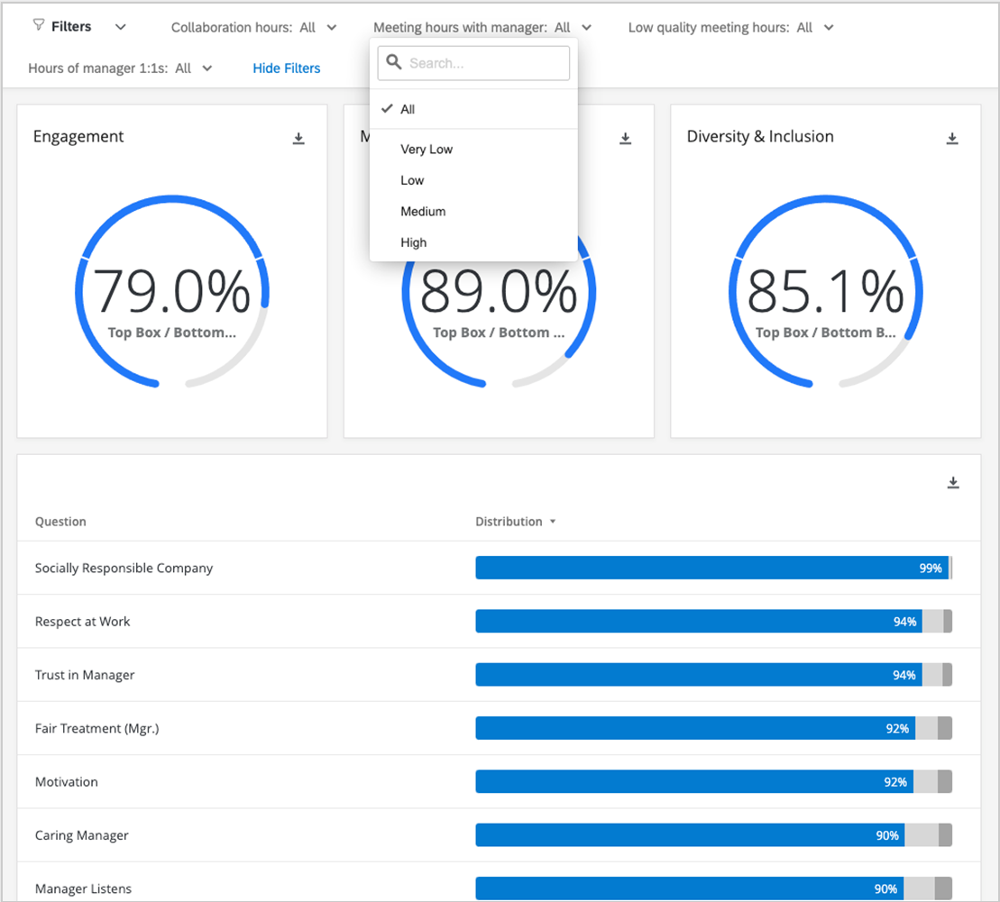

# Viva Insights and Qualtrics integration

*This experience is only available through private preview at this time*

The Microsoft Viva Insights and Qualtrics integration combines employee collaboration data from Viva Insights with employee engagement data in Qualtrics.

This integration enables you to combine Viva Insights query data and Qualtrics Employee Experience data. You can then identify behaviors and patterns behind key metrics, such as engagement, prioritization, manager effectiveness, and wellbeing.

For example, the following shows how you can configure the widgets on your dashboard in Qualtrics to include after-hours collaboration data from Viva Insights as breakouts. Your HR and leadership teams can see how after-hours work affects employee engagement and manager effectiveness. They can then use this analysis to take action.

Also, in Qualtrics, you can include Viva Insights metrics as filters at the top of the dashboard to filter the entire page:

## Setup steps

The following tasks are required to set up this integration.

1. Confirm or complete the [Prerequisites](#prerequisites)
2. [Upload appended HR data](#upload-hr-data)
3. [Set up a Viva Insights query](#query-setup)
4. [Upload the query data to Qualtrics](#upload-to-qualtrics)

## Prerequisites

Before using the Viva Insights Query Designer, you must confirm or complete the following prerequisites:

* Confirm that [Viva Insights in Workplace Analytics is set up](../setup/set-up-workplace-analytics.md) and ready to use.
* Confirm that your analysis population is assigned Viva Insights or Workplace Analytics licenses
* Confirm you have a Viva Insights or Workplace Analytics admin assigned to upload appended organizational (HR) data and a Viva Insights analyst assigned to set up the query data.
* Do the following for the Azure subscription that will host the exported query data:

  * Confirm you have either an **Azure Admin** or an **Azure Contributor** role for the Azure data store that'll store the query data.
  * Get [applicable Azure AD permissions](/azure/active-directory/develop/active-directory-how-applications-are-added) from your Microsoft 365 global admin for the analysts that will download the query data to that Azure data store.
  * If the Viva Insights team is downloading the query data, confirm that the vendor accounts are set up for the team.

## Upload HR data

Before your analysts can create a query in Viva Insights for use in Qualtrics, Viva Insights requires appended organizational data from Qualtrics.

1. The HR manager needs to prepare a new organizational data upload (.csv file in UTF-8 format) that maps an employee identifier, such as **EmployeeID**, that Qualtrics uses with the **PersonID**, which Viva Insights creates based on organizational (HR) data that's already been uploaded in Viva Insights, such as employees' primary SMTP address or email alias. See [Prepare organizational data](../setup/prepare-organizational-data.md) for more details about what's required in the upload.

   

2. Give the newly saved .csv file to the Viva Insights or Workplace Analytics admin. Who can then follow the steps in [Subsequent uploads](../setup/upload-organizational-data.md#file-upload) and select to **Append the existing organizational data** in **Step 7** and **Add attributes** in **Step 7** to add the new **EmployeeID** data into Viva Insights in Workplace Analytics.

## Query setup

After the upload is successfully processed in Viva Insights in Workplace Analytics, a Viva Insights or Workplace Analytics analyst can do the following to set up the query data.

As the analyst, you can use the Business Continuity template in Query Designer. Do the following to create the query.

1. As the analyst, you can use the Query Designer templates or create a custom person query for what's required by Workday for a specific use case.

   * See [Query designer](../tutorials/query-designer.md) for an overview the currently available templates and queries.
   * See [How-to-steps](../tutorials/customize-a-metric.md#how-to-steps) and [Person queries](../tutorials/person-queries.md) for details to create and customize a person query in the Query designer.
   * Be sure to select the [**Auto-refresh**](../tutorials/query-auto-refresh.md) option when creating the query.

2. You can then [view, download, and export the query results](view-download-and-export-query-results.md) to the Azure data store accessible by Workday.

## Upload to Qualtrics

Do the following to import the Viva Insights query data into Qualtrics.

1. Open the Business continuity .csv file that you downloaded in the exported file from MS Viva – and make sure it conforms to the following import format.  You will import your Viva metrics as person metadata.
Instead of including raw Viva data – you will likely want to manipulate Viva metrics into deciles, percentiles, or ranges (Very Low  Very High)
This data will be available for use as filters in dashboards or breakouts in Qualtrics widgets. 
PLEASE NOTE:  
You will be limited to 200 columns of metadata per upload
If you upload metrics after survey collection – please sync your metadata with your responses to allow the new metadata to appear in responses

