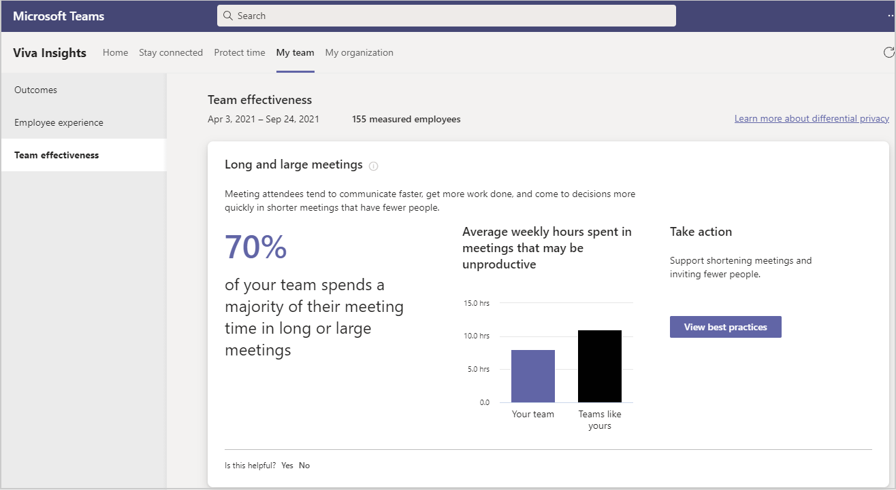

---

title: Team effectiveness in Viva Insights
description: Learn about your team's effectiveness in Microsoft Viva Insights
author: madehmer
ms.author: v-mideh
ms.topic: article
ms.localizationpriority: medium 
ms.prod: wpa
manager: scott.ruble
audience: Admin
---

# Team effectiveness

Microsoft Viva Insights has a **My team** page that shows manager's collaboration data about their team. The outcomes include data about **Team effectiveness**, which you can select in **My team** to see more details.

Nimble companies can more efficiently adapt to market changes and gain a true competitive advantage. The insights in this section show if your team has time to collaborate for rapid innovation, and to focus and produce higher quality work.

## Best practices

To see what actions are recommended, select **View best practices**.  For example, in **Team effectiveness**, select **View best practices** to see what’s recommended for **Long and large meetings**.

## About the insights

You can see more details about the insights by selecting the **Information** (i) icon next to the insight. The following describes how your team metrics are calculated to support these behavioral insights. With **Teams like yours**, you get comparable data from within your organization for context into broader organizational patterns. Today, "Team like yours" data is calculated as averages from peer manager teams. If you have only one peer team or no peer team, the company average is shown instead.

|Insight |Team metric description |Metric average for your team and "teams like yours" |
|--------------------------|-------------------|-----------------|
|Long and large meetings |The number of employees that spend over 30 percent of their total meeting time in long or large meetings, divided by the total number of measured employees. Long meetings are those scheduled for more than an hour. Large meetings are those that involve more than eight people. |Average number of meeting hours spent by the team. |
|Focus time |The number of employees who have less than 20 hours each of available time for focused work, divided by the total number of measured employees. Focus time is when employees have two or more consecutive hours with no meetings. |Average number of total hours |
|Collaboration across silos |Cross-organization collaboration is the number of hours employees spend in meetings and email with at least one person outside of their own department. This insight highlights the organizations that spend more than 50 percent of their overall collaboration within their group. |Average number of hours the team spent collaborating with people outside their department. |
|Instant message use |One-on-one communication is the combination of email and instant messages (IMs) sent between two employees. This insight highlights the employees that spend less than 20 percent of their one-on-one communication over Teams IM. This is calculated as the percentage of one-on-one IMs sent, divided by the total number of one-on-one IMs and emails sent. |Average number of emails sent between only two employees. |
|Cross-team manager connections |Manager cross-team connections are the number of departments outside your own that you had meaningful interactions with in the last 28 days. A meaningful interaction is defined as an email or meeting that includes two to five people. |An average number of meaningful connections the managers have outside their team. |
