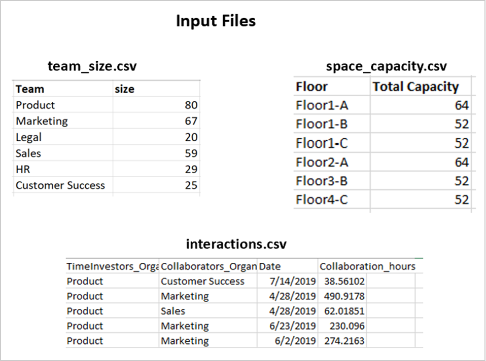
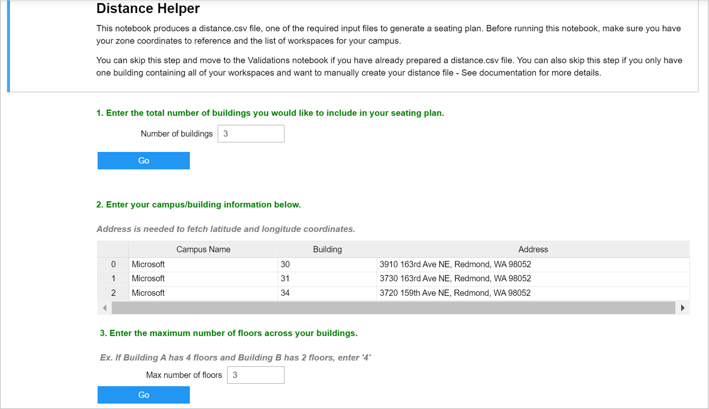
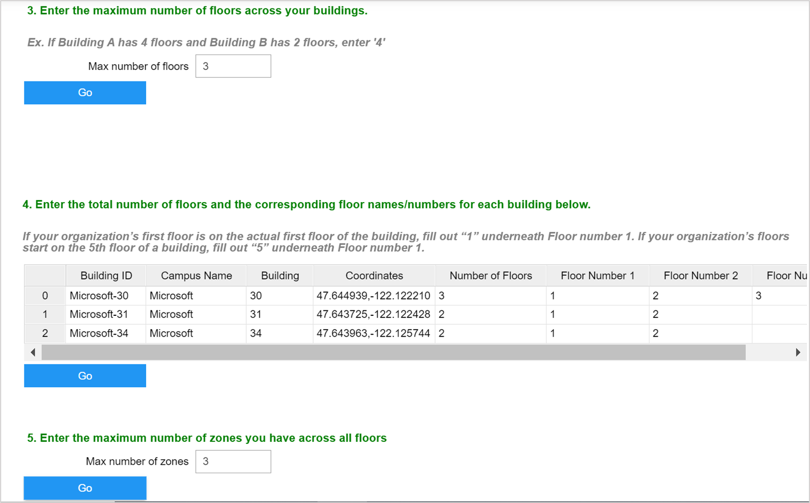
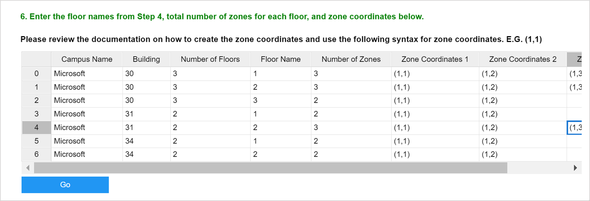
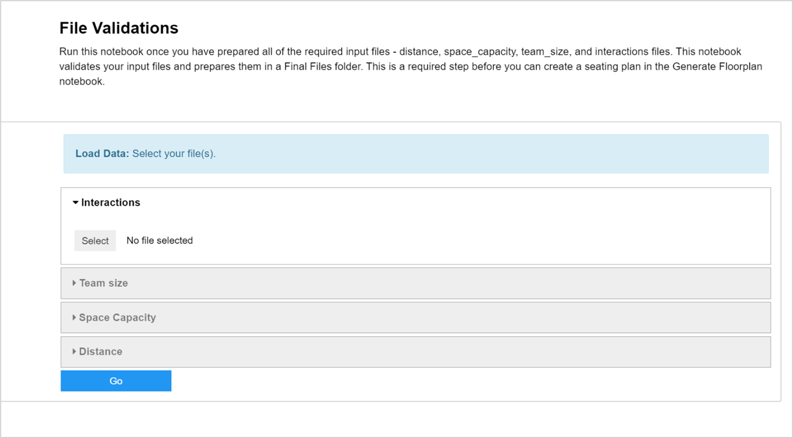
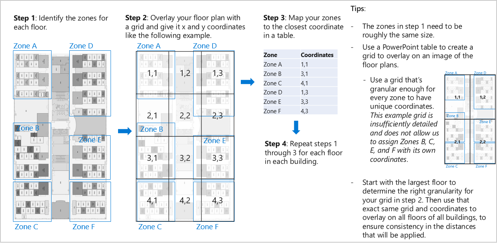

# Workspace Collaboration Optimizer

As a facility management professional or occupancy planner,  you can use the Workspace Collaboration Optimizer to plan a workspace. If your company is moving to a new worksite or reorganizing an existing workspace, this open-source tool can help, as follows:

* Increase innovation and collaboration by locating employees next to people who collaborate the most.
* Take the subjectivity and politics out of occupancy plans.
* Increase employee productivity by reducing the time spent travelling between meetings.

The Workspace Collaboration Optimizer is an open-sourced set of Python-based web apps (Jupyter Notebooks) that can help with seating plans that are optimized for innovation and cross-team collaboration. The underlying algorithm minimizes the distance between teams who collaborate the most with each other. You can use this tool to generate seating plans quickly and objectively, in a data-driven way.

The algorithm for this tool accounts for the following rules and constraints:

* **Teams stay together** - When a workspace can seat everyone on the team, it will keep them all together.
* **Teams who collaborate the most sit together** - Based on the collaboration patterns and the distances between spaces, if team A spends most of its time with team B, the two teams are assigned workspaces that are as close together as possible.
* **The most central team is in the most central workspace** - As lower priority than the previous two, the tool can help you determine which seating plans are better than others for seating specific teams in central locations.
* **Everyone gets a seat** - All team members get an assigned seat in a workspace.
* **People and seat assignments must match** - No workspace is assigned more people than it has seats for, and no workspace can have a negative number of people assigned to seats.

You can create seating plans that require different variables, such as the following:

* Co-locate teams who collaborate the most with each other within the same multi-floored building that has multiple zones or neighborhoods.
* Factor in seating constraints for specific teams. For example, the HR team must be located together on the first floor in the same neighborhood and Zone A must be next to the file room.
* Incorporate seat sharing ratios to account shared workspaces in your seating plans.
* Use the algorithm to create alternating or rotating work shift schedules for teams who share a workspace on different weeks or days.

## Prerequisites

Before you can use the tool, confirm with your IT admin that you can install and set up the following required apps, which are the required prerequisites for using this tool.

* **Anaconda** - Use to install and manage the following required versions of Python and Jupyter Notebook. See [Anaconda](https://www.anaconda.com/products/individual#windows) to install it. During the installation, select to **Register Anaconda as your default for Python**.
* **Python** - Latest available or version 3.3 or later is installed and you have some knowledge on how to use it.
* **Jupyter Notebook** - This open-source application is installed and you have some knowledge on how to use it because it is required to run the Workspace Collaboration Optimizer.
* **Workplace Analytics** - Have [the app set up](../setup/set-up-workplace-analytics.md) with an analyst role to create the query data for the interaction file.

## Input files

You need the following four input files (.csv) to generate a seating plan. These files define the relevant information for your workspace project, such as team sizes, workspace capacities, and the relative distances between workspaces. The tool uses these to generate seating plans with recommended seating for each team based on their collaboration patterns from the interaction file.

* [team size.csv](../azure-templates/space-planning.md#create-a-team-size-file) - Defines the number of employees in each team in your organization.
* [space capacity.csv](../azure-templates/space-planning.md#create-a-space-capacity-file) - Defines the workspaces, which can be a combination of buildings, floors, and zones or neighborhoods, and the maximum seat capacities for each.
* [interaction.csv](../azure-templates/space-planning.md#create-an-interaction-file) - This is a Workplace Analytics group-to-group query that shows collaboration patterns across the different teams. A Workplace Analytics analyst needs to run the group-to-group query in Workplace Analytics. For detailed steps, see [Create an Interaction file](../azure-templates/space-planning.md#create-an-interaction-file). Make sure the team names used in this file are aligned with the names used in the team_size.csv file.
* [distance.csv](../azure-templates/space-planning.md#create-a-distance-file) – defines the relative distances between the workspaces specified in the space_capacity file. You can either create a distance file yourself based on the estimated walking distance between zones, floors, and buildings, in a unit you specify (such as estimated minutes or meters). For detailed steps, see [Create a Distance file](../azure-templates/space-planning.md#create-a-distance-file). Alternatively, you can use the tool to help create the distance file for you using a coordinate system. For details, see [Create a seating plan](#create-a-seating-plan).

The tool uses the data in these input files to generate a seating plan in table format, where the rows represent the teams, and the columns represent the workspaces where teams are seated.

## Tool files

Before you can run the tool, you must save the following files, which are located in the [Workspace Collaboration Optimizer repository](https://github.com/microsoft/workspace-optimizer), to a **master folder**. If you’re new to GitHub, you’ll need to register and sign in before you can access this repository. See [GitHub Getting started](https://docs.github.com/github/getting-started-with-github) for details. You'll use this master folder to create a working folder for each workspace project.

* **Distance Helper notebook** - Creates a distance file that specifies the relative distance between zones or neighborhoods on different floors (and potentially different buildings) based on the coordinates of the different workspaces. You won’t need this file if you’ve already created a distance file.
* **File Validations notebook** - Validates the input files, including the distance file that's created from the Distance Helper notebook.
* **Generate Floorplan notebook** - Creates a seating plan from the validated input files and runs the algorithm again on the edited seating plans.
* **Requirements text file** - Includes the list of Python packages needed to run the notebooks.

## Create a seating plan

Do the following to create a seating plan:

1. [Prepare the input files](#prepare-the-input-files)
2. [Create a distance file](#create-a-distance-file) - The distance.csv file defines the relative distances between the workspaces that are specified in the space_capacity.csv file.
3. [Validate the input files](#validate-the-input-files) - Run the notebook to check if all input files are complete and formatted correctly. This notebook will also automatically format the interactions.csv input file.
4. [Generate a seating plan](#generate-a-seating-plan) - Run the notebook that creates the seating plan or to run the algorithm again for an existing seating plan with unassigned teams. See [Seating plan example](#seating-plan-example) for a sample plan.

### Prepare the input files

1. Determine the number of buildings, building floors, and zones for each floor that are in-scope for your workspace seating plan.

   A zone is a flexible definition. It can be a floor in a building or a specific section of a floor in a building, which is also known as a neighborhood or a collection of cubicles, desks, or workspace seats. Defining zones enables the tool to plan a workspace that is based on your buildings’ unique configuration and seating plans. If you don’t have predefined zones for each floor, you can define how one or more floors in a building can be divided into smaller zones. Think of these zones as “neighborhoods” where your teams will sit within the workspace. The zones must be roughly of equal size as compared to your teams. The more detailed the scope of the zones, the more specific your seating plan can be. However, if you make the zones too small (with too few seats to accommodate a full team), the teams will be divided into multiple zones.

2. After you have the building, floor, and zone numbers and definitions ready, you can then prepare the [Input files](#input-files). The names of the files must be spelled exactly the same as listed in the previous section and saved to a master folder.
3. Copy the prepared [Input files](#input-files) and the required [Tool files](#tool-files) into a working folder to plan the workspace.
4. Open the Anaconda navigator application with a [Google Chrome browser](https://www.google.com/chrome/), which is required by Jupyter.

### Create a distance file

>[!Note]
>If you’ve already created a distance file, you can skip to [Validate the input files](#validate-the-input-files).

1. In Anaconda, launch Jupyter Notebook, and then locate and open the **Distance Helper notebook** in the master folder.
2. In the **Distance Helper notebook**, select **Run** at the top, which will take a few minutes to load the files the first time you run it.
3. When prompted, enter the total number of buildings you have, and then select **Go**. If the restack scope only includes one building, enter **1**.

   

4. Enter the building information in the table, including the name, number, and complete address of each building. The tool needs the full address for accurate latitude and longitude coordinates. You can use [Bing maps](https://www.bing.com/maps) to get the addresses.
5. In **step 3**, enter the maximum number of floors for the buildings included in the overall workspace have, and then select **Go**. For example, if two of the buildings have two floors and one has three floors in the overall workspace, you'd enter **3** as the maximum number of floors.
6. In **step 4**, enter the numbers and the names of the floors that the workspace includes for each building. For example, if the company’s workspace starts on the first floor, enter **1** for **Floor Number 1**. If the company’s workspace starts on the fifth floor of a building, enter **5** for **Floor Number 1**.
7. In **step 5**, enter the maximum number of zones that you'll need to define for any of the floors in any of the individual buildings. For example, the following shows entering **6** as the maximum number of zones required for a floor in one of the buildings.

    

8. In **step 6**, enter the floor names, number of zones, and corresponding zone coordinates for each building, which you defined in **step 3**, and then select **Go**. For example, the following shows Floor 1 with 6 zones in building 32 that require zone coordinates of (1,1), (3,1), (4,1), and so on. For tips on how to create the coordinates, see [Create the zone coordinates](#create-the-zone-coordinates).

    

9. In **step 7**, enter each floor's zone coordinates and a friendly space name that defines the building's floor number and zone in the table. The following example shows a zone coordinate of **4,3** with a friendly space name of **16-1D**, which represents zone D on the first floor of building 16.

    

    >[!Important]
    >The friendly space names must match the floor names that you entered in the space_capacity.csv file.

10. Select **Go**, which saves a new distance.csv file with all your inputs in your working folder.

### Validate the input files

1. Select **Open Validations UI Notebook**.
2. In the **File Validations notebook**, select **Run** to validate the files that will be used to generate the seating plans.
3. When prompted to load the data, select the location for each of the files, as shown in the following graphic, and then select **Go** to validate them.

    

4. After validation, you'll see a green check mark for each file that passed and a red X for any that failed validation. For a **red X**, you can select **Show details** to troubleshoot why the file failed. After you have fixed any issues, repeat the previous steps to validate the updated files.
5. After all files are successfully validated, select one of the following input scenarios that the tool should use to aggregate the final output for your interaction file. These scenarios are based on the interactions file query data.

    * **Total collaboration** - Aggregates collaboration data based on the total number of hours the teams spent collaborating over the period of time specified in Workplace Analytics. Use this as the default aggregation option.
    * **Boost intra-collaboration** - Aggregates collaboration data based on the "boosted" number of collaboration hours spent with two specific teams. You can change the **Boost Multiplier** setting that defines how to apply the boost. The maximum setting is 3, which will multiple the maximum number of collaboration hours by 3. This multiplied value replaces the existing collaboration hours for all the teams. Use this option if _Collaboration within groups_ is low, but you want to keep the teams together as much as possible in your final seating plan.
    * **Latest date** - Aggregates collaboration data based on the most recent week of collaboration activity between teams.
    * **Average collaboration** - Aggregates collaboration data based on the weekly averages of collaboration hours spent between the different teams.

6. The updated files are saved to a new **Final Files set** folder. Any changes relating to these files are also saved to this folder.

   >[!Note]
   >The interaction file saved to the Final Files set folder is not a copy of the original interaction file. It is a newly optimized interaction file that aggregates the collaboration hours between teams based on the scenario selected in the previous steps.

### Generate a seating plan

1. Open the **Generate Floorplan notebook**, and then select **Run**.
2. Select **Standard** to get started. After you create a standard seating plan, do one of the following.

    * **Standard** - Select to create a new seating plan that's based on the validated files in the **Final Files set** folder. In **New results name**, enter a file name for it, and select **Go**.
    * **Fixed spaces** - This option is available after creating a seating plan using Standard mode. If you want to make specific changes to your Standard seating plan, such as seating a team in a specific workspace or seating two teams together, this Fixed spaces mode allows you to run the algorithm again on the edited seating plan for any unassigned teams. For this option, do the following:

      1. Edit the seating plan's existing .xlsx file that was saved in **app_results**. After editing it, you must save the seating plan as a .csv file. When editing the plan, you must stay within the constraints set in the validated *space_capacity.csv* and *team_size.csv* files. You must also leave some teams unassigned for the algorithm to correctly assign seats within the set constraints.
      2. After you save the new changes to a seating plan file, select **Fixed**, and then select the updated seating plan file. For example, the following graphic shows sample input files and a seating plan where **Engineering** and **Marketing** are assigned to multiple locations.

         

         In the following example, the seat assignments have been changed (fixed) to keep the **Engineering** and **Marketing** teams closer together. You must account for the capacity of the workspaces. For example, if workspace B31-Floor2 has a capacity of 100, then you can’t place 150 people in that workspace. Note the **Product** team is unassigned, so the fixed seating plan will keep the Marketing and Engineering team seat assignments unchanged and the Product team will be assigned to any unoccupied spaces based on the original input files in the Final Files set folder.

         

3. In the **app_results** folder, open the latest seating plan to see the seat assignments. In this example, after running Fixed spaces, the Product team will be seated in the available workspaces and the Engineering and Marketing teams will stay _fixed_ according to the previous changes.

### Seating plan example

When you open a seating plan file, you’ll see teams assigned to zones or neighborhoods, which should match up to the team and zone names assigned in the space_capacity.csv and team_size.csv files.

The following shows an example seating plan where the Product team has 64 people assigned to Floor 1, Zone A and 16 people assigned to Floor 1, Zone B.

## Create the zone coordinates

You can use Microsoft PowerPoint or a similar tool to define the zone coordinates. Do the following to define the zone coordinates for each workspace (floor zone):

1. Identify the zones for each floor.
2. Create a table or grid to overlay on the image of your seating plan. Use a grid that’s detailed enough for every zone to have unique coordinates.
3. Overlay x and y coordinates for each zone. For example, if Zone A is located at (0,0) and Zone B is located at (0, 1), then Zone B is one zone away from Zone A. Whereas Zone C at (0, 2) is two zones away from Zone A. This coordinate system is flexible enough to match your unique workspace and ensures that the distance matrix is formatted correctly.
4. Map all the zones and coordinates in a table. These coordinates are required in the Distance helper notebook. The following shows an example of defining zone coordinates for a workspace floor.

   If you have zones that are larger than other zones, you can adjust the value of the coordinate systems to account for different sizes of zones. For example, if Zone A is twice the size of Zones B, C and D, then the coordinates could be represented as A: (0,0), B: (0,2), C: (0,3), D: (0,4).

   

## Tips

* The best way to validate the output is to compare the collaboration levels in the collaboration file to the team seat assignment in the seating plan.
* The optimization of the seating plan might create a less than optimal plan because of the non-convexity of the constraints.
* Multiple, equally plausible seating plans can satisfy the same requirements, particularly when the collaboration between all the teams is very similar.
* The algorithm cannot interpret context (politics, hierarchy, or intentions) that a person could when allocating a workspace.
* When the algorithm creates a seating plan that is not optimal, be sure to use the **Fixed spaces** mode to improve the model predictions.

## FAQ

#### Q1. What to do when a Jupyter notebook doesn’t load when opened?

A1. Confirm you are using a [Chrome browser](https://www.google.com/chrome/). Then try restarting the browser by selecting **Kernel** > **Restart and Clear Output**. Or you can select **Run** if the UI is not loading automatically.

#### Q2. Can the values in the Distance Helper notebook be copy and pasted?

A2. Yes, you can use **Ctrl+C** and **Ctrl+V** to copy and paste the values in this notebook in their respective cells. At this moment, you cannot copy and paste multiple values.

#### Q3. What does the error about missing packages mean?

A3. Sometimes the tool doesn't install the following required packages through Anaconda. Confirm these packages are installed.

* **Required packages** - ipython, ipywidgets, scipy, pandas, numpy, ipywidgets, ipyfilechooser, pulp, ipysheet, and geopy
* If one or more of these packages are missing, install them through Anaconda. See [Installing conda packages](https://docs.anaconda.com/anaconda/user-guide/tasks/install-packages/) for installation instructions.

#### Q4. What does the X error represent?

A4. Check the following, which might be causing the error.

* **Distance Helper notebook** - Confirm that the addresses and the zone coordinates are entered correctly.
* **File Validations notebook** - Confirm the input files have the correct headings and match the values in the other files. For example, the team names in the team_size.csv should match the team names in the interactions.csv and the workspace names should be the same in the distance file and the space_capacity file. Also, check the Input Files section to confirm that the Requirements.txt file has the correct names for all the required files.
* **Generate Floorplan notebook** - Confirm that all the required validated files are in your **Final Files** folder.

## Related topics

* [Workspace Collaboration Optimizer Readme](https://github.com/microsoft/workspace-optimizer/blob/main/README.md)
* [Set up Workplace Analytics](../setup/set-up-workplace-analytics.md)
