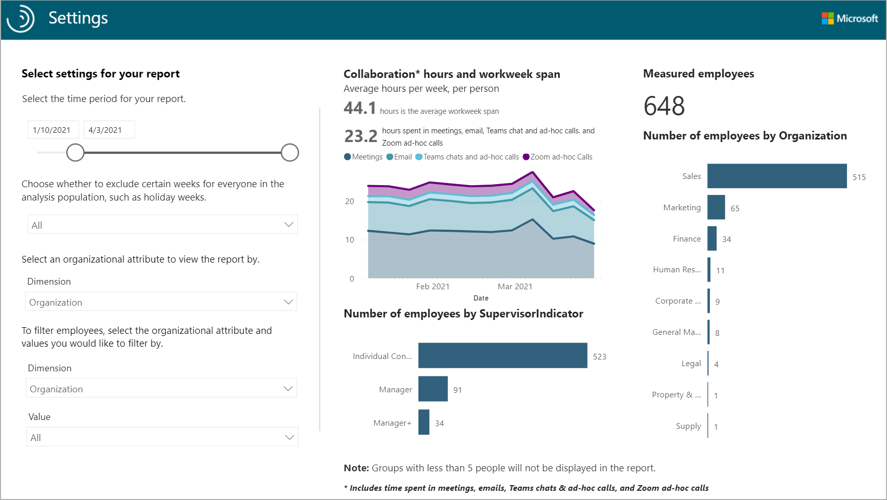
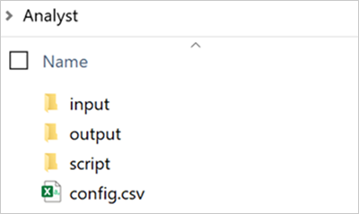
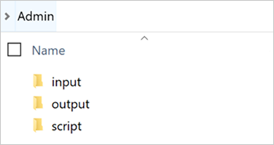
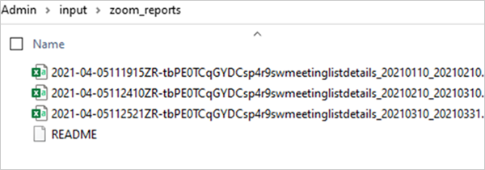

---

title: Viva Insights Zoom integration
description: Learn how to use the Viva Insights Zoom integration for including Zoom data in collaboration analysis
author: madehmer
ms.author: helayne
ms.topic: article
ms.localizationpriority: medium 
ms.collection: viva-insights-advanced
ms.service: viva 
ms.subservice: viva-insights 
search.appverid: 
- MET150 
manager: scott.ruble
audience: Admin
---

# Zoom integration

The Zoom integration adds meaningful collaboration metrics from Zoom meeting reports that complement existing metrics used in Viva Insights. This integration works with R for Windows and will be included in the existing [wpa R package](/viva/insights/tutorials/wpa-r-package?toc=/viva/insights/use/toc.json&bc=/viva/insights/breadcrumb/toc.json), which is an open-source repository of more than 100 functions that provide pre-built analyses.

This integration tool enables you to analyze unscheduled collaboration that occurs in Zoom. As an analyst, you can download the Zoom collaboration metrics either as a standalone .csv file or as a Ways of working assessment input file. You can then use the Zoom integration version of the [Ways of working assessment template](/viva/insights/tutorials/power-bi-collab-assess?toc=/viva/insights/use/toc.json&bc=/viva/insights/breadcrumb/toc.json) to analyze a combination of Zoom and Microsoft 365 collaboration data in Power BI.

This analysis helps leaders and analysts get a richer, more complete picture of collaboration patterns within their organization. See [Zoom metrics](#zoom-metrics) for a complete list of the type of metrics used for analysis of Zoom collaboration activity.

## Ways of working assessment demo

The following shows what you might see in Power BI when you combine Viva Insights and Zoom data for analysis in Power BI. This demo uses sample data that is only representative of the dashboard and might not be exactly what you see in a live dashboard specific to your organization's unique data.

<iframe width="800" height="486" src=https://msit.powerbi.com/view?r=eyJrIjoiNjRjOTI0ZjMtY2JmYS00NDY2LTk0MmMtMmU4MDlkZDEwOGYzIiwidCI6IjcyZjk4OGJmLTg2ZjEtNDFhZi05MWFiLTJkN2NkMDExZGI0NyIsImMiOjV9&embedImagePlaceholder=true frameborder="0" allowFullScreen="true"></iframe>

## Setup demos

This self-serve, open-source toolkit requires a one-time installation of the R package by your Zoom admin and Viva Insights analyst.

Also, your admins must de-identify the Zoom reports, with a key mapping file, that's uploaded to Viva Insights as organizational data.

Subsequent runs will be faster after the initial setup of the mapping key file. The following admin and analyst demos show how quickly you can prepare the Zoom data for integrating and analyzing in Viva Insights and Power BI.  

#### Zoom admin setup demo

#### Zoom analyst setup demo

## Prerequisites

The following is required before setting up the Zoom integration tool:

* Viva Insights licenses for your analysis population.
* Zoom Business, Education, or API plans and have access to the Zoom admin portal.
* Zoom admin and Viva Insights analyst must have permission to install R and other associated packages.
* Have the latest version of Power BI Desktop installed. If you have an earlier version of Power BI installed, uninstall it before installing the new version. Then go to [Get Power BI Desktop](https://www.microsoft.com/p/power-bi-desktop/9ntxr16hnw1t?activetab=pivot:overviewtab) to download and install the latest version.

## Setup and configuration

1. **Install R for Windows** - Ask your Zoom admin and Viva Insights analyst to install [R for Windows](https://cloud.r-project.org/bin/windows/). If necessary, ask IT for permissions to install R for Windows.
2. **Download the Zoom analyst integration** - Ask your Viva Insights analyst to download the [Zoom analyst integration package](https://github.com/microsoft/vivainsights_zoom_int) and extract it to a local folder, which uses the following folder structure.

   

3. **Download the Zoom admin integration** - Ask your Zoom admin to download the [Zoom admin integration package](https://github.com/microsoft/vivainsights_zoom_int) and extract it to a local folder, which has the following folder structure.

   

4. **Prepare a mapping file** - The Zoom report data that's downloaded from the Zoom admin portal will include identifiable data about employees (email IDs). Before the metrics can be computed and shared with a Viva Insights analyst, the information must be de-identified.

   1. The Zoom admin must replace each **email ID** with a **unique random ID** that's specified by the Viva Insights or Viva Insights admin.
   2. Then the admin must create a mapping file that maps a unique random ID (**HashID**) to each email address (**PersonID**) for each of the licensed employees in the company who are included in the analysis. Save this mapping file as a .csv file with the following headers and share it with the Zoom admin for de-identification.

      

   >[!Important]
   >You must save the mapping file as a .csv (not as an .xls or .xlsx file) with "mapping file" included in the file name.

5. **Append to the existing organizational data** - Your Viva Insights or Viva Insights admin must upload the .csv mapping file with the **HashID** as an additional column named **PersonHashID** that appends the existing organizational data that's already uploaded in the advanced insights app. For detailed instructions, see [Subsequent organizational data uploads](/viva/insights/setup/upload-organizational-data2?toc=/viva/insights/use/toc.json&bc=/viva/insights/breadcrumb/toc.json).

   >[!Important]
   >The Zoom meeting data includes identifiable data (email IDs) that must be de-identified before using it to create Viva Insights Person query data. Your admins must protect any identifiable data and only use de-identified Zoom data for analysis purposes.

6. **Download the Zoom reports** - Your Zoom admin needs to do the following:

   1. Sign in and go to **Admin** > **Account Management** > **Reports** > **Usage Reports** > **Active Hosts**.
   2. Set the scoped **From** and **To Dates**.
   3. Select **Meetings** > **Generate details report**. If you need more than one month of data, repeat these steps for prior months. Each report takes 1 to 2 hours to download.
   4. Save the downloaded reports in your **Zoom integration**/**Admin**/**input**/**zoom_reports** folder.

   

   5. Save the mapping file from your Viva Insights or Viva Insights admin in your **Zoom integration**/**Admin**/**input** folder.

7. **Run and download the Viva Insights data** - Your Viva Insights analyst needs to do the following:

   1. Follow the steps in [Ways of working assessment](/viva/insights/tutorials/power-bi-collab-assess?toc=/viva/insights/use/toc.json&bc=/viva/insights/breadcrumb/toc.json) and [Standard meeting query](/viva/insights/tutorials/query-basics?toc=/viva/insights/use/toc.json&bc=/viva/insights/breadcrumb/toc.json#query-templates) to create the applicable query data. When running the results, use the same date range as the Zoom data that was uploaded in **Step 5** and include the **TimeZone** and **PersonHashID** organizational data attributes.

      
      

   2. Download the query results (.csv) to the **Zoom integration**/**Analyst**/**input** folder.

8. **Prepare the Zoom file** - Your Zoom admin needs to do the following:

   1. Confirm that the input folder has the relevant **Zoom reports** from **Step 5** and the **mapping file** from **Step 4**.
   2. In the **Zoom integration** folder, double-click **AdminActions.bat** to run it. If prompted to select a program to open the .bat file, ignore and close the prompt, and continue running the file.
   3. When prompted, select **Rscript.exe** for the required script.
   4. Typically, the script file is located in the **C:/Program Files/R/R-4x-x/bin** folder. To find the file:

      * In Windows search, enter **RGUI.exe** to open the R graphical user interface, and then enter **file.path(R.home(), "bin", "Rscript.exe")**
      * Or in a Windows command prompt, enter **PowerShell** to open PowerShell. And then enter **get-childitem -Recurse -Name rscript.exe -path C:\ | select -First 1**

        >[!Note]
        >If R is installed on a custom drive, such as D:\ or E:\, replace C:\ with the applicable drive letter. For subsequent file prep, File Explorer will automatically open the right folder.

    5. Ignore the warnings during processing, and then when prompted, press any key to continue and exit.
    6. During this process, the Zoom reports are de-identified by using the hash key from the mapping file, and then joined into one combined file, which is saved in the **Admin**/**output** folder. Give the new Zoom output file to your Viva Insights analyst.

       >[!Note]
       >The first time you run the AdminActions.bat file might take longer than subsequent runs because of installation dependencies.

9. **Upload the Zoom output data** - As the Viva Insights analyst, save the Zoom output file to the **Zoom integration**/**Analyst**/**input** folder. Confirm that the Input folder also has the Ways of Working Assessment query, Standard meeting query, and the UTC_offset.rds file.
10. **Update the config file** -  If the Viva Insights analyst and Zoom admin are based in different time zones, then the analyst needs to update the **config.csv** file with the applicable **utc_offset**. If the **Ways of Working Assessment** results includes a column name that’s different than **HashID**, you must update the config.csv with the different column name that’s used in the data output.

11. In the **Script** folder, double-click **AnalystActions.bat** to run it. When prompted, point it to **Rscript.exe**, which is usually in **C:/Program Files/R/R-4x-x/bin**.
12. Confirm the **Output** folder includes a new .csv file for the Zoom collaboration metrics and a new .csv for the Zoom version of the Ways of working assessment query that you use with the new Zoom version of the Ways of working assessment dashboard in Power BI.

    >[!Note]
    >The first time you run the AnalystActions.bat file might take longer than subsequent runs because of the initial installation dependencies.

## Import and analyze in Power BI

Your Viva Insights analyst needs to do the following to import the combined collaboration data into Power BI. After the import, you can analyze a combination of Zoom and Viva Insights collaboration metrics in the Ways of working assessment dashboard in Power BI.

1. In the **Analyst**/**output** folder, double-click **WOW_Zoom_Integration.pbit** to run the template.

   

2. When prompted by Power BI, copy and paste the file path for the **Zoom Transformed Person Query** and **Standard meeting query** in the **Analyst/output** folder. To copy it, right-click the file, select **Properties** > **Security**, and then select and copy the file path for the **Object's name**.
3. Where prompted, copy and use the **SupervisorIndicator** column name from the **Zoom Transformed Person Query** file.

## Zoom metrics

This integration uses the following Zoom metrics for collaboration analysis.

**Core metrics**

* Zoom Unscheduled call hours
* Zoom Scheduled call hours
* Zoom Total call hours
* Zoom Meetings
* Zoom Unscheduled Meetings
* Zoom Scheduled Meetings
* Zoom After hours in unscheduled calls
* Zoom After hours in scheduled calls

**Supplementary metrics**

* Zoom Unscheduled call hours 30 minutes or less
* Zoom Unscheduled call hours 31 to 59 minutes
* Zoom Unscheduled call hours 1 hour
* Zoom Unscheduled call hours 1 to 2 hours
* Zoom Unscheduled call hours more than 2 hours
* Zoom Unscheduled call hours 2 attendees
* Zoom Unscheduled call hours 3 to 8 attendees
* Zoom Unscheduled call hours 9 to 18 attendees
* Zoom Unscheduled call hours 19 or more attendees

## Related topics

* [wpa R package](/viva/insights/tutorials/wpa-r-package?toc=/viva/insights/use/toc.json&bc=/viva/insights/breadcrumb/toc.json)
* [Ways of working assessment](/viva/insights/tutorials/power-bi-collab-assess?toc=/viva/insights/use/toc.json&bc=/viva/insights/breadcrumb/toc.json)
