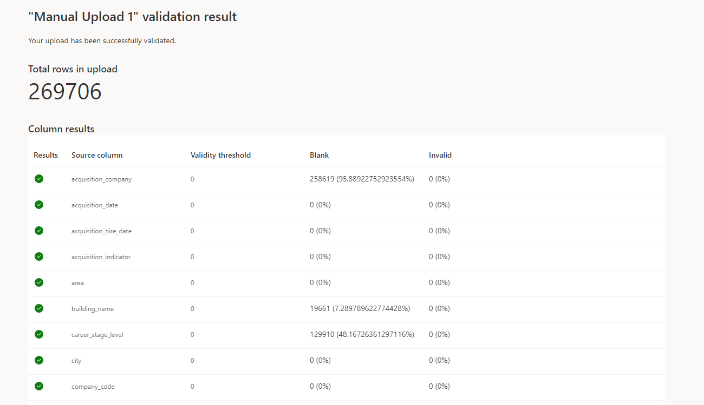
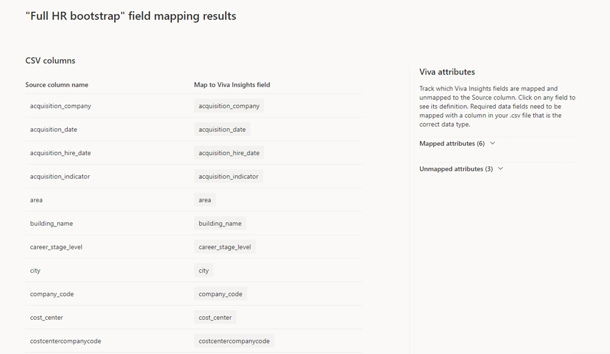

# Import organizational data (first import)

Your organizational data can appear in the Microsoft Viva Insights’ advanced insights app in one of four ways: through Azure Active Directory, which is the default source; through a .csv file that you as an Insights Administrator upload; through an automated data import that you, your source system admin, and your Microsoft 365 IT admin set up; or through a connection between Workday and Viva Insights.

This article talks about the third option: importing data. To import data from a source system, you'll need to coordinate a few tasks between your Microsoft 365 IT admin and your data source admin, including registering a new app and getting a security certificate. Refer to the next section, [Workflow](#workflow), for an overview of required steps.

>[!Important]
>Only use the following steps if this is the first time you’re importing organizational data. If this isn’t your first import, refer to [Import organizational data (subsequent imports)](import-org-data-subsequent.md) to refresh previously imported data.

## Workflow

1. Setup:
    1. The data source admin [generates a security certificate](#generate-the-security-certificate) and provides it to the Microsoft 365 IT admin.
    1. The Microsoft 365 IT admin [registers a new app in Azure](#register-a-new-app-in-azure).
    1. The Insights Administrator [sets up the automated import](#set-up-the-import-in-viva-insights).
    1. The data source admin pushes data to Viva Insights.
1. Validation: Viva Insights validates your data. (If validation isn’t successful, you can choose from a few options described in [Validation fails](#validation-fails).)
1. Processing: Viva Insights processes your data. (If processing isn’t successful, you can choose from a few options described in [Processing fails](#processing-fails).)

After the data successfully validates and processes, the overall data-import task is complete.

:::image type="content" source="../images/org-data-import.png" alt-text="org data import flowchart" lightbox="../images/org-data-import.png":::

## Setup

### Generate the security certificate

*Applies to: data source admin*

To start getting data from the source system into Viva Insights, the Microsoft 365 admin needs to create and register an app in Azure. As the data source admin, you’ll need to help the Microsoft 365 admin register their app by giving them a security certificate.

Here’s what to do:

1.	Create a certificate by following the instructions in this article: [Create a self-signed public certificate to authenticate your application](/azure/active-directory/develop/howto-create-self-signed-certificate)
2.	Send the generated certificate to the Microsoft 365 admin.

That’s it for now. If you want to get a head start on your next steps, follow steps 1-3 in [Set up the connection to Viva Insights](#set-up-the-connection-to-viva-insights).  

### Register a new app in Azure

*Applies to: Microsoft 365 admin*

>[!Note]
>For more information about registering an app in Azure, refer to [Quickstart: Register an application with the Microsoft identity platform](/azure/active-directory/develop/quickstart-register-app#register-an-application).

1. From the Microsoft admin center's left rail, select **All admin centers**. This option appears as the last one on the list.

    :::image type="content" source="../images/admin-di-all-admin-centers.png" alt-text="all admin centers":::

1. Select **Azure Active Directory**.

1. Create a new app registration:
    1. In the top toolbar, select **Add > App registration**.

        :::image type="content" source="../images/admin-di-add-new-registration1.png" alt-text="add new app registration":::

    2. On the resulting screen:
        1. Give your app a name. 
        1. Under **Supported account types**, leave the first option, **Accounts in this organizational directory only ([Your organization] only - Single tenant)**, selected. 
        1. Select the **Register** button at the bottom of the screen.

        :::image type="content" source="../images/admin-di-registration3.png" alt-text="name app":::

    1. When you arrive back at the **Overview** screen, copy down the **Application (client) ID** and **Directory (tenant) ID**.
    
         :::image type="content" source="../images/admin-di-app-id.png" alt-text="ID and certificate/secret pane":::

    >[!Important]
    >Keep these IDs handy. You'll need to provide them later.
1. Add a certificate:
    1.  Select **Add a certificate or secret**.

        :::image type="content" source="../images/admin-di-secret.png" alt-text="Application (client) ID":::

    2. Select **Upload certificate**.
    
        :::image type="content" source="../images/admin-di-upload-cert.png" alt-text="ID and certificate/secret pane":::

    3. Upload the certificate that the data source admin gave you and add a **Description**. Select the **Add** button.

        :::image type="content" source="../images/admin-di-upload-cert-pane3.png" alt-text="ID and certificate/secret pane":::

5. Remove API permissions:
    1. Select **API permissions** from the left rail.
    2. For each listed **API / Permissions** name, select the ellipses (**...**) to the right of the API—for example, **Microsoft Graph**.
    3. Select **Remove permission**.

        

    1. Confirm removal.

    When you remove permissions for these items, you’re making sure app only has permissions for what it needs.

1. Share the IDs you noted down in step 3c:
    1. Give the Insights admin the app ID.
    1. Give the data source admin the app ID *and* the tenant ID.

### Set up the import in Viva Insights

*Applies to: Insights admin*

1. Go to the **Organizational data** tab in the Viva Insights admin portal.

1. Start the import from one of two places: the **Data hub** tab or the **Data connections** tab. 

    1. From **Data hub**:
    
        1. In the **Data source** section, find the **Automated import** option. Select the **Start** button.

    1. From **Data connections**:
    
        1. Next to **Current source**, select the **Manage** button.

        1. A **Switch to: Automated organizational data import** window appears. Select **Start**.

1. On the **Automated organizational data import** page:
    1. Give your connection a name.
    
    1. Enter the app ID that your Microsoft 365 admin gave you.
    
    1. Save.
1. Select the connection you named in step 3a as the new data source. 
1. Contact the data source admin and request that they send org data to Viva Insights.

### Set up the connection to Viva Insights

*Applies to: data source admin*

<!--PENDING DOC FOR CONNECTOR-->

1. Download the [] plugin and configure it in your environment.

1. Enter the application ID and tenant ID that the Microsoft 365 IT admin gave you.

1. Prepare data.

1. When the Insights admin requests you to send data:
    1. Connect the plugin to Viva.
    1. Select the fields that should be included in the .csv export.
    1. Check the .csv file to make sure it's [properly formatted](#guidelines-for-correcting-errors-in-data).
    1. Enter how frequently you want to send data to Viva Insights.
    1. Select **Submit**. You're now sending data to Viva Insights.

## Validation

After the data source admin sends data, the app starts validating.

In most cases, file validation should complete quickly. If your organizational data file is large, validation could take up to one or two minutes. After this phase completes, validation has either succeeded or failed. Depending on the outcome, you’ll either receive a success notification or a failure notification in the top-right corner of the **Data connections** screen.

For information about what happens next, go to the appropriate section:

[Validation succeeds](#validation-succeeds)

[Validation fails](#validation-fails)

### Validation succeeds

After successful validation, Viva Insights starts processing your new data. Processing can take between a few hours and a day or so. During processing, you’ll see a “Processing” status on the **Import history** table.

After processing completes, it's either succeeded or failed. Depending on the outcome, you’ll either find a “Success” or “Failed” status in the **Import history** table.

#### Processing succeeds

When you find the “Success” status in the **Import history** table, the upload process is complete.

After you receive the “Success” status, you can:

* Select the view (eye) icon to see a summary of the validation results.

* Select the mapping icon to see the mapping settings for the workflow.

>[!Note]
>Each tenant can have only one upload in progress at a time. You need to complete the workflow of one data file, which means you either guide it to a successful validation and processing or abandon it, before you begin the workflow of the next data file. The status or stage of the upload workflow is shown on the **Data connections** tab.

#### Processing fails

If processing fails, you’ll find a “Processing failed” status in the **Import history** table. For processing to succeed, the data source admin needs to correct errors and push the data to Viva Insights again. If you’ve corrected all errors and are still getting a “Processing failed” status, file a support ticket with us.

### Validation fails

If data validation fails, you'll see a "Validation failed" status in the **Import history** table. For validation to succeed, the data source admin needs to correct errors and push the data to Viva Insights again. Under **Actions**, select the download icon to download an error log. Send this log to the data source admin so they know what to correct before sending the data again. 

The data source admin might find the following section helpful to fix data errors in their export file.

#### Guidelines for correcting errors in data

*Applies to: data source admin*

When any data row or column has an invalid value for any attribute, the entire import will fail until the data source admin fixes the source data. In this section, we go over some rules about the source file that might help resolve errors. For more information about preparing data, refer to [Prepare organizational data](prepare-org-data.md).

##### Rules for the file

The data file needs to be in the .csv format, and it can't be empty.

##### Rules for field headers

All field header or column names need to:

* Contain a value.
* Be unique—that is, two column names can’t be the same.
* Begin with a letter (not a number).
* Only contain alphanumeric characters (letters and numbers, for example, **Date1**). 
* Have no leading or trailing blank spaces or special characters (those that are non-alphanumeric, like *@*, *#*, *%*, *&*). You’ll get an error if your column name contains a formula.

##### Rules for field values

All rows need to contain the following fields:

* **PersonId**
* **ManagerId** (unless the import is an update for existing employees only) 
* **Organization** (unless the import is an update for existing employees only)
* **EffectiveDate** 

    >[!Note]
    >If you don’t enter a value here, Viva Insights will assign the date of upload as the **EffectiveDate**.

Some field values need to follow specific formatting, as described in this table:

|Field | Format |Example
|------|--------|------|
|**EffectiveDate** | MM/DD/YYYY | `01/15/2023`
|**HireDate** | MM/DD/YYYY | `01/15/2023`
|**PersonId** | Valid email address| `gc@contoso.com`
|**ManagerId** | Valid email address |`gc@contoso.com`
|**Layer** | Numbers only | `5`
| **HourlyRate** 1 | <ul><li>Numbers only <li>Double| `23.75`

 1. The app doesn't currently perform currency conversions for **HourlyRate** data. All calculations and data analysis assumes the data to be in US dollars.

##### Rules for characters in field values

The following field rules apply to characters in field values:

* Double-byte characters, such as Japanese characters, are permitted in the field values.
* The maximum character length of field values in rows is 128 KB, which is about 1024 x 128 characters.
* “New line” (\n) characters are not permitted in field values. 

## Related topic

[Prepare organizational data](prepare-org-data.md)
