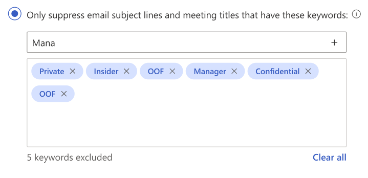

# Keyword suppression

In the Microsoft Viva Insights advanced insights app, you can specify sensitive keywords that might appear in email subject lines or meeting titles across your organization. After you set them, subject lines or meeting titles that contain these keywords won't appear in any surface that uses Viva Insights data, including query output.

>[!Important]
> Viva Insights suppresses *all* email subject lines and meeting titles by default. To get the most out of all Viva Insights features, you'll need to change this setting. Refer to [Default setting and feature availability](#default-setting-and-feature-availability) for more information.

## How it works

When Viva Insights finds one of your keywords in a meeting title or email subject line, it hides that entire title or subject line in query outputs. So, while a query might use the value of a keyword-suppressed meeting or email, you won't see its title or subject line. In the following image of a meeting query result, the **Subject** column omits certain values. These values are meeting titles that contained sensitive keywords set by an admin.

In other words, if you set up keywords, there's no way for analysts to associate query data about affected meetings or emails with their title or subject line.

### Default setting and feature availability

By default, Viva Insights suppresses *all* email subject lines and meeting titles. Some Viva Insights metrics use title and subject line data, for example, **Urgent email hours**<!--verify-->. Those metrics feed into features, like certain Power BI reports. If you keep keyword suppression turned off, those metrics and features won't be available to you.

When analysts try to run a query that depends on keywords, and all keywords are suppressed, they'll run into warnings and errors.

## How to change keyword-suppression settings

In the advanced insight app's admin experience, go to **Privacy settings**.

Under **Suppress email subject lines and meeting titles**, you'll find these three options:

* **Suppress all email subject lines and meeting titles**
* **Don't suppress any email subject lines or meeting titles**
* **Only suppress email subject lines and meeting titles that have these keywords**:

### Suppress all subject lines and meeting titles (default setting)

When you **Suppress all email subject lines and meeting titles**, Viva Insights won't include *any* meeting titles or subject lines in queries. As discussed earlier, we made this the default setting for everyone. You don't need to take any action if you want all meeting titles and subject lines suppressed.

### Don't suppress any subject lines and meeting titles

When you **Don't suppress any email subject lines or meeting titles**, you turn off keyword suppression. Viva Insights makes *all* subject lines or meeting titles available for query analysis, so any title or subject line could show up in query output.

### Only suppress email subject lines and meeting titles that have these keywords

When you **Only suppress email subject lines and meeting titles that have these keywords**, you suppress titles and subject lines with specific keywords, but not all titles and subject lines. Viva Insights only suppresses titles and subject lines with the keywords you set.

To set keywords, enter them in the text box provided. Enter each word separately, even if they're part of a phrase. For example, if you want to suppress a meeting title or subject line that contains the phrase, "Fire drill," you'd enter "fire" and "drill" as separate words. After you're done adding keywords, select the **Save changes** button at the bottom of the screen.

>[!Important]
> Keyword suppression only applies to queries that analysts run in the future. When you set keywords, they won't apply to queries that analysts have already run.