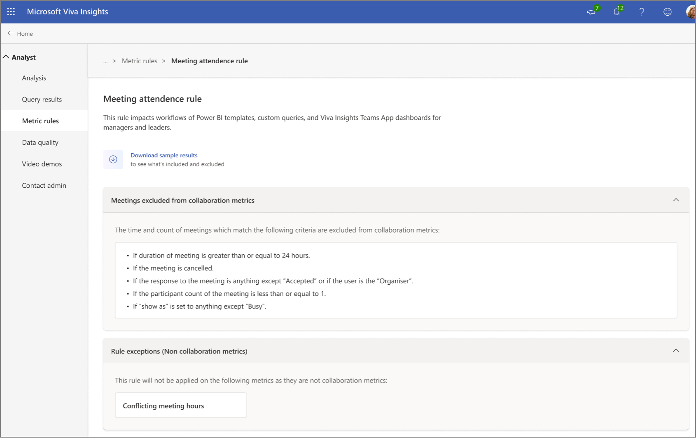

# Advanced insights metric rules

Microsoft Viva Insights uses email and calendar activities that are stored in a person's Microsoft 365 account to reveal internal and external collaboration trends. However, a person's calendar and email can contain a diverse set of activities (such as personal meetings, work-related social activities, all-day training meetings, and so forth) that are not relevant to work-related collaboration, and, if included in the metrics, would skew query results.

As a Viva Insights Analyst, you can view the **Metric rules** page within the Advanced insights app. Metric rules show what type of data is being excluded when using the available analysis tools, such as for templates and queries.

Viva Insights excludes events from analysis based on the default **Meeting attendance rule**. This rule is set by default to exclude meetings from analysis (such as all-day training meetings) where their inclusion might skew query results.

<!--customized is misspelled in the image, please replace when the UX is fixed-->

## About these rules

* **Only apply to analysis data** - Metric rules only apply and filter data in the **Analyst** pages. These rules are _not_ applied to the data shown in the **Data quality** pages, such as for Microsoft 365 data.
* **Are read-only** - These rules are set up automatically by default. For the first release of the new Advanced insights app, you cannot yet edit or change the Metric rules.

## View rule details

The default meeting attendance rule filters the meeting data for analysis purposes. To view rule details, do the following.

1. In the Advanced insights app, select **Analyst** > **Metric rules**.<!--add a link to the app when available?-->
1. Select **View details**.

   
   <!--add a better image, this one has typos-->
