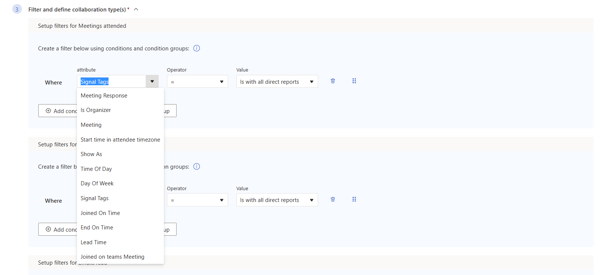
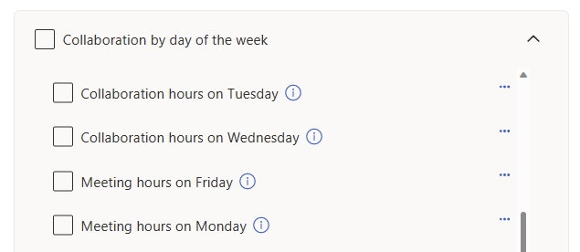
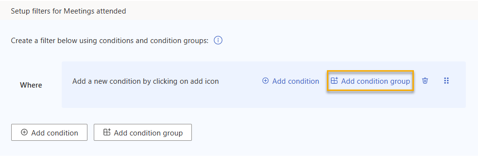
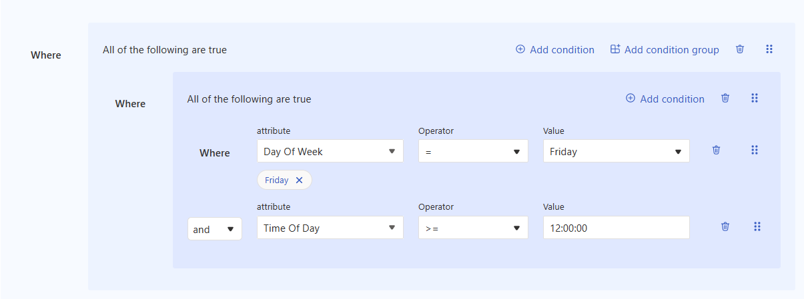

# Customizing metrics in Viva Insights

Metrics shape your query and help define what you want to know about your organization’s employees. In this article, we talk about how to customize metrics and add them to your queries.

Before we get started, here are a few things to know about custom metrics:

* In this release of the advanced insights app, you create custom metrics by duplicating existing metrics and changing their settings. In future releases, you’ll be able to create metrics from scratch and edit them directly.
* You can add custom metrics to person queries and Power BI template queries. Adding customized metrics to meeting queries isn’t supported right now.
* Some metrics aren’t customizable, including focus and hybrid metrics. Metrics available to customize have ellipses (**...**) to the right of their metric name. When you select the ellipses, you’ll see options to **View** and **Clone**.

## How to customize a metric

>[!Note]
> You’ll customize metrics while you’re creating a query. Make sure you’re in the Analysis page of the advanced insights app and have selected either a Power BI template query or a person query. Adding custom metrics to a meeting query isn’t supported right now.

### Find your base metric

Because you'll create your customized metric from an existing metric, you'll need to first find that original metric.

While you’re building a person or Power BI template query, select **Add metrics**, which brings you to the **Select metrics** pane. 

To find the metric you want to customize, either:

* Expand each category.
* Use the category filters on the left side of the **Select metrics** pane.
* Use the search bar at the top of the **Select metrics** pane.

To learn more about a metric, including its definition, select the tooltip to the right of the metric name.

 

### Use the Clone function

After you've found the metric you'll customize, select the ellipses (**...**) to the right of its metric name. In the resulting menu, select **Clone**.

You'll arrive at the metric editor.

>[!Tip]
>If you just want to find out how a metric is set up and don’t want to create a new one, use the **View** option. Cloning creates an identical copy of the original metric that you can make changes to.

### Customize your metric's settings

In the metric editor, make changes to the following settings:

>[!Note]
>**Select what you want to measure** isn't editable.

#### Select which collaboration type(s) you want to measure

**Collaboration type** is the kind of collaboration you want your metric to measure. Keep the existing type(s) or pick from these choices: 

* **Meetings attended**
* **Emails sent**
* **Emails read**
* **Chats sent**
* **Chats read**
* **Calls joined**

You can set multiple types if you want. 

#### Filter and define collaboration type(s)

Filters narrow down your metric’s scope and tell it which data to look for. 

After you selected collaboration types, you might have noticed blue containers appear. These containers match each selected collaboration type above. Within each container, you’ll need to set conditions and condition groups (collectively referred to as *filters*) that define the kind of data you want your metric to measure. For each category, you can set as many filters as you want.

We customize a sample metric below, where we give an example of how you might use filters.

#### Select a time window

The time window is the range of hours during the day you want your metric to analyze. Pick from the following choices:

* **During after hours**, which is determined by Outlook working-hours settings
* **During working hours**, which is also determined by Outlook working-hours settings
* **Throughout the day**, which is a 24-hour time period
* **Custom time period**

If you pick a custom time period, you can set the custom value through a time picker, which appears below.

#### Name and publish

The **Name** field differentiates your customized metric from existing ones, so you’ll need to either add to the prepopulated name or give it a new one. 

The **Description** field contains the metric definition. You might also consider adding information to the description about what you changed, so other analysts in your organization understand what your customized metric does.

This field is the last part of the metric editor. Read on to find out how to publish your metric.

### Save your metric and choose whether to publish it

When you’re ready to save your metric and start using it in your query, select the **Save** button. 

Viva Insights will ask you if you want to publish your metric to the metric library. If you select **Publish**, you’re making that metric available to other analysts in your organization, so they can use it in their queries. If you don’t want to make your metric available to other analysts, select **Cancel**. You can still use this metric in your query.

## How to add a customized metric to a query

You'll find customized metrics within the **Select metrics** pane. To get to the select metrics pane, select the **Add metrics** button while you're building a query.

If you're looking for a metric you customized, expand the **Defined by me** category. 

If you're looking for a metric that another analyst in your organization customized, expand the **Defined by others** category.

The rest of the process is the same as adding any metrics to a query. You'll select the checkmark next each metric you want to add. After you've selected all the metrics you want, select the **Add to query** button at the bottom of the pane.

Your metric appears in your query in progress, in the metrics box.

## Sample scenario

Let's demonstrate how you might customize a metric. For this sample scenario, we'll say that you already have a query started. You want to add a metric that captures how much time people spend in meetings on Friday afternoons.

1. Find a metric to customize:
    1. Select **Add metrics**.
    
    1. Look for a category that might contain a good starting metric. Maybe **Collaboration by day of the week** will have something. Expand this category.
    

    1. **Meeting hours on Friday** sounds like a good place to start. Select the tooltip to view this metric's definition and related information.

1. You decide that **Meetings hours on Friday** is the metric you want to customize. Select the ellipses (**...**) to the right of the metric name, and then select **Clone**.

    

1. Make changes to the metric settings:
    1. The collaboration type, meetings attended, will stay the same, so leave the **Select which collaboration type(s) you want to measure** section as-is.
    1. The metric has a filter set up to measure Fridays. However, you wanted to know about Friday afternoons specifically. In the **Filter and define collaboration type(s)** section, replace the existing condition with a condition group, which will measure two simultaneous conditions (Friday *and* afternoon).
        1. Select the trashcan icon to delete the existing condition.
        
        
        
        1. Select **Add condition group**.
        
        1. When your condition group appears, select **Add new condition** to add the "Friday" part of your condition group.
        
            1. Set **Day of the Week** as the **Attribute**, **=** as the **Operator**, and **Friday** as the **Value**.
        
        1. Select **Add condition** again to add the "afternoon" part of your condition group.
            1. Set **Time of Day** as the **Attribute**, **> =** as the **Operator**, and **12:00:00** as the **Value**.
            
        These are all the filters you'll need to set for this metric, so you  move on to the next section. 
1. In **Select a time window**, select **During working hours**. Though you set a filter earlier to analyze meetings that occur after noon, the time window makes sure you're only analyzing meetings that occur during business hours.

1. In **Name and publish**, choose a new name for your metric and add to its description.

1. Select **Save**. 
1. You think other analysts in your organization might use this metric at some point, so you also select **Publish** when Viva Insights asks.
1. In your query's **Select metrics** pane, expand the **Defined by me** category, select your new metric, and select **Add to query**.
