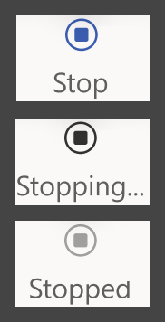
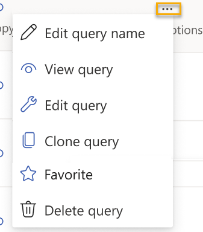

# Access query results and modify existing queries

In the advanced insights app Analyst experience, the **Query results** page lists all the results available for your organization. In addition to seeing basic information about each query, you can:

* Create a copy of (clone) a query.
* Edit, rename, and delete a query.
* Favorite a query to find it later.
* Download query results as a .csv file.
* Get a link to access results as data in Power BI or Excel.

This article talks about each of these capabilities, and it also provides some information about permissions and your downloaded query results file.

## Permissions

The **Insights Analyst** role for the advanced insights app is required to view, download, rename, edit, delete, favorite, or clone query results.

>[!Important]
>Only the analyst who originally ran the query can edit, rename, or delete its results. Other analysts in the organization can view, favorite, and clone results.

## Query results page

### Results statuses

After you run your query, you might see the following statuses in the **Status** column:

#### Running

If you see a blue square within a blue circle, the query is running. The analyst who ran the query can cancel the query by selecting **Stop**.

#### Stop, Stopping, and Stopped

Selecting **Stop** freezes the query. While stopping is in progress, the query status shows **Stopping**; after the query is fully stopped, the status shows **Stopped**.

If the analyst who ran the query wants to run this query again later, they can select **Rerun** from the **More options** menu.

>[!Note]
>Other analysts in the organization can see a query is running, but they can’t stop it.

#### Success

When a query successfully runs, you’ll see a green checkmark within a green circle labeled **Success**.

If you ran the query, you can now edit, delete, or rename it. All other analysts can now clone or favorite it.

#### Failed

If an error occurs while a query is running, you’ll see a **Failed** status. 

### Results filters

There are some predefined views on the **Query results** page:

* **My results** – Queries only you’ve run
* **All results** – Queries all analysts in your organization have run
* **Favorites** – Queries you’ve marked as **Favorite**
* **Power BI templates** – Predefined queries all analysts in your organization have run for Power BI templates (for example, Ways of working)
* **Custom queries** – Custom Person queries all analysts in your organization have run

### Setting the query to auto-refresh

If you ran a query and want it to recur on a certain schedule, you can set the **Auto-refresh** toggle key to **On**.

Analysts who didn’t run a query can’t set it to auto-refresh.

### More options

When you select the **More options** ellipses—located in the far-right column of the **Query results** page—you’ll see a few different options based on whether you ran the query or are another analyst in the organization: **Edit query name**, **Edit query**, **Clone query**, **Favorite**, and **Delete query**.

Let’s explore these options in more detail.

#### Edit query name

*Applies to: analyst who ran the query*

To change a query name, select the **Edit query name** option.

>[!Important]
>All query names need to be unique. You’ll receive an error if the query name you enter already exists.

After you’ve successfully renamed your query, you’ll receive a notification in the upper right corner of your screen.

#### View query

*Applies to: any analyst in the organization*

If you want to see how a query was set up, but don't want to edit anything, you can select **View query**. This option takes you to the query's setup screen. You can clone a query from here, too.

#### Edit query

*Applies to: analyst who ran the query*

If you want to change your query’s setup information (like **Query name** and **Time period**), metrics, conditions and condition groups, and employee attributes, you can edit the query and run it again.

>[!Caution]
>The **Edit query** option permanently deletes and replaces the query’s existing results. To keep a query’s existing results, use the **Clone option** instead and make changes in a new query.

When you select **Edit query**, you’re prompted to confirm whether you want to overwrite your existing results or want to clone the query instead.

If you select **Edit query** in this box, the app takes you to the query setup screen. You can then make changes and rerun the original query. If you choose **Clone**, the app takes you to a new query with the same settings as the original.

#### Clone query

*Applies to: any analyst in the organization*

The **Clone** option makes an identical copy of an existing query. Use **Clone** when you want to start a new query using the same settings (**Time period**, **Group by**, metrics, conditions and condition groups, and employee attributes) as an existing query.

>[!Tip]
>
>You can reach the **Edit** and **Clone** options through the query setup screen, too.

#### Favorite query

*Applies to: any analyst in the organization*

Favoriting a query saves it in your **Favorites** view so you can find it later. 

#### Delete query

*Applies to: analyst who ran the query*

Deleting a query removes it from the results list for everyone in the organization.

>[!Caution]
>Deleting queries is permanent. If you delete a query that’s set to auto-refresh, you’re also disabling that query’s future updates.

After you select **Delete query**, you’ll need to confirm you’re ready to delete before proceeding.
 
After your query is deleted, you’ll receive a notification in the upper right corner of your screen.

## Query results

### About query results

When you define a query, you select metrics and employee attributes. After the query runs, its results are organized into columns and rows. The column headers in the results match the attribute names and metric names that you selected while defining the query. You can download these results as described later in this article.

#### Downloading and connecting to results

##### Download and import results in Excel

1.	In **Query results**, next to the results you want, select the CSV icon.
2.	Select to open and right-click the zip file, which contains a .csv version of the data, and then select **Extract All** and extract the .csv to a local folder.
3. Open the extracted .csv file using Excel.

##### Connect through the Power BI Connector

1.	In Power BI Desktop, select **Get Data**.
2.	Select **Online Services**, select **Viva Insights**, and then select **Connect**.
3.	In the **Analyst > Query results** page, find your query and select **Copy link**.
    >[!Note]
    >The link contains two pieces of information: the partition identifier and the query identifier, which are separated by a slash.

4.	In **Connect to Viva Insights Data**, enter the partition identifier and the query identifier.

    >[!Note]
    >Query name isn't supported right now.

5.	In **Advanced parameters > Data granularity**, select **Row-level data**.
6.	Select **Import** under **Data Connectivity mode**, and then select **OK**. 
7.	If you're prompted to sign in, select **Sign in**, enter your Microsoft 365 credentials, and then select **Connect**.
8.	In the preview window, select **Load**. Optionally, select **Transform Data** to transform and shape the data in the Power Query editor before loading it into Power BI.

## Related topics

[Power BI tips, FAQ, and troubleshooting](./templates/power-bi-faq-troubleshoot.md)

[User roles in Viva Insights](../setup-maint/user-roles.md)