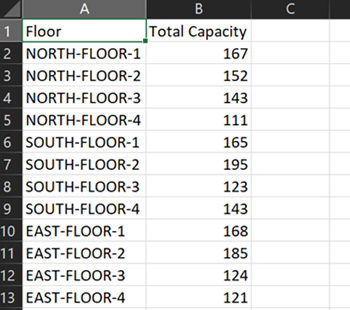
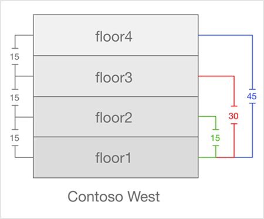
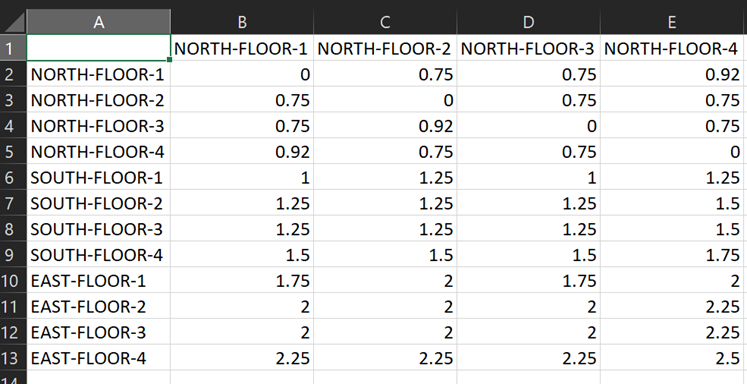
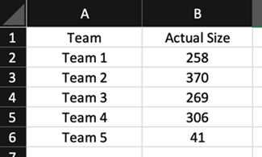
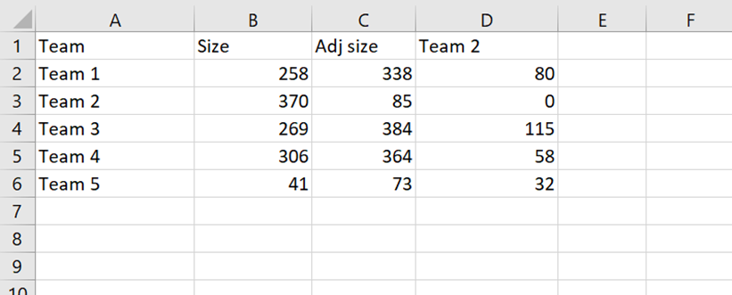
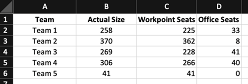

---

ROBOTS: NOINDEX,NOFOLLOW
title: Workspace Planning Azure Template for Workplace Analytics 
description: Learn about the Workspace Planning Azure Template for Workplace Analytics and how to use it for advanced data analysis
author: madehmer
ms.author: helayne
ms.topic: article
ms.localizationpriority: medium 
ms.collection: m365initiative-viva-insights 
ms.service: viva 
ms.subservice: viva-insights 
search.appverid: 
- MET150 
manager: scott.ruble
audience: Admin
---

# Workspace Planning Azure Template for Workplace Analytics

_This template is only available as part of a Microsoft service engagement._

Workplace Analytics Azure Templates include the Workspace Planning template that provides a quantitative solution to optimize the seat locations of teams based on their collaboration with the teams around them. This planning can help maximize and foster physical workspace for teams and for cross-team productivity and collaboration.

The template combines Workplace Analytics data with your team size, workspace capacity, and the distances between seating areas to generate optimized floor plans.

## Use cases

* **Moving to a new workspace** and your organization wants to know the best workspace plan for employees within a building for optimal cross-team collaboration.
* **Reorganizing an existing workspace** and your organization wants to generate an optimized floor plan and compare it to the current floor plan, based on current communication patterns.

## How it works

This template combines Workplace Analytics data with your team size, workspace capacity, and the distances between the floors and the buildings to generate floor plans with recommended seating.

* [Interaction](#create-an-interaction-file) - This is a Workplace Analytics group-to-group query that includes meeting and email activity for insight into current work and collaboration patterns.
* [Space capacity](#create-a-space-capacity-file) - This file includes details about the maximum capacity for the workspace.
* [Distance](#create-a-distance-file) - This file includes details about the walking distances in a unit you specify, such as minutes or meters that can be estimates, between floors or buildings.
* [Team size](#create-a-team-size-file) - This file includes details about the number of employees in each team in your organization.

This template combines the data in these files and generates a table that shows where to seat people in the specified floor plan.

   

## Key features

* **Seating Optimization** - Generates seating assignments for teams that reduces the distance between teams who have the most collaboration with each other.
* **Fixed Spaces** - Allows the user to fix specific teams to particular locations and then optimize the remaining teams around them such that teams are situated nearest to teams who they have the most collaboration with.
* **Interactive mode** - Enables you to interactively change the floor plan results, such as the number of team members on each floor or in each office, within the application, and then it updates the results to reflect these changes.
<!--* **Co-located teams** (coming soon) - Enables you to specify a constraint that a certain number of seats for a team must be adjacent to another team. For example, certain number of seats of Team 1 are always close to Team 2. Requires a different version of the team_size.csv input file.-->
<!--* **Relative constraints** - Specify a specific distance or collaboration constraint for certain teams. For example, Team 1 must be seated in a workspace that is less than 15 minutes from Team 3. You need to use the additional **constraints.csv** input file for these.-->

## Deploy and configure the template

1. Confirm you meet the [Prerequisites](deploy-configure.md#prerequisites) for deploying the template.
2. Complete the steps to [Deploy and configure](deploy-configure.md#deployment) the template.

## Create an Interaction file

1. Confirm you are assigned the [Analyst role in Workplace Analytics](../use/user-roles.md), which is required to create this file.
2. Sign in as an **Analyst** and open [Workplace Analytics](https://workplaceanalytics.office.com/).
3. Select **Analyze** > **Query designer**.
4. In **Start custom query**, select **Group-to-group query**.

   

5. Enter or select the following to create the query.

   * Name: **Interaction**
   * Group by: **Week**
   * Time period: **3 months** (to start with)
   * Meeting exclusion: **Tenant Default Meeting Exclusion Rule**
   * Select metrics: **Collaboration Hours**
   * Time investors
      * Group the time investors by: **Organization**
      * Limit the analysis to certain time investors: *None*
   * Their collaborators
      * Exclude collaborators: *None*
      * Group people who collaborated with time investors: **Organization**
      * Focus analysis on a set of collaborators: *None*

6. At the top right, select **Run** to create the query.
7. After the query is successfully created, in **Query designer** > **Results**, locate and select the **Download** icon for your new Interactions query, and then save the zipped file.

   

8. Locate and right-click the **interaction.zip** file, select **Extract all**, and then select **Extract** and specify the folder.
9. Confirm the new file is named (or rename it as) **interaction.csv** (exact file name is required).

## Create a Space capacity file

#### Key term

**Total_Capacity** is the total number of individual desks and office seats that are available within a specified workspace.

>[!Note]
>Only include workspaces that you want to account for or utilize.

1. Open and save the [space_capacity.csv](/Workplace-Analytics/azure-templates/images/space_capacity.csv) file to local storage. The file must be named **space_capacity.csv** (match exactly).
2. In the **Floor** (first) column in the file, replace the example floor names with your own that match the same format of [**Building name**-**Floor number**], as shown in the following graphic.

   * Use valid characters, including: **a-z**, **A-Z**, **0-9**, "**-**" (dashes), and " " (spaces)
   * Do not use invalid characters, including: "**_**" (underscores) and "**,**" (commas)

3. In the **Total Capacity** column, enter the maximum capacity for each floor.
4. If you have office seat variables to define, continue to the next set of steps. Otherwise, save and close the file.

   

## Create a Distance file

The following graphic depicts a building with four floors. The distance between each parallel floor needs to be the same consistent value. You can use the default value of 15 for parallel floors, which is a good estimate of how long it takes to get from one floor to the next in the same building.

   

>[!Notes]
>
>* You must define the distances between buildings, floors, or zones within a floor. You can use any single unit, such as meters, feet, seconds, or minutes, if you use it consistently. **Estimates of distances are acceptable**.
>* For distances between floors directly above and below each other, use a default value of 15.
>* Start your distance measurements by walking at a normal pace across the furthest distance of teams on a single floor. This will be used as the benchmark distance of all teams throughout the campus. Consider asking your customer support advisor for guidance on how to efficiently generate this file.

### To create a Distance file

1. Open and save the [distance.csv](/Workplace-Analytics/azure-templates/images/distance.csv) file to local storage.
2. In the first row and the first column, replace the example data with the locations you want processed with the structure that match the same format of [**Building name**-**Floor number**], similar to the data shown in the following graphic.
3. Starting in the second row and column, enter the distances where the corresponding locations intersect to denote the distance between the two locations.
4. Save and close the file.

   

## Create a Team size file

>[!Note]
>Employees can only be included in one team.

#### Key terms

* **Team** is the name of the team or group that is being moved, which should match the names of the teams within the Interaction file.
* **Actual Size** is the total number of people that are a part of the team to account for during the move.

1. Open and save the [team_size.csv](/Workplace-Analytics/azure-templates/images/team_size.csv) file to local storage.
2. Starting in the second row, replace the example data with your own that matches the same format, similar to what's shown in the following graphic.

   * **Team** - Enter the name or function of each team.
   * **Actual Size** - Enter the number of employees that are in each corresponding team.

3. Save the file, and then continue to the next set of steps.

   

<!--### For co-located teams

1. In the **team_size.csv** file you just created in the previous set of steps, add a new column named **Adjacent Size**.
2. Add another new column and name it for the team to which you want to enforce adjacency.
3. For each row in the new team column, enter the number of team members you want to place next to each team, entering a 0 for the row that has the same team name.
4. In the **Adjacent Size** column, for the rows that are not the same team as the new column, add the Size column and the value in the new team column.  For the row that matches the team name in the new column, total the new Team column. And then subtract that sum from the **Size** column and enter that value in the **Adj Size** cell.

   

### For office seat variables

1. In the **team_size.csv** file you just created in the previous set of steps, add a new column and name it **Workpoint Seats**, which represents how many standard desk seats (shared desks or open space) the team needs.
2. Add an additional column and name it **Office Seats**, which represents how many office seats (desks assigned to one person) the team needs. If a single office is assigned to two people, count it as two office seats.
3. Enter the number of workpoint seats required for each team. If no workpoint seats are required for a team, enter 0.
4. Enter the number of office seats required for each team. If no office seats are required for a team, enter 0.
5. Your final floor plan should look similar to the following graphic.
6. Save and close the file.

   

## Generate a Constraints file

> [!Note]
> If you do not create a constraint for a team, an optimized floor plan will still be created.

1. Open and save the **constraints.csv** file to local storage.
2. Set the **Constraint Type** to **Distance**.
3. In the **From** column, enter the names of your source teams that you used in the **team_size.csv** file (the names must match between these two files).
4. In the **To** column, enter the names of the destination teams that match the team names you used in the **team_size.csv** file (the names must match).
5. In the **Eq(<, >, =)**  column, enter a constraint:

   * Use **<** (less than) to connect two teams.
   * Use **>** (greater than) to separate two teams.
   * Use **>=** (greater than or equal to) to separate two teams the same way as ">", but also includes the value used to compare against.

6. Enter the applicable amount on a scale of **1 -100** where **1** is for having teams be as close together as possible and **100** is for as far away as possible. Add as many team combinations as you require.
7. Save the file in the same locations as the four base files.
8. When selecting the relative constraints feature as you see above, make sure to select all five files.

   In the following example, the first constraint defines that Team 1 be as close as possible to Team 2. The second constraint defines Team 3 be as far away as possible from Team 4.

   -->

## Generate a floor plan

Before you can generate a floor plan, you need to create a Project folder. This enables you to group related floor plans and any edited versions of a floor plan as a single project. For example, when planning workspace for a multi-building campus, you’ll want multiple floor plans grouped together in one project folder.

**To add a new project**:

1. In the Workspace Planning Azure Template, select **Create Project** at the top right.
2. Enter a project name, and then select **Create Project** again.
3. Proceed to the next set of steps to create a new floor plan.

**To generate a floor plan**:

1. In the Workspace Planning Azure Template, select the applicable project (created in the previous steps) for this new floor plan.
2. Select **Create Floor Plan**.
3. Enter a unique floor plan name.
4. In **Upload data files**, select **Browse files**, and then select the .csv data files created in the previous steps, including **interaction**, **space_capacity**, **distance**, and **team_size**.
5. Confirm the **Status** for each file shows as **Accepted**, and then select **Submit**.
6. After the floor plan shows a green check mark for the **Status**, select it, or any edited floor plans generated from the original, and then select **Generated Floor Plan** to open it.
7. Confirm or change how teams are assigned to workspaces, such as:

   * Select **Clear Floor Plan** to replace all values with zero in this plan.
   * Select the **Clear** (eraser) icon for any column or row to clear all the values for it.
   * Select the **Eye** icon to hide or unhide a full workspace or a team that’s fully assigned in the floor plan view.

8. Select **Save Floor Plan**.
9. Name the plan, and then select **Save Floor Plan** again.

### Capacity color key

The workspace capacity bar shows the total capacity and the exact number of unassigned or over-assigned seats for each workspace name. As you assign or unassign seats for a workspace, the capacity bar will change colors as follows:

* **Light blue** reflects a workspace with available capacity.
* **Dark blue** reflects a workspace that is at capacity.
* **Red** reflects a workspace that is over capacity.

Also, a **green 100%** icon and a **blue striped** or **blue and green striped** background show for a column when a workspace is at capacity, depending on the team head count.

### Team size color key

Similar to the workspace capacity bar, each team has a head count bar next to the team’s name that shows the team size and number of team members who are assigned or over assigned to a workspace. As you assign or unassign team members to workspaces, this bar will change colors as follows:

* **Light green** shows when capacity is available for team members.
* **Dark green** shows when all the team members are assigned to a workspace.
* **Red** shows if a team is over assigned for a workspace.

Also, a **green 100%** icon and a **green striped** background show for a team’s row when the head count is fully assigned to a workspace.

## Activate fixed spaces

After generating an optimized floor plan, you can reassign head count and move teams to specific workspaces. If extra head count remains, you can use **Assign Remaining Head Count** to re-run the optimization, which generates a new floor plan with your changes and assigns the remaining team members to the workspace:

1. Select **Clear Floor Plan** and then reassign teams to different workspaces.
2. Confirm any changes, and then select **Assign Remaining Head Count**.
3. Enter a unique floor plan name, and then select **Assign Remaining Head Count** again. Your new floor plan will show as loading in the same project folder as your original floor plan.
4. After this new version shows a **Status** of a **green check mark**, you can select the floor plan to open, review, make changes, and download it.

>[!Note]
>The more teams you assign to fixed locations, the less optimized the floor plan will be.

## View project and floor plan details

After you create projects and associated floor plans, they are available in the **Workspace Planning** list with the following options:

* Select a table column heading, such as **Name** or **Created by**, to sort the list by.
* Select a project name to view its floor plans.
* For floor plans, select the **Download** icon to download the constraint files that were used to create the floor plan.
* Select the **Dataset Parameters** icon to see more details about a floor plan.
* Select the **Job Details** icon to see more details about the floor plan was generation.
* Select the **Delete** (trashcan) icon to delete a project or a floor plan that you created from the list.

## Save and download a floor plan

To download an existing floor plan, select the **Download** icon for the plan listed in **Load Floor Plan**. Or to make changes and then download an updated floor plan, do the following steps.

1. In the Workspace Planning Azure Template, select the applicable project for the floor plan.
2. Select the name of the floor plan you want to save and download.
3. Confirm or change how teams are assigned to workspaces, such as:

   * Select **Clear Floor Plan** to replace all values with zero in this plan.
   * Select the **Clear** (eraser) icon for any column or row to clear all the values for it.
   * Select the **Eye** icon to hide or unhide a full workspace or a team that’s fully assigned in the floor plan view.

4. Select **Save Floor Plan**.
5. Name the plan, and then select **Save Floor Plan** again.
6. Select **Download Floor Plan** to save a .csv version of it.

## Related topics

* [Workplace Analytics Azure Templates overview](./overview.md)
* [What's new in Workplace Analytics Azure Templates](./release-notes.md)
* [Deploy and configure Workplace Analytics Azure Templates](./deploy-configure.md)