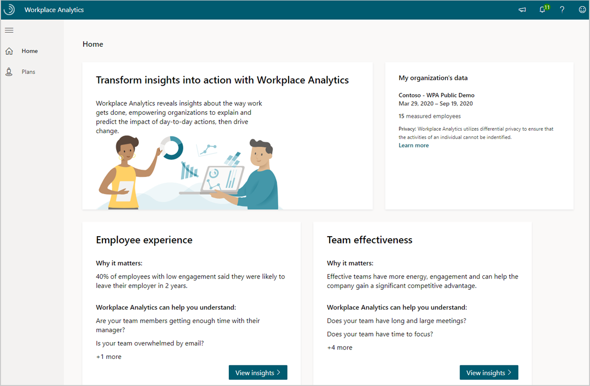

# Get started with manager insights

As a people manager, confirm the following prerequisites. You can then sign in and see your team's data in Viva Insights.

## Prerequisites

* **Manager access** - Confirm that your admin has given you access through [Manager settings](../use/manager-settings.md).
* **Licensed team** - You and your team are measured employees who are assigned a license and your team is included in the reporting hierarchy that leads to you as their manager. The hierarchy is based on the latest available HR data uploaded by the admin.
* **Minimum team size** - Your team structure must meet the minimum group size of 10 or more measured and licensed employees.

## View your team's insights

Depending on your license and access settings, you can get a snapshot of how your team is currently doing in the following apps:

* [Microsoft Viva Insights app](teams-app.md)
* [Advanced insights app](https://workplaceanalytics.office.com) (if that link doesn't work, try [this link instead](https://workplaceanalytics-eu.office.com/)).

Manager insights give you visibility into your team’s collaboration patterns, which are leading indicators that ladder up to overall wellbeing.

* **Employee experience** - Research shows that happy employees help boost productivity and reduce turnover. These insights and suggestions can help you maintain positive employee experiences, such as evaluating how much time your team is working after hours on email or instant messages, and if your team is getting enough 1:1 time with you and other managers.

* **Team effectiveness** - Nimble companies can more efficiently adapt to market changes and gain a true competitive advantage. The insights in this section show if your team has time to collaborate for rapid innovation, and to focus and produce higher quality work.

## Who is included

Insights are scoped to your team's data, including employees who you directly or indirectly manage within your defined organizational group. The date range shows you the most recent [Organizational data](../use/organizational-data.md) that's been uploaded to and processed for advanced insights, including the current date range and the number of *included employees* in your team. Your Viva Insights Administrator can give you more details about uploads and measured employees.

## About the insights

The following describes how your team metrics are calculated to support the behavioral insights for each of the business insight questions. With **Teams like yours**, you get comparable data from within your organization for context into broader organizational patterns. Today, "Team like yours" data is calculated as averages from peer manager teams. If you have only one peer team or no peer team, the company average is shown instead.

|Insight |Team metric description |Metric average for your team and "teams like yours" |
|--------------------------|-------------------|-----------------|
|Coaching and development |One-on-one time is the number of meeting hours with only an employee and their manager. To account for various meeting frequencies, the total time is calculated for each employee per month and averaged over a week.|The average number of hours that managers spend in one-on-one meetings with *all* of their direct reports. |
|After-hours work |After-hours work is the number of hours employees spend in meetings and on email outside of working hours. This uses the working hours set in the employee's Outlook calendar settings. |Average number of total hours a team spent in meetings and on email outside of working hours. |
|Email overload |Employees that spend over 10 hours in email each week. Email workload is the number of hours employees spend sending and receiving email. |Average number of hours spent sending and receiving email. |
|Long and large meetings |The number of employees that spend over 30 percent of their total meeting time in long or large meetings, divided by the total number of measured employees. Long meetings are those scheduled for more than an hour. Large meetings are those that involve more than eight people. |Average number of meeting hours spent by the team. |
|Focus time |The number of employees who have less than 20 hours each of available time for focused work, divided by the total number of measured employees. Focus time is when employees have two or more consecutive hours with no meetings. |Average number of total hours |
|Instant message use |One-on-one communication is the combination of email and instant messages (IMs) sent between two employees. This insight highlights the employees that spend less than 20 percent of their one-on-one communication over Teams IM. This is calculated as the percentage of one-on-one IMs sent, divided by the total number of one-on-one IMs and emails sent. |Average number of emails sent between only two employees. |
|Manager connectedness |Manager cross-team connections are the number of departments outside your own that you had meaningful interactions with in the last 28 days. A meaningful interaction is defined as an email or meeting that includes two to five people. |An average number of meaningful connections the managers have outside their team. |
|Collaboration across silos |Cross-organization collaboration is the number of hours employees spend in meetings and email with at least one person outside of their own department. This insight highlights the organizations that spend more than 50 percent of their overall collaboration within their group. |Average number of hours the team spent collaborating with people outside their department. |

## Tell us what you think

After using one or more of the manager insights, use the thumbs up and down icons on the dashboard to send us your feedback.
