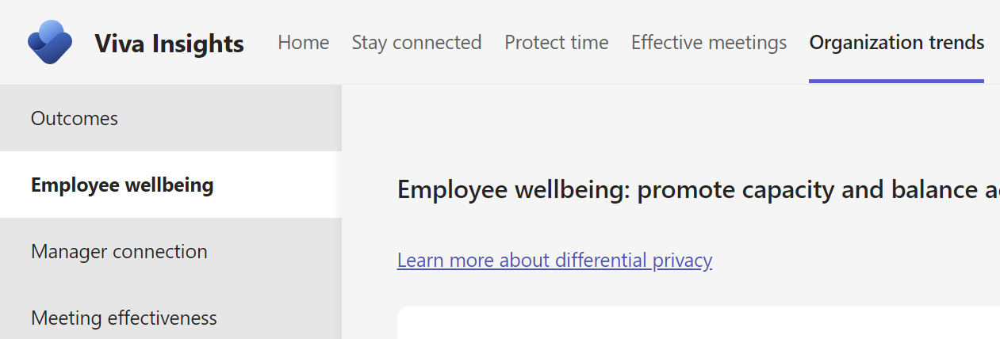
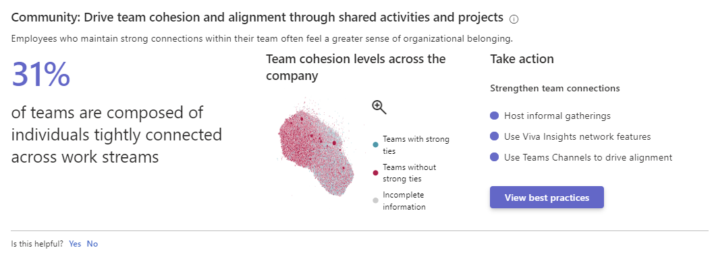

# Employee wellbeing

Workplaces that balance fluid collaboration patterns alongside capacity for individual focus promote sustained employee wellbeing. In Microsoft Viva Insights, two elements make up the Employee wellbeing framework: balance and capacity. This article explains how to leverage best practices for balance and capacity and how related insights are calculated.

You can find the **Employee wellbeing** page in the Viva Insights app, within the **Organization trends** tab.

<!-- placeholder image-->

## Balance

### Help employees disconnect

<!-- placeholder image-->

#### Insights

For **Help employees disconnect**, the **Employee wellbeing** page provides a percentage insight that shows how many employees collaborate outside of their set working hours for more than three hours per week and a visual insight that shows average weekly time spent collaborating after hours.

Here's some information about how those metrics are calculated:

|Percentage insight  |Metric| Calculation  
|----------|-----------|-----------------|
|Percentage of employees who are working after hours for more than three hours each week | [After-hours collaboration](../advanced/reference/metrics.md#after-hours-collaboration-define)| Percentage of employees who spend more than one hour collaborating through emails, calls, chats, and meetings after hours. This percentage is calculated weekly and averaged over the entire time period.|

|Visual insight  | Definition  
|----------|-----------|
|Average weekly time spent collaborating after hours | Percentage of employees based on their weekly after-hours collaboration. They are divided into employees who spend less than one hour collaborating after-hours, employees who spend between one to five hours collaborating after-hours, and employees who spend more than five hours collaborating after-hours. These percentages are calculated weekly and averaged over the entire time period.|

#### Best practices

Rapid shifts in ways employees work can blur the line between work and home. The amount of time employees collaborate outside of standard working hours can be an indicator of burnout risk, even as teams embrace flexibility.

Based on research presented in the [Why unplugging from work is more work than we think](https://insights.office.com/productivity/unplugging/): "New research and our growing understanding about human behavior tell us two things for certain: that unplugging is more necessary than ever, and that true unplugging is not a single action but a social agreement — a culture shift that employees and companies must create together."

Here are ways to support employee wellbeing:

* Schedule [quiet time](../personal/use/wellbeing.md) to mute notifications after hours. Consistently working outside of your regularly scheduled hours can increase the chance of burnout. To help unplug from the work day, use Viva Insights quiet time to mute mobile notifications from Outlook and Teams between the hours you choose.
* Delay delivery of emails using the [Outlook Insights add-in](../personal/use/delay-delivery.md). Delayed delivery helps to minimize disruptions to recipients outside their working hours or when they’re away from work. It helps to maintain the flexibility of work hours, while being considerate of others.
* Wrap up the day with [virtual commute](../personal/teams/viva-insights-virtual-commute.md) from Viva Insights.

For more best practices and ways to protect employees after hours, see [Best practices for wellbeing](../tutorials/gm-wellbeing.md).

## Capacity

### Focus without interruptions

<!--placeholder image-->

#### Insights

For **Focus without interruptions**, the **Employee wellbeing** page provides a percentage insight that shows how many employees have less than 10 hours of uninterrupted focus time per week and a visual insight that shows the distribution of uninterrupted weekly time.

Here's some information about how those metrics are calculated:

|Percentage insight  |Metric| Calculation  
|----------|-----------|-----------------|
|Percentage of employees who get less than 10 hours of weekly uninterrupted time for work | [Available-to-focus hours](../advanced/reference/metrics.md#available-to-focus-hours-define)| This calculation is based on the percentage of employees who have less than 10 hours available to focus each week. It's calculated weekly and averaged over the time period.

|Visual insight  | Definition |
|----------------|------------|
|Distribution of uninterrupted weekly time| Shows the percentage of employees grouped by their uninterrupted focus time. The groups are divided into those who spend between 0 and 10 hours, 10 and 20 hours, 20 and 40 hours, and more than 40 hours focusing. The percentages are calculated weekly and averaged over the entire time period.

#### Best practices

Back-to-back meetings and a barrage of emails and chats leave little time to focus on independent work and can limit creativity and innovation. Are your employees getting the time they need in between conversations with their colleagues to complete challenging work, think creatively, and generate innovative ideas?

[How to establish a meeting-free day each week](https://insights.office.com/time-management/how-to-establish-a-meeting-free-day-each-week/) explains the "goal is uninterrupted focus" time to work "on projects that require focus and high-level thinking..."

Here are ways to support focus time:

* Select a day and period of time when people should try to avoid scheduling meetings—for example, holding "meeting-free Fridays."
* Create a team norm to not send chats to team members who are in focus mode and displaying the focus status symbol in Microsoft Teams.
* Schedule focus time in Viva Insights. When you schedule regular focus-time sessions into your calendar, Viva Insights helps protect your time by silencing chats and setting your Teams status to focusing.

For more best practices and ways to establish a "no meeting" period, see [Best practices for focus time](../tutorials/gm-focus.md).

### Reduce meeting hours

<!-- placeholder image-->

### Insights

For **Reduce meeting hours**, the **Employee wellbeing** page provides a percentage insight that shows how many employees spend most of their workweek collaborating and a visual insight that shows the distribution of collaboration hours per week.

Here's some information about how those metrics are calculated:

|Percentage insight  |Metric| Calculation  
|----------|-----------|-----------------|
|Percentage of employees who spend 20+ hours in collaboration every week| [Collaboration hours](../advanced/reference/metrics.md#collaboration-hours-define)| Percentage of employees who spend more than 20 hours each week collaborating through Microsoft Outlook and Teams. This insight is calculated weekly and averaged for the entire time period.

|Visual insight  |Definition|
|----------|-----------|
|Distribution of collaboration hours| Percentage of employees based on their weekly collaboration hours. They are divided into those who spend between zero and 10 hours, 10 and 20 hours, and more than 20 hours collaborating. These percentages are calculated weekly and averaged for the entire time period.

#### Best practices

Reducing the amount of time wasted on low-quality collaboration is a way to create capacity for activities that create business value.

As explained in [How to finally kill the useless, recurring meeting](https://workplaceinsights.microsoft.com/digital-transformation/how-to-finally-kill-the-useless-recurring-meeting/), it's not only that the meeting provides little value or that people are multitasking; it's that "the sheer amount of time invested in these low-value interactions is a high-cost impediment to getting things done."

Here are ways to reduce meeting time:

* Review your recurring meetings and make sure they’re necessary. Every quarter, reassess the need for the recurring meetings that consume the most time. Try canceling meetings that have lost relevance, or audit agendas and attendee lists for better focus.
* Consider declining meetings that aren’t a priority. Encourage employees to politely say no to meetings that lack an agenda or are misaligned with priorities.
* Use Teams channels as an alternative to meetings. Channels provide team members with a new way to get questions answered and provide updates without the need for a meeting.

For more best practices and ways to schedule shorter meetings, see [Best practices for meetings](../tutorials/gm-meetings.md).

## Insights for leaders

If you're assigned the **Insights Business Leader** role in Microsoft Viva Insights, you'll find an additional insight on the **Employee wellbeing** tab. 

#### Improve team cohesion

##### Insight

For **Improve team cohesion**, the **Employee wellbeing** page provides a percentage insight that shows the share of teams that are composed of tightly connected individuals and a visual insight that shows how these teams are connected across the larger organizational network.

Here's some information about how those metrics are calculated:

|Percentage insight  |Metric| Calculation  
|----------|-----------|-----------------|
|Percentage of teams composed of individuals tightly connected across workstreams| Strong ties*| If more than 30% of the potential ties between pairs of employees on a team are classified as strong, then the team is determined to be tightly connected.

|Visual insight  |Definition|
|----------|-----------|
|Team tie type| Each team is represented by a dot with larger teams showing up as bigger dots. Dot coloration indicates whether the team is composed of a set of tightly connected individuals. 

\* Strong ties indicate how strong and tight a person's engagements are, based on both direct collaboration between two people and on the common network they share. (Collaboration activities consist of emails, meetings, Teams calls, and Teams chats.) For example, a "strong tie" between a manager and a direct report reflects both the amount of direct collaboration they have with each other and the time they both invest in connections that are common to both of them. Typically, a person has only a few strong ties because such ties take more effort to maintain. Type: Count.

##### Best practices

Changes in work environments can leave employees feeling isolated from their colleagues. Feeling part of community is important for engagement and goal alignment as employees navigate change.

According to the [Rebuilding companies as communities](https://insights.office.com/culture/rebuilding-companies-as-communities/) article, "organizations function best when committed people work in cooperative relationships based on respect." 

Here are a couple of ways to improve team cohesion:

* Add colleagues to your [important people list](../personal/use/use-insights.md#add-important-people); also, receive suggestions to meet and reminders to respond to emails and complete tasks from these contacts.
* Provide teams with virtual opportunities to bond over non-work activities and form new connections. Create agendas with fun conversation prompts and activities such as online games.

<!--Best practices-->