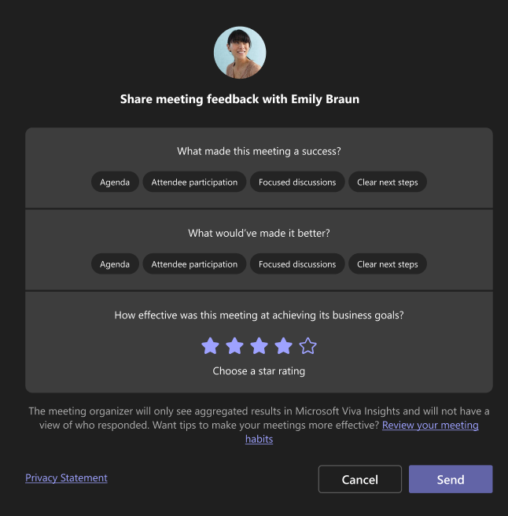

# Effective meetings

*This experience is part of a rolling release set to complete in October 2022. It's available to users with a Viva Insights subscription. Refer to [Plans and environments](../Overview/plans-environments.md) for more information.*

## Meeting category insights

You can use **Meeting category insights** in **Effective meetings** to help understand how you’re allocating time across your Outlook meeting categories.
To set up Outlook meeting categories, refer to [Assign a color category to a calendar appointment, meeting, or event (microsoft.com)](https://support.microsoft.com/office/assign-a-color-category-to-a-calendar-appointment-meeting-or-event-750596d9-707d-4412-8c0e-7fdc0fc52527).
  
**Meeting category insights** shows you how many hours you’re spending in meetings, then breaks down the time you spend in each of your categories.

You can customize what you see here. If you want to:

* Analyze a specific category, select it from the checklist to the left.

    

* Pick a specific timeframe, use the dropdown menu in the top-right. You can choose from **Last 3 months**, **Last 4 weeks**, or **Next 4 weeks**.

    

>[!Important]
>If you haven’t categorized any meetings between the last three months and next four weeks, these insights won’t be available to you. However, you’ll have access to them once you categorize any meeting within this time period, as long as you have a Viva Insights subscription.

## Meeting effectiveness surveys

With meeting effectiveness surveys, you can view aggregated feedback from attendees on the meetings you organized. These surveys help you gain insight into what’s going well with your meetings, and what you could improve in future meetings, to promote a healthy meeting culture at your company.

Surveys appear at the end of select Teams meetings with five or more participants. Here are the survey questions and response choices:

* **What made this meeting a success?**
    * Agenda
    * Focused discussions
    * Attendee participation
    * Clear next steps

* **What would've made it better?**
    * Agenda
    * Focused discussions
    * Attendee participation
    * Clear next steps

* **How effective was this meeting at achieving its business goals?**

    * A rating scale of one to five stars

### Results

As an organizer with a Viva Insights subscription, you can see aggregated survey results in the Viva Insights app in Teams and on the web. These results include an aggregated view of star ratings and access to individual, but anonymous, feedback. The **Effective meetings** page also shows how your meetings succeeded and how they could be improved.

:::image type ="content" source="images/effective-meetings-landing.png" alt-text="Screenshot that shows the effective meetings page." lightbox="images/effective-meetings-landing.png":::

### Settings

All users have meeting effectiveness surveys turned on by default. Admins can turn off surveys for their entire organization or [enable them](./viva-teams-app-admin-tasks.md#configure-meeting-effectiveness-surveys) for a specific set of users. When you organize meetings, you can turn off meeting effectiveness surveys using the effective meetings plan feature.

#### Opt in or out of surveys

To opt in or out of getting feedback about your meetings, follow these steps:

1. In the Viva Insights app, select **Settings**.
2. For **Meeting effectiveness surveys**, select to turn the setting **On** or **Off**, and then select **Save**. This setting defaults to **On**.

    

### Privacy by design

The meeting effectiveness surveys are only sent for scheduled meetings that have five or more participants (including the meeting organizer). We also check whether the attendees who get those surveys stay in the meetings for at least five minutes. To help mitigate survey fatigue in survey participants, 10% of qualified meetings get the surveys. Providing meeting feedback is optional for all participants.

As the meeting organizer, you’ll only see aggregated results in Viva Insights. You won't see who sent what suggestions within the aggregated feedback.

### Admin controls

To configure meeting effectiveness surveys for your organization at the user or tenant level, refer to [Admin tasks](./viva-teams-app-admin-tasks.md#configure-meeting-effectiveness-surveys).

## Related topics

[Microsoft Viva Insights overview](viva-teams-app.md)
