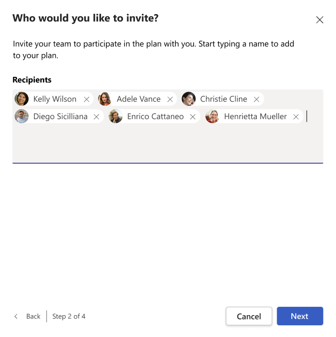
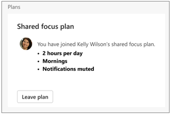

# Shared focus plan

*To start a shared focus plan, you need to have a Viva Insights premium license. For more information, refer to [Plans and environments](../../overview/plans-environments.mdtoc=/viva/insights/personal/teams/new/toc.json&bc=/viva/insights/breadcrumb/toc.json). A Viva Insights license isn't required to participate in a shared focus plan.*

>[!Note]
>This article talks about a focus plan shared between a group. If you just want to block out time on your calendar to focus, refer to our [Focus plan documentation](focus-plan.md).

A shared focus plan in Microsoft Viva Insights helps your team book daily, uninterrupted time to get work done. This plan also helps build shared productivity habits with your coworkers.

## For plan organizers

### To create a shared focus plan

1. In the **Wellbeing** tab, go to the **Take action to improve your wellbeing** section.
2. Find the **Start a shared focus plan** card and select the **Set up plan** button.

   

3. In **Customize your shared focus plan**, select the number of hours you want your team to focus each day, whether to schedule focus time in the morning or afternoon, and whether to silence Teams notifications during focus time. Then, select **Next**.
1. In **Who would you like to invite?**, add people you want to invite to join the plan. Use the search bar to find people by name. When you’re done adding invitees, select Next.
   
    

1. When you're ready to start the plan, select **Send invitation**.

    

6. When prompted, you can either accept or edit the draft note or delete it, and then select **Send invitation**.

    
<!--this doesn't have an action button-->
After you send the invitation, Viva Insights sends invitees a notification in Teams. 

## For plan recipients

### To join a shared focus plan

When someone invites you to join a shared meeting plan, you get an invitation in Teams. Select the notification to view the plan's settings and choose whether to join it. 

Your join options differ depending on whether you're already enrolled in a focus plan.

If you're *not* currently enrolled in a focus plan, you can select:

* **Join plan**, which automatically books time based on the preferences the organizer set. After you join, you get a confirmation card. If you need to change your settings, select Change settings there.
* **Decline**, which doesn't enroll you in the plan. If you decline, we don't send you any further communications about this plan.

If you are already enrolled in a focus plan, you can select:

* **Join plan**, which switches you from your individual plan to the shared plan.
* **Edit settings**, which switches you from your individual plan to the shared plan, but lets you change some of the settings first. Adjust your focus hours per day, when you focus, and whether you want to silence Teams notification during focus time. Then, select **Join plan**.
* **Decline**, which keeps you enrolled in your individual plan and doesn't enroll you in this new shared one. When you decline, we don't send you any further communications about this shared meeting plan, and we don't change your current plan's settings.

## For all participants

### View and edit plan details

To view details about your shared focus plan, go to the **Track your progress** section of the **Wellbeing** tab. Use the arrows to right of the section header to find the **Shared focus plan** card. Here, you get a summary of the plan's settings: how much time your team focuses a day, what time of the day focus time is booked, whether you get a reminder to start focus time, and whether Teams chats are muted during focus time. To change any of these settings, select **Change settings**.

### Leave a plan

You can also leave a plan through the Shared focus plan card. Select Leave plan, and then confirm you want to leave.

>[!Note]
>When you leave a shared focus plan as a *participant*, you don't remove anyone else from it. Other plan participants stay in the focus plan until they leave it. When you leave a shared focus plan as an *organizer*, you end the plan for all participants.

If you have a personal focus plan, you'll still be enrolled in it even after you leave the shared focus plan. To leave the personal focus plan or change its settings, refer to our [Focus plan documentation](focus-plan.md).

### Check the details of your shared focus plan

To check the details of your new plan, open the **Home** page of Viva Insights. The **Shared focus plan** details will be included in the **Plans** section:

   

If you have a Microsoft Viva Insights license with an applicable [service plan](../overview/plans-environments.md), you'll also see the plan details on the **My team** page.

### Concepts

To learn about how focus time is scheduled, refer to [Focus plan](focus-plan.md#concepts)
