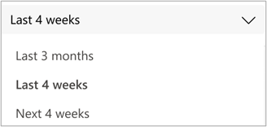
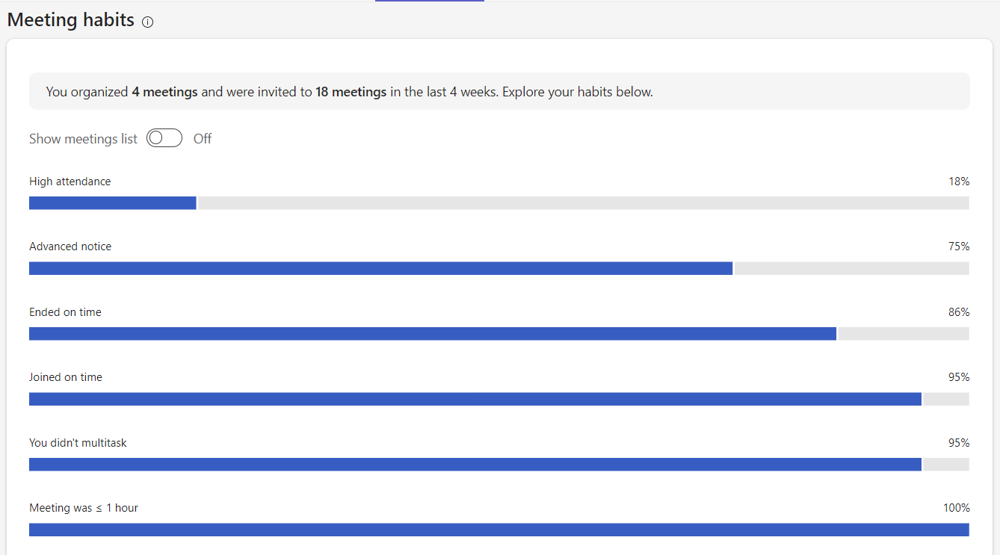
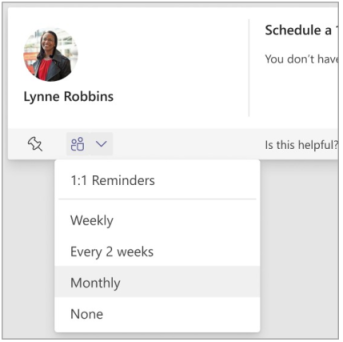

# Productivity

## Effective meetings

*This experience is part of a rolling release set to complete in October 2022. It's available to users with a Viva Insights subscription. Refer to [Plans and environments](../Overview/plans-environments.md) for more information.*

### Meeting category insights

You can use **Meeting category insights** in **Effective meetings** to help understand how you’re allocating time across your Outlook meeting categories.
To set up Outlook meeting categories, refer to [Assign a color category to a calendar appointment, meeting, or event (microsoft.com)](https://support.microsoft.com/office/assign-a-color-category-to-a-calendar-appointment-meeting-or-event-750596d9-707d-4412-8c0e-7fdc0fc52527).
  
**Meeting category insights** shows you how many hours you’re spending in meetings, then breaks down the time you spend in each of your categories.

You can customize what you see here. If you want to:

* Analyze a specific category, select it from the checklist to the left.

    

* Pick a specific timeframe, use the dropdown menu in the top-right. You can choose from **Last 3 months**, **Last 4 weeks**, or **Next 4 weeks**.

    

>[!Important]
>If you haven’t categorized any meetings between the last three months and next four weeks, these insights won’t be available to you. However, you’ll have access to them after you categorize any meeting within this time period, as long as you have a Viva Insights subscription.
>
> When you make updates to your meeting categories in Teams or Outlook, it can take up to a day for those changes to appear in the **Effective meetings** tab.

### Meeting habits

>[!Note]
> This capability is currently available in the MyAnalytics dashboard, but it's coming to the Viva Insights app in Teams and on the web soon.

The **Meeting habits** section highlights your habits or practices in meetings you organized and accepted. Switch between the **Habits** and **Meetings** views by toggling the control above the graph/table.

* Use percentage data from the **Habits** view to understand how often you organize or attend meetings that apply certain habits. For example, you might notice that 81% of the online meetings you attend end on time. 

    

* For details about all your meetings in the past four weeks, use the **Meetings** view.
    

    

    The **Meetings** view classifies meetings by using icons, which we describe in the following table:

   |Icon|Description |
   |--|---|
   | |  This meeting is recurring |
   | | This meeting meets the requirement of the habit in the column header. For example, if the meeting started on time, you'd see a check under **On time**. |
   | |This meeting doesn't meet the requirement of the habit in the column header. For example, if the meeting didn't start on time, you'd see an **X** under **On time**. |
   | |Not applicable. The  habit in the column header doesn't apply to this meeting. For example, **On time** doesn't apply to a canceled meeting, so you'd see a dash instead of a check or an **X**. |

You can sort this table by selecting the column header.

#### How meeting habits are calculated

Here's how we calculate the habits shown in this section:

* **<= 1 hour** – Meetings you organized that were one hour or shorter
* **Advanced notice** – Meeting invitations you sent with more than 24 hours' notice before the scheduled start time
* **Added a Teams link** – Meetings you organized that included a Teams link for remote attendees
* **During working hours** – Meetings you organized or accepted during your working hours
* **Ended on time** – Online meetings (on Microsoft Teams) that you ended within one minute of the scheduled end time
* **High attendance** – Meetings you organized or accepted that had a response rate over 50%
* **Joined on time** – Online meetings (on Microsoft Teams) you joined within five minutes of the scheduled start time
* **No overlap with other meetings** – Meetings that didn't overlap with other meetings on your calendar
* **RSVP'd to invite** – Meetings you were invited to and either accepted or declined (that is, you didn't leave your status as **Tentative**)
* **You didn't multitask** – Meetings where you didn't read or send emails or chats

#### Meeting exclusions

These types of meetings are excluded from meeting metrics—that is, they don't factor into the habits you see in this section.

* Meetings that are 24 hours or longer, which include meetings marked as **All day** 
* Meetings marked as **Private**
* Meetings where you're the only participant, like when you block focus time in your calendar or set reminders
* Meetings with a **Show As** status set to one of these:
    * Free
    * Working Elsewhere
    * Tentative
    * Out of Office

>[!Note]
>Viva Insights counts double-booked meetings only one time for metric calculations. For example, if you have two meetings scheduled for 10:00 AM to 11:00 AM on the same day, Viva Insights counts this as only one hour of meeting time.

### Meeting effectiveness surveys

With meeting effectiveness surveys, you can view aggregated feedback from attendees on the meetings you organized. These surveys help you gain insight into what’s going well with your meetings, and what you could improve in future meetings, to promote a healthy meeting culture.

Surveys appear at the end of select Teams meetings with five or more participants. Here are the survey questions and response choices:

* **What made this meeting a success?**
    * Agenda
    * Focused discussions
    * Attendee participation
    * Clear next steps

* **What would've made it better?**
    * Agenda
    * Focused discussions
    * Attendee participation
    * Clear next steps

* **How effective was this meeting at achieving its business goals?**

    * A rating scale of one to five stars

### Insights

As an organizer with a [Viva Insights subscription](https://www.microsoft.com/microsoft-viva/insights), you can see aggregated survey results in the Viva Insights app in Teams and on the web. These results include an aggregated view of star ratings and access to individual, anonymous feedback. The **Effective meetings** page also shows insights into how your meetings succeeded and how they could be improved.

:::image type ="content" source="images/effective-meetings-landing.png" alt-text="Screenshot that shows the effective meetings page." lightbox="images/effective-meetings-landing.png":::

#### Settings

All users have meeting effectiveness surveys turned on by default. Admins can turn off surveys for their entire organization or [enable them](./viva-teams-app-admin-tasks.md#configure-meeting-effectiveness-surveys) for a specific set of users. You also can opt out of receiving feedback.

##### Opt in or out of surveys

To opt in or out of getting feedback about your meetings, follow these steps:

1. In the Viva Insights app, select **Settings**.
2. For **Meeting effectiveness surveys**, select to turn the setting **On** or **Off**, and then select **Save**. This setting defaults to **On**.

    

#### Privacy by design

The meeting effectiveness surveys are only sent for scheduled meetings that have five or more participants (including the meeting organizer). We also check whether the attendees who get those surveys stay in the meetings for at least five minutes. To help mitigate survey fatigue in survey participants, 10% of qualified meetings get the surveys. Providing meeting feedback is optional for all participants.

As the meeting organizer, you’ll only see aggregated results in Viva Insights. You won't see who sent what suggestions within the aggregated feedback.

#### Admin controls

To configure meeting effectiveness surveys for your organization at the user or tenant level, refer to [Admin tasks](./viva-teams-app-admin-tasks.md#configure-meeting-effectiveness-surveys).

# Stay connected

You can use **Stay connected** in the Microsoft Viva Insights app to stay connected with your collaborators and improve your productivity.

**Stay connected** includes the following insights:

* [Identify and pin important collaborators](#identify-and-pin-important-collaborators)  
* [Set up 1:1 meeting reminders](#set-up-11-meeting-reminders) 
* [1:1 meeting suggestions](#11-meeting-suggestions) 
* [Reschedule a 1:1 in case of conflict](#reschedule-a-11-in-case-of-conflict) 
* [Stay on top of outstanding task suggestions](#stay-on-top-of-outstanding-task-suggestions) 
* [Catch up on unread documents shared with you](#catch-up-on-unread-documents-shared-with-you) 
* [@Mentions for pinned important contacts](#-for-pinned-important-contacts) 
* [Upcoming meetings that need your RSVP](#upcoming-meetings-that-need-your-rsvp) 
 
#### Identify and pin important collaborators  

You might receive insights from various people but some items might deserve more attention than others. For example, an outstanding task suggestion from your manager or a message from a key customer would likely be of higher priority.  

Based on your collaboration patterns, you can pin some of your contacts as important. All insights from pinned important contacts are shown with higher priority at the top of the page.  

To pin a contact, select the **pin** icon on the bottom left below the contact’s name: 
   
   

To unpin a contact, select the **unpin** icon: 
   
   

#### Set up 1:1 meeting reminders 

While staying in touch with top collaborators can be difficult, a quick 1:1 meeting with key contacts can help you nurture your professional network. Microsoft Viva Insights can help you set a target 1:1 meeting frequency for each contact and provide  you with meeting recommendations if you are falling out of touch.  

In the following example, if Lynne was an important colleague, you could set up a monthly 1:1 meeting target with Lynne by selecting the **people** icon and then selecting the **Monthly** reminder frequency. Viva Insights will keep track of your meetings with Lynne and if you have not had a 1:1 with Lynne for a month, it will suggest setting up a 1:1 meeting and help you schedule it. 

If you want to remove the 1:1 meeting target, you can select the **people** icon and select **None**. If you are a manager, Viva Insights will automatically suggest a biweekly 1:1 meeting with your direct report.  
   
   

#### 1:1 meeting suggestions 

If you’ve set up a target 1:1 meeting cadence with your colleague through the Microsoft Viva Insights app and are falling out of the set cadence, Viva Insights will remind you to set up a 1:1 meeting and help you schedule it.  

In the following example, you can select one of the proposed meeting times and then select **Send invite** to send a meeting invitation to Lynne. Viva Insights will only show meeting time blocks when both of you are available to meet. If none of the suggested time blocks work, you can select **View calendar for other items** to open the Teams calendar and schedule a meeting on your own. 
   
   

#### Reschedule a 1:1 in case of conflict  

Microsoft Viva Insights also helps you follow through on your intent to have 1:1 meeting with your colleagues. If, for some reason, the 1:1 meeting invitation you sent to your colleague has a conflict, Viva Insights will help you quickly reschedule the meeting. 

In the following example, if your meeting with Lynne has a conflict, Viva Insights will remind you of the conflict ahead of time and you can quickly choose a new time for the 1:1 meeting and select **Reschedule** to move the meeting invitation. 
   
   

#### Stay on top of outstanding task suggestions 

It is easy to lose track of commitments that you've made to your colleagues in email. This insight helps you make sure that nothing falls through the cracks by reminding you of tasks that you've agreed to do. It is based on emails that you've sent and requests from your colleagues during the last 14 days of email communication, and includes: 

* **Commitments** &ndash; Something that you promised or committed to do for someone else in an email 
* **Requests** &ndash; Something that another person asked you to do in an email 
* **Follow-ups** &ndash; Something that you asked for from someone else in an email 

In the following example, you can select **Re: Sync up on Regression Tests** to open the email in which you can follow up or select **Done** to confirm that you’ve already followed up.  
   
   

This insight is available in the languages listed in [Briefing languages](../briefing/be-languages.md).

#### Catch up on unread documents shared with you 

Have you searched for that document that you planned to read but you just cannot find it? With so many documents shared across meetings and emails, it can be difficult to stay caught up on documents shared by your colleagues. With this insight you can see a list of the shared OneDrive and SharePoint documents that you need to catch up on.  

In the following example, to open the document, select **Open**. To open the email through which the document was shared, select **Re: Sync on Regression Test**. 
   
   

#### @Mentions for pinned important contacts 

@Mention is a common way to tag colleagues on important work items. Microsoft Viva Insights can help you quickly triage recent @Mentions from pinned contacts so that you are caught up on important conversations and tasks in Teams. In the following example, select **Go to comment** to open the conversation and follow up. 
   
   

#### Upcoming meetings that need your RSVP 

Let your colleagues know if you can join their meeting so that they can run effective meetings. Meeting attendance information helps meeting organizers better plan and prepare for meetings, and reschedule if needed.  

In the following example, select **Sync on Proposal** to open the meeting invitation for more context on the meeting and then select **Accept** to accept (or **Decline** to decline) the meeting invitation. 
   
   

## Related topics

[Viva Insights introduction](viva-teams-app.md)

[Microsoft Viva Insights overview](viva-teams-app.md)