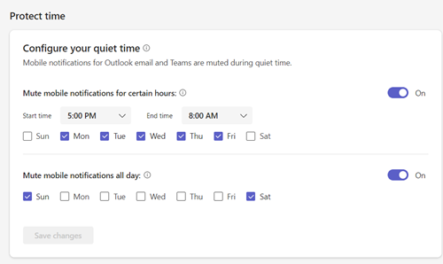

# Quiet time

Research shows that long hours and the pressure to always be available can lead to employee burnout. The amount of time you spend collaborating outside of business hours can be an indicator that you are at risk of burnout, even as you and your team embrace flexibility.

This feature can help protect your quiet time, which is the hours each day when you want to disconnect from work and recharge. To minimize work related interruptions, you can schedule when you want mobile notifications from Outlook and Teams to automatically be muted.

In the **Quiet time** section on the **Protect time** page, if you haven't scheduled quiet time and are prompted to, select **Let's go**. You are then prompted to select a start and end time for when to mute mobile notifications from Outlook and Teams. In **Mute mobile notifications all day**, you can also select which days to mute notifications for the full 24 hours.

After the initial setup, you'll see the following options in **Configure your quiet time**. You can get here by selecting the ellipses (**...**) at the top right of the Viva Insights app, selecting **Settings**, then selecting **Protect time** from the left pane. You can confirm or change any of the quiet-time options or turn quiet time off at any time.

