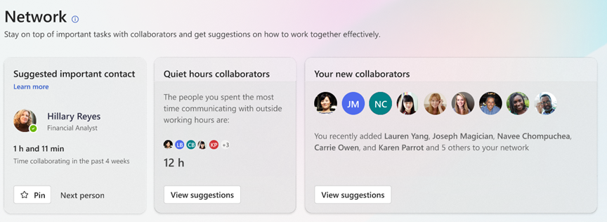
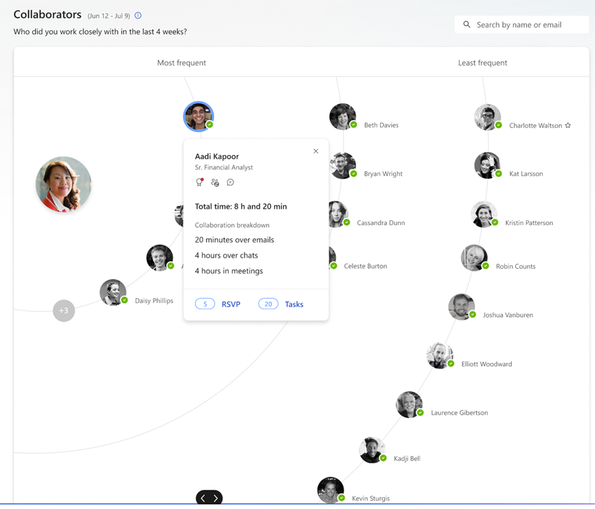
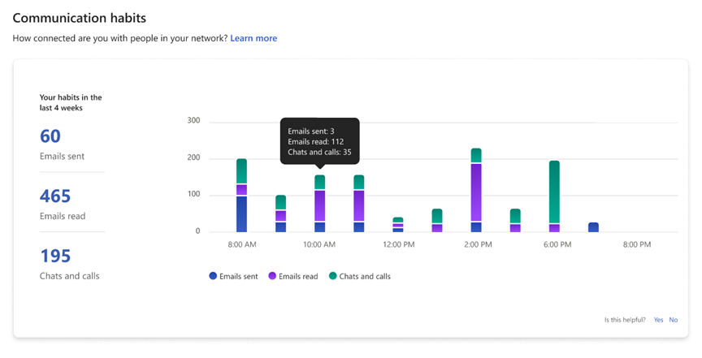

[WORKING DRAFT]   

# Teamwork

*Applies to: users with a premium subscription*

**Teamwork** is your hub for building and strengthening connections with your team. Use this tab to understand who your top collaborators are and how much time you spend collaborating with others. 

## Build better relationships

You’ll find three cards on your **Teamwork** tab, under the Build better relationships section:

* Time spent collaborating with others shows how many people you’ve collaborated with over the last month. It also shows how much time you’ve spent collaborating during and after working hours. For more information about who you’re collaborating with, select About your network. We talk about this section more later, in Network.
* Your communication habits shows what percentage of your time is available to focus and what percentage of your time is spent collaborating with others. The card also breaks down how much collaboration time you spend per communication channel—meetings, chats and calls, and email.
* Suggested important contact is a contact you’ve worked with and who you might want to consider pinning as a favorite. When you pin someone as a favorite, using the Pin button, Viva Insights prioritizes tasks from them in the Productivity tab’s Tasks feed.
 
## Network

When you select **About your network** on the **Time spent collaborating with others** card, you arrive at the **Network** tab. Insights on this tab show how you work with your active collaborators, split into four sections:

* Suggested important contact, like the main **Teamwork** tab, is a contact you might want to pin as a favorite. 
* Quiet hours collaborators are people you work with most often after hours.
* Your new collaborators are people you’ve recently started collaborating with.
* Collaborators are your network, which we discuss later.
* Communication habits are how you communicate with people in your network, which we also discuss later.

### Collaborators

In the **Collaborators** section, you’ll find your collaboration network arranged in three rings—from Most frequent to Least frequent collaboration time. If you want more information about how much time you’re spending with a contact, select their profile image. The tooltip shows you how much time you’ve spent collaborating with that person, then breaks down how much time you spent collaborating in each communication channel—meetings, chats and calls, and email. On a collaborator’s tooltip, you can RSVP to meeting invitations that collaborator sent you, and also catch up on tasks they might have assigned to you.

If you can’t find a frequent collaborator on your network map, use the Search by name or email bar to add them.
 
### Communication habits

**Communication habits** shows how you communicate with people in your network. We break up your total communication over the last four weeks by communication type: emails sent, emails read, and chats and calls. On a graph, we display your average distribution of communication throughout your day—for example, your graph might show that you send a majority of your emails around 8am, but chat and call with colleagues around 6pm. Hover on each bar for a breakdown of collaboration activity by hour.
 