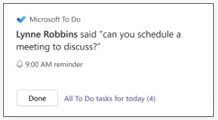
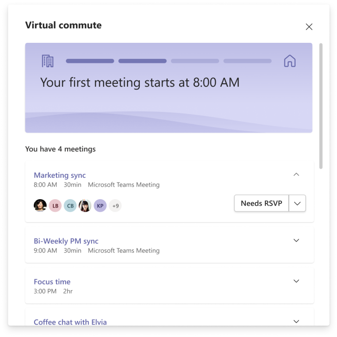
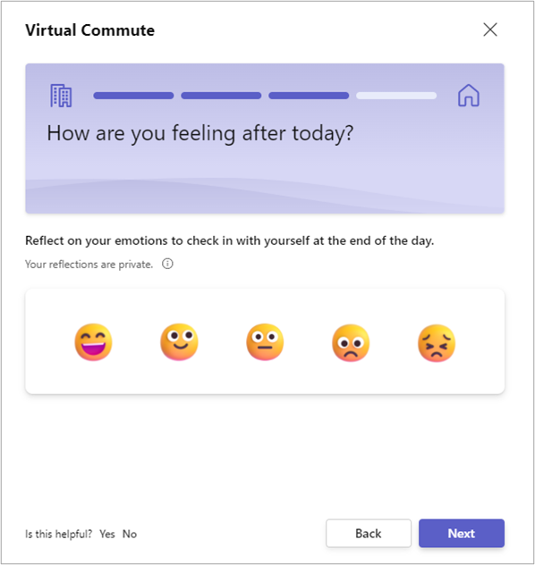
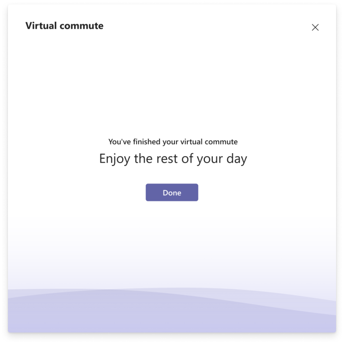

---

title: Virtual commute with Viva Insights
description: Use the virtual commute feature in Microsoft Viva Insights
author: madehmer
ms.author: helayne
ms.topic: article
ms.collection: viva-insights-personal
ms.localizationpriority: medium 
ms.service: viva
ms.subservice: viva-insights
manager: helayne
audience: user
---

# Virtual commute

You can use virtual commute feature in the Microsoft Viva Insights app from either the [Up-next card](#up-next-card) or [Within Protect time](#within-protect-time).

If you’ve set a reminder, that reminder appears as a Teams notification you can select to begin your virtual commute.

## Up-next card

When the Up-next card prompts you to "wrap up your day," you can select it to start your virtual commute now.

This message appears at the following times:

* If you've configured virtual commute reminders, the message appears 30 minutes before the time that you configured. For information about making this and other settings, see [Insights app settings](viva-teams-app-settings.md).
* If you have not configured virtual commute reminders, the message appears 30 minutes before the end of your workday as [scheduled in Outlook](https://outlook.office.com/calendar/options/calendar/view/appearance).

## Within Protect time

In **Protect time**, when prompted with **Ready to wrap up**, select **Start**.

  

This causes your virtual commute to start immediately. For details about the virtual commute experience, see [virtual commute steps](#virtual-commute-steps).

Starting a virtual commute this way does not affect the scheduled days and time of day that you set in [Set up virtual commutes](#set-up-virtual-commutes).

## Set up virtual commutes

The first time you open **Protect time**, you're prompted to schedule your virtual-commute reminders:

  

You can use this prompt to turn on the **Reminder** toggle, then select the days and time of day that you want to see the virtual-commute reminder. When you're done, select **Save changes**.

>[!Note]
>* You can schedule virtual-commute reminders for any day of the week, including days not configured as workdays in your Outlook settings.
>* The time you select will apply to every day on which you'll see reminders. You can't set different times for different days of the week.
>* The reminder might not arrive at exactly the scheduled time, but most reminders appear within five minutes before their scheduled time. For example, if your reminder is scheduled for 5:00, the reminder could appear between 4:55 and 5:00.

If you need to adjust these settings at any time, you can do so on the **Settings** page. For more information, see [Settings > Virtual commute](viva-teams-app-settings.md).

### Virtual commute steps

After you begin your virtual commute by selecting **Start** on the **Protect time** page, the sequence starts. It consists of the following steps. All steps are optional; to skip a step, select **Next**.

1. On the start page, select **Let's go**:

     

2. **Review and close out current tasks** &ndash; Virtual commute shows you your open tasks on the Microsoft To-Do list whose due date is today or that have a reminder set for today. (If you currently have no tasks, this step is not shown and you go directly to **Add new tasks**.)

   In this step, you can mark each task as complete (select "**It's done**") or set a reminder for another day:

     

   If you do set a reminder, it will appear in the following places:
    * In your Microsoft To Do list.
    * In your Briefing email, if you are subscribed to receive Briefing emails.
    * On the To Do card on the **Home** page; it appears here only on the day after you set the reminder.

   Select **Next**.

3. **Add new tasks** &ndash; Use this step to add tasks to your list. There are two reasons to add them to your list:

   * If you have work-related tasks that are top of mind, adding them to a list holds them for you in a reliable spot so that you can mentally let them go during your personal time.
   * Adding them here puts them directly into Microsoft To Do, complete with reminders set, so that you don't forget about them.

   

   Tasks that you add on this page will appear in two places:

   * If you subscribe to the Cortana briefing email, you'll see your tasks there.
   * If you add a task today, it will appear tomorrow on the **Microsoft To-Do** card on the **Home** page:

       

   After you've finished adding tasks &ndash; or if you have no tasks to add &ndash; select **Next**.

4. **Preview of tomorrow** &ndash; This step shows you the events (such as meetings) that are on your schedule for tomorrow:

   

   The purpose of this step is to reduce surprises so that you can be prepared for all that's on your schedule. You can accept, decline, or cancel meetings to make final decisions about your schedule for the next day. When finished, select **Next**.

5. **Opportunity for reflection** &ndash; At the end of your workday, this step lets you reflect on your feelings, just as you would by using the [Reflect](viva-insights-reflect.md) feature on the **Home** page:

   

   Select the emoji that best represents how you're currently feeling. The card gives you feedback to acknowledge your choice, which you can view before you select **Next**. This optional step helps you build the healthy habit of checking in with yourself.

6. **Mindfully disconnect with a Headspace meditation** &ndash; Select the play button on the Headspace card to begin a guided meditation:

   

   When you're finished, select **Next**.

7. **Completion** &ndash; Complete your virtual commute.

   

   Select **Done**.

## Related topics

* [Viva Insights introduction](viva-teams-app.md)
* [Protect time](viva-insights-protect-time.md)
