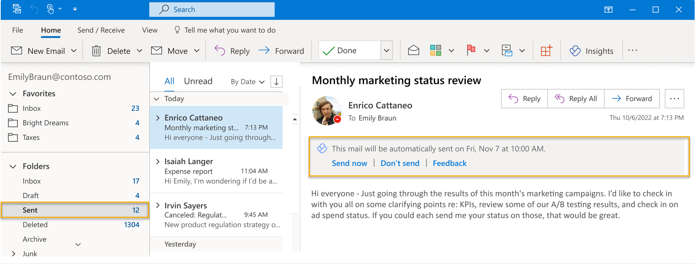
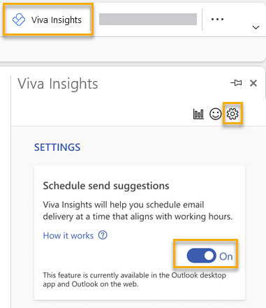

---

title: Schedule send with Viva Insights
description: Learn how to opt in and use Schedule send with Viva Insights for suggestions on when to send email during your coworker's working hours
author: lilyolason
ms.author: v-lilyolason
ms.topic: article
ms.localizationpriority: medium 
ms.collection: 
- viva-insights-personal
- highpri
ms.service: viva 
ms.subservice: viva-insights 
search.appverid: 
- MET150 
manager: helayne
audience: user
---

# Schedule send suggestions

With schedule send suggestions, you can help minimize email disruptions to your colleagues outside their working hours or when they’re away from work. Schedule send suggestions also help you maintain the flexibility to work when you want without putting the burden of your schedule on others. 

Suggestions appear when you're composing an email in Outlook at certain times, and they propose send times that align with your colleagues' working hours. Read on to learn more.

## Who can use schedule send suggestions

If you have either a [Viva Insights subscription or MyAnalytics (Full) service plan](../Overview/plans-environments.md), you get an unlimited number of schedule send suggestions for delaying email delivery to your coworkers. If you have an [Insights by MyAnalytics service plan](../Overview/plans-environments.md), you get up to three daily schedule send suggestions. If you fall into one of these categories, but you [turn off the feature](#to-turn-on-and-off-schedule-send-suggestions), you don't get any schedule send suggestions.

If you qualify to use the feature, schedule send suggestions are turned on by default. Your Global admin or Exchange Online admin can configure tenant-level settings in the Microsoft Admin Center. As an individual user, you can [opt in or out](#to-turn-on-and-off-schedule-send-suggestions) of schedule send suggestions through the Viva Insights dashboard or your Outlook add-in.

## To see schedule send suggestions

When you're composing an email in Outlook, Viva Insights shows you suggestions to align email delivery with working hours. You might see suggestions in the following scenarios:

* When all recipients in the **To** field are outside of their working hours. 
* When you're sending an email to just one recipient in the **To** field, and that recipient has an automatic out-of-office reply set up in Outlook.
* When you're outside of your working hours.

You might *not* see suggestions in the following scenarios:

* When you’re composing an email during the 30 minutes before the recipients’ or your working hours. 
* When there are more than 15 recipients in the **To** field.
* When you're sending an email to yourself.

>[!Note]
> Distribution lists and Microsoft 365 or Office 365 groups don't count as qualifying recipients for use by schedule send suggestions feature.
>
> A shared mailbox in the **To** field, however,*does* count as a qualifying recipient. If a user has **Full** access permissions and can **Send as** or **Send on behalf of** the shared mailbox, that user counts as a qualifying sender.

Schedule send suggestions are currently available in the Outlook desktop app for Windows and Outlook on the web. Be sure you're using Outlook for Windows 2016 version 1808 or later and build 16.0.12016.10000 or later.

## To use schedule send suggestions

If you see a suggested delivery time appear above the **To** field in an email you're composing—for example, *Friday, Oct 7 at 10:00 AM*—and you want to send your email at that time, select  **Schedule send**.

After you select **Schedule send**, an insight opens to the right of your message confirming that date and time.

If you:

* Like the date and time that Viva Insights suggests, press **Send** within the email. The recipient will get your email as scheduled.

* Want to change when the recipient will get your email, use the date and time boxes in the insight to make changes. After you adjust these settings, press **Send** within the email.

* Decide you don't want schedule  delivery and would rather send your email right away, select **Cancel delay**. Then, select **Send** within the email to send the message immediately.

If you've scheduled your message, it's kept in one of two places after you press **Send**—the **Drafts** folder if you use Outlook on the web or the **Sent items** folder if you use Outlook for Windows—until the scheduled delivery time. At the scheduled delivery time, the email is automatically delivered to all recipients in the **To**, **Cc**, and **Bcc** fields for you.

If you decide that you want to send your message before its scheduled time, you can open the email in the **Drafts** or **Sent items** folder and select **Send now**. If you *don't* want to send your message, select **Don't send**. This option moves the email to your **Deleted items** folder in Outlook.

The following graphic shows a scheduled message in Outlook for Windows.

## To turn on and off schedule send suggestions

You can opt in or opt out of schedule send suggestions as many times as you want. When you turn *on* schedule send suggestions, Viva Insights aligns email delivery with your coworker's working hours.

To make changes, use your Viva Insights app in Teams or on the web or your Viva Insights Outlook add-in.

### With the Viva Insights app in Teams or on the web

1. In the upper-right of any page, select the ellipses (**...**), then select **Settings**.
1. Select **Protect time** on the left pane.
1. Under **Schedule send suggestions**, toggle the switch to turn the feature on or off.

Read more about settings in the app in [Configure Viva Insights](../teams/viva-teams-app-settings.md).

### With the Viva Insights Outlook add-in

1. In the Viva Insights Outlook add-in, select **Settings** (gear icon).
2. Switch the toggle for **Schedule send suggestions** to **On** or **Off**.

## Admin controls

To configure schedule send suggestions for your organization at the tenant level, refer to [Admin setup](../Setup/configure.md#to-enable-access-to-viva-digest-emails- meeting-effectiveness-surveys-viva-insights-outlook-add-in-and-schedule-send-suggestions).

<!--## Video walk-through

Watch this video to take a closer look at schedule send experiences in Outlook.
