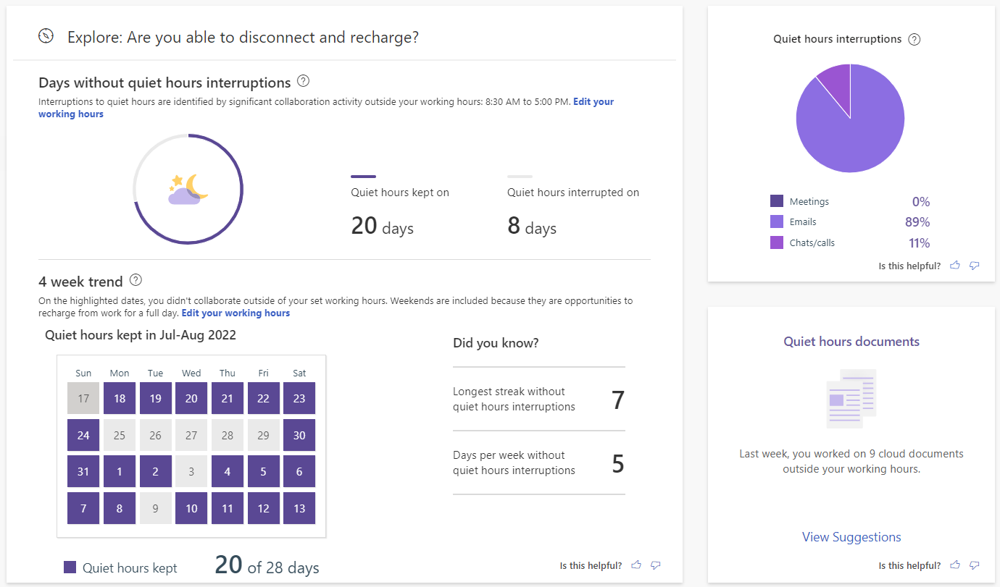

---

title: Viva Insights Wellbeing page
description: Learn how to use Viva Insights to improve your work-life balance
author: lilyolason
ms.author: v-lilyolason
ms.topic: article
ms.localizationpriority: medium 
ms.collection: viva-insights-personal 
ms.service: viva 
ms.subservice: viva-insights 
search.appverid: 
- MET150 
manager: anirudhbajaj
audience: user
---

# Personal wellbeing insights

The **Wellbeing** page on the [Dashboard](dashboard-2.md) shows how well you are disconnecting from work during your time off and suggests ways to reduce stress and burnout.

## Productivity insights

These insights are based on your recent workplace activity. Select **View Suggestions** to get ideas about how you might change your current work patterns to improve your work-life balance.

## About the metrics

**Quiet hours kept** measures the number of days where you did not have significant collaboration outside your set work hours (as defined in your Outlook calendar). Significant collaboration includes sending and reading email, sending, and responding to chats, or attending calls and meetings in more than one one-hour period outside your working hours. Weekends are considered all-day quiet time and are included in the quiet days calculation because they're opportunities to recharge from work for a full day.

For example: If your set work schedule is 8 AM to 5 PM, Monday through Friday, and you collaborate in meetings, emails, chats, or calls after 5 PM on Monday, or during a weekend, Monday (or the weekend day) won't count as a quiet day.

## Wellbeing tips

* **Turn work off when not at work**: We all need breaks to recharge. Turning work "off" outside of working hours can help you get a better night's sleep and helps you feel refreshed the next day.

* **Turn off notifications when not at work**: Some find it helpful to reserve one night a week away from work or mute notifications outside of working hours. Research shows that people who disconnect daily from work report lower levels of stress and higher wellbeing.

* **Take a break when at work**: Go enjoy a meal with your team or take a break from work. You'll give your brain a break, grow your network, and help boost your productivity and professional success.

* **Plan time away from work**: Time away from work reduces stress and improves your wellbeing. Use Insights to [plan your time away](../use/use-the-insights.md#plan-your-time-away). Resolve meetings that occur while you're away, compose your auto-reply notifications, and book focus time to wrap up tasks before you go and catch up when you get back.

* **Be a thoughtful coworker!** Establishing quiet time with no meetings or email can lead to better teamwork:

  * For "inform" type emails, condense the emails and status updates into daily or weekly digests. This practice reduces the overall noise and randomization caused by email overload.
  * Use [schedule send suggestions](../use/mya-notifications.md#schedule-send-suggestions) to schedule email delivery when the recipients are within their working hours. Limit late-night and early-morning email to urgent email only, to cut through the noise.
  * Turn off notifications on your phone and computer when you are trying to focus.

* **Be respectful of people's time**:  

  * Agree on "team hours." Use [schedule send suggestions](../use/delay-delivery.md) to deliver email when most of the team is working.
  * Be intentional about who you invite to meetings.
  * Try to limit meeting overruns.
  * Consider starting a policy of no meetings on Fridays.

