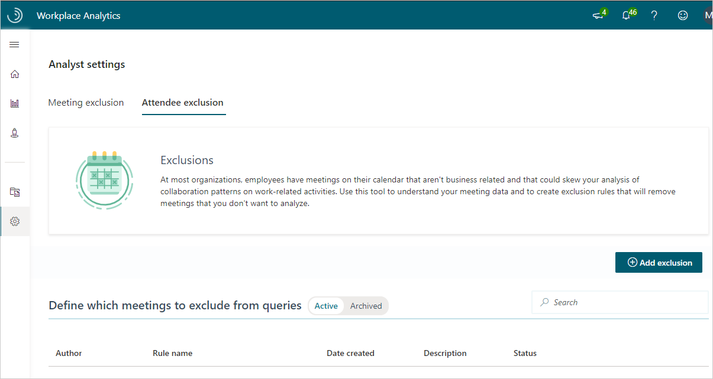
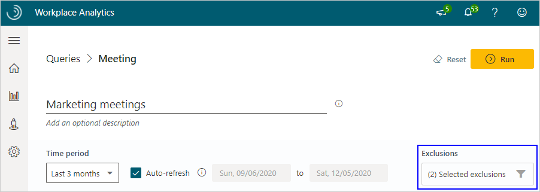

# Attendee exclusions

As an analyst for the advanced insights app that's available in Microsoft Viva Insights, you can set attendee exclusion rules. The rules can exclude data from analysis about meeting invitees, which are based on responses that the invitees made to meeting invitations.

This enables you to measure work-related calendar collaboration in analysis, such as in [Query designer](/viva/insights/tutorials/query-basics?toc=/viva/insights/use/toc.json&bc=/viva/insights/breadcrumb/toc.json). These measurements are most accurate when they include data that reflects genuine collaboration.

For example, the data shouldn't include meetings that schedule personal time, or count an invitee as "present" at a meeting when they weren't actually there. The advanced insights app lets you exclude these kinds of events so that they don't skew your data.

**Owners** – Admins and Analysts have full access to this page and limited Analysts have read-only access. For details, see [Assign roles to admins](/viva/insights/setup/assign-roles-to-wpa-admins?toc=/viva/insights/use/toc.json&bc=/viva/insights/breadcrumb/toc.json).

## Responses to meeting invitations

Creating attendee exclusions lets you effectively redefine meeting attendance in analyses. By default, "attending a meeting" means that a person did not decline the meeting invitation.

By creating an attendee exclusion, you can change that definition to also include either or both of the invitee actions "tentative" and "no response."

### Tentative

In some countries, it is a cultural practice not to "decline" a meeting; rather, a "Tentative" response means "I won’t be attending but I still want to keep this meeting on my calendar." As an analyst, you can exclude invitees who tentatively accepted a meeting invitation.

Using the "accepted as tentative" exclusion would mean that a meeting invitee who tentatively accepted isn't counted as an attendee to that particular meeting.

### No response

Sometimes, meeting invitees don't respond to meeting invitations. Using the "did not respond" exclusion would mean that a meeting invitee who didn't respond isn't counted as an attendee to that particular meeting.

## Create an attendee exclusion

**Owners** - Analysts and limited Analysts

1. Open [the advanced insights app](https://workplaceanalytics.office.com/). (If that link doesn't work, try [this link instead](https://workplaceanalytics-eu.office.com/).) If prompted, enter your work credentials.

2. Select **Analyst settings** to see the exclusions pages.
3. Select **Attendee exclusion**.
4. Select **Add exclusion**.
5. On the **New exclusion** page, for **Exclusion type**, select **Attendee exclusion**:

   

6. Type a name for your exclusion, and, optionally, a description, and then select **Next**.
7. Choose the types of invitees whose data you want to exclude from analysis: those who didn't respond to meeting invitations, those who responded as **Tentative** to meeting invitations, or both types of invitees:

   

   The **Potential impact of exclusion** area shows the percentage and total number of potential attendees at meetings whose data will be excluded from analysis if you publish and use this exclusion rule.

8. Optionally, select **Apply this exclusion for metrics in Explore the stats**. Selecting this option doesn't automatically affect any existing queries. This option makes this exclusion appear as the default for new queries, and it affects only the data shown in [Explore the stats](/viva/insights/use/explore-intro?toc=/viva/insights/use/toc.json&bc=/viva/insights/breadcrumb/toc.json).
9. Select **Publish**. Your new exclusion rule will now be available to analysts who create and run queries.

## Select an attendee exclusion for a query

**Owners** - Analysts and limited Analysts

1. In [Workplace  Analytics](https://workplaceanalytics.office.com/)(if that link doesn't work, try [this link instead](https://workplaceanalytics-eu.office.com/)), select **Analyze** > **Query designer**.
2. Create a query—for example, a **Meeting** query.
3. Select the **Exclusions** box:

   

   The **Exclusions** box opens the **Exclusions** pane:

   

4. Make a selection for **Attendee exclusions**:

   * Select the name of an attendee exclusion to use that exclusion in this query. In the preceding illustration, an attendee exclusion called "Not-responded" is currently selected. 
   * Select **Clear value** to remove all attendee exclusions from this query. 

## Related topics

* [Meeting exclusions](/viva/insights/tutorials/meeting-exclusions-intro?toc=/viva/insights/use/toc.json&bc=/viva/insights/breadcrumb/toc.json)
